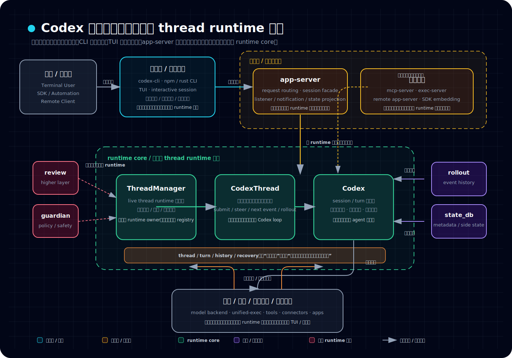

# Codex 卷一 01：Codex 到底是什么系统：从壳到主体的第一张总图

## 先回答读者最容易搞错的问题

第一次看 Codex，很容易把它看成三种东西里的某一种：

- 一个 npm CLI
- 一个终端里的 TUI 工具
- 一个很厚的 app-server

这三种理解都不算全错，但都只抓到了外层外观，没有抓到主体。

这篇真正要先立住的判断只有一句：

> **Codex 是一套以 thread runtime 为核心的 agent 系统。CLI 是入口壳，TUI 是交互前端，app-server 是控制面；真正让系统活起来并持续工作的，是中间那层 runtime core。**

如果这个判断先没立住，后面你看到 `ThreadManager`、`CodexThread`、`Codex`、rollout、recovery、unified-exec、review / guardian / collab，就会一直像在看仓库里一堆彼此挨着放的零件，而不是一台真的能持续运转的机器。

---

## 一、先把“壳”和“主体”分开

理解 Codex 的第一步，不是先记目录树，而是先把壳和主体分开。

### 1. CLI 是入口壳
`codex-cli` 和 `codex-rs/cli` 这层最先碰到用户。它们负责：

- 提供统一命令入口
- 解释当前要走哪种模式
- 把请求导向 TUI、app-server、mcp-server、exec-server 等不同使用面

但它们不负责：

- 持有 live thread
- 推动 turn 主循环
- 承担恢复主线
- 维护系统真正的持续工作状态

所以 CLI 更像**把人送进系统的入口壳**，不是系统本体。

### 2. TUI 是交互前端
TUI 是人最容易把 Codex 误认成“就是这个东西”的地方，因为你确实是在终端里直接跟它互动。

但从系统分工看，TUI 更像：

- 驾驶舱
- 界面层
- 输入与渲染层

它负责把用户动作组织成请求，再把返回事件渲染成可见状态。它让你看见系统、操作系统，但它本身不是那台系统的发动机。

### 3. app-server 是控制面
app-server 的职责也很容易被看反。

它很厚，也确实很重要，但它更准确的角色不是“另一套 runtime”，而是：

> **把底下已经活起来的 runtime，暴露成一个可启动、可观察、可连接、可控制的稳定接口面。**

所以它负责的是：

- 请求路由
- 连接与会话组织
- listener / notification / state projection
- 把 thread / turn / event 投影成对外协议

它是控制面，不是主体本体。

---

## 二、真正的中间层：runtime core

如果说 CLI、TUI、app-server 都还属于“怎么进入系统、怎么使用系统、怎么观察系统”，那再往里一层，才开始接近“系统到底怎么活着”。

这层就是 runtime core。

它至少包括这些真正应该被放在一起看的核心对象：

- `core`
- `ThreadManager`
- `CodexThread`
- `Codex`
- thread / turn / history / recovery 这一整套持续工作机制

这一层之所以重要，不是因为名字显得更底层，而是因为：

- 一条工作线在这里成立
- 一轮工作回合在这里推进
- 工具调用、模型采样、动作回流在这里接回主线
- 中断之后还能恢复继续，也是在这套机制里才真正成立

也就是说，Codex 的核心价值不只是“能响应一次”，而是：

> **能把工作线组织起来，并让它持续下去。**

---

## 三、卷一先认识的 3 个关键对象和 1 组关键机制

卷一不把这些对象和机制讲透，但必须先让它们第一次正确出场。

### 1. `ThreadManager`
它最接近全局 runtime 协调者。

它不是普通 registry，而更像：

- live thread runtime 的总调度入口
- thread 生命周期的高层协调者
- 让线程真正被放进系统里运行起来的那层支点

如果你要找“哪个地方更接近 runtime owner”，答案通常不会先落在 app-server，而会更靠近 `ThreadManager`。

### 2. `CodexThread`
它更接近单个 thread 的正式交互面。

可以先把它理解成：

- 单线程工作线的外观层
- 上接控制面、下接更底层 `Codex`
- 把 submit / steer / next event / rollout 等线程级行为组织成一套正式接口

它不是总调度者，也不是最底层 loop，本质上是线程级交互对象。

### 3. `Codex`
`Codex` 更接近真正承接 session / turn loop 的底层 agent 主循环。

这里开始发生的事情更像：

- 收到输入
- 组织当前工作面
- 进入模型采样或动作路径
- 推动本轮 turn
- 产出事件，再把事件交回更上层去投影

所以如果你问“真正开始干活的是哪层”，通常要往 `Codex` 这一层看。

### 4. thread / turn / history / recovery
这些不是后来额外补上的概念，而是 Codex 之所以不是一次性命令工具的根。

它们一起回答的是：

- 工作线怎么成立
- 本轮怎么推进
- 历史怎样形成可继续使用的语义材料
- 中断后为什么还能恢复

卷一在这里只先让你知道它们是一组东西；卷二、卷三再分别展开它们。

---

## 四、先看一张最小系统图

如果先把目录细节都压掉，卷一需要先让读者脑中先立住这张全景图：

这张图先故意只回答 4 个问题：

- 人是从哪里进入系统的
- runtime 是通过哪一层被暴露和控制的
- 真正持续推进 thread / turn 主线的是哪一层
- 动作执行、恢复材料、高层能力为什么都还是围着同一条 runtime 主线展开

这张图的价值不在于“画得完整”，而在于先让你知道：

- 哪些层是把人带进来的
- 哪些层是把系统呈现出来的
- 哪些层是把 runtime 暴露出来的
- 哪些层才真正负责持续工作

如果你脑中先有这张图，后面再进卷二到卷六时，就不容易把每一个局部子系统都误当成“新的主体”。

---

## 五、Codex 不是一层层并排摆着，而是有认知坡度

卷一之所以重要，不是因为它最“基础”，而是因为它决定你后面会不会一直把组件看反。

后面这几卷，其实是在沿着同一张系统图往里走：

- **卷二**：不是重新介绍系统，而是把 runtime core 这层真正展开，回答一条工作回合怎么跑起来
- **卷三**：不是再开一套新系统，而是解释这条工作线为什么能持续、能恢复、能继续
- **卷四**：不是另起一个 app-server 专题，而是解释控制面怎样把 runtime 暴露出来
- **卷五**：不是单独讲 shell 执行，而是解释 unified-exec 怎样把动作变成可管理会话
- **卷六**：不是捡边角功能，而是解释 review / guardian / collab / memories 这些更高层 runtime 组织为什么成立

也就是说，卷一的真正任务不是“把系统说完”，而是：

> **先让读者知道后面每卷为什么存在。**

---

## 六、这一篇最该稳定下来的边界判断

读完这一篇，至少先把下面几句话记住：

### 判断 1：CLI 不是主体
它是入口壳和模式分流层，不是系统真正 owner。

### 判断 2：TUI 不是主体
它是交互前端，是驾驶舱，不是发动机。

### 判断 3：app-server 不是另一套 runtime
它是建立在 runtime 之上的控制面 facade。

### 判断 4：runtime core 才是整台机器真正开始运转的中间层
真正的工作线、turn 推进、动作接回、持续工作，都更靠近这里。

### 判断 5：后面所有卷都不是平行专题，而是在补同一张图
卷二到卷六的意义，都是把卷一先搭起来的系统图逐块补齐。

---

## 收口：卷一为什么一定要先立这一张图

如果你一上来就进恢复、进 `ServerRequestResolved`、进 unified-exec、进 guardian，很容易产生一种错觉：Codex 像一个装了很多功能模块的大仓库。

卷一要先修正的，正是这个错觉。

更准确的理解应该是：

> **Codex 先是一套以 thread runtime 为核心的 agent 系统，然后才向外暴露控制面，向下接执行子系统，再继续长出平台能力和更高层 runtime 组织。**

这就是卷一第一篇要先立住的总图。

下一篇不再停留在静态总图，而是顺着这张图继续往前一步：**一条最基础的 interactive 主请求流，到底是怎么跑通的。**
