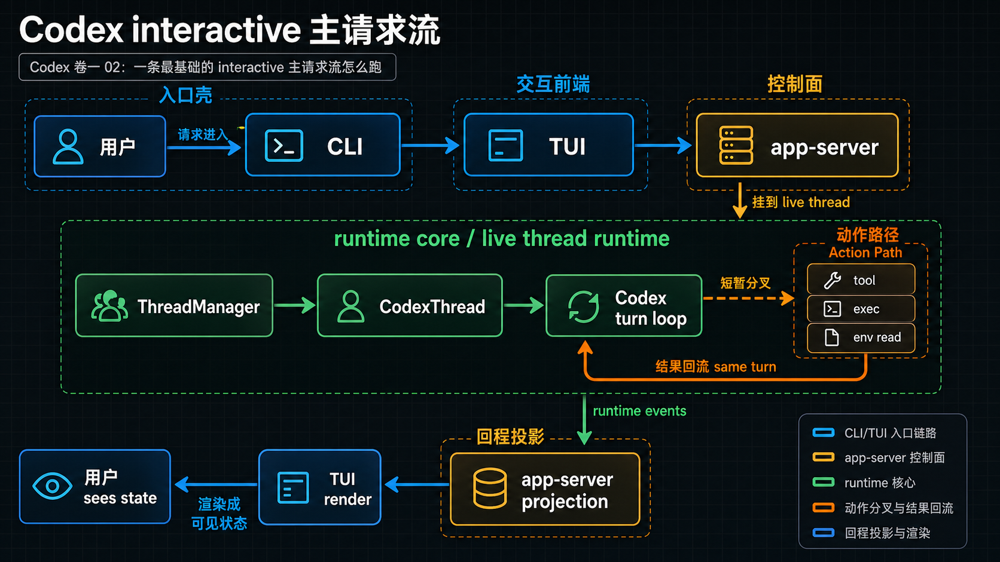

# Codex 卷一 02：一条最基础的 interactive 主请求流怎么跑

## 这一篇不是讲透机制，而是先让主链活起来

上一篇解决的是“这台机器大致分几层、主体在哪”。但只停在静态分层还不够。因为读者真正会困惑的，不是“这些层都叫什么”，而是：

> **我在终端里敲下一句输入之后，它到底是怎么一路穿过去，最后变成一个系统真的开始工作、最后又把结果送回来的过程？**

这篇先不把每个内部机制展开到后面各卷那种密度，只做一件事：

> **先把一条最基础的 interactive 主请求流讲成一条能在脑中跑起来的主链。**

如果这条主链先没看见，后面进卷二到卷六时，读者就会一直觉得自己在不同章节之间跳来跳去，而不是沿着同一台机器往里走。

---

## 一、先给结论：Codex 的 interactive 请求不是“进来一句，出去一句”

很多人第一次接触这类系统时，会默认把它想成：

- 用户输入一句
- 系统做点处理
- 输出一句回答

这对最外面的产品体验当然没错，但对 Codex 的系统理解是不够的。

更准确的说法是：

> **一次 interactive 请求，会先穿过入口壳、交互前端和控制面，再进入 runtime core，被组织成当前工作线中的一个正式工作回合；如果需要调用能力，它还会暂时分叉到动作路径，最后再把结果回流回来。**

也就是说，真正重要的不是“有没有生成一句回答”，而是：

- 请求怎样进入系统
- 哪一层开始承接工作线
- 本轮工作怎样推进
- 动作结果怎样重新回到同一条工作回合里
- 最后怎样被重新投影成用户看得见的界面状态

---

## 二、先看一张 interactive 主请求流总图

先把最小版本的 interactive 主请求流压成一张图：



*图：这张图展示一条最基础的 interactive 请求如何从 CLI / TUI 进入 runtime，再经过 thread、turn、model、tool / sandbox，最后把结果回写到用户可见界面。*

看这张图时，建议按这个顺序读：

- 先看上半段从用户、CLI、TUI 到 app-server 的进入链
- 再看中间 `ThreadManager → CodexThread → Codex` 这条真正进入 runtime 主体的接力链
- 最后看右侧动作路径和下方回程，确认结果为什么必须重新回到同一轮工作回合

这张图先故意只回答 4 个问题：

- 用户输入是怎么被带进正确入口的
- 哪一层开始把请求挂到 live thread runtime 上
- 动作为什么只是当前回合里的短暂分叉
- 为什么最后用户看到的状态，一定已经经过了控制面投影和前端渲染

这条线最重要的，不是你现在能背出所有对象名，而是你要先感受到：

- 这不是一层里自己闭环的系统
- 也不是每层都干同样的事
- 它是一条**层层接力、层层换职责**的主链

所以卷一在这里最该做的事，就是先把每一层的责任边界讲清楚。

---

## 三、逐层看：这条链里每一层到底负责什么

### 1. 用户 → CLI：把请求带进正确入口

用户在终端里执行 `codex`，从系统视角看，第一步发生的不是 runtime 工作，而是**入口判断**。

CLI 这一层先做的是：

- 识别命令模式
- 决定当前走默认 interactive 路径，还是别的产品面/服务面
- 把请求送进正确入口

所以 CLI 的角色不是“真正开始思考”，而是：

> **先把人和输入带到正确系统入口。**

它更像分发器，不像主循环 owner。

### 2. CLI → TUI：进入人真正可操作的交互面

一旦进入默认 interactive 路径，用户就进入 TUI 这层。

TUI 的职责可以先简单记成三件事：

- 接住用户输入
- 组织用户动作
- 把返回事件渲染成可见状态

也就是说，TUI 负责的是“怎么和人打交道”，不是“怎么让系统底层活起来”。

如果要打个比方：

- CLI 是检票口
- TUI 是驾驶舱
- 但真正驱动整台机器往前跑的发动机，不在这两层

### 3. TUI → app-server：把交互动作翻译成可控制请求

TUI 再往下，不是直接扑进最底层对象，而是通过 app-server 这一层把用户动作翻译成一个稳定的控制面请求。

这一步的重要性在于：

- 用户动作不再只是零散 UI 事件
- 它开始被放进一个正式的请求—状态—事件协议面里
- 后面无论是嵌入式 app-server 还是远端 app-server，都会尽量表现成同一套 contract

所以 app-server 的价值不是“它很厚”，而是：

> **它把下层 runtime 暴露成一个稳定可控制的界面。**

### 4. app-server → ThreadManager：真正进入 live thread runtime

到这里，请求才真正开始靠近“系统主体”。

`ThreadManager` 是这一跳里最重要的对象，因为它更接近：

- live thread runtime 的全局协调入口
- thread 生命周期的总调度者
- 让工作线真正活起来的高层 owner

也就是说，app-server 可以负责把请求组织得很稳定，但真正要让一个 thread 工作起来，还得落到 `ThreadManager` 这一层。

### 5. ThreadManager → CodexThread：进入单线程工作线

如果说 `ThreadManager` 处理的是“全局有哪条 thread、它们怎样被持有与调度”，那么再往下一层，就会进入具体某一条 thread 的正式交互对象：`CodexThread`。

这一层更像：

- 单线程工作线的外观
- 线程级操作的正式入口
- 上接控制面，下接更底层 loop 的桥

读者在卷一阶段不用先把它讲透，只要先知道：

> **请求到了这里，已经不再是泛泛“进系统”，而是开始挂到某一条真正可持续工作的 thread 上。**

### 6. CodexThread → Codex：进入本轮真正开始推进的地方

再往里，就进入 `Codex` 这一层。

这一层更接近真正的 session / turn loop。这里开始发生的事情，不再只是“接收一个动作”，而是：

- 组织当前工作面
- 决定是直接回答还是转入动作路径
- 驱动采样、工具、执行等能力
- 把这轮 turn 往前推
- 产出事件与结果

也就是说，真正的“这轮工作开始跑起来”，要往 `Codex` 这一层看。

---

## 四、动作分叉怎样回到同一轮工作回合

如果把这条主链简单理解成“请求进来 → 回答出去”，会忽略 Codex 非常关键的一点：

> **它不是只能直接回答，也可以先进入动作路径。**

比如某一轮里，系统判断当前工作不能只靠模型直接收口，就可能先去：

- 调用工具
- 进入执行链
- 读取环境
- 触发某些能力路径

这一步在卷一不展开 unified-exec、tool runtime、approval、sandbox 的内部细节，但必须先让读者知道：

- 动作不是主线之外的旁枝
- 动作是工作回合内部的一次正式分叉
- 分叉出去之后，结果还必须再回到同一轮工作里

所以更准确地说，这条链中间其实长这样：

```text
当前工作回合
  → 判断
    → 直接回答
    或
    → 进入动作路径
        → 得到结果
        → 把结果接回当前工作回合
```

后面卷二会重点把“这一轮工作回合”展开，卷五则会重点把“动作路径怎样被装成执行会话”展开。

---

这一节最关键的不是“系统会不会做动作”，而是：

> **动作分叉出去之后，结果必须重新回到同一轮工作回合里，成为系统接下来继续判断的输入。**

所以更准确地看，这一段主链不是“离开主线去做点事”，而是：

- 当前回合做判断
- 必要时进入动作路径
- 得到结果
- 再把结果并回当前回合

也就是说：

- action 不是离开主线不回来了
- execution 不是外挂
- tool result 不是随便贴个输出
- 整轮工作要成立，结果必须被重新并回当前工作线

卷一在这里只先立这个闭环感觉。等到卷二讲 runtime core 主回合、卷五讲统一执行子系统时，读者才会真正看清为什么“结果接回主线”是那么核心的事。

---

## 五、最后为什么还能回到 TUI

当底层工作已经推进了一轮，系统还要再经过一个向上的回程：

- runtime 产出事件
- app-server 把这些事件投影成更稳定的外部状态
- TUI 再把这些状态渲染成用户能看见的东西

所以你在界面上看到的“回答”“状态变化”“执行输出”“继续可输入”，其实都不是最底层主循环的原样裸露，而是经过：

- runtime 推进
- 控制面投影
- 前端渲染

三层接力之后，才回到用户眼前。

这也是为什么：

- 不能把 TUI 当成系统主体
- 不能把 app-server 当成底层 runtime owner
- 不能把 UI 上看到的状态，误认为底层内部状态的原样镜像

---

## 六、卷一在这里先立住什么，不立住什么

到这里，卷一已经该完成的任务是：

### 先立住的
- 一条 interactive 主请求流确实存在
- 这条流穿过入口壳、前端、控制面、runtime core
- runtime 中间还能分叉到动作路径，再把结果接回主线
- 最后状态要经过投影与渲染，才能回到用户眼前

### 暂时不立住的
这些东西都会在后面几卷真正展开：

- `ThreadManager` / `CodexThread` / `Codex` 的精确分工 → 卷二
- thread / turn / history / recovery 为什么能持续成立 → 卷三
- app-server 的 request / event / listener / projection 细节 → 卷四
- unified-exec / transcript / approval / sandbox / process store → 卷五
- review / guardian / collab / memories 这些更高层 runtime 组织 → 卷六

卷一的任务不是提前抢掉它们，而是：

> **先让读者知道，后面这些卷是在同一条主链上继续往里走。**

---

## 收口：为什么卷一必须先让你看见这条链

如果卷一没有先把这条最基础的 interactive 主请求流立起来，后面每卷都会有一个共同问题：

- 读者能看到局部对象
- 也能看到一些局部机制
- 但不知道它们是在一条怎样的工作线上接力

一旦先看见这条链，后面的阅读姿势就会完全不同：

- 卷二不再是“新开一套对象介绍”，而是展开 runtime core 中段
- 卷三不再是“突然讲恢复”，而是解释这条工作线为什么能持续
- 卷四不再是“单讲 app-server”，而是解释这条线怎样被暴露成控制面
- 卷五不再是“单讲 exec”，而是解释动作分叉怎样被组织成正式执行会话

所以这篇真正完成的，不是详细解释，而是：

> **让读者第一次把 Codex 看成一条真的会跑的主链，而不是一堆会动的模块。**

下一篇再继续往前一步：不是只看一条请求怎么跑，而是**对 Codex 各个主要组件建立第一次正确认识，并把后面的六卷地图挂回这张总图里。**
---

## 卷内导航

- 上一篇：[《Codex 卷一 01：Codex 到底是什么系统：从壳到主体的第一张总图》](./2026-04-14-Codex-卷一-01-Codex-到底是什么系统-从壳到主体的第一张总图.md)
- 回到本卷入口：[本卷导读](./index.md)
- 下一篇：[《Codex 卷一 03：Codex 各组件第一次认识与六卷地图》](./2026-04-14-Codex-卷一-03-Codex-各组件第一次认识与六卷地图.md)

