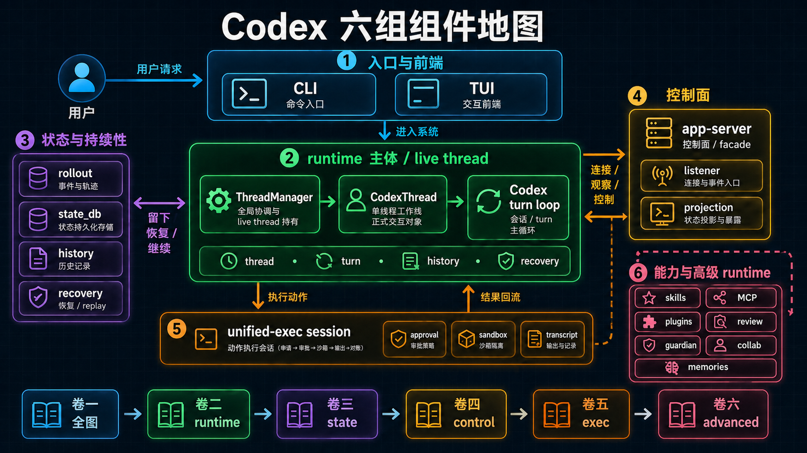

# Codex 卷一 03：Codex 各组件第一次认识与六卷地图

## 这一篇要做的，不是讲透，而是先给每个组件一个正确抽屉

*图：这张图先不展开每个机制，而是把后续六卷会反复出现的组件放到同一张地图上：入口层、runtime core、状态恢复、控制面、执行系统与高级能力。*

前两篇已经先把总图和最小主链立起来了。但光有这两步还不够。因为读者接下来还是会立刻遇到另一个问题：

> **Codex 里这么多组件，我到底该先怎么认识它们？哪些是同一层，哪些不是？哪些是后面某一卷的主角，哪些现在只需要先知道它们的角色？**

这篇不把每个组件讲透，而是先做一件更重要的事：

> **给每个主要组件一个第一次正确定位，再告诉你后面的卷二到卷六分别是在补哪块认识。**

也就是说，卷一到这里要完成的，不是“已经完全懂了 Codex”，而是：

- 先知道每个组件大致属于哪一层
- 先知道它大概负责什么
- 先知道它不是什么
- 先知道后面去哪一卷继续补

---

## 一、先把 Codex 的主要组件分成 6 组

如果直接按仓库目录看，很容易把所有东西看成同一平面上的文件夹。

但更适合卷一的看法，不是目录树，而是下面 6 组组件：

1. **入口与前端**
2. **runtime 主体**
3. **状态与持续性**
4. **控制面**
5. **执行面**
6. **能力与高级 runtime**

这 6 组不是平行专题，而是一张整机图里的不同层。

下面就按这 6 组，先做第一次认识。

---

## 二、第一组：入口与前端

这组最容易先被误认成“系统本体”，因为用户最先碰到的就是它们。

这一组包含 `codex-cli`、`codex-rs/cli` 和 TUI。

### 一句话定位
这组组件负责：**把人带进系统，并把系统呈现给人。**

### 最容易看错什么
最容易看错的是把它们直接当成系统本体。但更准确的说法是：

- **`codex-cli`**：分发壳 / 用户命令入口
- **`codex-rs/cli`**：统一入口与模式分流层
- **TUI**：交互前端 / 渲染层

它们负责把人送进来、把结果展示出来，但不是 thread runtime 真正成立的地方。

### 后面去哪卷补
这组在卷一先认识就够。后面只有在解释“这条主链怎么从用户输入进系统”时，才会再回头经过它们；它们本身不是后续任何一卷的唯一主角。

---

## 三、第二组：runtime 主体

这是卷一最需要先指给读者看的那一组。

### 包含哪些东西
- `core`
- `ThreadManager`
- `CodexThread`
- `Codex`

### 一句话定位
这组组件负责：**让 thread 工作线真正活起来，并把一轮工作回合往前推进。**

### 它们分别大致是什么
- **`core`**：runtime 聚合层
- **`ThreadManager`**：全局 runtime 协调与 live thread 持有支点
- **`CodexThread`**：单线程工作线的正式交互对象
- **`Codex`**：更接近 session / turn loop 的底层 agent 主循环承载者

### 它们不是什么
- 不是控制面 facade
- 不是前端外观
- 不是单纯把请求转发下去的桥

### 你现在先要记住什么
如果前端是驾驶舱，控制面是控制台，那这组组件更像发动机舱。

它们不一定是整本书里最容易读的一组，但它们是整本书最不能看错的一组。

### 后面去哪卷补
- **卷二**：重点把这组组件展开，解释一条 runtime core 主工作回合怎么跑起来

---

## 四、第三组：状态与持续性

如果第二组回答的是“这台机器怎么开始运转”，这一组回答的就是：“为什么它不只是运转一次。”

这一组包含 rollout、SQLite / state、history、recovery / replay，以及 thread / turn 持续工作相关语义。

### 一句话定位
这组组件负责：**让 Codex 不是一次命令执行就结束，而是一条能留下、能恢复、能继续的工作线。**

### 最容易看错什么
最容易看错的是把恢复理解成“把数据库读出来再拼回对象”。卷一阶段先记一个总判断就够：这里真正重要的，不是存了什么，而是这条工作线怎样留下、恢复、继续。

### 后面去哪卷补
- **卷三**：重点展开状态、持续性与恢复为什么能成立

---

## 五、第四组：控制面

这一组最容易和 runtime 主体混在一起。

### 包含哪些东西
- app-server
- listener
- request / event / notification
- projection / state exposure
- TUI over app-server 这一层关系

### 一句话定位
这组组件负责：**把底下已经活起来的 runtime，暴露成可观察、可连接、可控制的稳定接口面。**

### 这一组最容易被误读成什么
最常见误读是：

- app-server 就是主体
- app-server 是另一套 runtime
- request semantics 就等于底层状态本体

但更准确的看法是：

- app-server 不是主体 owner，而是 control-plane facade
- 它很强、很厚，但它的价值在于投影与控制，不在于自己重建另一套心脏

### 你现在先要记住什么
如果 runtime 主体负责“让机器活着”，控制面负责的是：

> **让外界能稳定地使用、观察和控制这台机器。**

### 后面去哪卷补
- **卷四**：重点展开 app-server / listener / request semantics / projection 这些控制面问题

---

## 六、第五组：执行面

这组组件负责回答一个很具体的问题：真正要做动作时，Codex 到底怎么做。

这一组包含 primitive exec、unified-exec、approval、sandbox、transcript、process store，以及 execution session 相关状态。

### 一句话定位
这组组件负责：**把一次动作组织成可批准、可观察、可流式输出、可对账的执行会话。**

### 最容易看错什么
最容易看错的是把执行理解成“包了一层 shell”。更准确的方向是：这里关注的不是单次命令，而是一整条执行会话——从执行申请、审批、沙箱运行，到输出记录和状态对账，都在同一条子系统链上。

### 后面去哪卷补
- **卷五**：重点展开 unified-exec 及其执行子系统链路

---

## 七、第六组：能力与高级 runtime

这是最容易在前几轮阅读里被当成“边角功能”的一组，但它其实决定了 Codex 为什么不只是一个会写代码的终端 agent。

这一组包含两小簇东西：

- **能力接入**：skills、MCP、plugins、apps / connectors
- **高层组织**：review、guardian、collab / realtime、memories

### 一句话定位
这组组件负责：**让 Codex 从一个能运行的 agent，继续长成一个有平台能力、有审查能力、有协作能力、有更高层运行组织的系统。**

### 最容易看错什么
最容易看错的是把它们都当成边角功能：skills / MCP 像附加能力，review / guardian 像外挂检查器，collab / memories 像零散 feature。卷一在这里只先给一个更稳的方向：它们不是主链跑完后的装饰，而是 Codex 继续往更高层 runtime 组织长出来的部分。

### 后面去哪卷补
- **卷六**：重点展开 review / guardian / collab / memories 等高级 runtime 问题
- 平台能力相关材料，也会在后续相关卷里继续被挂回这条主线里

---

## 八、把六卷重新挂回这张组件图

到这里，卷一最重要的导流工作就应该很清楚了：

- **卷一**：立总图、立最小主链、立组件的第一次认识
- **卷二**：补 runtime 主体——一条工作回合怎么真正跑起来
- **卷三**：补状态与持续性——为什么这条工作线能留下、能恢复、能继续
- **卷四**：补控制面——app-server 怎样把 runtime 暴露成稳定控制面
- **卷五**：补执行面——动作怎样被装成可管理的执行会话
- **卷六**：补能力与高级 runtime——review / guardian / collab / memories 为什么不能被当作边角功能

换句话说，后面的每一卷都不是“又开了一个新主题”，而是在补卷一这张图里某个先预览过的区域。

---

## 九、卷一读到这里，读者应该先会什么

如果卷一立住了，读者到这里至少应该先能稳定回答：

1. Codex 到底是什么系统，不是什么系统？
2. CLI、TUI、app-server、core 分别处在哪一层？
3. `ThreadManager`、`CodexThread`、`Codex` 大概分别是什么角色？
4. rollout / recovery / control-plane / unified-exec / review / guardian / collab / memories 大致属于哪类问题？
5. 卷二到卷六分别是在补哪块认识？

注意，这里强调的是“先会大致回答”，不是“已经讲透”。

因为卷一到这里最重要的任务从来不是一次讲完，而是：

> **先让读者脑中有一张不容易看反的图。**

---

## 收口：为什么卷一必须先做这件事

源码导读最容易发生的一种失败，不是观点错，而是读者读了一堆正确内容之后，脑中还是没有一台完整的机器。

卷一要先修掉的，就是这个问题。

所以卷一第三篇的任务不是继续堆术语，而是先把这些术语一个个塞回正确抽屉里：

- 什么属于入口
- 什么属于主体
- 什么属于持续性
- 什么属于控制面
- 什么属于执行子系统
- 什么属于更高层 runtime 组织

到这里，卷一才算真正把前门立住。

下一卷就不再只做 preview，而是正式进入这台机器的心脏部分：**一条请求怎么在 runtime core 里闭合成一轮可以持续推进的工作回合。**
---

## 卷内导航

- 上一篇：[《Codex 卷一 02：一条最基础的 interactive 主请求流怎么跑》](./2026-04-14-Codex-卷一-02-一条最基础的-interactive-主请求流怎么跑.md)
- 回到本卷入口：[本卷导读](./index.md)
- 这是本卷卷尾，读完建议先回到本卷入口再决定是否跳卷。

