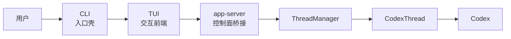
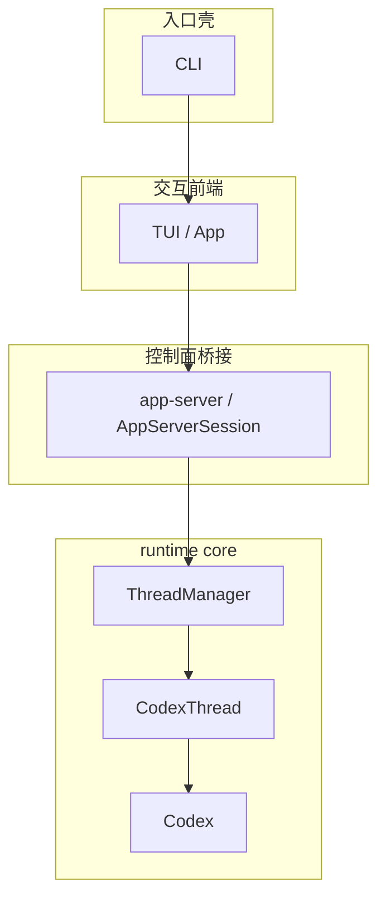

# Codex 新卷二 01：一次请求怎么进入 Codex 的 runtime 主线

## 本篇先回答读者最容易卡住的那个问题

当你在终端里输入一次请求时，直觉上很容易把这件事想成：

- 我敲了一句 prompt
- 它被某个聊天对象接住
- 然后系统开始回答

但 Codex 的源码结构并不是这样。

对 Codex 来说，一次请求不是直接掉进某个“对话对象”里，更不是一开始就进入“聊天逻辑”。它会先穿过几层外壳与桥接层，最后才进入真正负责工作回合推进的 runtime core。

所以本篇真正要回答的是：

> **当用户在终端里发起一次交互时，这次输入到底是怎么穿过 CLI、TUI、app-server 这些外层，真正进入 Codex runtime 主线的？**

---

## 先给结论

先把本篇最重要的判断一句话立住：

> **一次请求不是直接落进某个聊天对象，而是沿着入口壳、交互前端、控制面桥接，最终进入 runtime core 的正式工作线。**

如果再拆成更清楚的四层，就是：

1. **CLI 是入口壳**：负责把用户带进正确入口
2. **TUI 是交互前端**：负责接住人的操作、组织界面交互
3. **app-server 是控制面桥接**：负责把前端动作翻译成稳定的 thread/turn 请求语义
4. **runtime core 才是主体**：`ThreadManager`、`CodexThread`、`Codex` 在这里接力，把请求变成真正运行中的工作回合

也就是说，用户的一次输入真正进入系统主线时，看到的不是“某个聊天框收到了文本”，而是下面这条链：

```text
用户
  → CLI
  → TUI
  → app-server
  → ThreadManager
  → CodexThread
  → Codex
```

这个判断非常重要，因为它直接决定了后面几篇怎么读：

- 如果你把 CLI 当主体，后面会把很多东西看成“命令行功能”
- 如果你把 TUI 当主体，后面会把 UI 编排误认成 runtime 主循环
- 如果你把 app-server 当主体，后面会把控制面误认成真正的 thread owner
- 只有把 runtime core 认作主体，后面的 thread、turn、action、continuation 才会连成一条线

---

## 本篇只写主路径，不展开三类旁支

为了把主线先写稳，本篇只处理“请求如何进入 runtime core”的主路径，不往旁边岔太多。

本篇**不深讲**：

- 恢复、rollout、SQLite 这些历史承接问题
- app-server 更细的 request semantics 与协议细目
- unified-exec、工具执行、结果回流这些后续链路

也就是说，这篇先只做一件事：

> **把一次 interactive 请求是怎样正式接进 Codex runtime 主线的，讲清楚。**

---

## 一、先把层次摆正：请求不是直接进 core，而是先经过三层外部结构

先看最小主图。



这张图里最重要的不是“节点多”，而是每层职责不同。

### 1. CLI 不是主体，它只是把人送进系统

从 `codex-rs/cli/src/main.rs` 的命令定义可以看到，Codex 的 CLI 是一个统一入口：如果没有子命令，参数会被转交给 interactive CLI；真正运行时，`match subcommand` 的 `None` 分支会走 `run_interactive_tui(...)`。

这说明两件事：

- `codex` 默认确实会进入 interactive 路径
- 但 CLI 做的事情主要是**入口选择与模式分流**，不是 thread runtime 本身

所以，CLI 的准确角色不是“聊天主体”，而是：

> **入口壳。**

它负责把用户带到正确模式，但并不持有 live thread，也不直接推进 turn。

### 2. TUI 不是 runtime 主体，它是交互前端

TUI 这一层代码很大，看起来像“整个产品”。但从源码依赖和启动方式看，它更准确的角色是：

- 管界面
- 管输入
- 管渲染
- 管本地 UI 编排
- 通过 `AppServerSession` 去启动或连接 app-server

`tui/src/lib.rs` 里明确存在 `AppServerTarget::Embedded` 和 `AppServerTarget::Remote`，并由 `start_app_server(...)` 去决定到底连嵌入式还是远端 app-server。这个设计已经说明，TUI 先面对的是“我该连哪一个 app-server target”，而不是“我自己直接 new 一个 core runtime”。

所以，TUI 的准确角色不是 runtime owner，而是：

> **交互前端。**

### 3. app-server 不是另一套核心，它是控制面桥接

TUI 再往下，不是直接裸调 `ThreadManager`。`tui/src/app_server_session.rs` 里能直接看到几类 typed request：

- `ClientRequest::ThreadStart`
- `ClientRequest::TurnStart`
- `ClientRequest::TurnSteer`

这说明 TUI 发出去的不是“直接调用 core 对象的方法”，而是**控制面请求**。

再看 `app-server/src/codex_message_processor.rs`，它会把这些 `ClientRequest` 分派到对应的处理函数，例如：

- `ClientRequest::ThreadStart` → `self.thread_start(...)`
- `ClientRequest::TurnStart` → `self.turn_start(...)`
- `ClientRequest::TurnSteer` → `self.turn_steer(...)`

因此，app-server 的准确角色不是“再造一套 runtime”，而是：

> **把上层前端动作桥接成可控制、可观察、可分发的 runtime 请求面。**

### 4. runtime core 才是请求真正进入工作线的地方

再往下，才来到核心层。

从 `core/src/thread_manager.rs` 可以直接看到，`ThreadManager` 的注释非常直白：它负责创建 threads，并在内存中维护它们。也就是说，live thread 的创建与持有，真正更靠近 `core`。

而 `CodexThread` 则是单线程交互面；它把线程级行为收束为较稳定的接口，比如：

- `submit(...)`
- `submit_with_trace(...)`
- `steer_input(...)`
- `next_event(...)`

再往下，`Codex` 才是更底层的 session / submission / event 主循环承载者。`core/src/codex.rs` 里可以看到：

- 它持有提交通道 `tx_sub`
- 持有事件通道 `rx_event`
- 在 spawn 时会启动 `submission_loop(...)`
- `submit(...)` / `submit_with_trace(...)` 会把 `Op` 包成 `Submission` 发进内部队列
- `next_event(...)` 会从事件流取回 runtime 事件

所以这里才是“请求真正并入运行主线”的地方。

---

## 二、把主路径完整走一遍：一次输入到底怎么进入 runtime core

下面按实际运行顺序，把一条最基础的 interactive 主路径从上到下走一遍。

## 1. 用户在终端执行 `codex`，CLI 先做入口分流

从 CLI 视角看，用户的第一步不是“开始对话”，而是“进入哪种运行面”。

`cli/src/main.rs` 中：

- `MultitoolCli` 同时带有 `interactive: TuiCli`
- 也带有 `subcommand: Option<Subcommand>`
- 当 `subcommand` 为 `None` 时，会调用 `run_interactive_tui(...)`

所以默认 interactive 请求的第一步是：

```text
用户输入 codex
  → CLI 解析参数
  → 发现没有子命令
  → 进入 interactive TUI 路径
```

这一段的重点不是复杂，而是边界：

- CLI 决定**走哪条路**
- 但 CLI 还没有让任何 thread 真正跑起来

也就是说，此时请求还在入口壳。

---

## 2. TUI 启动后，先决定连接哪种 app-server 目标

进入 TUI 后，系统还没有直接进入 core。它先要确定交互前端下面接的是谁。

`tui/src/lib.rs` 里存在一个很关键的抽象：

```text
AppServerTarget
  - Embedded
  - Remote
```

`start_app_server(...)` 会根据 target：

- 要么启动嵌入式 app-server
- 要么连接远端 app-server

这一步透露出一个非常关键的架构判断：

> **对 TUI 来说，它面对的不是“我直接拥有 core”，而是“我通过一个 app-server 会话来使用 runtime”。**

这也是为什么 TUI 更像驾驶舱，而不是发动机。

它管的是：

- 人机交互
- 会话启动
- 事件渲染
- 前端状态

但它不自己承接 thread runtime 主体。

---

## 3. TUI 用 `AppServerSession` 把前端动作翻译成控制面请求

TUI 真正开始“把用户请求送下去”时，走的是 `AppServerSession`。

这一层非常关键，因为它把 UI 事件翻译成 app-server 可理解的 typed request。

在 `tui/src/app_server_session.rs` 中，可以看到三组特别重要的入口：

### `start_thread(...)`
它会发送：

```text
ClientRequest::ThreadStart
```

并附带由配置生成的 `ThreadStartParams`。

### `turn_start(...)`
它会发送：

```text
ClientRequest::TurnStart
```

参数中包含：

- `thread_id`
- 当前输入 `input`
- cwd、approval、sandbox、model 等本轮设置

### `turn_steer(...)`
它会发送：

```text
ClientRequest::TurnSteer
```

这对应的是对当前活动回合的继续引导，而不是重新起一个线程。

所以，从运行路径上说，TUI 并不是把一句话“直接交给模型”，而是先把用户动作整理成：

- 是不是要先起线程
- 是不是要开启新 turn
- 还是要 steer 当前 turn

这正是控制面桥接的意义。

---

## 4. app-server 收到请求后，先按协议路由，再落到 runtime 请求处理函数

到了 app-server 这一层，请求已经不再是 UI 动作，而是正式的控制面请求。

`app-server/src/codex_message_processor.rs` 里有很清楚的路由分发：

- `ClientRequest::ThreadStart` 被路由到 `thread_start(...)`
- `ClientRequest::TurnStart` 被路由到 `turn_start(...)`
- `ClientRequest::TurnSteer` 被路由到 `turn_steer(...)`

这一层最重要的工作，不是“自己完成推理”，而是：

1. 验证和整理请求参数
2. 按控制面契约分派到相应处理路径
3. 把请求继续往下桥接到 live thread runtime
4. 同时准备好后续的监听、通知与状态投影

你可以把它理解成一座正式的桥：

- 上面接 UI / client
- 下面接 core runtime

所以 app-server 的厚，主要厚在**控制面组织与协议投影**，不是厚在“自己就是 agent 主体”。

---

## 5. `ThreadStart` 这类请求，会被 app-server 继续桥接到 `ThreadManager`

如果是新线程路径，桥接关系会更清楚。

在 `codex_message_processor.rs` 的 `thread_start(...)` / `thread_start_task(...)` 里，可以看到 app-server 最终会调用：

```text
thread_manager.start_thread_with_tools_and_service_name(...)
```

这一步很关键，因为它说明：

- 真正创建 live thread 的，不是 TUI
- 也不是 app-server 自己维护的一层假对象
- 而是 `core` 里的 `ThreadManager`

而 `thread_manager.rs` 里也明确写着：`ThreadManager` 负责创建 threads，并在内存中维护它们。

所以到这一步，我们终于看到一次请求从控制面正式落到了 runtime owner。

这正是本篇要立住的关键边界：

> **app-server 负责桥接，`ThreadManager` 才更接近 live thread runtime 的真正持有者。**

---

## 6. `ThreadManager` 把请求接到单线程工作面：`CodexThread`

请求一旦进入 `ThreadManager`，它就不再处于“入口分发”阶段，而是进入“线程级运行面”。

这里出现的关键对象是：

```text
ThreadManager → CodexThread
```

`CodexThread` 的意义，不是又起一层壳，而是把“某个线程的一切正式交互”收束成一个稳定对象。

从 `core/src/codex_thread.rs` 可以看出，它对外提供的是线程级行为：

- `submit(...)`
- `submit_with_trace(...)`
- `steer_input(...)`
- `next_event(...)`
- `agent_status(...)`

这说明 `CodexThread` 更像：

> **单线程 runtime 的正式外观。**

从这里开始，请求已经不再是“前端请求”或“控制面请求”，而是会变成线程上的实际操作。

---

## 7. `CodexThread` 再把动作送进 `Codex`，请求才真正并入工作主循环

再往下一层，才是 `Codex`。

从 `codex_thread.rs` 可以看到：

- `submit(...)` 直接转发到 `self.codex.submit(...)`
- `submit_with_trace(...)` 转发到 `self.codex.submit_with_trace(...)`
- `steer_input(...)` 转发到 `self.codex.steer_input(...)`
- `next_event(...)` 转发到 `self.codex.next_event(...)`

这说明 `CodexThread` 本身更像线程级门面，而真正承接 submission loop 的，是 `Codex`。

`core/src/codex.rs` 里更清楚：

- spawn 阶段会启动 `submission_loop(...)`
- `submit_with_trace(...)` 会生成 submission id，并把 `Op` 包进 `Submission`
- 然后通过 `tx_sub.send(sub)` 送入内部提交通道
- `next_event(...)` 则从 `rx_event` 把运行时事件取出来

所以，一次请求真正进入 runtime 主线的关键动作，不是“某个函数被调用了”，而是：

> **它被包装成 runtime 可推进的 submission / op，并送进 `Codex` 背后的提交循环。**

到这里，才可以说它真正进入了 Codex runtime core 的正式工作线。

---

## 三、用一句白话把整条链再翻译一遍

如果把上面的技术结构翻成更好记的白话，可以这样理解：

- **CLI** 负责把你送到大楼门口
- **TUI** 是你看到的前台和操作台
- **app-server** 是前台和内部系统之间的办事窗口
- **ThreadManager** 是内部真正负责开工单、持有活线程的人
- **CodexThread** 是单个工单的正式工作面
- **Codex** 是工单背后真正跑起来的主机器

所以，用户的一句话不是直接塞进“聊天对象”，而是先被送进系统，再被桥接成一个线程/回合上的正式操作，最后进入 runtime 主循环。

---

## 四、这条链里最容易看反的四个地方

为了避免后面读源码时再次看反，这里把最容易混淆的四个判断单独写出来。

### 1. 不要把 CLI 看成主体
CLI 是 front door，不是 runtime owner。

### 2. 不要把 TUI 看成主体
TUI 很大，但主要是 UI orchestration，不是 agent 主循环本身。

### 3. 不要把 app-server 看成平行 runtime
app-server 很厚，但它主要是控制面 facade 与桥接层，不是另一颗 runtime 心脏。

### 4. 真正的工作线起点在 core
真正让请求并入 live thread、并进入提交循环的是：

```text
ThreadManager → CodexThread → Codex
```

这三层才是后面新卷二真正要展开的主体。

---

## 五、把本篇主结论收紧成一张分层图



这张图要记住的不是名词，而是判断：

> **一次请求先进入壳与前端，再经由控制面桥接，最后才并入 runtime core 的主工作线。**

---

## 六、这篇写完后，后面最自然该接什么

既然这篇已经把“请求怎么进来”讲清了，下一篇最自然的问题就不再是“入口在哪”，而是：

> **进入 runtime core 之后，`ThreadManager`、`CodexThread`、`Codex` 这三个核心对象，究竟是怎样接力工作的？**

也就是下一篇要解决的主问题：

- `ThreadManager` 为什么更像全局 runtime 协调者
- `CodexThread` 为什么是线程级正式外观
- `Codex` 为什么更接近真正的 turn / submission loop 承载者

---

## 本篇小结

本篇只要求读者先稳稳记住三句话。

### 第一句
**一次请求不是直接掉进某个聊天对象。**

### 第二句
**CLI 是入口壳，TUI 是交互前端，app-server 是控制面桥接，runtime core 才是主体。**

### 第三句
**一次 interactive 请求的主路径，是 `用户 → CLI → TUI → app-server → ThreadManager → CodexThread → Codex`。**

只要这三句先立住，后面再看 thread、turn、action、result、continuation，就不会把外层壳误认成系统主体。
---

## 卷内导航

- 这是本卷起点，建议先顺着往下读。
- 回到本卷入口：[本卷导读](./index.md)
- 下一篇：[《Codex 新卷二 02：`ThreadManager`、`CodexThread`、`Codex` 怎么接成一条 runtime 主工作链》](./2026-04-12-Codex-新卷二-02-ThreadManager-CodexThread-Codex-怎么接成主工作链.md)

