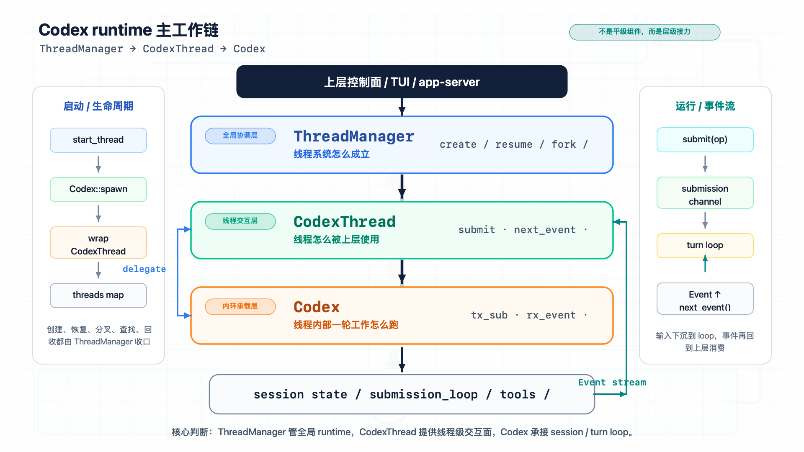
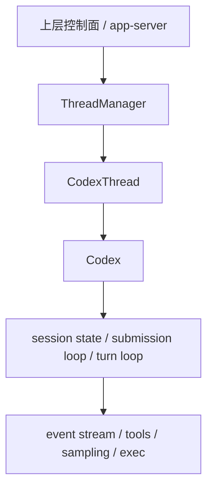
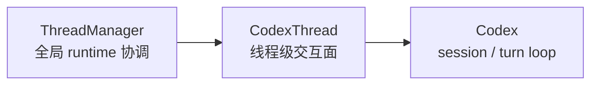

# Codex 新卷二 02：`ThreadManager`、`CodexThread`、`Codex` 怎么接成一条 runtime 主工作链

## 本篇要解决的问题



*图：这张图展示 ThreadManager、CodexThread 与 Codex 三者不是平级模块，而是一条由会话定位、线程封装、回合执行共同组成的主工作链。*


到了 `core` 这一层，读者通常会先看到三个高频名字：`ThreadManager`、`CodexThread`、`Codex`。

如果只看命名，很容易把它们误读成三个并排的组件：

- 一个像管理器
- 一个像线程对象
- 一个像核心对象

但源码关系并不是这样。

本篇要建立的核心判断是：

> **`ThreadManager` 管全局 runtime 协调，`CodexThread` 提供线程级交互面，`Codex` 承接更底层的 session / turn loop；三者不是并排摆放的对象，而是一条 runtime 主工作链上的层级接力。**

这句话如果立不住，后面再看 thread、turn、事件流、恢复、执行面，都会重新散掉。

---

## 一、先把误解拿掉：这不是三个“平级零件”

最常见的误解，是把这三个对象理解成下面这种关系：

```text
ThreadManager
CodexThread
Codex
```

这种看法的问题在于，它只看到“都在 core 里”，却没有看到它们在运行时里的承接方向。

更接近实际的关系是：

```text
ThreadManager
  ↓
CodexThread
  ↓
Codex
```

也就是说：

1. `ThreadManager` 站在**全局 runtime**视角工作
2. `CodexThread` 站在**单个 thread 的正式交互面**上工作
3. `Codex` 站在**更底层的 session / turn loop**里工作

因此，这不是“同层对象的功能分工”，而是**不同层对象对同一条工作线的接力承接**。

---

## 二、先给整张图：三层对象在 runtime 里的位置

### 2.1 主接力图



这张图里最关键的不是箭头多少，而是两件事：

- 上层通常不会直接把全部工作打到 `Codex`
- 下层实际执行也不会由 `ThreadManager` 直接完成

它们之间隔着明确的层级。

### 2.2 三层职责图



可以先用一句话记忆：

- **`ThreadManager` 决定 thread 怎么被创建、持有、协调**
- **`CodexThread` 决定一个 thread 以什么接口被上层使用**
- **`Codex` 决定一个 thread 内部这一轮工作怎么真正跑起来**

---

## 三、为什么先从 `ThreadManager` 讲起

虽然真正“干活”的 loop 更靠近 `Codex`，但运行时主链必须从 `ThreadManager` 开始理解。原因很简单：

> **没有 `ThreadManager`，`Codex` 只是一个可被生成的底层 runtime 单元；有了 `ThreadManager`，这些 runtime 单元才进入一个可持续、可协调、可管理的 live thread system。**

从源码可见，`ThreadManager` 不是一个轻量注册表。

### 3.1 它持有全局线程表

在 `core/src/thread_manager.rs` 中，`ThreadManagerState` 维护：

- `threads: Arc<RwLock<HashMap<ThreadId, Arc<CodexThread>>>>`
- `thread_created_tx`
- `auth_manager`
- `models_manager`
- `environment_manager`
- `skills_manager`
- `plugins_manager`
- `mcp_manager`
- `skills_watcher`
- `session_source`

这说明它管的不是“某一个会话对象”，而是：

- live threads 的持有
- 线程共享资源的注入
- 线程创建时所需的公共 runtime 依赖
- 线程生命周期上的全局协调

所以它首先是一个**全局 runtime 协调者**。

### 3.2 它负责把 thread 真正启动出来

`ThreadManager` 暴露的关键动作包括：

- `start_thread(...)`
- `start_thread_with_tools(...)`
- `resume_thread_from_rollout(...)`
- `resume_thread_with_history(...)`
- `fork_thread(...)`
- `get_thread(...)`
- `shutdown_all_threads_bounded(...)`

这组接口透露出一个清楚的事实：

> **`ThreadManager` 负责把 thread 作为运行时实体启动、恢复、分叉、获取和回收。**

也就是说，它不是“拿到现成 thread 以后做点外围管理”；它本身就是 thread runtime 的正式入口。

### 3.3 它并不直接执行单轮 agent 工作

但反过来看，`ThreadManager` 并不直接暴露：

- 一轮提交如何进入内部 loop
- 单个事件如何被消费
- turn 内部如何推进
- 工具执行如何回流

这些工作继续往下交给 `CodexThread` 和 `Codex`。

所以，`ThreadManager` 的正确定位不是“核心逻辑都在这里”，而是：

> **它负责把全局 runtime 组织起来，并把单个 thread 交给下一层可操作对象。**

---

## 四、`CodexThread` 为什么是线程级交互面，而不是底层 loop 本体

如果说 `ThreadManager` 负责“全局拥有和协调”，那么 `CodexThread` 负责的就是“让某个 thread 变成可交互对象”。

在 `core/src/codex_thread.rs` 里，`CodexThread` 本身非常直白：

```rust
pub struct CodexThread {
    pub(crate) codex: Codex,
    rollout_path: Option<PathBuf>,
    out_of_band_elicitation_count: Mutex<u64>,
    _watch_registration: WatchRegistration,
}
```

这段结构已经暗示了它的角色：

- 它不是脱离 `Codex` 独立存在的线程系统
- 它是一个**包住 `Codex` 的线程级外观**
- 它顺便挂上线程级附属信息，例如 rollout path、watch registration

### 4.1 它对上暴露的是线程级操作

`CodexThread` 的关键方法包括：

- `submit(...)`
- `submit_with_trace(...)`
- `next_event(...)`
- `steer_input(...)`
- `shutdown_and_wait(...)`
- `agent_status(...)`
- `config_snapshot(...)`
- `read_mcp_resource(...)`
- `call_mcp_tool(...)`

这些方法有一个非常明显的共同点：

> **它们都站在“单个 thread 该怎么被上层使用”的角度，而不是站在“session loop 内部怎么实现”的角度。**

例如：

- 上层要向 thread 提交一个操作，就调 `submit`
- 上层要读取 thread 的事件流，就调 `next_event`
- 上层要在 active turn 里追加 steer input，就调 `steer_input`
- 上层要结束 thread，就调 `shutdown_and_wait`

这正是“线程级交互面”的定义。

### 4.2 它对下基本是把动作转交给 `Codex`

更关键的是，`CodexThread` 的很多方法只是直接委托给内部的 `codex`：

- `submit -> self.codex.submit(...)`
- `next_event -> self.codex.next_event(...)`
- `steer_input -> self.codex.steer_input(...)`
- `shutdown_and_wait -> self.codex.shutdown_and_wait(...)`
- `config_snapshot -> self.codex.thread_config_snapshot(...)`

这说明什么？

说明 `CodexThread` 自己不是主要 loop 的实现体。

它的价值不在“比 `Codex` 更底层”，而在：

1. 把底层 `Codex` 包装成一个稳定的 thread-facing 对象
2. 在线程级别补足 rollout、状态、MCP 访问、配置快照等能力
3. 对上形成统一、清晰的交互界面

所以它最准确的位置是：

> **上承 `ThreadManager` 的线程拥有关系，下接 `Codex` 的 session / turn loop，实现单线程 runtime 的正式交互外观。**

### 4.3 它不是 UI 对象，也不是 app-server 对象

这一点也要顺手钉住。

`CodexThread` 不是：

- TUI widget
- app-server request handler
- 前端会话对象

它仍然属于 `core` 内部的 runtime 对象，只不过它已经来到“线程级对外接口”这一层。

换句话说：

- 对 TUI 来说，它太底层
- 对 `Codex` 内部 loop 来说，它又更靠外

这正是中间层对象的典型位置。

---

## 五、`Codex` 为什么是更底层的 session / turn loop 承载者

到了 `Codex`，我们才真正靠近 agent runtime 的内部工作线。

在 `core/src/codex.rs` 中，`Codex` 的结构很有代表性：

```rust
pub struct Codex {
    pub(crate) tx_sub: Sender<Submission>,
    pub(crate) rx_event: Receiver<Event>,
    pub(crate) agent_status: watch::Receiver<AgentStatus>,
    pub(crate) session: Arc<Session>,
    pub(crate) session_loop_termination: SessionLoopTermination,
}
```

这几个字段基本已经把它的定位写明白了：

- 有 submission channel：说明它承接输入操作
- 有 event receiver：说明它向外输出运行事件
- 有 agent status：说明它维持运行状态
- 有 `session`：说明它真正握住底层 session 状态
- 有 loop termination handle：说明后台 loop 是它在承载

所以：

> **`Codex` 不是“再包装一层的 API 对象”，而是更接近 session runtime 本体的容器。**

### 5.1 `Codex::spawn(...)` 真正把 loop 跑起来

`Codex` 最关键的动作是 `spawn(...)`。

从实现看，`CodexSpawnArgs` 会带入：

- config
- auth manager
- models manager
- environment manager
- skills manager
- plugins manager
- mcp manager
- initial history
- session source
- dynamic tools
- agent control
- analytics 等依赖

然后在 `spawn_internal(...)` 中完成几类关键动作：

1. 建立 submission / event channel
2. 装配插件、技能、模型、环境、执行策略等运行依赖
3. 解析初始历史、动态工具、base instructions、session configuration
4. `Session::new(...)` 创建底层 session
5. `tokio::spawn(...)` 启动后台 `submission_loop(...)`
6. 返回可被上层持有的 `Codex`

这说明：

> **真正让一个 thread 内部运行起来的，不是 `ThreadManager` 直接完成，也不是 `CodexThread` 自己完成，而是 `Codex::spawn(...)` 把 session 和 submission loop 组装并启动。**

### 5.2 `Codex` 负责“提交—推进—出事件”这条内环

`Codex` 自己暴露的关键方法包括：

- `submit(...)`
- `submit_with_trace(...)`
- `submit_with_id(...)`
- `next_event(...)`
- `steer_input(...)`
- `shutdown_and_wait(...)`

这组接口和 `CodexThread` 很像，但含义不同。

在 `CodexThread` 层，这些方法是**线程交互 API**；
在 `Codex` 层，这些方法已经直接连着：

- submission channel
- event channel
- session state
- session loop

例如：

- `submit(...)` 会生成 `Submission` 并送入 `tx_sub`
- `next_event(...)` 会从 `rx_event` 读取下一条 runtime 事件
- `shutdown_and_wait(...)` 会提交 `Op::Shutdown` 并等待 loop 终止
- `steer_input(...)` 会直接进入 session 里的 active turn 处理

也就是说，`Codex` 已经站在“这个线程内部回合怎么跑”的层级。

### 5.3 这里才真正靠近 turn loop

虽然 `codex.rs` 还不是所有细节的最底端，但就卷二当前这篇来说，已经足够下判断：

> **`Codex` 是 session / turn loop 的主要承载者，是 runtime 主线中最接近 agent 内部工作回合的对象。**

后面我们再往下，会展开：

- 当前工作面怎么组织
- turn 怎样被推进
- action / result 如何回流
- thread 与 turn 如何分层

但在本篇，这个深度已经够了。这里不再提前把 recovery、projection、control-plane 细节拉进来。

---

## 六、把三者连成一条链：一次 thread 工作到底怎么经过这三层

现在可以把三层接成一条完整工作线。

### 6.1 启动阶段：从全局协调进入单线程 runtime

当上层要启动一个 thread 时，主链大致是：

```text
上层控制面
  → ThreadManager.start_thread(...)
  → ThreadManagerState.spawn_thread(...)
  → Codex::spawn(...)
  → 得到 Codex
  → 包装成 CodexThread
  → 注册进 ThreadManager 的 threads map
```

这里的层级关系很清楚：

- `ThreadManager` 决定要不要建、怎么建、建出来后放到哪里
- `Codex` 负责把底层 session runtime 实际启动起来
- `CodexThread` 则成为上层之后要操作的那个 thread 对象

所以创建顺序本身就证明三者不是平铺对象。

### 6.2 运行阶段：从线程交互面进入底层 loop

当上层向一个已存在 thread 提交动作时，主链大致是：

```text
上层控制面
  → 拿到 Arc<CodexThread>
  → CodexThread.submit(op)
  → Codex.submit(op)
  → submission channel
  → session / submission_loop
  → 产出 Event
  → Codex.next_event()
  → CodexThread.next_event()
  → 上层消费事件
```

这条链可以概括为：

- `ThreadManager` 负责“我该跟哪个 thread 说话”
- `CodexThread` 负责“我怎么跟这个 thread 说话”
- `Codex` 负责“这个 thread 内部如何真正处理这次提交”

### 6.3 生命周期阶段：thread 仍然由 `ThreadManager` 收口

即使 thread 内部 loop 由 `Codex` 承接，到了全局生命周期管理时，系统还是会回到 `ThreadManager`：

- `get_thread(...)`
- `list_thread_ids(...)`
- `fork_thread(...)`
- `resume_thread_with_history(...)`
- `shutdown_all_threads_bounded(...)`

这说明 thread 的运行并不是一堆 `Codex` 各自漂浮着。

相反：

> **单线程内部工作可以下沉到 `Codex`，但全局 thread runtime 仍由 `ThreadManager` 统一收束。**

---

## 七、三者的职责边界，最好用一张表记住

| 层级 | 对象 | 主要职责 | 不负责什么 |
|---|---|---|---|
| 全局协调层 | `ThreadManager` | 创建、持有、恢复、分叉、查找、回收 thread；协调共享 runtime 资源 | 不直接实现单个 turn 的内部 loop |
| 线程交互层 | `CodexThread` | 为单个 thread 提供 submit / next_event / steer / shutdown 等统一接口 | 不拥有全局线程系统，也不是底层 loop 本体 |
| session / turn loop 层 | `Codex` | 承接 submission、event、session、后台 loop，推进单线程内部工作回合 | 不负责全局 thread registry 和跨线程协调 |

如果要把这张表再压缩成一句话，那就是：

> **`ThreadManager` 解决“线程系统怎么成立”，`CodexThread` 解决“线程怎么被使用”，`Codex` 解决“线程内部一轮工作怎么跑”。**

---

## 八、为什么这三层设计比“一个大对象全包”更合理

理解这三层，不只是为了记住命名，而是为了理解 Codex runtime 的工程结构。

### 8.1 它把“全局协调”和“单线程推进”拆开了

如果没有这层拆分，那么下面这些职责会混在一起：

- 全局线程表管理
- 共享依赖注入
- thread 生命周期
- 线程级交互接口
- turn loop 内部推进
- 事件收发

混在一个对象里，系统会非常难读，也难以在上层控制面、thread runtime、session loop 之间建立清楚边界。

### 8.2 它把“线程外观”和“线程内核”拆开了

`CodexThread` 的存在很关键。

因为上层通常需要的是：

- 一个 thread-facing API
- 稳定、可持有、可传递的交互对象
- 不必直接碰到底层 session loop 的实现细节

这就是 `CodexThread` 的意义：

> **它把单线程的“可操作界面”从底层 loop 中抽了出来。**

### 8.3 它让 runtime core 可以同时服务不同上层入口

卷一已经立过一个判断：

- TUI 不是 runtime 主体
- app-server 不是另一套 runtime
- `core` 才是 runtime 中间层

而 `ThreadManager -> CodexThread -> Codex` 这条链，正是这种设计得以成立的关键原因之一。

因为无论上层是：

- TUI
- app-server
- 其他控制面调用

它们最终都可以汇入同一条 thread runtime 主链，而不是各自持有一套独立 loop。

---

## 九、这篇刻意不展开什么

为了保持卷二主线清晰，这里有几类内容只点到为止，不提前展开。

### 9.1 不回头重讲 CLI / TUI

这篇讨论的是 `core` 内部三层对象怎么接力，不再回到：

- CLI 如何分发
- TUI 如何渲染
- app-server 如何做控制面桥接

这些内容已经在前文承担了入口铺垫。

### 9.2 不提前深讲 recovery / turn-history 细节

虽然 `ThreadManager` 已经涉及：

- resume
- fork
- rollout history
- state DB

但本篇只拿这些能力来证明它是 thread runtime 的全局 owner，不把恢复机制本身展开成主题。

### 9.3 不把本文写成 API 手册

这篇的重点不是罗列每个 public method，而是建立**runtime 结构判断**。

我们关心的是：

- 为什么存在这三层
- 三层怎么接
- 各自解决什么问题
- 为什么它们不是并排组件

---

## 十、最后把结论收紧

现在可以把本篇核心结论收成四句话。

### 结论 1：`ThreadManager` 是全局 runtime 协调者

它持有 thread map、共享依赖和线程生命周期入口，负责 thread 的创建、恢复、分叉、查找和整体回收。

### 结论 2：`CodexThread` 是线程级交互面

它把单个 thread 暴露成一个正式、稳定、可操作的对象，对上提供 submit / next_event / steer / shutdown 等线程接口。

### 结论 3：`Codex` 是更底层的 session / turn loop 承载者

它真正握住 submission channel、event stream、session 状态和后台 loop，是单线程内部工作回合的主要运行容器。

### 结论 4：三者不是平铺组件，而是 runtime 主工作链上的层级接力

正确关系不是：

```text
ThreadManager | CodexThread | Codex
```

而是：

```text
ThreadManager
  → CodexThread
    → Codex
```

也正因为如此，Codex runtime core 看起来不是一堆静态对象，而是一条能够持续推进 thread 工作回合的主链。

---

## 下一篇应该接什么

把这三层对象的接力关系立住之后，下一步自然要问：

> **当输入已经进入这条链，Codex 在一轮工作里到底先组织出什么“当前工作面”？**

所以，下一篇应该进入：

- 当前工作面是怎么被组织出来的
- 输入为什么不会直接变成一句回答
- runtime 为什么会先形成一个可判断、可继续推进的当前上下文
---

## 卷内导航

- 上一篇：[《Codex 新卷二 01：一次请求怎么进入 Codex 的 runtime 主线》](./2026-04-12-Codex-新卷二-01-一次请求怎么进入-Codex-的-runtime-主线.md)
- 回到本卷入口：[本卷导读](./index.md)
- 下一篇：[《Codex 新卷二 03：当前工作面是怎么被组织出来的》](./2026-04-12-Codex-新卷二-03-当前工作面是怎么被组织出来的.md)

