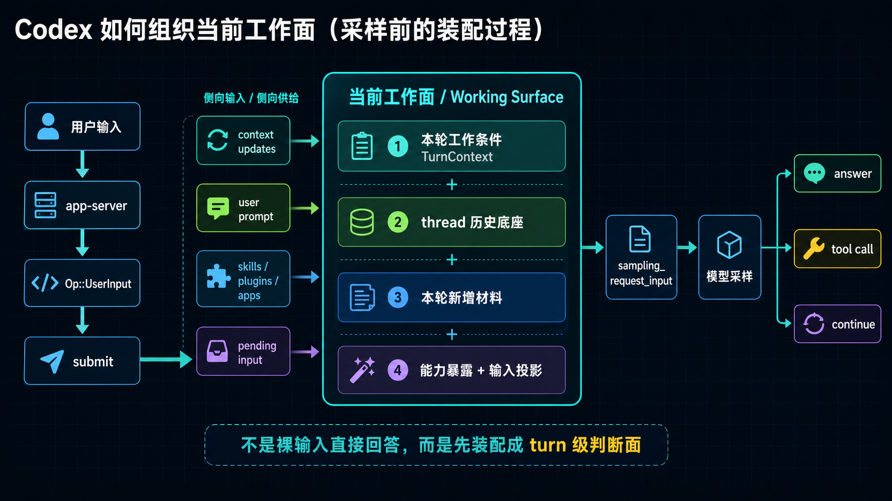

# Codex 新卷二 03：当前工作面是怎么被组织出来的

## 本篇要回答的问题



*图：这张图说明当前工作面不是简单消息列表，而是由历史、配置、上下文、待处理请求与当前 turn 共同组织出来的运行视图。*


一条请求进入 runtime 之后，Codex 并不会立刻把输入直接变成一句回答。
它会先把这一轮真正要处理的材料组织起来，形成一个**当前工作面**，然后才在这个工作面上继续判断、采样、调用能力、接结果、决定是否继续。

本篇要回答的就是：

> **这个“当前工作面”到底是什么，它是怎么被组织出来的？**

为了避免这一篇一上来就卡在术语上，先补两个最低必要定义：

- **thread**：可以先理解为同一条持续工作线的容器。它保存这条线已经累积下来的历史、上下文基线和状态。
- **turn**：可以先理解为这条工作线里的当前一轮处理动作。每来一次新的用户输入，或同一轮内部需要继续推进一次，runtime 都会在 thread 之上组织一个本轮的工作现场。

本篇不会展开 thread / turn 的完整分工，那是下一篇更系统的主题；这里只需要先记住一句：

> **thread 提供这条工作线已经有什么，turn 决定这一刻到底拿哪些东西出来工作。**

---

## 一、先下结论：输入不会直接变成回答，而会先变成可工作的当前工作面

本篇最重要的判断只有一句：

> **进入 runtime 的输入，不会直接变成回答，而会先被组织成当前这轮工作真正可判断、可继续、可调用能力的工作面。**

这句话看起来像概念解释，但其实是 Codex runtime 的一个结构事实。

从代码路径看：

- app-server 在 `turn_start(...)` 中并不是“替用户拿一句回复”，而是把输入映射为 core 的 `Op::UserInput`，提交给 thread runtime
- `CodexThread::submit(...)` 也不是同步产出回答，而是把 `Submission` 送进 `Codex` 的内部提交通道
- `run_turn(...)` 真正开始时，先做的不是“生成一句话”，而是：
  - 建立本轮 `TurnContext`
  - 把上下文更新写入历史
  - 记录用户输入
  - 合并技能 / 插件 / 环境等增补材料
  - 处理 pending input
  - 最后才从当前历史中抽取本轮要送模型的 `sampling_request_input`

所以，runtime 接住请求后的第一件大事，不是回答，而是**把这一轮可工作的判断面立出来**。

---

## 二、什么叫“当前工作面”

为了把这一卷的中间层写稳，这里给出一个工作定义。

如果先不用术语，只记一句最白的话：

> **当前工作面，就是 runtime 在本轮里临时搭出来的一块工作台。后面所有判断，都不是直接踩在原始输入上，而是踩在这块工作台上。**

### 2.1 定义

**当前工作面**，就是 Codex 在某一轮 turn 真正开始执行前，为这一轮工作组织出来的、可供系统继续判断和推进的运行时工作集合。

它不是单一对象，也不是一个提示词字符串；更准确地说，它更像一个**turn 级 runtime 对象视图**：

- 一头连着当前 `TurnContext`
- 一头连着当前 thread 已经积累下来的历史
- 中间不断吸收本轮新增的上下文项、输入项、能力暴露和继续材料
- 最后再被投影成一次次真正送模型的 `sampling_request_input`

所以如果要把它想得更具体一些，不要把它想成一个抽象名词，而要把它想成：

> **runtime 在本轮内临时立起的一块工作台。系统后续的判断，不是直接踩在原始输入上，而是踩在这块工作台上。**

至少包括以下几层：

1. **本轮 turn 身份与配置**
   - turn id / sub id
   - model
   - cwd
   - approval policy
   - sandbox policy
   - collaboration mode
   - personality
   - output schema

2. **当前 thread 已形成的历史底座**
   - 之前已经记录进会话历史的消息与事件物化结果
   - 上一轮留下来的 reference context baseline
   - 当前 thread 已有的状态性上下文

3. **本轮要新注入的上下文更新**
   - 初次完整上下文注入，或后续 steady-state diff
   - developer instructions / user instructions
   - environment context
   - skills / plugins / apps 相关说明
   - 权限、沙箱、realtime、personality 等 turn 级更新

4. **本轮用户输入与其派生的附加材料**
   - 用户本次输入本身
   - submit hooks 带来的 additional contexts
   - 显式提到的技能、插件、连接器所转化出的引导项

5. **当前 turn 可见的能力面**
   - 本轮真正暴露给模型的工具规格
   - 是否允许并行 tool calls
   - 是否存在 deferred dynamic tools

6. **本轮尚待处理的继续材料**
   - 活跃 turn 期间灌入的 pending input
   - 本轮内部继续推进所需的补充输入

把这些合起来，才是 Codex 本轮真正面对的“工作面”。

### 2.2 为什么不用“prompt”来代替它

因为“prompt”太窄了。

如果直接把这一层说成 prompt，很容易误以为：系统只是把几段字符串拼起来发给模型。
但从 runtime 结构看，事实更接近：

- 有一层是**turn 级运行时配置**
- 有一层是**thread 历史**
- 有一层是**本轮上下文注入**
- 有一层是**能力暴露与工具路由**
- 有一层是**运行中继续灌入的 pending input**
- 最后这些才共同收束成一次次 sampling request

所以，“当前工作面”比 prompt 更接近 Codex 的真实中间对象。

如果要再说得工程一点：

- `prompt` 更像是**送模型的投影结果**
- 当前工作面更像是**产生这个投影的 turn 级运行时装配面**

---

## 三、为什么这一篇必须把“当前工作面”立成核心中间对象

如果这一层不单独立住，读 Codex runtime 时会马上发生三种误读。

### 3.1 误读一：以为用户输入直接驱动回答

表面上看，用户在 TUI 里输入一句话，系统似乎马上就开始“答”。
但实际链路是：

```text
用户输入
  → app-server turn_start
  → Op::UserInput
  → Session 建本轮 TurnContext
  → 记录上下文更新
  → 记录用户输入
  → 合并本轮附加材料
  → 从当前历史抽出 sampling_request_input
  → run_sampling_request
```

也就是说，真正送到模型前，输入已经被放进一个更完整的本轮工作面里。

### 3.2 误读二：以为 thread 历史就是全部上下文

thread 历史当然重要，但它只是底座，不是全部。

本轮真正可用的工作面还额外依赖：

- 当前 turn 配置
- 本轮上下文更新
- 本轮技能 / 插件 / app 注入
- 工具可见面
- 当前 pending input

因此，**历史是工作面的底座，不是工作面本身。**

### 3.3 误读三：以为 tool decision 是在“空白状态”下做的

不是。

系统判断“这一轮要不要调用能力”，并不是拿着一条裸输入直接分流，而是在已经组织好的当前工作面上分流。

这也是为什么本篇必须先于“要不要调用能力”那篇：
**不先说明工作面，就无法说明决策面。**

---

## 四、当前工作面是沿哪条链被组织出来的

先给最简主链。

```text
用户输入
  → TUI / app-server
  → TurnStartParams.input
  → 映射为 core::Op::UserInput
  → Codex submit / session turn handler
  → 新建 TurnContext
  → 记录 context updates
  → 记录 user prompt
  → 注入 additional contexts / skills / plugins
  → 吸收 pending input
  → 从当前 history 抽取 sampling_request_input
  → 构成本轮可运行工作面
```

把这条链拆开看，会更清楚。

这里可以先带着一个很具体的阅读视角：

> **所谓“把当前工作面立起来”，不是某一行代码突然创建了一个叫 WorkingSurface 的结构体，而是 runtime 沿着上面这条链，把本轮要站住的材料一层层装上去。**

也正因为如此，本篇最需要看的不是某个孤立定义，而是**单回合里它怎么一步步成形**。

---

## 五、第一步：先把请求从“接口输入”变成“turn 输入”

在 app-server 里，`turn_start(...)` 做的关键动作不是回答，而是把外部请求翻译成 core 能处理的 turn 提交。

它至少做了两件事：

1. 把 v2 输入项映射成 core 的输入项
2. 把这次请求提交成 `Op::UserInput`

可以把它理解成：

> **到 app-server 为止，输入还只是协议请求；进入 core 之后，它才开始进入 turn 组织阶段。**

这一点很重要，因为它说明“当前工作面”的起点不是 UI 文本框，而是 runtime 已经认可的一次 turn 提交。

---

## 六、第二步：先为这一轮建立 `TurnContext`

一旦输入进入 core，系统不会直接采样，而会先建立本轮 `TurnContext`。

从 `TurnContext` 的字段可以看出，这个对象本身就已经不是“用户说了什么”，而是“这一轮怎么工作”的配置快照。

它包含的典型内容有：

- `sub_id`
- `model_info`
- `cwd`
- `current_date` / `timezone`
- `developer_instructions`
- `user_instructions`
- `approval_policy`
- `sandbox_policy`
- `tools_config`
- `dynamic_tools`
- `turn_metadata_state`
- `turn_skills`
- `final_output_json_schema`

这一步的意义是：

> **当前工作面首先不是由“内容”定义，而是由“本轮工作条件”定义。**

也就是说，runtime 先确定这一轮站在什么地面上工作，再决定这一轮要怎么处理内容。

如果把这一步放回“立工作面”的过程里理解，就是：

- 先把这轮的工作台支起来
- 先确定工作台的边界、权限、能力和输出约束
- 然后才把真正要处理的内容往这张工作台上放

---

## 七、第三步：把“上下文更新”先写进历史，建立本轮判断底座

这是理解当前工作面的关键步骤。

在 `run_turn(...)` 里，真正早于用户输入记录的一步是：

```text
record_context_updates_and_set_reference_context_item(...)
```

它的职责非常明确：

- 如果当前还没有 `reference_context_item`，就注入**完整初始上下文**
- 如果已经有 baseline，就只注入**settings diff**
- 然后把新的 `TurnContextItem` 持久化并设成新的 reference baseline

这说明 Codex 不会每轮都把全部上下文重新硬塞一遍，而是把工作面分成两层：

1. **可持续的 baseline**
2. **本轮需要新增的更新项**

### 7.1 初始上下文里到底装什么

`build_initial_context(...)` 说明得很清楚。它会组织出本轮可见的上下文块，包括：

- 权限与审批规则说明
- developer instructions
- memories 相关 developer 提示
- collaboration mode 对应说明
- realtime 更新说明
- personality 说明
- apps / connectors 能力说明
- skills 说明
- plugins 说明
- commit attribution 提示
- user instructions
- environment context

这些内容最后会被整理为：

- developer message
- contextual user message
- 在特殊场景下分离出的独立 developer message

也就是说，Codex 不是“拿到输入后临时看情况想一想”，而是会先把这轮真正需要被模型看见的工作条件整理成一组正式历史项。

### 7.2 这一步为什么重要

因为它把“当前工作面”从抽象概念变成了具体机制：

> **工作面不是漂在内存里的无形状态，而是通过 context updates 被正式写回当前会话历史，成为后续 sampling 的直接输入底座。**

---

## 八、第四步：把本轮用户输入正式写进工作面

上下文底座建立后，`run_turn(...)` 才继续处理本轮输入本身。

这里做的事情不是“马上回答”，而是：

1. 把用户输入转成 `ResponseInputItem`
2. 跑 submit hooks
3. 如果 hooks 要求停止，本轮直接停在这里
4. 如果继续，则把用户 prompt 作为 turn item 正式记录进当前历史

这一步说明两个判断：

### 8.1 用户输入是工作面的一部分，不是工作面的全部

它当然重要，但它进入系统后，要先被放进已经成形的本轮上下文框架里。

### 8.2 用户输入在进入模型前，还可能先经过 runtime 钩子再组织

这意味着 Codex 的当前工作面不是“原始输入快照”，而是**经过 runtime 接纳、检查、补充、落历史之后的输入位置**。

从过程感上看，这也是当前工作面真正开始“像一张工作台”的时刻：

- 前面几步先把工作条件和上下文底座摆好
- 到这里，用户这次真正要处理的问题才被正式放上台面
- 后面系统再继续往这张台面上补充技能说明、能力说明和后续输入

---

## 九、第五步：把本轮显式提到的技能、插件、连接器也折进工作面

`run_turn(...)` 接下来还会继续做一类很重要的工作：

- 识别输入中显式提到的插件
- 识别显式提到的 skills
- 识别可用 connectors / apps
- 解析相关依赖
- 生成 skill injections / plugin items
- 再把这些 items 记录进会话历史

这一层很容易被忽略，但它对“当前工作面”的定义非常关键。

因为这说明：

> **本轮工作面不只是“用户问了什么”，还包括“根据这次提问，系统额外为这一轮补充了哪些能力说明与工作提示”。**

所以当前工作面不是纯被动接收，而是会被 runtime 主动整理和增强。

---

## 十、第六步：把运行中灌入的 pending input 纳入同一工作面

如果用户在模型运行期间继续输入，或者运行中又有别的输入项进入，Codex 不会把这些东西当成完全无关的新世界。

在 `run_turn(...)` 的循环里，它会：

- 从 active turn 取 pending input
- 检查这些 pending input 是否可接受
- 对被接受的输入调用 `record_pending_input(...)`
- 把额外补充上下文再写入历史
- 然后重新构造下一次 sampling request

这说明当前工作面还有一个非常重要的性质：

### 10.1 它不是静态快照，而是本轮可继续扩展的动态面

也就是说，当前工作面一旦建立，并不会被冻结；
只要本轮没有结束，它就还能继续吸收：

- 新增用户输入
- hook 产出的附加上下文
- 工具结果回流
- 其他需要纳入本轮判断的新材料

因此更准确的说法是：

> **当前工作面是当前 turn 的活动判断面，而不是一次性拼好的 prompt 包。**

---

## 十一、第七步：从当前历史里抽出真正送模型的 sampling 输入

当前工作面真正收束成模型输入的那一步，在 `run_turn(...)` 里也写得很直白：

```text
sampling_request_input = sess.clone_history().for_prompt(...)
```

这一步特别值得强调。

它说明 Codex 并不是单独维护一个“本轮 prompt 字符串”，而是：

1. 先把本轮需要的上下文、输入、增补项都写回会话历史
2. 再从当前历史中，按模型输入模态抽取出本次 sampling 所需的输入项

也就是说：

> **模型看到的内容，不是“用户输入本身”，而是“当前工作面在这一时刻被投影成的 prompt 输入”。**

这就是“当前工作面”与“prompt”的真正层级关系：

- 当前工作面：runtime 中间对象
- prompt / sampling_request_input：当前工作面的模型投影结果

本篇不继续细讲 projection 细部，但这一层级必须先记住。

把前面几步连起来看，单回合里“当前工作面被立起来”的节奏其实很明确：

1. 请求先被接纳成一次 turn 提交
2. runtime 先建立本轮 `TurnContext`
3. 再把 context updates 写成这轮的历史底座
4. 然后把用户输入正式放进来
5. 再补上 skills / plugins / apps / pending input 等增量材料
6. 最后才从这套已装配好的历史视图里抽出本次 sampling 输入

所以，“当前工作面”不是一句解释性的命名，而是这六步装配完成之后，本轮真正开始可运行的那个状态。

---

## 十二、因此，当前工作面可以概括成一个四层结构

为了便于记忆，可以把它压缩成下面四层。

```text
第一层：本轮工作条件
- model / cwd / sandbox / approval / mode / schema

第二层：thread 已有历史底座
- 会话历史
- reference context baseline
- 已持久化的上下文状态

第三层：本轮新增组织材料
- context updates
- user prompt
- additional contexts
- skills / plugins / apps 注入
- pending input

第四层：本轮能力暴露与模型输入投影
- tool visibility
- router/model-visible specs
- sampling_request_input
```

这四层合起来，就是本轮 runtime 真正站着工作的地方。

---

## 十三、用一句更工程化的话重新定义它

如果要把“当前工作面”写成更像手册的定义，我建议这样表述：

> **当前工作面，是 Codex 在一个 turn 内围绕 `TurnContext`、当前 thread 历史、本轮新增上下文项、用户输入、能力暴露和 pending continuation 共同组织出的运行时判断面；后续回答、工具调用与继续推进，都不是直接建立在原始输入上，而是建立在这个判断面上。**

这个定义有三个重点：

1. 它是**turn-scoped** 的
2. 它以**历史 + 当前配置 + 本轮增量**共同组成
3. 它是后续一切判断的**真正支点**

---

## 十四、这一层会直接决定后文哪些问题

把当前工作面立住之后，后面几篇就都能顺着展开。

### 14.1 它帮助读者先看懂“thread 和 turn 怎么分工”

因为 thread 提供持续历史底座，turn 提供当前活动判断面。

### 14.2 它决定“为什么系统不是一问一答”

因为一轮不是把一句输入换一句输出，而是在同一工作面里反复补材料、做判断、接结果、再继续。

### 14.3 它决定“为什么 tool decision 是 turn 内决策”

因为要不要调用能力，不是在裸输入上判断，而是在当前工作面上判断。

---

## 十五、本篇结论

现在可以把本篇收成三句话。

### 结论 1

**进入 runtime 的输入，不会直接变成回答，而会先被组织成当前这轮工作真正可判断、可继续、可调用能力的工作面。**

### 结论 2

**“当前工作面”应该被视为新卷二的核心中间对象。**

它不是单个字段，也不是 prompt 术语，而是连接：

- thread 历史
- turn 配置
- 本轮输入
- 上下文更新
- 能力暴露
- 继续推进材料

的 runtime 判断面。

### 结论 3

**Codex 的回答、工具调用与继续推进，都是在这个工作面上发生的，不是直接从原始输入跳出来的。**

这也是为什么理解 runtime 时，不能只盯“收到输入”和“返回结果”两个端点；
中间真正把系统组织起来的，就是这块当前工作面。

---

## 下一篇建议阅读

顺着这一篇，下一篇最自然的问题是：

> **thread 和 turn 为什么不是两个平行名词，而是同一条工作线上的不同层次？**

因为一旦“当前工作面”成立，thread 与 turn 的分工就会变得非常清楚：

- thread 负责持续工作线
- turn 负责当前活动工作面
- runtime 则负责让两者接成真正能推进的工作回合
---

## 卷内导航

- 上一篇：[《Codex 新卷二 02：`ThreadManager`、`CodexThread`、`Codex` 怎么接成一条 runtime 主工作链》](./2026-04-12-Codex-新卷二-02-ThreadManager-CodexThread-Codex-怎么接成主工作链.md)
- 回到本卷入口：[本卷导读](./index.md)
- 下一篇：[《Codex 新卷二 04：thread 和 turn 为什么不是两个平行名词》](./2026-04-12-Codex-新卷二-04-thread-和-turn-为什么不是两个平行名词.md)

