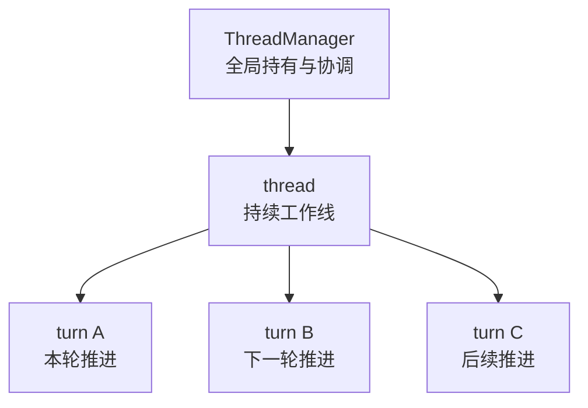

# Codex 新卷二 04：thread 和 turn 为什么不是两个平行名词

## 本篇要回答的问题

读到 Codex 的 runtime core 时，很多人会先遇到两个高频词：`thread` 和 `turn`。

如果只看字面，这两个词很容易被理解成两个并排概念：

- 一个叫 thread
- 一个叫 turn
- 它们似乎都是“对话过程”的单位

但这种理解会很快把后面的 runtime 主线读散。

因为在 Codex 里，`thread` 和 `turn` 并不是两个横着摆放的名词，也不是两个互相替代的粒度。它们描述的是**同一条工作线上的不同层次**。

本篇要回答的就是：

> **Codex 里 thread 和 turn 为什么不能被理解成两个并排的概念，而应该被理解成同一条工作线上的不同层次？**

---

## 先给结论

本篇先把最关键的判断立住：

> **thread 是持续工作线的承载单元，turn 是这条工作线上的运行轮次；两者不是并列概念，而是容器层与推进层的关系。**

把这句话再展开一层，可以得到四个直接判断：

1. **thread 负责承载连续性**：它让一条工作线可以被创建、持有、继续、观察和结束。
2. **turn 负责承载推进性**：它表示这条工作线当前正在跑的某一轮具体工作。
3. **thread 比 turn 更上层**：没有 thread，turn 就没有稳定归属；没有 turn，thread 只是一个静态壳。
4. **两者必须放回 runtime core 主线理解**：这里先讨论 live runtime 如何组织工作线，不把话题拖进恢复机制。

所以，更准确的关系不是：

```text
thread    turn
```

而是：

```text
thread
  └─ turn 1
  └─ turn 2
  └─ turn 3
```

或者再白话一点：

> **thread 像这条持续存在的工作线，turn 像这条线上一轮一轮实际发生的推进。**

---

## 本篇的讨论边界

为了把 runtime core 主线写稳，本篇只处理 `thread` 和 `turn` 在**运行时主线**里的层级关系。

本篇**不展开**：

- `turn-history semantic projection`
- `active turn snapshot` 的恢复边界
- running-thread resume 时的 turn 视图装配细节
- rollout / SQLite / replay 这些恢复问题

这些材料当然和 `thread` / `turn` 有关，但它们属于后面的恢复与视图重建主题，不是本篇的主任务。

本篇现在只做一件事：

> **把 thread / turn 放回 Codex runtime core 的 live 工作线里，说明谁承载持续性，谁承载当前轮次。**

---

## 一、先把最常见的误解拿掉：thread 和 turn 不是两个平级单位

最常见的误读，是把 `thread` 和 `turn` 理解成两个并排的“状态单位”：

- thread 表示一个对话
- turn 表示一个回合
- 两者像两个不同角度的命名

这个理解的问题在于，它没有回答一个更关键的问题：

> **到底是谁在承载整条 live 工作线，谁又是在这条工作线上一次次推进？**

如果把两者看成平级名词，就会立刻出现三个解释不通的地方。

### 1. 为什么上层先拿到的是 thread，而不是 turn

前一篇已经说明，app-server 往 core 侧下发的是：

- `ThreadStart`
- `TurnStart`
- `TurnSteer`

这个命名顺序本身就说明了一件事：

- 先有可被启动和持有的 thread
- 才有在线程内部发起的一轮 turn
- turn 还可以在活动期间继续被 steer

也就是说，在系统接口层面，`turn` 已经不是一个独立漂浮单位，而是**默认隶属于某个 thread**。

### 2. 为什么 `ThreadManager` 持有的是 threads，而不是 turns

从前文可知，`ThreadManager` 负责创建、持有、获取、恢复、分叉和关闭 thread。

这说明 runtime core 真正长期管理的实体是：

- live threads
- 线程共享资源
- thread 生命周期

而不是一堆脱离上下文、平铺存在的 turns。

如果 `thread` 和 `turn` 真是平级概念，那么 runtime 的全局拥有关系就应该同时对它们平等成立；但实际上并不是。全局拥有的是 thread，turn 是在线程里发生的轮次活动。

### 3. 为什么运行中最关键的是 active turn，而不是 active thread snapshot 列表

在 app-server 的 turn materialization 笔记里能看到一个重要判断：运行中的系统会维护 active turn 的热态视图，并在需要时把它叠加到 thread 历史视图上。

这件事本身说明：

- thread 提供的是整条工作线的归属和连续性
- turn 提供的是当前这轮工作的活跃推进面

也就是说，系统并不是拿 `thread` 和 `turn` 做两个平行投影；而是在**同一条 thread 上，对当前活跃 turn 做额外强调**。

所以，到这里可以先把误解拿掉：

> **thread 和 turn 不是两个并排状态单位，而是“持续工作线”与“当前推进轮次”的关系。**

---

## 二、先用一句白话记住它们的区别

如果只想先记最不容易错的一版，可以直接记下面这句：

> **thread 管“这条线一直是谁”，turn 管“这条线现在跑到哪一轮”。**

把它翻成更正式一点的说法：

- `thread` 是一条持续工作线在 runtime 里的承载单元
- `turn` 是这条工作线内部一次具体运行轮次的工作单位

这里有两个关键词必须抓住。

### 1. thread 的关键词是“持续”

`thread` 的存在意义，不是为了表示“消息列表”。

它更核心的作用是：

- 给这条工作线一个稳定身份
- 持有这条线的 live runtime
- 让上层可以继续向它提交输入
- 让下层可以持续向外发事件
- 让这条线可以在多轮工作之间保持连续性

所以，thread 首先不是内容块，而是**持续运行关系的承载体**。

### 2. turn 的关键词是“本轮”

`turn` 的作用也不是“把历史切片做展示”这么简单。

在 runtime 主线上，turn 更准确地表示：

- 当前这一轮工作开始了
- 当前这一轮工作正在推进
- 这一轮里可能生成消息、调用工具、接收结果、继续判断
- 最终这一轮完成、失败或被中断

所以，turn 首先不是一个静态记录条目，而是**工作线上的一次运行轮次**。

把这两个关键词并在一起看，就很清楚了：

> **thread 负责把线拉住，turn 负责让线往前走。**

---

## 三、为什么必须把它们放回 runtime core 主线里看

很多关于 `thread` / `turn` 的混乱，不是因为词本身难，而是因为读者太早把它们拖进了恢复视角。

一旦过早从恢复、回放、历史投影视角进入，就会很容易把它们看成：

- thread 是一种历史容器
- turn 是历史里切出来的片段

这种看法并不完全错，但它不是新卷二现在要立住的那条主线。

新卷二这一段要写的是：

> **一条请求怎么进入 runtime core，并在 live 系统里变成一轮可持续推进的工作回合。**

在这条主线上：

- `thread` 首先是 live runtime 的承载单位
- `turn` 首先是 live runtime 正在推进的一轮工作

只有先把这层立住，后面再谈恢复、重建、投影、历史装配时，读者才不会把“运行时实体”和“恢复后的视图结果”混成一层。

所以，本篇的立场要刻意收紧：

- 先讲 live runtime 里的 thread / turn
- 不提前展开 turn 视图装配
- 不提前展开 active snapshot 合并
- 不提前展开 semantic projection

这是为了防止结构顺序倒过来。

---

## 四、thread 在 runtime 里到底承载什么

下面先单独讲 `thread`。

如果只从名字看，thread 很容易被想成“一个聊天线程”。但在 Codex runtime 里，它的角色比这个说法更正式，也更强。

### 4.1 thread 是 live 工作线的正式归属单位

从 `ThreadManager -> CodexThread -> Codex` 的主链可以看出，系统真正长期持有的是 thread。

这意味着 thread 至少承担以下几件事：

1. **身份归属**
   - 上层要引用某条工作线，首先拿的是 thread id
   - 后续动作也都围绕这个 thread 发生

2. **runtime 持有**
   - `ThreadManager` 在内存中持有 live threads
   - `CodexThread` 作为单线程交互面存在
   - `Codex` 则作为更底层的 session / turn loop 运行在其中

3. **连续事件面**
   - 上层向 thread 提交输入
   - 从 thread 读取事件
   - 在活动期间向 thread 发送 steer input

4. **多轮工作承接**
   - 一轮工作结束后，这条 thread 仍然可能继续存在
   - 下一轮 turn 仍然在这条线上继续发生

所以，thread 最准确的定义不是“对话内容容器”，而是：

> **一条 live 工作线在 runtime 里的承载单元。**

### 4.2 thread 的重点不在“本轮做了什么”，而在“这条线还能继续”

thread 当然会包含和历史、状态、事件相关的信息，但它最关键的能力并不是描述某一轮细节，而是保证：

- 这条线被系统认领
- 这条线可以继续收输入
- 这条线可以继续产事件
- 这条线可以从一轮进入下一轮

也就是说，thread 更像**连续性框架**，而不是“当前动作本身”。

### 4.3 没有 thread，turn 就失去稳定归属

这点必须明确说出来。

如果没有 thread：

- 一轮 turn 属于谁，就不稳定
- turn 的前后文要挂在哪里，也不稳定
- 下一轮和上一轮如何接续，也不稳定
- 事件流要从哪条工作线上返回，也不稳定

因此，从 runtime 主线看，turn 不能先于 thread 被理解。

正确顺序是：

> **先有作为承载线的 thread，才有作为运行轮次的 turn。**

---

## 五、turn 在 runtime 里到底承载什么

再来看 `turn`。

如果把 `thread` 理解成整条持续工作线，那么 `turn` 就是在这条线上一次次真正发生的工作轮次。

### 5.1 turn 是工作线上的一次正式推进

从 app-server 的接口语义就可以看到，`TurnStart` 不是“查看某个历史条目”，而是**发起一轮新的工作**。

进入 core 后，这一轮工作会经历一整套 runtime 动作：

- 建立本轮上下文
- 记录用户输入
- 组织当前工作面
- 进入采样或能力调用判断
- 处理工具结果和继续材料
- 最终收口、失败或中断

因此，turn 不是消息切片，而是：

> **thread 内部一轮真正被执行的工作过程。**

### 5.2 turn 的重点不在“归属”，而在“推进”

和 thread 对比看，会更清楚：

- thread 关心的是“这条线是谁、能不能继续、由谁持有”
- turn 关心的是“当前这一轮开始没有、在跑没有、跑成什么状态”

也就是说，turn 不是负责把整条工作线长期托住，而是负责描述和承载**本轮推进状态**。

### 5.3 turn 可以结束，但 thread 不一定结束

这是区分两者层级最直观的事实。

一轮 turn 完成后，可能发生的是：

- 这一轮结束了
- 当前工作回合收口了
- thread 仍然存在
- 用户或系统之后还能在同一条 thread 上再启动下一轮 turn

这说明：

- turn 的生命周期通常比 thread 更短
- turn 是在线程内部展开和结束的
- thread 是承接多个 turn 的更上层单位

所以，`turn` 不是和 `thread` 同层竞争“谁代表会话”；它只是这条会话工作线里的单轮推进单元。

---

## 六、用一张图把层级关系摆正

到这里，可以把两者的关系压缩成一张最小图。



这张图想表达的只有三件事：

1. `thread` 先作为被持有的 live 工作线存在。
2. `turn` 不是和 `thread` 横向并列，而是在线程内部一轮一轮发生。
3. 一条 thread 可以承接多个 turn，因此 thread 和 turn 的职责天然不同。

如果换一种更贴近 runtime core 的写法，可以理解成：

```text
ThreadManager 持有 thread
thread 暴露可交互的单线程 runtime
turn 在这个 runtime 内一轮轮启动、推进、完成
```

这就是“容器层与推进层”的具体含义。

---

## 七、为什么说它们是“容器层与推进层”，而不是“两个维度”

有些解释会说：thread 和 turn 是两个不同维度。这个说法有一点帮助，但还不够准确。

因为“两个维度”容易让人继续觉得它们是平行轴；而 Codex 里的实际结构更像：

- 一个负责承载
- 一个负责推进
- 后者发生在前者之中

所以，本篇更建议用下面这组词：

- `thread`：**容器层**
- `turn`：**推进层**

这里的“容器”不是说 thread 只是个静态盒子，而是说它负责：

- 承接这条工作线
- 给轮次提供归属
- 维持跨轮次连续性

这里的“推进”也不是说 turn 只是个抽象标记，而是说它负责：

- 打开当前一轮工作
- 承接本轮运行中的状态变化
- 给本轮结果一个收口边界

这组关系里最重要的不是术语本身，而是方向：

> **turn 发生在 thread 上，thread 通过一轮轮 turn 被推进。**

这已经不是两个平行维度，而是一个上层承载、一个下层推进的层级关系。

---

## 八、把它翻成更白话的话

如果读者不想先记这么多术语，可以先记下面这版白话解释：

### 8.1 thread 像一条长期挂着的工作线

它回答的是：

- 这条工作线是谁
- 这条线现在还在不在
- 后续输入往哪里送
- 事件从哪里继续回来
- 下一轮还在不在同一条线上跑

### 8.2 turn 像这条工作线上当前这一轮正在做的事

它回答的是：

- 这一轮开始了没有
- 这一轮目前跑到哪里
- 这一轮有没有被打断
- 这一轮最后是完成、失败还是中止

### 8.3 两者组合起来，才是一条完整的 runtime 工作回合结构

只看 thread，会只剩“这条线还活着”；
只看 turn，会只剩“这一轮在动”。

把它们放在一起，才得到 Codex runtime 更真实的结构：

- thread 让工作线可以持续存在
- turn 让工作线在某一刻实际推进

所以，白话总结就是：

> **thread 是线，turn 是线上的这一轮。**

---

## 九、这一定义为什么对后文很重要

本篇不是为了做术语辨析，而是为了给后面几篇铺底。

如果这里不把 `thread` / `turn` 的层级关系立住，后面至少会出现三种连锁误读。

### 9.1 会误把 action / result 当成“属于 thread 的静态属性”

实际上，后面的 action、tool call、result 回流、continue-or-stop 判断，主要都发生在**某一轮 turn 的推进中**。

thread 提供承载面，但真正的推进动作发生在 turn 内。

### 9.2 会误把多轮连续性看成“turn 自己串起来的”

不是。

turn 本身是轮次单位，多轮连续性真正依附的是 thread。是同一条 thread 把上一轮和下一轮接到一起，而不是 turn 自己单独完成跨轮承接。

### 9.3 会误把恢复视图里的 turn 列表当成 live runtime 主体

恢复时当然会看到 turn 列表、历史装配、active turn snapshot 等问题，但那是对 thread 历史与当前轮次的**重建和投影**。

如果在 runtime core 这一卷就把它们当主体，会把 live 运行关系和恢复视图关系混成一层。

因此，本篇的结论会直接服务后文：

- 第 5 篇谈“系统怎么决定这一轮要不要调用能力”时，主体是当前 turn 的决策推进
- 第 6、7 篇谈 result 如何回到当前工作回合、系统如何决定继续还是收口时，主体也仍然是 turn 内部推进
- 而这些 turn 之所以能连成持续工作线，依赖的则是 thread 这一承载层

---

## 十、最后把本篇结论收紧成正式定义

到这里，可以把本篇压成一组适合手册正文引用的定义。

### 10.1 `thread` 的正式定义

> **thread 是 Codex runtime 中一条持续工作线的承载单元。它负责提供稳定归属、连续事件面与跨轮次延续能力，使系统能够在同一条 live 工作线上持续接收输入并推进后续工作。**

### 10.2 `turn` 的正式定义

> **turn 是某条 thread 内部一次具体运行轮次的工作单位。它负责承载当前这一轮的开始、推进、状态变化与收口边界，是 runtime 工作真正发生的本轮推进面。**

### 10.3 `thread` 与 `turn` 的关系定义

> **thread 与 turn 不是两个并列概念，而是同一条工作线上的不同层次：thread 负责承载持续性，turn 负责承载推进性；前者是容器层，后者是推进层。**

---

## 本篇小结

最后只记三句话就够了。

1. **thread 是持续工作线的承载单元。**
2. **turn 是这条工作线上的运行轮次。**
3. **两者不是并列概念，而是容器层与推进层关系。**

如果再用最白的话收一遍，就是：

> **在 Codex 里，thread 不是和 turn 并排摆着的另一个名词；thread 是线，turn 是这条线当前跑的这一轮。**

这也是为什么本篇必须把 `thread` / `turn` 放回 runtime core 主线来讲，而不提前拖进恢复机制：

- 先把 live 工作线和本轮推进关系讲清楚
- 后面谈恢复、投影、历史装配时，层次才不会乱
