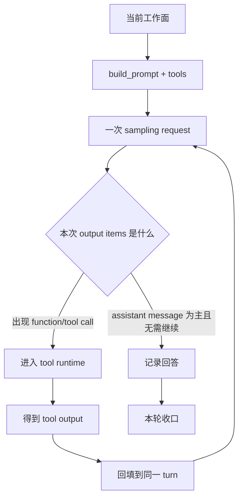
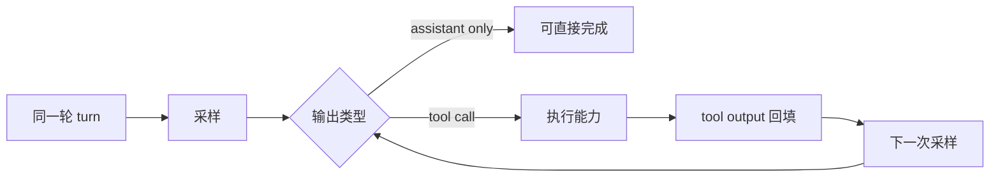

# Codex 新卷二 05：系统怎么判断这一轮要不要调用能力

## 本篇要回答的问题

前一篇已经把“当前工作面”立住了。
接下来的关键问题是：

> **进入当前工作面之后，Codex 是怎么从“形成当前判断”推进到“要不要调用能力”的？**

这一步如果不写清，读者很容易把 Codex 想成一种过于简单的聊天程序：

- 用户发来一句话
- 模型先回第一句话
- 如果需要，再另外想办法调工具

但 Codex runtime 的真实结构并不是这样。
它的一轮工作回合，从一开始就不是默认要停在“首条回复”上；它真正先做的，是在当前 turn 里判断：

- 这一次采样是否已经可以直接收口
- 还是要沿着 action / tool / execution 路径继续推进

本篇要说明的，就是这个**回合内部分叉点**：

> **系统为什么会从当前工作面走进 action / tool path。**

---

## 先给结论

本篇最重要的判断有三句。

> **第一，Codex 的一轮工作回合不是天然停在首条回复上，而是先判断当前该直接收口，还是先进入 action / tool / execution 路径。**

> **第二，这个判断点不在 UI 层，也不在某个单独 tool handler 里，而是在 runtime core 的 turn loop 中。**

> **第三，“回答”和“调用能力”不是两套彼此独立的流程，而是同一工作回合里对同一次采样结果的两种去向。**

把这三句再压缩成一张最小心智图，就是：

```text
当前工作面
  → 组织 prompt 与工具可见面
  → 发起一次 sampling request
  → 看模型这次吐出的 output items 是什么
      → 只有 assistant message，可直接收口
      → 出现 tool / function call，进入能力路径
  → 工具结果回填当前 turn
  → 再次 sampling
  → 直到本轮无需继续
```

所以，Codex 并不是“先回答，再考虑要不要执行”。
更准确地说，它是：

> **先跑一轮 runtime 判断；回答与调用能力，只是这一轮判断后的两种分叉。**

## 先把几个高频词说白

- **sampling**：让模型基于当前工作面做一次正式判断。
- **output items**：这次判断吐出来的结果项，可能是普通回答，也可能带 tool / function call。
- **follow-up**：这一轮还没收口，runtime 认为还得继续往下跑。
- **tool / action path**：同一轮判断里，系统决定先去调用能力、拿结果、再回流当前 turn 的那条分叉。

---

## 本篇边界

为了把 runtime core 的决策点写清楚，本篇只讨论以下内容：

1. 当前工作面已经形成之后，turn loop 如何进入采样
2. runtime 如何先组织本轮可见能力面
3. 采样结果怎样在同一工作回合里分叉成“直接回答”或“调用能力”
4. 工具调用如何在本轮内形成需要 follow-up 的信号

本篇**不展开**：

- unified-exec 的内部执行链
- plugins / MCP / skills 的全貌
- 每一种工具的注册细节与 handler 细节
- 执行结果如何完整回流到下一轮判断的所有细部

这里的目标不是写一篇工具系统总览，而是把**“是否进入能力路径”这个 runtime 决策点**单独立住。

---

## 一、先纠正一个最常见的误解：一轮 turn 不是默认在第一条回答处结束

从 `core/src/codex.rs` 的 `run_turn(...)` 注释就能直接看出这一点：

- 如果模型请求 function call，系统会执行它，并把输出送回下一次 sampling request
- 如果模型只给出 assistant message，系统才把它记入历史，并把这一轮视为完成

这句话其实已经把本篇的主结构说明白了。

也就是说，在 runtime core 眼里，一轮 turn 的默认形态不是：

```text
用户输入 → assistant 首答 → 结束
```

而是：

```text
用户输入
  → run_turn
  → sampling
  → 观察本次输出的类型
      → 纯回答：可结束
      → tool call：继续执行并回填
```

所以，“第一条回复”在 Codex 里只是可能的结果，不是天然的终点。
真正值得本篇盯住的，不是“有没有说出一句回复”，而是：

> **这次采样有没有把当前 turn 推向 action / tool path。**

这也是为什么前一篇必须先讲“当前工作面”。
因为系统不是在一条裸输入上判断要不要调能力，而是在已经组织好的本轮工作面上，进入一次次 sampling / action / continuation 的闭环。

---

## 二、真正的决策点在 runtime core 的 turn loop 里

如果只用一条最短代码主线来描述，本篇可以写成下面这样：

```text
run_turn(...)
  → record_context_updates...
  → record user input / additional contexts / skills / plugins
  → 从当前历史抽出 sampling_request_input
  → run_sampling_request(...)
      → built_tools(...)
      → build_prompt(...)
      → try_run_sampling_request(...)
          → stream model outputs
          → 处理每个 output item
          → 形成本次采样的 follow-up 信号
  → run_turn 承接这个分叉结果
```

这里最重要的不是函数名本身，而是层级关系：

- **`run_turn(...)`** 负责整轮 turn 的主循环
- **`run_sampling_request(...)`** 负责一次面向模型的采样请求
- **`try_run_sampling_request(...)`** 负责消费这次流式响应，并根据输出类型形成本次采样的结果判断

所以，“这一轮要不要调用能力”并不是某个工具模块单独拍板的。
它首先是 `run_turn` / `run_sampling_request` 这一层的**主循环判断**。

换句话说：

> **tool handler 决定的是“某个工具具体怎么执行”；run-time core 决定的是“这一轮是否进入工具路径”。**

这是两个不同层次的问题。

---

## 三、进入能力路径之前，runtime 先把“本轮允许模型看到什么能力”组织出来

在真正采样之前，`run_sampling_request(...)` 并不是立刻向模型发请求，而是先做两件事：

1. `built_tools(...)`
2. `build_prompt(...)`

这两步非常关键，因为它们说明：“是否调用能力”虽然最终由模型输出触发，但并不是在真空里发生的。
系统会先准备好一份**本轮可见能力面**。

### 3.1 `built_tools(...)` 先构造本轮 tool router

从 `built_tools(...)` 的代码可以看到，这一步会综合：

- 当前配置下的 `tools_config`
- MCP / connectors / apps 的可见面
- dynamic tools
- 是否有 deferred tools
- 当前输入里显式启用的 connector

最后得到的是一个 `ToolRouter`。

这意味着，运行时在“要不要调用能力”之前，先做的是：

> **把当前 turn 到底有哪些能力可用，整理成一份本轮有效的工具路由面。**

因此，能力决策并不是“先有调用，再去查能不能调”；而是“先建立本轮可调能力面，再允许采样阶段做分叉”。

### 3.2 `build_prompt(...)` 把工具规格正式放进 prompt

`build_prompt(...)` 会把以下东西组装进 `Prompt`：

- `input`
- `tools`
- `parallel_tool_calls`
- `base_instructions`
- personality
- output schema

这里尤其值得注意两点：

1. `Prompt` 里明确带有 `tools`
2. `Prompt` 里明确带有 `parallel_tool_calls`

而在 `core/src/client.rs` 中，真正发到 Responses API 请求里的 `tool_choice` 被固定写成了 `"auto"`。

这三个事实合在一起，说明 Codex 的这一步不是“程序员手写 if/else 决定一定调用某个工具”，而是：

- runtime 先把本轮可见工具面交给模型
- 同时告诉模型这一轮允许的并行能力约束
- 请求侧把 `tool_choice` 设为 `auto`
- 然后由这次采样实际产出的 output items 决定是否进入工具路径

所以，这里的“判断”更准确地说是双层结构：

1. **runtime 先决定本轮暴露哪些能力、允许哪些调用方式**
2. **模型再在这张能力面上产出“直接回答”或“发起 tool call”**

也就是说，runtime 并不是直接替模型选工具；runtime 先定义了**可行动边界**。

---

## 四、“回答”与“调用能力”的真正分叉，发生在同一次 sampling response 的 output items 上

`try_run_sampling_request(...)` 最值得看的地方，是它并不把模型输出当成一整段大字符串来处理。
它处理的是一串流式 `ResponseEvent`，并在 `OutputItemDone(item)` 时，根据 `item` 的类型做不同处理。

从这段代码能直接看到，系统明确区分了多类 output item：

- assistant message
- reasoning
- function call
- local shell call
- custom tool call
- tool search call
- web search call
- image generation call
- 以及相应的 output item

这说明什么？

说明在 Codex runtime 里，“回答”和“调用能力”并不是两条前后相接的外部流程，而是：

> **同一次模型响应内部，不同 output item 类型造成的分叉。**

可以把这件事理解成：



这里最关键的不是“模型会不会工具调用”这种泛泛而谈的表层问题，而是：

- runtime 已经把一次 turn 设计成了**可循环推进**的结构
- 一次 sampling 的结果，不只可能是文本回答，也可能是行动请求
- 这两者处在同一个 turn loop 里

因此，本篇真正要立住的判断就是：

> **“回答”与“调用能力”是同一工作回合内，对同一采样结果的两种分叉。**

---

## 五、runtime core 如何把“进入能力路径”落成 follow-up 信号

如果要找一个最像“分叉落点”的字段，本篇最应该盯住的是：

- `SamplingRequestResult { needs_follow_up, last_agent_message }`

但这里要注意边界：

> **本篇只把它当成“已经进入 action / tool path”的信号出口来看，不完整展开“什么时候继续、什么时候结束”的最终收口逻辑。**

### 5.1 `try_run_sampling_request(...)` 产出本次采样结果

在 `try_run_sampling_request(...)` 里：

- 系统持续消费模型流式事件
- 处理 assistant message 的流式文本
- 处理各种 tool / function call item
- 顺手形成本次采样的 follow-up 信号
- 最终在 `ResponseEvent::Completed` 时返回 `SamplingRequestResult`

这说明一次采样跑完以后，runtime core 并不是只拿到“一段回答文本”，而是拿到一个更适合驱动后续分叉的结果对象。

### 5.2 tool call 会把这次采样推向 follow-up

在 `OutputItemDone(item)` 处理过程中，如果某个 item 进入了工具路径，`handle_output_item_done(...)` 会返回：

- 是否有 `tool_future`
- 是否更新了 `last_agent_message`
- 是否形成 `needs_follow_up`

随后这些信息被汇总进本次采样结果。

因此，是否进入能力路径，在 runtime 里的落点并不是一个抽象概念，而是：

> **本次采样是否已经产出了需要后续动作来承接的 item。**

只要模型发出了 tool / function call，并且系统把这个调用纳入当前 turn 的继续流程，这次采样就已经不再是“纯回答分支”，而是被推入了 follow-up 分支。

### 5.3 这里先停在“形成分支信号”即可

对本篇来说，更重要的是看清这件事：

- tool / function call 不是额外附加在回答之后的东西
- 它会直接改变本次采样结果的类型
- 这种改变会在 runtime core 中被收束成一个 follow-up 信号

至于**这个信号在 turn loop 里最终怎样被消费、什么时候继续、什么时候真正结束**，留给后文单独展开更合适。

---

## 六、为什么说“调用能力”不是离开本轮，而是本轮内部的继续推进

这点非常重要。
如果把工具调用理解成“系统跳出回答流程去干别的”，就会误读 Codex 的 turn 结构。

从 `run_turn(...)` 和 `try_run_sampling_request(...)` 的关系看，更准确的结构是：

1. 本轮 turn 发起一次 sampling
2. sampling 产出 tool call
3. tool runtime 执行调用
4. 工具输出被转成新的 `ResponseInputItem`
5. 再喂回同一轮 turn 的下一次 sampling

这不是“另起一轮”，而是“同一轮内部的继续”。

可以用另一张图来记住：



所以这里最该避免的一种说法是：

- 模型先回答
- 然后系统额外去调一下工具

真正更贴近代码的说法应该是：

- 模型在本轮采样里要么直接给出可收口回答
- 要么要求本轮继续沿能力路径推进
- 工具结果回到同一轮，成为下一次判断输入

这就是 runtime core 的回合式结构。

---

## 七、`parallel_tool_calls`、tool runtime 与 unified-exec 在这里各自处于什么位置

为了不把本篇写散，这里只做边界澄清。

### 7.1 `parallel_tool_calls` 不是“是否调用能力”的决定器

`build_prompt(...)` 会把 `parallel_tool_calls` 放进 prompt，来源是模型能力配置。
`ToolCallRuntime` 里也会根据 `tool_supports_parallel(...)` 决定某个工具调用走共享读锁还是独占写锁。

但这些都不是本篇的那个核心决策点。
它们回答的是：

- **如果已经进入能力路径，这些调用能否并行、如何并行**

而不是：

- **这一轮到底要不要进入能力路径**

前者是执行策略问题，后者是回合分叉问题。

### 7.2 unified-exec 属于能力路径内部，不是本篇的判断核心

一旦模型产出的 tool call 命中了执行类能力，像 `UnifiedExecHandler::handle(...)` 这样的组件才会开始接手。
它负责的是：

- 把模型侧 function call payload 翻译成 runtime 可执行请求
- 做 workdir / shell / permission / sandbox 等装配
- 再把请求交给后续执行层

但这一步发生在**已经决定进入能力路径之后**。

所以本篇只需要记住它的边界位置：

> **unified-exec 回答的是“既然已经要执行了，接下来怎么执行”；本篇回答的是“这一轮为什么会走到要执行”。**

---

## 八、把本篇真正的 runtime 决策点压成四步

如果要把这一篇写成最方便记忆的手册版，可以直接记下面四步。

### 第一步：先组织当前工作面

也就是前一篇已经讲过的内容：

- turn 配置
- context updates
- user input
- additional contexts
- 技能 / 插件 / connector 注入
- 当前可见能力面

没有这一步，就没有后面的决策面。

### 第二步：把本轮可见能力正式放进 prompt

`built_tools(...)` + `build_prompt(...)` 完成的是：

- 本轮有哪些工具对模型可见
- 是否允许并行 tool calls
- 本轮输出有哪些额外约束

这一步不是执行，而是**建决策边界**。

### 第三步：看这次 sampling 产出的 output items

这是回答与调用能力真正分叉的地方：

- 若输出只形成可收口 assistant message，则可结束
- 若输出包含 tool / function call，则进入 action path

### 第四步：把“已进入能力路径”收束成 follow-up 信号

runtime core 在这里并不是直接问一句空泛的“要不要调工具”，而是把本次采样的分叉结果收束成一个更可执行的信号：

- 这次采样之后，当前 turn **是否已经形成 follow-up**

对本篇来说，记到这里就够了。真正最值得记住的一句技术手册式定义是：

> **在 Codex runtime core 中，“要不要调用能力”并不是孤立判断，而是“这次采样是否已经把当前 turn 推入 follow-up 分支”的一部分。**

---

## 九、这一篇最终要立住的结构图

到这里，可以把整篇收成下面这张总图：

```text
当前工作面已形成
  → built_tools(): 整理本轮可见能力面
  → build_prompt(): 把 tools / parallel_tool_calls / instructions 装进 prompt
  → 请求模型，tool_choice = auto
  → try_run_sampling_request(): 消费 output items
      → assistant message 路径
      → tool/function call 路径
  → 汇总为 SamplingRequestResult.needs_follow_up
  → 把 turn 推入后续承接分支
```

这张图里最关键的两个判断必须记住：

1. **一轮工作回合不是天然停在首条回复上，而是先判断当前该直接输出，还是先进入 action / tool / execution 路径。**
2. **“回答”与“调用能力”不是两个分离流程，而是同一工作回合里对同一次 sampling 结果的分叉。**

---

## 结语：本篇之后，下一篇该看什么

如果这一篇已经立住，那么后面的主线就会很自然：

- 本篇回答的是：**这一轮为什么会进入能力路径**
- 下一篇要回答的是：**能力执行出来的结果，怎么重新回到当前工作回合**
- 再往后，才适合专门讨论：**这轮什么时候继续、什么时候真正结束**

也就是从本篇的“决策分叉”，继续进入后文的“结果回流”和“回合收口”。

换句话说，本篇把 runtime core 里最关键的一道门槛写清楚了：

> **Codex 不是先默认回答，再偶尔调用能力；它是在同一轮 turn 中，先形成分叉，再决定是否进入能力路径。至于这条路径最后何时收口，留给后文。**
---

## 卷内导航

- 上一篇：[《Codex 新卷二 04：thread 和 turn 为什么不是两个平行名词》](./2026-04-12-Codex-新卷二-04-thread-和-turn-为什么不是两个平行名词.md)
- 回到本卷入口：[本卷导读](./index.md)
- 下一篇：[《Codex 新卷二 06：动作结果怎么重新回到当前工作回合》](./2026-04-12-Codex-新卷二-06-动作结果怎么重新回到当前工作回合.md)

