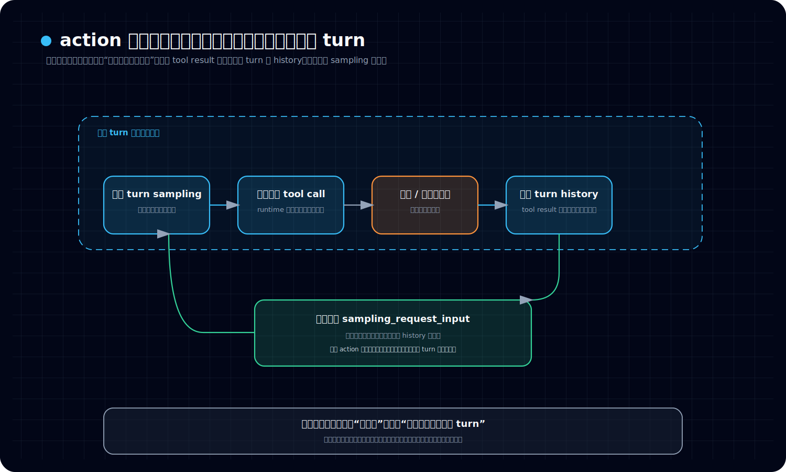

# Codex 新卷二 06：动作结果怎么重新回到当前工作回合

## 本篇要回答的问题

到了这一卷这里，读者通常已经接受了两件事：

- Codex 的一轮工作不会天然停在第一句回答
- 系统在必要时会调用工具、执行命令、发起搜索，先去拿外部结果

但新的困惑也会马上出现：

> **当系统已经调用了能力、执行了动作之后，结果到底是怎么重新回到当前工作回合里的？**

这个问题如果讲不清，读者很容易把 action 想成一条岔路：

- 主线先暂停
- 系统跑去外面做了点事
- 然后神秘地又“知道了结果”

可源码里的结构并不是这种“离线回来再续写”的感觉。
真正关键的不是“执行过一个动作”，而是：**动作的结果必须重新进入同一轮工作回合，重新成为 runtime 接下来继续判断的输入。**

---

## 一、先给结论：关键不是做过动作，而是结果要回流成同一 turn 的下一次输入

本篇最重要的判断句，先直接立住：

> **真正关键的不是“执行过一个动作”，而是动作结果必须回到同一轮工作回合，重新成为 runtime 接下来判断的输入。**

如果只想先抓住“什么叫回流真正完成”，可以先记 3 个条件：

1. **结果先被产成 runtime 后面还能继续吃进去的材料**，而不只是停在 UI 展示层。
2. **这份结果被写回同一 turn 的 conversation history**，而不是另起一条平行线。
3. **下一次 sampling 会从这份更新后的 history 重新取输入**，于是结果重新变成当前回合的判断材料。

这句话要特别注意三个词：

### 1. 不是只看“执行过”

动作发生过，本身并不等于这一轮工作真的向前推进了。
如果一个命令执行完，结果没有重新回到 runtime 的当前判断面里，那对后续模型来说，它就像没有发生过一样。

### 2. 必须“回到当前工作回合”

Codex 的设计重点不是把结果单独展示给 UI，而是把结果重新挂回当前 turn 的内部材料里。
所以 action 不是脱离主线的平行流程，而是**当前 turn 中的一段外出动作**。

### 3. 必须“重新成为输入”

结果真正有价值的时刻，不是 `exec` 子系统发出了 `end event`，也不是前端看到了输出，而是这个结果被写回 conversation history，随后又被拿去构造下一次 `sampling_request_input`。

这才是“结果回流”的真正完成点。

---

## 二、本篇只讲主线闭环，不展开三块旁支

为了让主线保持清楚，这篇只讲“动作结果如何回到当前 turn”。

本篇**不深讲**：

- turn-history builder 的更细装配语义
- app-server / 控制面的 notification 细目
- unified-exec 的 spawn、PTY、sandbox、watcher 等执行 plumbing 细节

这些东西都重要，但本篇只抓一个主问题：

> **结果是如何重新并入当前回合，变成下一次判断输入的。**

---

## 三、先看最小主图：action 不是离开主线，而是短暂出去再回到当前 turn

先给出本篇最小闭环图。



看这张图时，建议按这个顺序读：

- 先看上方从当前 turn sampling 到 tool call 的前半段，确认动作起点仍然在这轮 sampling 里
- 再看中段工具 / 执行子系统，确认 action 只是短暂出去拿结果
- 最后看下方 sampling_request_input 回环，确认结果为什么会重新并回当前 turn，再进入下一次判断

这张图里最关键的不是“有一个工具子系统”，而是最后三步：

- 结果不是只停在执行层
- 结果会写回当前 turn 的会话历史
- 下一次采样又从这份更新后的历史取输入

所以 action 的正确心智模型不是：

```text
主线 → 分叉出去 → 另起一条线
```

而是：

```text
当前 turn
  → 产生活动作
  → 短暂出去获取结果
  → 把结果带回当前 turn
  → 重新进入下一次判断输入
```

这就是本篇要立住的主线。

---

## 四、第一步：模型先在当前 sampling 里发出 tool call，而不是直接“拿到结果”

从 `try_run_sampling_request(...)` 的主循环可以看到，Codex 先从模型流里接收 `ResponseEvent`。
当模型输出一个完成的 `ResponseItem` 时，runtime 会调用：

```text
handle_output_item_done(...)
```

而在 `handle_output_item_done(...)` 里，第一件关键事不是“马上继续采样”，而是先判断这个 item 是不是工具调用：

```text
ToolRouter::build_tool_call(...)
```

如果判断结果是 `Ok(Some(call))`，说明这一项不是普通消息，而是一个正式的 tool call。

这一步的意义是：

> **动作的起点，并不是某个工具子系统自行决定去做事，而是当前这次模型输出明确地产生了一个工具调用项。**

也就是说，action 一开始就属于当前 turn 的产物。
它不是 runtime 之外突然冒出来的附加行为。

---

## 五、第二步：runtime 先把“调用这件事”记进当前历史，再把执行发出去

`handle_output_item_done(...)` 在识别出 tool call 之后，会立刻做两件事：

1. 先记录这个已完成的响应项
2. 再把工具执行排进运行队列

源码里对应的顺序非常清楚：

```text
record_completed_response_item(...)
  → handle_tool_call(...)
```

其中 `record_completed_response_item(...)` 会进一步调用：

```text
sess.record_conversation_items(...)
```

而 `record_conversation_items(...)` 的职责也写得很直白：

- 写入 in-memory conversation history
- 持久化到 rollout
- 发送原始 response item

这意味着，模型刚刚发出的“我要调用某个工具”本身，已经先进入了当前 turn 的正式历史。

这一步非常关键，因为它说明：

> **Codex 不会把 tool call 当成一个只在内存瞬间存在的临时动作，而是先把“调用发生了”记进本轮工作材料。**

然后，runtime 再把实际执行交给 `ToolCallRuntime::handle_tool_call(...)`，并把这个 future 放进 `in_flight` 队列里等待完成。

到这里，主线没有断开；它只是从“模型生成了一个调用项”推进到了“当前 turn 正在等待该调用的结果项被补回”的阶段。

---

## 六、第三步：执行子系统可以很复杂，但对当前 turn 来说，真正重要的是它最终要产出一个可回写的结果项

工具执行的内部细节可以非常复杂。
以 unified-exec 为例，这条链会经过：

- `UnifiedExecHandler::handle(...)` 做入口装配
- `UnifiedExecRuntime::run(...)` 做最后执行适配
- `process_chunk(...)` 把输出切成 transcript / delta
- `emit_exec_end_for_unified_exec(...)` 统一封装终态
- `resolve_aggregated_output(...)` 决定最终输出内容

这些层共同保证一件事：

- 执行真的发生
- 输出被持续接住
- 最终结束态被标准化

但对本篇的主问题来说，更重要的不是里面怎么 spawn、怎么 watch，而是：

> **执行子系统最后必须给当前 turn 产出一个“可重新送回模型”的结果对象。**

这也是为什么 `ToolCallRuntime::handle_tool_call(...)` 的返回类型不是“某种 UI 事件”，而是：

```text
ResponseInputItem
```

也就是说，工具子系统最终不是只负责“把结果展示出去”，而是要把结果整理成**下一次模型输入可消费的项目**。

这正是结果回流的关键接口。

---

## 七、第四步：tool result 不是直接变成人类看到的文字，而是先变成 `ResponseInputItem`

这一层是整篇最关键的结构点。

在 `ToolCallRuntime::handle_tool_call(...)` 里，不管工具执行成功、失败还是被中止，最后都会收束成某种 `ResponseInputItem`。常见的形式包括：

- `ResponseInputItem::FunctionCallOutput`
- `ResponseInputItem::CustomToolCallOutput`
- `ResponseInputItem::ToolSearchOutput`

这意味着，工具结果回到 runtime 时，采用的不是“执行层私有格式”，而是**和模型输入体系兼容的标准输入项**。

这件事的重要性怎么强调都不为过。
因为它决定了结果不是停留在：

- exec watcher 的内部 transcript
- protocol event 的 end payload
- UI 侧的一段展示文本

而是被提升成：

> **当前会话历史中的正式输入材料。**

只有变成这种形态，结果才可能在下一次采样时继续被模型看见。

换句话说，action result 真正“回来”的时刻，不是命令执行完，而是它被转写成 `ResponseInputItem` 的时刻。

---

## 八、第五步：真正完成回流的动作，是把这个结果写回同一 turn 的 conversation history

工具 future 完成以后，`try_run_sampling_request(...)` 不会立刻重新采样。
它先在收尾阶段调用：

```text
drain_in_flight(&mut in_flight, sess.clone(), turn_context.clone())
```

而 `drain_in_flight(...)` 做的事情非常直接：

```text
while let Some(res) = in_flight.next().await {
    match res {
        Ok(response_input) => {
            sess.record_conversation_items(&turn_context, &[response_input.into()]).await;
        }
    }
}
```

请注意这里最关键的两个点。

### 1. 写回用的是同一个 `sess`

也就是同一个 session / thread 的会话历史。
这不是把结果送去另一个临时缓冲区，也不是只发给前端。

### 2. 写回用的是同一个 `turn_context`

也就是同一轮 turn 的上下文。
因此，这不是“上一轮动作结束，下一轮再另起一个结果总结”。
它就是在**当前 turn 内部**把结果补回去。

所以，结果回流真正完成的判据应该写成：

> **tool future 完成后，返回的 `ResponseInputItem` 被转换成 `ResponseItem`，并通过 `record_conversation_items(...)` 写回同一 session、同一 turn 的 conversation history。**

这一步一旦发生，action 就已经重新并回主线。

---

## 九、第六步：下一次继续判断时，runtime 会从更新后的历史重新构造 `sampling_request_input`

如果只写到“结果被记进 history”，还是差最后半步。
因为读者还会问：

- 写进去之后，谁会再次用到它？
- 它怎么重新成为模型下一次判断的输入？

答案在 turn 主循环里非常清楚。

在 `run_turn(...)` 中，每次准备发起新的采样前，都会重新构造：

```text
let sampling_request_input: Vec<ResponseItem> = {
    sess.clone_history()
        .await
        .for_prompt(...)
};
```

也就是说，下一次采样并不是沿用上一轮旧输入，而是：

1. 从 session 当前历史重新克隆一份材料
2. 过滤成适合 prompt 的输入项
3. 再交给 `run_sampling_request(...)`

而前一步工具返回的结果，已经被写进了这份 history。
所以接下来发生的不是“模型凭空知道工具执行过了”，而是：

> **runtime 在下一次 sampling 之前，重新从更新后的历史取输入，因此刚才的 tool result 自然进入了本轮后续判断面。**

这就是“结果重新回到当前工作回合”的最准确写法。

不是魔法。
不是暗箱通知。
而是：

```text
tool result
  → 写回 conversation history
  → clone_history 再取出来
  → 成为下一次 sampling_request_input
```

这条链一旦看清，整件事就不神秘了。

---

## 十、为什么说 action 不是离开主线，而是短暂出去再回到当前 turn

现在可以把前面的事实收成一个更稳定的判断。

如果把 action 理解成“离开主线”，你会得到一种错误心智：

- 当前 turn 在这里断开
- exec / tool 自己跑一段
- 然后把结果丢给某个别的模块
- 后面再想办法接回来

但源码实际呈现的是另一种结构：

### 1. tool call 来自当前 turn 的模型输出
它不是外部系统擅自发起的动作。

### 2. tool call 自身先被记入当前历史
所以“调用发生了”本身就在主线上。

### 3. tool runtime 最终返回的是 `ResponseInputItem`
所以结果从设计上就是为了回到模型输入面。

### 4. 结果被写回同一个 session、同一个 turn 的 history
所以它没有脱离当前回合。

### 5. 下一次 sampling 再从更新后的 history 取输入
所以结果不是被旁路消费，而是重新并入当前 turn 的判断材料。

把这五步连起来，最准确的表述就是：

> **action 不是离开 runtime 主线，而是当前 turn 为了获取外部事实而发生的一次短暂外出；只要结果被写回同一轮历史，它就重新成为这轮工作回合的内部材料。**

这正是新卷二这一篇必须立住的主判断。

---

## 十一、为什么“执行层 end event 发出来了”还不等于“结果已经回到当前回合”

这里还要专门纠正一个非常常见的误解。

很多人第一次读 exec 链时，会把下面这件事误认成“结果回来了”：

- `ExecCommandEnd` 发出来了
- 前端能看到命令结束和聚合输出了

但这其实还不够。

因为 `ExecCommandEnd` 的主要意义是：

- 对外报告执行生命周期已经结束
- 给前端和观察面提供稳定终态
- 让 transcript 聚合后的输出有一个标准协议出口

这层当然重要，但它更偏**观察面 / 协议面**。

而“当前 turn 真正拿到结果继续思考”要求的是另一件事：

- 结果要被转成 `ResponseInputItem`
- 再被写进当前 history
- 再被下一次 sampling 读到

所以更准确地说：

> **执行终态事件说明动作已经结束；结果回流完成，则说明这个结束态已经重新进入当前 turn 的判断输入。**

这两个层次不能混为一谈。

这也是为什么本篇不把“控制面 notification”当主角。
对于新卷二主线来说，真正关键的是回到 runtime 输入面，而不是前端先看见了什么。

---

## 十二、把整条回流链压成一句主线定义

如果要把本篇压成一句适合放进手册边栏的话，我会这样写：

> **在 Codex 里，动作结果之所以能回到当前工作回合，不是因为系统“记得刚才做过什么”，而是因为 tool runtime 最终把结果产成 `ResponseInputItem`，并写回同一 turn 的 conversation history；而下一次采样又正是从这份更新后的 history 重新取输入。**

再压缩一点，就是：

> **结果回流的本质，是“结果被重新写回当前回合的输入面”。**

---

## 本篇小结

最后用四句话收住全篇。

1. **真正关键的不是执行过动作，而是结果必须回到同一轮工作回合。**
2. **结果回流的核心接口不是 UI 展示，而是 `ResponseInputItem`。**
3. **结果回流真正完成的标志，是它被写回同一 turn 的 conversation history。**
4. **下一次采样会从更新后的 history 重新构造输入，因此动作结果会重新成为当前 turn 的判断材料。**
---

## 卷内导航

- 上一篇：[《Codex 新卷二 05：系统怎么判断这一轮要不要调用能力》](./2026-04-12-Codex-新卷二-05-系统怎么判断这一轮要不要调用能力.md)
- 回到本卷入口：[本卷导读](./index.md)
- 下一篇：[《Codex 新卷二 07：一轮工作回合什么时候继续，什么时候收口》](./2026-04-12-Codex-新卷二-07-一轮工作回合什么时候继续什么时候收口.md)

