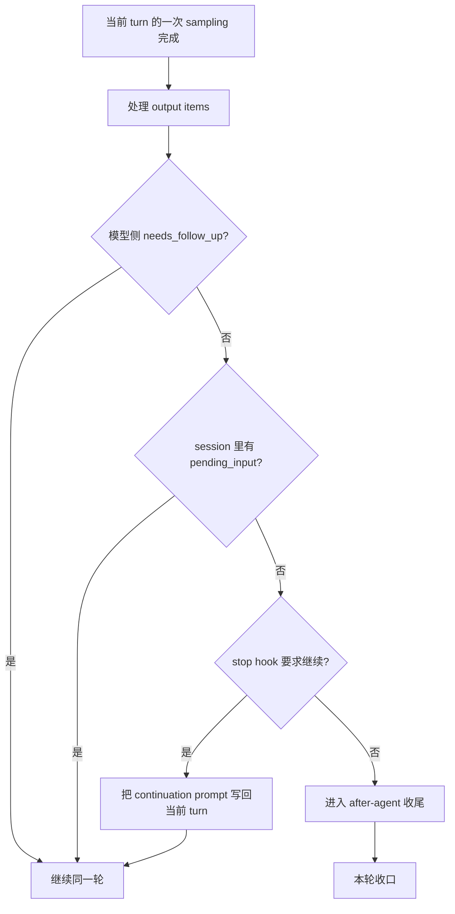
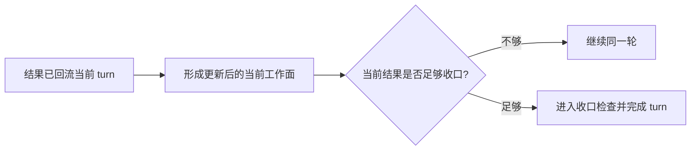

# Codex 新卷二 07：一轮工作回合什么时候继续，什么时候收口

## 本篇要回答的问题

前一篇已经说明了一件事：

> **动作结果不是停在执行层，而是会重新回到同一轮工作回合，重新成为下一次判断的输入。**

但这恰好把卷二带到了卷尾前最关键的一道判断：

> **既然结果已经重新回到当前 turn，runtime 到底凭什么判断这一轮应该继续推进，还是已经可以正式收口？**

这个问题如果不单独立住，读者很容易形成两个误解：

- 误以为“只要调过工具，这一轮就一定继续”
- 误以为“只要拿到结果，这一轮就应该结束”

源码里的判断都不是这样。
Codex 真正看的，不是这一轮“做没做动作”，而是**runtime 此刻是否已经拿到了足够支持收口的结果**。
只要还不够，这一轮就会继续；只有当当前结果已经足够，系统才会把这一轮正式收口。

---

## 先给结论

本篇最重要的判断，先直接立住。

> **工作回合的边界不在“做没做动作”，而在 runtime 判断当前结果是否已经足够支持收口。**

> **continue-or-stop 的边界，是新卷二卷尾前必须立住的最后一个关键判断。只有把这条边界看清，前面的“工作面”“动作路径”“结果回流”才会真正并成一条完整回合线。**

如果把这件事压缩成一张最小心智图，可以写成：

```text
当前 turn
  → 一次 sampling
  → 形成当前结果
  → runtime 判断：这份结果够不够收口？
      → 不够：继续同一轮
      → 够了：收口
```

所以，决定一轮是否结束的，不是“有没有动作”，而是：

> **当前 turn 里已经累积出来的结果，是否足以支持本轮结束。**

---

## 本篇边界

本篇只讨论 **runtime core 内部的 continue-or-stop 判断**，重点回答三件事：

1. 这条边界在代码里到底落在哪里
2. 为什么结果已经回流后，这一轮仍然可能继续
3. 什么情况下，runtime 才认为这一轮真的可以收口

本篇**不展开**：

- 05 里已经处理过的“为什么会进入动作路径”
- 06 里已经处理过的“结果怎样写回当前 turn”
- 恢复机制、request replay、产品规则表

这里的目标不是重讲前文铺垫，而是把 **turn loop 的收口边界** 单独立住。

---

## 一、先纠正核心误解：工作回合的边界不在“是否发生过动作”

很多人会把一轮工作回合理解成下面这两种简化模型之一。

### 误解一：做了动作，就说明这一轮还没结束

```text
用户输入 → 调工具 → 结果回来 → 必然继续
```

### 误解二：结果回来了，就说明这一轮应该结束

```text
用户输入 → 调工具 → 结果回来 → 立刻结束
```

Codex 的实际结构都不是这两种。
前文已经分别说明：

- 05 处理的是“当前判断为什么会进入动作路径”
- 06 处理的是“动作结果怎样重新回到当前 turn”

而 07 真正要补上的，是这条线最后的判断：

> **结果回流之后，runtime 现在是否已经有了足够支持收口的材料？**

这才是真正的 continue-or-stop 边界。

也就是说：

- 工具调用本身，不等于必须继续很多轮
- 工具结果返回本身，也不等于可以马上结束
- 关键在于 runtime 对“当前结果是否足够”的判断

所以这篇要立住的第一句话就是：

> **工作回合的边界，是判断边界，不是动作边界。**

---

## 二、这条边界在代码里落在 `run_turn(...)` 的主循环里

从 `core/src/codex.rs` 可以看到，真正决定一轮 turn 继续还是收口的，不是单个工具 handler，而是 `run_turn(...)` 的主循环。

最短主线可以压成下面这样：

```text
run_turn(...)
  → 组织本轮输入
  → run_sampling_request(...)
      → try_run_sampling_request(...)
      → 返回 SamplingRequestResult { needs_follow_up, last_agent_message }
  → 再结合 sess.has_pending_input()
  → 得到这一轮此刻是否还需要 follow-up
      → 需要：继续 loop
      → 不需要：进入 stop/after_agent 收尾，再 break
```

其中最关键的一段是：

```text
let SamplingRequestResult {
    needs_follow_up: model_needs_follow_up,
    last_agent_message: sampling_request_last_agent_message,
} = sampling_request_output;

let has_pending_input = sess.has_pending_input().await;
let needs_follow_up = model_needs_follow_up || has_pending_input;

if !needs_follow_up {
    ... 收尾并 break ...
}

continue;
```

这段结构说明两件事。

### 2.1 继续或收口，不是只看模型这次“有没有做事”

`try_run_sampling_request(...)` 会给出一个 `model_needs_follow_up`。
但 `run_turn(...)` 并不会按“刚才是否发生过动作”来决定结束，而是继续看：

- 当前模型输出是否还要求 follow-up
- 当前 session 里是否还有 `pending_input`

于是最终判断变成：

> **模型层面还要不要继续**
> **以及 session 层面是否还有未并入本轮的新输入**

只要其中一个成立，这一轮就不会立刻收口。

### 2.2 continue-or-stop 是 turn loop 的运行时判定

这意味着，收口边界并不是静态写死在“某类动作之后”。
它是每次 sampling 结束之后，由 runtime 根据当前状态重新判断出来的。

所以更准确的说法是：

> **Codex 不是按动作类型结束一轮，而是按当前是否还需要 follow-up 来结束一轮。**

这也是为什么 07 必须单独成篇：它处理的不是某个局部机制，而是**整条 turn loop 何时停下**。

---

## 三、为什么“结果已经回来了”，这一轮通常还是会继续

理解这一点时，要故意把视线从“动作是否完成”移开。
对 runtime 来说，结果回流之后发生的第一件关键事，并不是“动作结束了”，而是：

> **当前 turn 新增了一份可供判断的材料。**

这句话听起来平，但它正好解释了为什么结果回来后往往还要继续。

因为“拿到结果”只说明当前工作面被更新了；它还没有自动说明：

- 这份结果是否已经足够
- 模型是否还需要补一轮处理
- session 是否在这期间又进来了新输入

所以，“结果已经回来了”通常只意味着：

> **runtime 获得了下一次判断所需的新材料。**

它并不自动意味着：

> **当前 turn 已经满足收口条件。**

这就是为什么在 Codex 里，动作完成后往往还会继续同一轮。
系统真正要确认的不是“有没有结果”，而是“现在这份结果够不够结束”。

---

## 四、模型侧的“继续”信号，来自 `needs_follow_up`

`try_run_sampling_request(...)` 一开始会维护一个布尔值：

```text
let mut needs_follow_up = false;
```

随后在处理输出项时，只要发现当前结果还不足以结束，就会把它置为 `true`。

最直接的情况出现在 `stream_events_utils.rs` 的 `handle_output_item_done(...)`。

### 4.1 模型发出 tool call 时，直接标记为需要继续

当 `ToolRouter::build_tool_call(...)` 成功识别出这是一个正式工具调用时，代码会：

- 先记录完成的 response item
- 再把工具执行 future 放进队列
- 然后设置

```text
output.needs_follow_up = true;
```

这表示的不是“工具一定会让系统无限继续”，而是：

> **仅凭当前这个工具调用项，这一轮还不能收口。**

因为 tool call 只是中间步骤。
是否能结束，要看后续结果回流后，当前材料是否已经足够。

### 4.2 某些 guardrail / 错误补偿，也会要求继续

同一个函数里还有两种情况也会把 `needs_follow_up` 设为 `true`：

- `MissingLocalShellCallId`
- `RespondToModel(message)`

它们虽然不是正常工具执行成功，但 runtime 仍然会把一段补偿性结果写回历史，再要求模型继续。

这再次说明：

> **continue-or-stop 的标准，不是动作成功与否，而是当前材料是否已经足够结束。**

哪怕工具调用有问题，只要 runtime 认为还需要补一轮模型判断，这一轮就会继续。

### 4.3 纯 assistant message 并不会自动等于继续

反过来，如果 `handle_output_item_done(...)` 处理的是普通 assistant message / reasoning，而没有工具调用，也没有额外 follow-up 条件，那么它只会：

- 记录 response item
- 提取 `last_agent_message`
- 不把 `needs_follow_up` 设为 `true`

这意味着：

> **纯回答本身，通常是“可以收口”的候选状态。**

注意，这里只是“候选”。
最终是否收口，还要看 `run_turn(...)` 后面叠加的 session 级别和 hook 级别判断。

---

## 五、真正的收口判断，不只看模型，还要看 session 里有没有新输入

`run_turn(...)` 在拿到 `SamplingRequestResult` 之后，并没有直接按 `model_needs_follow_up` 决定结束，而是又补了一层：

```text
let has_pending_input = sess.has_pending_input().await;
let needs_follow_up = model_needs_follow_up || has_pending_input;
```

这一步非常关键，因为它把 continue-or-stop 的边界，从“模型刚才的输出”扩展成了“当前 session 的整体状态”。

### 5.1 为什么 `pending_input` 会阻止收口

源码注释已经写得很清楚：

- `pending_input` 可能是模型运行时，用户又通过 UI 提交的新输入

这意味着，即便模型刚刚已经给出一段看上去完整的回答，只要 session 里已经排进了新的输入材料，这一轮也不该直接当成彻底结束。

换句话说：

> **只要当前 turn 的工作面又发生了变化，这一轮就仍然可能需要 follow-up。**

### 5.2 这再次说明边界是“当前结果是否足够”

如果只看“模型已经回答了”，系统很容易过早收口。
但 `pending_input` 的存在表明，runtime 实际判断的是：

- 现在这份结果，面对当前 session 的真实状态，是否还足够作为终点

只要答案是否定的，这一轮就继续。

因此，这条边界从来不是“assistant 已经说完一句话”这么简单。

---

## 六、还有两类情况会让同一轮继续：mid-turn compact 与 stop hook 续推

到这里，可以先记住一个结论：

> **`!needs_follow_up` 只是“进入收口检查”，还不是“已经完成收口”。**

因为在 `run_turn(...)` 里，即便模型层和 session 层都暂时不要求 follow-up，runtime 仍然会再经过两道门。

### 6.1 token 不够时，会先压缩，再继续同一轮

代码里有一段非常直接：

```text
if token_limit_reached && needs_follow_up {
    run_auto_compact(... CompactionPhase::MidTurn)
    client_session.reset_websocket_session();
    continue;
}
```

这说明：

- 如果当前还需要继续
- 但 token 已经顶到 auto compact limit

runtime 不会把这一轮硬收掉，而是先做一次 **mid-turn compact**，然后继续同一轮。

这一步很能说明 continue-or-stop 的本质。
因为这里继续的原因，不是“又做了一个新动作”，而是：

> **为了让当前这一轮能够在新上下文条件下继续完成，runtime 先重整工作面，再继续。**

### 6.2 stop hook 也可能把“原本可结束”的状态重新推回继续

更关键的一段在 `if !needs_follow_up { ... }` 里面。
表面看，代码似乎已经来到“可收口”分支；但系统还会跑 stop hook。

如果 stop hook 返回 `should_block`，并且能构造出 continuation prompt，代码会：

- 把这个 hook prompt message 记入当前 turn 的 conversation history
- 设置 `stop_hook_active = true`
- `continue`

也就是说：

> **即便模型和 session 都暂时认为可以结束，hook 仍然可以把这一轮重新推回继续态。**

这再次证明，收口边界不是“模型已经没话说了”，而是：

> **runtime 在所有本轮必要判断都完成后，仍然认为现在已经足够结束。**

---

## 七、那么什么情况下，系统才真正收口

把前面的代码合起来，可以得到一个更准确的收口条件。

一轮工作回合要真正结束，通常至少要同时满足下面几层：

### 7.1 模型侧已经不要求 follow-up

也就是本次 sampling 处理完后，`SamplingRequestResult.needs_follow_up == false`。

这通常意味着：

- 当前响应没有再产生需要继续处理的 tool call
- 当前结果已经不要求再送回模型补一轮

### 7.2 session 侧也没有待并入的新输入

也就是：

```text
sess.has_pending_input().await == false
```

这表示本轮工作面没有在模型运行期间又被新的用户输入改写。

### 7.3 若需要 stop hook，hook 也没有要求继续

如果 stop hook：

- `should_block` 且给出 continuation prompt，那么这一轮还会继续
- `should_stop`，则直接结束
- 否则才进入真正的完成路径

### 7.4 after-agent 收尾也没有中止完成

在 stop hook 之后，`run_turn(...)` 还会 dispatch `AfterAgent` hook。
如果这里出现 `FailedAbort`，turn completion 还会被中止并报错；只有这些收尾都通过，代码才会 `break`。

所以更完整的结论是：

> **一轮工作回合真正收口，不是因为“最后一个动作完成了”，而是因为 runtime 在当前状态下已经看不到必须继续推进的理由了。**

这是“收口”的准确含义。

---

## 八、把 continue-or-stop 边界压成一张图

可以把整条判断链压成下面这张图：



如果再把“结果已经回来之后为什么还会继续”也放进去，可以得到另一张图：



这两张图合起来，就是本篇真正要立住的边界。

---

## 九、这一篇为什么是新卷二卷尾前的关键转折

到新卷二这里，如果读者还把 Codex 理解成下面这种结构：

```text
输入一句 → 回答一句 → 结束
```

那么前面关于：

- 当前工作面
- 进入动作路径
- 结果回流

这些内容都会被误读成“额外补丁”。

但只要 continue-or-stop 这条边界立住，整卷的主线就会一下子变清楚：

```text
请求进入 runtime
  → 当前工作面形成
  → 形成本轮判断
  → 必要时进入动作路径
  → 结果回流
  → runtime 判断当前是否足够收口
      → 不够则继续
      → 足够则收口
```

这就是为什么本篇必须被立成卷尾前的关键转折。
因为它把前文的几段主线重新锁成一句完整话：

> **Codex 不是因为做了动作才继续，也不是因为动作结束才停止；它是在同一轮里持续判断“当前结果是否已经足够”，直到判断可以收口为止。**

这一步一旦立住，第八篇才能把整卷真正压成稳定运行图，而不是只做目录复盘。

---

## 十、最后收束成一句话

本篇可以最后收成一句最短定义：

> **Codex 一轮工作回合什么时候继续、什么时候收口，看的不是这一轮做没做动作，而是 runtime 判断当前结果是否已经足够支持收口；只要还不够，这一轮就继续。**

再换成更偏手册的表述，就是：

> **continue-or-stop 的边界，本质上是 turn loop 对“当前结果是否足够”的运行时判定。**

这就是本篇要立住的核心结论。
