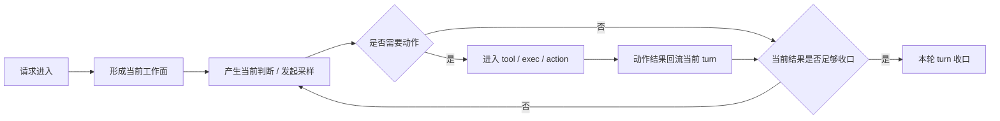
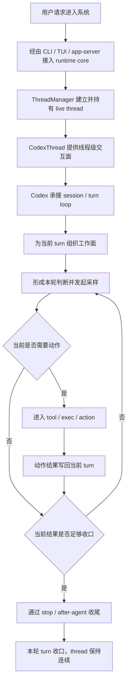

# Codex 新卷二 08：把整条 runtime core 主线重新压成稳定运行图

## 本篇要做的事：把整卷收成一条完整回合总跑线

到这一卷结尾，读者已经依次看过：

- 请求怎样进入 runtime 主线
- `ThreadManager`、`CodexThread`、`Codex` 怎样接成主工作链
- 当前工作面怎样被组织出来
- `thread` 和 `turn` 为什么不是两个平行名词
- 系统怎样判断这一轮要不要进入动作路径
- 动作结果怎样重新回到当前工作回合
- runtime 怎样判断这一轮应该继续，还是已经可以收口

如果这些内容还只是几篇分开的文章，那么这卷其实还没有真正完成。

卷尾必须再做一步：

> **把前面分开的局部判断重新压回一条完整回合总跑线，并把它收成一张稳定运行图。**

本篇要回答的就是：

> **如果把前面七篇全部收回来，Codex 的 runtime core 到底应该在读者脑中留下怎样一条完整工作回合线？**

---

## 先给最终结论

这一卷最终要留下的，不是模块表，也不是目录地图，而是下面这句判断：

> **Codex 的核心不是一组静态模块，而是一条会持续推进的工作回合主线：请求进入、工作面形成、当前判断产生、必要时进入动作、结果回流、判断继续还是收口，直到本轮正式结束。**

这句话里每个部分都对应前文已经建立过的结构事实：

1. **请求进入**：输入不是直接掉进“聊天对象”，而是沿入口壳、交互前端、控制面桥接，进入 runtime core
2. **工作面形成**：输入不会直接变成回答，而会先被组织成当前这一轮真正可判断的工作面
3. **当前判断产生**：系统在 turn loop 中形成本轮判断，并进入一次实际采样
4. **必要时进入动作**：如果当前判断不能直接收口，就进入 tool / exec / action 路径
5. **结果回流**：动作结果不会停在执行层，而会重新写回同一轮工作回合
6. **继续还是收口**：runtime 会根据当前结果是否已经足够，决定这一轮继续推进，还是正式收口

所以，卷二最后应该保留下来的，不是“Codex 里有这些对象”，而是：

> **Codex runtime core 本质上是一条动态推进、会反复判断是否已足够收口的回合主线。**

---

## 一、这张稳定运行图为什么必须在卷尾重新压一遍

如果不做这一步，前面几篇很容易在读者脑中散成七块：

- 一篇讲入口
- 一篇讲对象分层
- 一篇讲上下文
- 一篇讲 thread / turn
- 一篇讲 tool decision
- 一篇讲结果回流
- 一篇讲继续还是收口

这样虽然每篇都能看懂，但系统感仍然不稳定。

Codex 的 runtime core 难点不在于单个概念多难，而在于：

> **这些概念只有放回同一条正在运行的回合主线里，才会显得清楚。**

因此，本篇的任务不是补新细节，而是完成三件事：

1. **把整卷重新压成一条完整主线**
2. **让读者确认 runtime core 的主体是一轮会闭环推进的工作回合**
3. **让读者带着这张稳定图进入新卷三、新卷四**

这里要特别注意边界。

本篇**不做**三件事：

- 不把卷二又写回卷一的系统总览
- 不把恢复机制整段提前展开
- 不把控制面协议与投影细节重新写穿

本篇只做一件事：

> **确认 runtime core 自己到底怎样完成一轮从进入到收口的稳定运行。**

---

## 二、卷二最后应当留下的最小心智模型

如果必须把这一卷压成最短的一版，我建议读者最后只记住下面这张图。



这张图里真正重要的有四点。

### 1. 它是“线”，不是“表”

runtime core 不是一张对象清单：

- `ThreadManager`
- `CodexThread`
- `Codex`
- tools
- events
- history

这些对象当然存在，但它们在这里都不是独立终点。
它们真正的意义，是在这条主线上各自承担不同阶段的工作。

### 2. 它是“回合推进”，不是“一问一答”

这条图的中心单位不是一条消息，而是一轮工作回合。
一轮回合内部可以：

- 组织上下文
- 做一次采样
- 触发动作
- 接回结果
- 再判断是否继续或收口

所以 Codex 的基本运行单位，不是“回复一句话”，而是**推进一轮工作**。

### 3. 它有闭环

最关键的结构不是“会调用工具”，而是：

- 动作结果会回流
- 回流结果会重新进入当前工作回合
- 当前工作回合会基于新结果继续判断

没有这一步，tool call 只能算外部分支；有了这一步，它才属于 runtime core 的正式闭环。

### 4. 它有明确边界

这条主线并不是无限循环。
每一轮都会回到一个同样的问题：

- 当前结果是否已经足够收口
- 还是仍然需要继续推进

这就是卷二结尾必须保留的稳定感：
**Codex 不是一直“想办法干更多事”，而是在回合内不断判断当前是否已经可以结束。**

---

## 三、先用一次完整 turn walkthrough，把前文七篇穿成一条线

与其把 1–7 再各说一遍，不如直接看一轮完整 turn 是怎么跑完的。
下面用一次“用户让 Codex 检查本地项目里的配置问题”的典型回合，把整条主线穿起来。

### 第 1 步：请求进入 runtime，而不是直接落成一条回答

用户输入先经过 CLI / TUI / app-server 这一层外壳，最终进入 runtime core。
在 core 内，`ThreadManager` 找到或建立 live thread，`CodexThread` 提供线程级交互面，`Codex` 承接真正的 session / turn loop。

这一段对应卷二前两篇建立的判断：

> **真正开始推进工作的，不是外层界面，而是 runtime core。**

### 第 2 步：这一轮先形成当前工作面

请求进入以后，不会立刻变成“模型给答案”。
系统会先把：

- 当前用户输入
- 既有 conversation history
- turn 级配置
- 上下文附加材料
- 能力面与约束面

组织成当前这一轮真正可判断的工作面。

这一段对应前文关于当前工作面的判断：

> **Codex 不是直接对一句输入作答，而是先形成本轮真正可工作的判断面。**

### 第 3 步：在当前 turn 中发起一次采样，形成当前判断

工作面准备好之后，`run_turn(...)` 发起一次 sampling。
这时模型可能直接给出可收口的回答，也可能产出 reasoning 或 tool call。

这一段对应前文关于 turn 的判断：

> **真正向前推进的，不是抽象会话，而是某条 thread 内的当前 turn。**

### 第 4 步：如果当前结果不足以收口，就进入动作路径

假设这次模型判断仅凭现有信息还不够，于是产出一个 tool call，比如去读配置文件、执行命令或做搜索。
这时进入的不是另一条独立主线，而是当前 turn 内的一段能力路径。

这一段对应第 05 篇：

> **是否进入动作路径，取决于当前判断是否已经足够，而不是系统预设总要去调工具。**

### 第 5 步：动作结果不会停在执行层，而会回流当前 turn

工具执行完成后，结果不会只停在 end event 或 UI 展示上。
它会被整理成 `ResponseInputItem`，再写回同一 turn 的 conversation history。
之后，runtime 又会从这份更新后的历史重新构造 `sampling_request_input`。

这一段对应第 06 篇：

> **动作结果之所以能回到当前工作回合，不是因为系统“记得做过什么”，而是因为结果被重新写回了当前回合的输入面。**

### 第 6 步：结果回流后，关键问题变成“继续还是收口”

到这里，卷二最后一道判断才正式出现。
结果已经回来，并不自动等于结束；动作发生过，也不自动等于必须继续。
真正决定边界的是：

- `needs_follow_up` 是否仍为真
- session 里是否还有 `pending_input`
- stop hook / after-agent 收尾后，runtime 是否仍认为当前结果已经足够

这一段对应第 07 篇：

> **工作回合的边界不在做没做动作，而在 runtime 判断当前结果是否已经足够收口。**

### 第 7 步：若还不够，就继续同一 turn；若足够，才正式收口

如果当前结果还不够，这一轮就继续回到下一次 sampling。
如果当前结果已经足够，而且后续收尾检查也都通过，`run_turn(...)` 才会真正 break，完成本轮 turn。
thread 本身则继续存在，等待之后的新回合。

这一步把整卷真正收成一句完整话：

> **Codex 会在同一轮工作回合内，把判断、动作、结果回流与继续/收口组织成一条闭环运行线。**

---

## 四、把前文七个判断重新挂回这条完整主线

有了上面的完整 walkthrough，再回看前文，就不该再把它们理解成七个分散主题，而要理解成同一条运行线上的七个必要判断。

## 1. 请求进入：主线不是从回答开始，而是从正式接入开始

卷二开头先处理的不是“模型怎样回答”，而是“请求怎样进入主线”。
这一段最后应当留下的判断是：

> **一次请求不是直接落进某个聊天对象，而是沿 CLI、TUI、app-server，最终进入 runtime core 的正式工作线。**

---

## 2. 主工作链：`ThreadManager`、`CodexThread`、`Codex` 不是并排模块，而是层级接力

这一层不能只记对象名，必须记住承接关系：

```text
ThreadManager
  ↓
CodexThread
  ↓
Codex
```

因此，卷二结尾不该留下“core 里有三个重要对象”，而该留下：

> **runtime core 是一条分层接力的主工作链。**

---

## 3. 当前工作面：请求进入主线后，先被组织成“本轮可判断的面”

卷尾应当保留的稳定判断是：

> **请求进入 runtime 后，不会直接变成回答，而会先被组织成当前这轮真正可工作的判断面。**

这一步把 Codex 从“对输入做输出”的模型，推进成“对当前工作面做持续判断”的模型。

---

## 4. thread 与 turn：主线的持续性和推进性分别由谁承载

如果在卷尾只留一句话，应该是：

> **thread 是持续工作线的承载单元，turn 是这条工作线上的运行轮次。**

也因此，动作、结果回流、继续还是收口，都不是漂浮在抽象会话层上，而是发生在**某条 thread 的当前 turn**里。

---

## 5. 当前判断：一轮回合先判断是收口还是进入动作路径

卷二这一段最重要的收束句，应当是：

> **Codex 的一轮工作回合不是天然停在首条回复上，而是先判断当前该直接收口，还是进入 action 路径。**

这一步把“回答”和“动作”重新放回同一次回合判断之下。

---

## 6. 结果回流：动作不是岔路，结果必须回到当前 turn

卷尾应当留下的最短结论是：

> **动作结果不会停在执行层，而会重新回到当前工作回合，成为下一次判断的输入。**

这一步让动作不再是岔路，而成为同一轮回合中的一个闭环段落。

---

## 7. 继续还是收口：闭环最后总会回到边界判断

卷二最后一个必须稳定保留的判断，是 continue-or-stop 的边界。
最适合压成一句话：

> **工作回合的边界不在于做没做动作，而在于 runtime 判断当前结果是否已经足够支持收口。**

这一步不是附加说明，而是整条运行线最后的落点。
没有这一点，前面的“动作路径”和“结果回流”都还不能真正收束成完整回合。

---

## 五、把整卷重新压成一张正式的稳定运行总图

如果要把卷二整卷压成一张正式一点的总图，我建议保留下面这版。



这张图里有三个特别重要的阅读方式。

### 1. 中间主体是 `thread + turn`

这张图虽然写了入口层，也写了动作层，但中间真正稳定的主体其实是：

- thread 作为持续工作线
- turn 作为当前工作回合

所以这不是一张“全产品图”，而是一张**runtime 主线图**。

### 2. 中心动作是“判断”而不是“回答”

图中最核心的节点不是 assistant message，也不是 tool call。
最核心的节点其实是：

- 形成本轮判断
- 看是否需要动作
- 看当前结果是否足够收口

这说明 Codex runtime core 真正的本质，是一个持续判断并推进回合的系统。

### 3. 收口后留下的是 thread 的连续性

一轮 turn 收口，并不等于整条工作线消失。
turn 结束后，thread 仍然存在，因此后续还可以继续开启新的回合。

这也是为什么卷二要把 thread 和 turn 区分开：

> **收口的是当前回合，延续的是工作线。**

---

## 六、卷二结束时，读者应该如何重新理解 Codex runtime core

如果这卷写成功了，到卷尾时，读者对 Codex runtime core 的理解应该发生三个变化。

## 1. 从“静态模块图”转成“动态工作线图”

卷尾不应再把 Codex 理解成：

- 一个 CLI
- 一个 TUI
- 一个 app-server
- 一个 core
- 一堆 tools

而应理解成：

> **一条请求进入之后，系统如何在 runtime core 中形成并推进一轮工作回合。**

这是从“模块认知”到“运行认知”的变化。

## 2. 从“一问一答”转成“一轮工作回合”

卷尾也不应再把 Codex 理解成一个更强的聊天程序。
更准确的理解是：

- 一次输入进入后
- 系统先组织当前工作面
- 再形成判断
- 必要时进入动作
- 接回结果
- 再判断继续还是收口
- 最后才完成本轮结束

这意味着 Codex 的基本单位不是消息，而是**回合**。

## 3. 从“会调工具”转成“会在回合内闭环推进”

卷尾最不该留下的简化说法是：“Codex 会自己调工具。”
更准确的说法是：

> **Codex 会在同一轮工作回合内，把判断、动作、结果回流和继续/收口组织成闭环。**

真正的核心能力不只是动作本身，而是**让动作重新回到主线，并在合适时机收口**。

---

## 七、卷二到这里为止，和新卷三、新卷四的边界应该怎样理解

本篇还需要做最后一个作用：给后续卷建立正确边界。

## 1. 新卷三不是另起一条主线，而是解释这条主线为什么能被保存、恢复、继续

卷二已经建立了 live runtime 主线。
接下来进入新卷三时，问题不再是“主线是什么”，而是：

- 这条工作线怎样被记录下来
- 当前 turn 的关键状态怎样被保留
- 系统中断后怎样把这条线重新接起来

因此，新卷三应当被理解成：

> **解释 runtime 主线为什么能够跨时间继续存在。**

也就是说，新卷三是在卷二这张运行图之上，补“持续性机制”；不是把卷二推翻重来。

## 2. 新卷四不是替代 runtime core，而是解释这条主线怎样被暴露成控制面

卷二里已经把 app-server 放在正确位置：它不是另一套核心，而是控制面桥接。
因此，新卷四真正要回答的，不是“系统主体在哪里”，而是：

- 这条 runtime 主线怎样被对外暴露
- thread / turn / event 怎样被投影成可控制接口
- 前端怎样观察并驱动这条工作线

所以，新卷四应当被理解成：

> **解释 runtime 主线怎样被外层系统连接、观察和驱动。**

这同样不是另起一条主线，而是在卷二主线之上补“暴露方式”。

---

## 本篇最后只保留三句话

如果读者看完整个新卷二，只能带走三句话，那么我希望是下面这三句。

> **第一，Codex 的 runtime core 不是静态模块集合，而是一条动态推进的工作回合主线。**

> **第二，这条主线的基本节奏是：请求进入、工作面形成、当前判断、必要时动作、结果回流、判断继续还是收口，直到本轮完成。**

> **第三，后面的恢复卷与控制面卷，都不是替代这条主线，而是分别解释它怎样被延续、怎样被暴露。**

如果这三句话能稳定留下，那么这一卷的任务就算完成了。

---

## 结语：卷二最终留下的，不是一堆对象，而是一条能完整跑完一轮的线

到这里，整卷应该重新收成一个很朴素、但非常关键的判断：

Codex 最值得先建立的，不是目录熟悉感，也不是模块熟悉感，而是**运行熟悉感**。

你需要先知道的不是：

- 哪个目录更重要
- 哪个子系统更复杂
- 哪个对象名字最像核心

而是：

> **当一次请求真正进入 Codex 以后，系统会怎样把它推进成一轮能持续判断、必要时行动、接回结果、决定继续还是收口并最终完成的工作回合。**

这就是卷二真正压出来的“稳定运行图”。

带着这张图进入后面的恢复、控制面和执行专题，读者脑中的主体就不会再丢。
