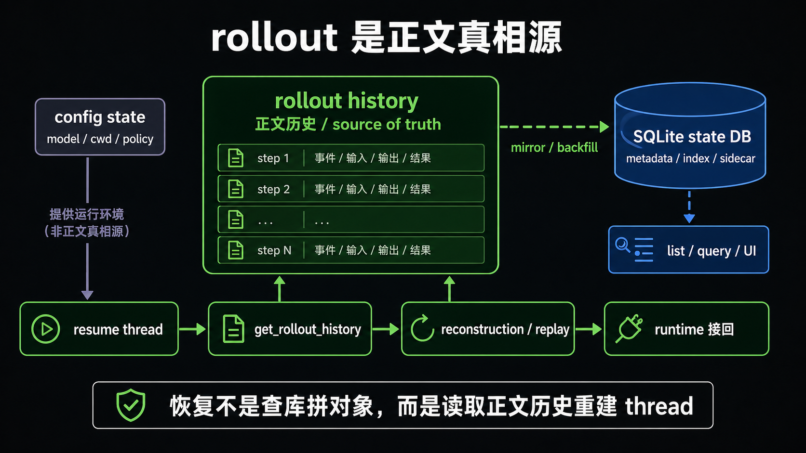
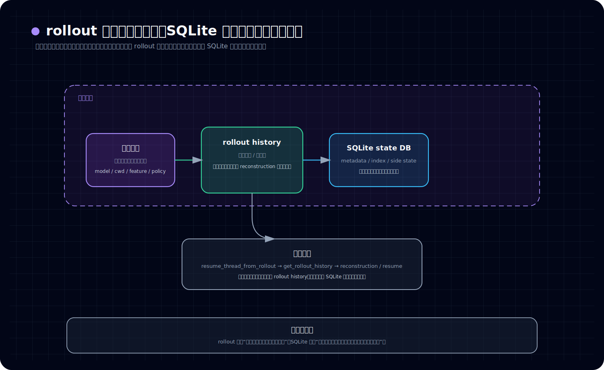

# 为什么 rollout 才是正文真相源，而 SQLite 不是恢复核心

## 先回答读者最容易问的那个问题

*图：这张图把卷三的恢复语义压成一条主线：rollout 是可 replay 的正文事件流，SQLite 更像索引、摘要和辅助状态层，不能替代真实上下文。*

**Codex 要恢复一条工作线，到底主要靠什么接回来？为什么不是直接查 SQLite 数据库？**

先给结论：

> **主要靠 rollout。**
>
> 更准确地说，Codex 在恢复一条工作线时，真正依赖的是那条工作线的**正文历史记录**；这份历史主要保存在 rollout 里。SQLite 更像是围绕这些历史整理出来的**索引、摘要和辅助状态库**，它很重要，但不是恢复时最根本的那份来源。

这也是本文想先立住的判断：

1. **rollout 是正文真相源。**
2. **SQLite state DB 更像 metadata / index / sidecar。**
3. **恢复不是“先查库，再把对象拼回来”，而是基于正文历史重新接起工作线。**

如果先把这三点看清，后面再谈 recovery、replay、thread 生命周期，读起来就不会一直跑偏。

---

## 先把几个词说白

这一篇里会反复出现 4 个词。为了不让术语挡路，先用最白的话解释一次。

### rollout

可以先把 **rollout** 理解成：

> **Codex 保存一条工作线正文经过的记录文件。**

它记录的不是界面上“看起来像聊天”的展示结果，而是系统之后还会重新读取、重新解释、拿来恢复工作的那份历史材料。

### thread

可以先把 **thread** 理解成：

> **Codex 里一条可以持续推进、可以中断后再接回来的工作线。**

它不是单次问答，也不是只存在于界面中的聊天框，而是一条有上下文、有历史、能继续往下执行的正式会话线。

### recovery

这里说的 **recovery**，不是“把旧消息重新显示出来”，而是：

> **让运行中的系统把这条工作线重新接上，并继续工作。**

重点不是“看到以前说过什么”，而是“系统能不能顺着以前那条线继续跑”。

### state DB / SQLite

这里说的 **state DB**，通常就是那套 **SQLite 状态库**。可以先把它理解成：

> **一层结构化的辅助数据库，用来存放标题、路径、索引、摘要、统计信息，以及一些便于查询的状态。**

它很有用，但它不等于整条工作线的正文历史。

---

## 本文只讲一件事：谁才是恢复时真正依赖的那份内容

很多人一看到 SQLite，就会自然代入一种很熟悉的理解：

- 既然有数据库，恢复应该就是先查库；
- 库里应该存着完整状态；
- 运行时再把这些状态还原成对象，系统就接上了。

但从当前材料看，Codex 更像另一种设计：

- **工作线真正经历过什么，主要记在 rollout 里；**
- **SQLite 把这些内容整理成更好查、更好列、更适合界面和服务层使用的结构化信息；**
- **恢复时，系统依赖的是 rollout 提供的历史，再进入重建和继续运行的流程。**

所以，这里真正要纠正的不是某个细节，而是一整套理解入口：

> **Codex 的恢复，不应先按“数据库恢复对象图”去想，而应先按“基于正文历史重新接起工作线”去想。**

---

## 一、先分清三种不同的“状态”

如果把所有持久化内容都混在一起，就很容易误以为 SQLite 一定是核心。更稳妥的读法，是先把 Codex 里的状态分成三层。

看这张图时，建议按这个顺序读：

- 先看上方三层状态，确认配置状态、rollout history、SQLite state DB 各自回答什么问题
- 再看下方恢复主链，确认 resume 时首先相信的是 rollout history
- 最后看底部一句话收口，把“rollout 保存正文、SQLite 保存索引与辅助状态”这层边界压住

### 1. 配置状态：系统该怎么运行

这一层处理的是运行条件，例如：

- 使用什么 model / provider
- 当前工作目录是什么
- 各种 feature、policy、layer merge 的结果
- 持久化相关开关和运行参数

它决定的是：

> **系统应该按什么规则启动和运行。**

但它不回答：

> **这条工作线之前到底发生过什么。**

### 2. 正文历史：这条工作线实际经历过什么

这一层才是本文真正关心的核心。

从当前线索看，Codex 把一条工作线的正文历史主要放在 **rollout** 里。它保存的不是一次临时查询结果，而是更接近下面这些东西：

- 会话本身的基础信息
- 历史条目（history items）
- 后续还能被重新读取和解释的正文经过
- 恢复时真正会再次进入重建流程的原始材料

所以 rollout 更像：

> **这条工作线的正文存档。**

这也是为什么本文把它叫作“正文真相源”。

### 3. 元数据与辅助状态：为了更好查、更好管

SQLite state DB 主要落在这一层。它承接的更像是：

- thread metadata
- 列表和搜索所需的索引
- 标题、provider、cwd、token usage、git 信息等摘要
- 某些 sidecar state
- 便于 UI、服务层和辅助恢复逻辑读取的结构化视图

换句话说，SQLite 更像是在做这件事：

> **把围绕工作线的各种信息整理成一套适合查询和管理的数据库视图。**

它当然重要，但它的重要性不在于“替代 rollout 成为正文本体”，而在于让系统更容易列出、检索、过滤、展示和辅助处理这些工作线。

---

## 二、为什么说 rollout 才更像正文真相源

判断“谁更核心”，不能只看名字，而要看恢复路径到底怎么走。

当前材料里，一个非常关键的信号是：恢复线程时，代码路径明显把 **rollout history** 当成核心输入来使用。已有线索包括：

- `ThreadManager::resume_thread_from_rollout(...)`
- `RolloutRecorder::get_rollout_history(&rollout_path)`
- 然后再继续进入恢复和重新挂接运行时的逻辑

这条链路说明了一件事：

> **系统恢复一条工作线时，首先相信的是 rollout 里的正文历史，而不是先从 SQLite 里取出一个“完整会话快照”。**

如果 SQLite 才是恢复核心，我们更容易期待看到另一种模式：

- 先查 state DB；
- 直接拿到完整 session / thread snapshot；
- 再把这份对象状态整体装回 runtime。

但现在更接近的路径不是这样。现在更像是：

- 先找到这条工作线对应的 rollout；
- 从 rollout 取出历史；
- 再用这些历史进入 reconstruction / resume 逻辑；
- 让 runtime 把工作线重新接起来。

这意味着 Codex 真正依赖的，不是一份早就封装好的“库中最终对象”，而是：

> **一份仍然可以被再次读取、再次解释、再次归纳成运行状态的正文历史。**

这正是 rollout 比 SQLite 更接近“正文真相源”的原因。

---

## 三、SQLite 为什么重要，但仍然不是恢复主脑

把 SQLite 说成“不是恢复核心”，很容易让人误会成“那它不重要”。事实正好相反。

SQLite 很重要，只是它扮演的是另一种重要角色。

从现有材料看，把它理解成下面这句话最稳：

> **SQLite state DB 更像 rollout 的元数据镜像、索引层和辅助状态层。**

它主要解决的是这些问题：

- 如何快速列出有哪些 thread
- 如何按条件查询 thread metadata
- 如何保存标题、路径、provider、统计信息等结构化摘要
- 如何让 UI 或服务层不必每次都去全量扫描 rollout 文件
- 如何为一些辅助恢复逻辑提供可控、可查询的状态入口

所以，SQLite 的职责更像：

> **把工作线变成“好查、好列、好索引、好展示”的对象。**

而 rollout 的职责则是：

> **保存这条工作线真正经历过的正文历史。**

两者都重要，但不在同一层。

这也是为什么旧材料会把 `codex-state` 说成 **SQLite-backed rollout metadata mirror**。这里的重点其实是 **mirror**：

- 它表示这是镜像、投影、整理层；
- 它不表示这是最原始的正文来源。

---

## 四、为什么“恢复不是查库拼对象”这句话很关键

本文最容易被记住的一句判断，应该是这句：

> **Codex 的恢复，不是查库之后把一堆对象拼回去。**

因为一旦按“查库拼对象”的心智来读，你后面会自然推导出一连串错误印象：

- 数据库一定是第一真相源；
- rollout 只是备份或导出物；
- 恢复只是反序列化；
- 正文历史不是核心，核心是库里的最终状态。

但当前材料更支持另一套理解：

- 正文历史是核心；
- 恢复要重新读取这份历史；
- 运行时不是简单拿一个成品对象，而是根据历史重新接回工作线；
- SQLite 是围绕这份历史生长出来的结构化辅助层。

这也解释了为什么 recovery 更接近 **replay / reconstruction**，而不是传统意义上的“从数据库还原对象图”。

这里本文先点到为止，不继续展开卷三那类 app-server 或 control-plane 的话题；本篇只先把地基打稳：

> **真正被恢复的是一条工作线，而恢复这条工作线依赖的起点，是正文历史。**

---

## 五、`state_db_bridge` 这个名字，反而提醒了它不是中心

另一个容易误读的地方，是 `state_db_bridge` 这个名字。

很多人第一次看到它，会下意识觉得：既然它叫 bridge，而且又连着 state DB，那它大概就是恢复主链上的核心层。

但从目前看到的结构看，这个名字反而很诚实：

> **它更像桥接层，而不是恢复主脑。**

旧材料已经提到几个关键信号：

- `core/src/state_db_bridge.rs` 本身并不厚；
- 它主要是把 `codex_rollout::state_db` 暴露给 core 使用；
- 真正复杂、真正决定恢复语义的，还是 rollout replay / reconstruction 这一侧。

换句话说，bridge 的作用是把层接起来，不是宣布自己是最根本的真相源。

这点很重要，因为它能直接压住一个常见误读：

- 看起来数据库桥接很显眼；
- 但真正决定恢复内容和恢复方式的，依然是 rollout 历史与重建逻辑。

---

## 六、backfill 也说明 SQLite 更像投影层，而不是先验主真相

还有一个常被忽略、但很能说明设计倾向的信号，是 **backfill**。

如果一个系统天然把数据库当成唯一完整真相源，它通常会表现得更像：

- 数据库从一开始就是最权威来源；
- 其他文件只是备份、缓存或导出；
- 缺什么就说明系统不完整。

但 Codex 这里不是这种姿态。

现有材料显示，系统会关心 metadata mirror 是否已经完成 backfill。换句话说，SQLite 这一层是可以逐步补建、逐步对齐的。

这背后的含义很直接：

> **SQLite 不是那种从第一秒起就被默认视为完整正文真相的中心数据库。**

更像的情况是：

- rollout 负责保留正文历史；
- SQLite 把这些历史相关的信息逐步整理成结构化镜像；
- 缺了镜像，可以补；
- 但正文历史那一层的角色并没有因此被替代。

所以 backfill 的存在，本身就是一个设计信号：

> **SQLite 更像可以补齐的投影层，而不是恢复时唯一可信的原始来源。**

---

## 七、正确的分工，不是“谁更高级”，而是“谁负责哪类真实”

讲到这里，还需要顺手避免另一个误解。

这篇不是在说：

- 文件一定比数据库高级；
- 数据库一定只是次要附件。

本文真正想说的是：

> **Codex 把不同类型的真实，放在了不同层里。**

可以把分工收成下面这张简表。

### rollout 负责什么

- 保存工作线的正文历史
- 提供恢复时真正要读取的原始材料
- 让系统能够基于历史重新接起 thread

### SQLite state DB 负责什么

- 整理 thread metadata
- 提供索引、摘要和 sidecar state
- 支持 listing、query、UI 读取和一些辅助恢复入口

所以这两层不是高低关系，而是职责关系：

- **rollout 负责“发生过什么”；**
- **SQLite 负责“这些内容怎么被更方便地查询和管理”。**

只要把这个分工记住，很多问题都会立刻变清楚。

---

## 八、本文先收住的结论

这一篇先不继续往卷三方向展开，也不提前把 app-server、control-plane 的话题拉进来。本文只收住三个结论。

### 结论 1

**rollout 才是 thread 正文历史更接近第一真相源的地方。**

### 结论 2

**SQLite state DB 主要是 metadata / index / sidecar state 层，不是恢复主脑。**

### 结论 3

**理解 Codex 的恢复时，不要先用“查数据库、拼对象”的老心智；更合适的入口是“读取正文历史、重建并接回工作线”。**

如果这三个判断先立住，后面再谈“为什么恢复更像 replay”，读者就不会一开始就被术语和错误预设带偏。
---

## 卷内导航

- 这是本卷起点，建议先顺着往下读。
- 回到本卷入口：[本卷导读](./index.md)
- 下一篇：[《为什么恢复更像 replay，而不是“查库拼对象”》](./2026-04-12-Codex-卷三-02-为什么恢复更像-replay-而不是-查库拼对象.md)

