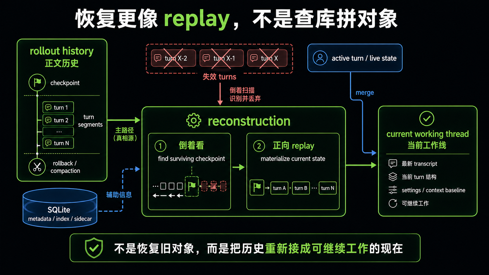

# 为什么恢复更像 replay，而不是“查库拼对象”

## 先回答读者最容易问的那个问题

*图：这张图展示恢复为什么更像 replay：系统不是从数据库里拼回一个对象，而是沿着历史事件重新走到可继续工作的当前状态。*

**Codex 要恢复一条 thread，为什么不直接去数据库里把会话对象查出来、拼起来、塞回内存？为什么还要走一条看起来更绕的恢复链？**

先给结论：

> **因为 Codex 的恢复不是 ORM 式查表重建。**
>
> 它真正依赖的，是这条工作线留下来的正文历史重新进入 reconstruction。系统不是把几张表里的字段拼成一个旧对象就算恢复完成，而是要根据仍然有效的历史材料，把**还能继续工作的当前状态**重新接起来。

这一篇要立住 4 个判断：

1. **恢复不是 ORM 式查表重建。**
2. **系统依赖的是正文历史重新进入 reconstruction。**
3. **replay 不是简单把旧消息显示出来，而是把还能继续工作的当前状态重新接起来。**
4. **理解了这一点，后面再看 thread、turn 和 semantic projection，才不会走偏。**

如果上一篇解决的是“为什么 rollout 比 SQLite 更像正文真相源”，那这一篇要解决的就是下一步：

> **既然正文历史才是核心，那恢复到底是怎样成立的？**

答案就是：它更像 replay。

---

## 先把“查库拼对象”这套直觉放下

很多人第一次看这类系统，脑子里会自然冒出一种很熟悉的模型：

- 数据库存着完整状态；
- 恢复时先查数据库；
- 查出来后按字段拼回对象；
- 对象一回到内存，系统就算恢复了。

这套想法对很多业务系统都成立，所以它很容易被带进来。

但放到 Codex 这里，这个入口会让人一开始就看错重点。因为它默认了两件事：

1. **完整状态已经被整理成数据库对象；**
2. **恢复的关键是把这个旧对象重新装配出来。**

而当前材料更支持另一种理解：

- 真正要恢复的，不是一份静态对象；
- 真正要接回的，是一条还能继续推进的工作线；
- 这条工作线能不能接回，取决于系统能不能根据正文历史重新得到当前可工作的语义状态。

所以更接近事实的说法不是：

> 从数据库里把会话对象找回来。

而是：

> 从持久化历史里，把这条工作线重新接回到可以继续运行的状态。

这两种说法看起来只差一点，但背后的系统心智完全不同。

---

## 一、为什么“恢复对象”不是这里真正的目标

如果把恢复理解成“恢复一个对象”，就会自然把注意力放在这些问题上：

- 这个对象有哪些字段；
- 哪些字段存在数据库表里；
- 如何从多张表 join 回一份完整结构；
- 最后如何反序列化回内存。

但 Codex 的恢复难点不在这里。

它真正要解决的是这些问题：

- 这条 thread 的正文历史中，哪些部分现在还有效；
- compaction 之后，哪段历史应该视为新的基线；
- rollback 之后，哪些 user turn 已经不该继续算在当前状态里；
- 当前上下文需要从哪里重新接起；
- 如果还有活跃中的 turn，持久化历史和活跃态应该怎样合并。

你会发现，这些问题都不是“把字段装回对象”能直接解决的。

它们更像是在问：

> **现在这条工作线，究竟应该从哪份历史现实继续往前跑？**

这就是为什么 Codex 的恢复，核心不是 object rebuild，而是 history reconstruction。

---

## 二、系统真正依赖的，是正文历史重新进入 reconstruction

上一篇已经先把一个边界立住了：**rollout 更像正文真相源，SQLite 更像 metadata / index / sidecar。**

这一篇要再往前走一步。

如果 rollout 只是一个旁路日志，那恢复时我们大可以：

- 先查 SQLite；
- 直接得到完整 thread 状态；
- rollout 只在排障或审计时才需要。

但从参考材料看，Codex 的恢复主线并不是这样组织的。更接近的路径是：

- 先拿到 rollout history；
- 让这些历史重新进入 reconstruction；
- 在 reconstruction 过程中判断哪些 checkpoint、哪些 turn 片段、哪些 metadata 仍然有效；
- 再把结果恢复成当前能工作的状态。

这里最关键的一点是：

> **系统依赖的不是“库里现成的一份最终对象”，而是“还能被重新解释的正文历史”。**

这也是 `reconstruct_history_from_rollout(...)` 这类逻辑为什么重要。它不是在做格式转换，不是在把 rollout “导入”成 history 而已；它真正做的是：

- 找出最新仍然有效的历史基线；
- 把 rollback 对 transcript 和 metadata 的影响一起消化掉；
- 再对幸存后缀做正向 replay；
- 最后得到一份跟当前历史现实对齐的恢复态。

换句话说，恢复依赖的是：

> **正文历史重新进入 reconstruction。**

而不是：

> **查询数据库后把对象拼出来。**

---

## 三、为什么这里更像 replay，而不是查库

现在可以正面回答本文标题里的那个问题了。

### 1. 因为输入更像历史材料，而不是对象快照

在“查库拼对象”的模型里，最理想的输入是一份结构完整的对象快照。你拿到它，按字段填回去就行。

但 Codex 这里更关键的输入，不是一份完整快照，而是：

- session meta
- rollout items
- replacement history checkpoint
- turn context 相关信息
- rollback / compaction 留下来的历史线索

这些东西的共同特点是：

> **它们更像需要被重新解释的历史材料。**

而 replay 正是处理这类材料的自然方式。

### 2. 因为恢复过程要判断“哪些历史还活着”

数据库重建通常默认一件事：表里当前那份记录就是最终真相。

但 Codex 这里不是这么简单。参考材料里一个很关键的点，是 reconstruction 不会机械地相信“看到什么就是什么”，而是会去判断：

- 哪个 `replacement_history` checkpoint 仍然存活；
- 哪些 turn segment 在 rollback 之后还应保留；
- `previous_turn_settings` 和 `reference_context_item` 应该跟哪段 surviving history 对齐。

这说明恢复不是“把已有记录装回去”，而是：

> **先判断历史现实，再根据这份现实重建当前状态。**

这就是 replay / reconstruction 的典型味道。

### 3. 因为它要处理的是语义，而不是只处理结构

从材料看，恢复过程中不仅要把 transcript 接回来，还要同时恢复：

- previous turn settings
- reference context baseline
- rollback 后仍成立的 turn 结构
- compaction 后的新历史基线

这已经不是纯结构化装配了。

它处理的是：

> **历史的语义关系。**

而一旦进入“语义关系”这一层，replay 就比“查表拼对象”更接近系统真实动作。

---

## 四、`replay` 不是把旧消息再显示一遍

这里有一个特别容易出现的误会：

一听到 replay，很多人会下意识理解成“把旧消息重新放出来”。

但如果只这么理解，还是会把 Codex 的恢复看浅。

在这套系统里，replay 不是单纯为了展示旧内容。它真正要做的是：

> **把还能继续工作的当前状态重新接起来。**

这句话非常重要。

因为“把旧消息显示出来”和“把当前状态接起来”根本不是一个难度级别。

### 如果只是显示旧消息

系统只需要：

- 读到历史；
- 原样列出来；
- 让用户能看见过去发生过什么。

这更像历史查看器。

### 但 Codex 要的是继续工作

系统需要进一步做到：

- 当前 transcript 是对的；
- 当前 turn 边界没有错位；
- rollback 之后删掉的 user turns 不会偷偷回魂；
- compaction 之后新的基线被正确接住；
- 上一轮留下来的 settings 和 context baseline 仍跟当前 surviving history 对齐；
- 如果 thread 还活着，持久化历史还能和 live active turn 合并起来。

所以这里的 replay，更准确地说是：

> **把历史重新过一遍，并把它重新组织成当前还能工作的状态。**

它不是回放给人看，而是回放给系统自己用。

---

## 五、为什么 reconstruction 比“顺序读历史”还更进一步

即使接受了 replay，也还要再往前一步。

因为 Codex 的恢复不只是“从头到尾重新读一遍历史”。参考材料里已经把这个特征讲得很清楚：它更像两段式的 reconstruction。

### 第一段：先倒着看

倒着看的目标，不是为了直接把 transcript 拼出来，而是为了先搞清楚：

- 最新仍然有效的 checkpoint 在哪；
- 哪些 metadata 来自仍然存活的 turn；
- rollback 要把哪些 user turns 视为已经失效；
- 旧历史中哪些部分已经没必要再继续往前追。

这一步本质上是在回答：

> **恢复应该从哪份仍然有效的历史现实开始。**

### 第二段：再正着 replay

等起点选对了，系统才会再对幸存后缀做 forward replay，把 transcript history 真正 materialize 出来。

这说明 Codex 并不是机械地“读文件 -> 还原对象”。

它做的是更像下面这套动作：

1. 先判断哪份历史还算数；
2. 再从那个起点往前重建；
3. 最后把结果装配成当前恢复态。

这就是 reconstruction 这个词比单纯 replay 更准确的原因。

也因此，本文说“恢复更像 replay”，其实已经是比较好懂的说法了；如果更严格一点，它甚至更像：

> **基于正文历史的 replay + reconstruction。**

---

## 六、为什么 rollback 和 compaction 会逼着系统走 replay 心智

如果一个系统只是“查库拼对象”，rollback 和 compaction 往往会被理解成：

- 更新某些表；
- 覆盖某些字段；
- 最终保留一份新的静态结果。

但 Codex 这里，rollback 和 compaction 直接暴露出另一种事实：

> **历史不是纯粹 append 完就不管了，历史语义本身会被重新整理。**

### rollback 暴露了“删的是 turn 语义，不是几行记录”

参考材料里一个很重要的判断是：rollback 处理的不是“删最近几条 event”，而更接近“删最近 N 个 user turns”。

这意味着系统想保住的，不是原始记录表面的排列顺序，而是：

> **会话作为一条工作线时的轮次结构。**

这显然不是查表拼对象的直觉，更像 replay 后再按 turn 语义重建。

### compaction 暴露了“恢复依赖 checkpoint + 后缀重放”

`replacement_history` 之所以重要，就是因为系统不会傻乎乎地每次都从远古历史全量重播，而是会：

- 找到最新仍然有效的 replacement history；
- 把它视为恢复基线；
- 再对后面的幸存后缀继续 replay。

这就是典型的：

> **checkpoint + replay suffix**

它依然不是 ORM 式重建，而是更成熟的历史重建思路。

---

## 七、running thread 的恢复，更能说明这不是“查库复原对象”

如果一个 thread 已经完全静止，读者可能还会觉得：“那也许只是另一种离线恢复。”

但真正能把问题讲透的，是 running thread 的情况。

参考材料已经指出：对于还在运行的 thread，恢复往往不是只读持久化历史就结束，因为这时同时存在两部分东西：

- 已经写进 rollout 的持久化历史；
- 还活在内存里的 active turn / live state。

这时系统做的事情，不是：

- 去数据库查一份完整对象；
- 然后把整个对象原样放回去。

而更像是：

- 先根据 rollout 做 persisted history reconstruction；
- 再把当前 active turn snapshot 叠加上去；
- 再修正 thread status 和某些 stale in-progress 语义；
- 最后得到对外可见、对内可继续工作的当前状态。

这条链路说明得很清楚：

> **恢复的目标，是把“历史部分”和“活跃部分”重新接成一个还能工作的现在。**

这已经完全不是“把旧对象从库里拎出来”的画风了。

---

## 八、为什么这一篇必须先为 thread / turn / semantic projection 铺底

本文不提前展开卷三，也不把 app-server 控制面的细节拉进来。但有三件事必须在这里先埋下去，不然后面读起来会很别扭。

### 1. 后面看 thread，才会明白恢复的对象不是“聊天记录”，而是一条持续工作线

如果现在还把恢复理解成“显示旧消息”，那后面讲 thread 时，读者就会误以为 thread 只是历史容器。

但本文其实已经先说明了：

> **恢复真正接回的是一条还能继续推进的工作线。**

这正是 thread 这个概念后面要承接的东西。

### 2. 后面看 turn，才会明白 replay 处理的不是“消息列表”，而是工作轮次结构

rollback 按 user turns 处理、历史按 turn segment 判断是否存活，这些都说明一个事实：

> **系统真正维护的，不只是消息顺序，而是轮次语义。**

这就是为什么 turn 会在后文里变成中心角色。

### 3. 后面看 semantic projection，才会明白 turn-history 不是 event log 镜像

本文已经反复说明：replay 不是简单展示旧记录，而是把当前可工作的状态接起来。

一旦这点成立，后面再看 turn-history 时，读者就更容易接受：

> **turn-history 不是 event log 的逐条镜像，而是一层语义投影。**

因为只有经过 projection，系统才能把“历史材料”变成“当前还能用的视图”。

所以这一篇虽然不展开 03 / 04，但必须先把路铺平。

---

## 九、把本文的判断收成一张对照表

为了防止心智再次滑回“查库拼对象”，可以把两种理解直接并排看。

### 容易误入的理解

- 恢复 = 查数据库
- 数据库 = 完整状态真相源
- rollout = 备份或日志附件
- replay = 把旧消息再显示一遍
- 最终目标 = 把旧对象拼回内存

### 更接近 Codex 的理解

- 恢复 = 基于正文历史的 replay / reconstruction
- 正文历史 = 重新进入 reconstruction 的恢复材料
- SQLite = metadata / index / sidecar 辅助层
- replay = 把当前还能工作的状态重新接起来
- 最终目标 = 让 thread 继续作为一条工作线往前运行

把这张对照表记住，后面很多细节都会一下子顺起来。

---

## 十、本文先收住的结论

这一篇的任务，不是把所有恢复细节一次讲完，而是把理解入口纠正过来。先收住 4 个结论。

### 结论 1

**Codex 的恢复不是 ORM 式查表重建。**

它不是去几张表里把完整对象拼出来，再把旧状态原样装回去。

### 结论 2

**系统依赖的是正文历史重新进入 reconstruction。**

真正重要的不是数据库里有没有一份漂亮的对象快照，而是持久化历史能不能重新支撑当前状态被接起来。

### 结论 3

**replay 不是简单把旧消息显示出来，而是把还能继续工作的当前状态重新接起来。**

恢复的重点不是“看见过去”，而是“顺着过去继续工作”。

### 结论 4

**后面理解 thread、turn、semantic projection，都要建立在这套 replay 心智上。**

如果这一步没立住，后面会一直把 thread 看成聊天盒子，把 turn-history 看成日志列表，把恢复看成数据库反序列化。

而这三种理解，都会把 Codex 读歪。

---

## 一句话收尾

如果只留一句最短的话来记这一篇，可以记成：

> **Codex 恢复的不是一个“库里的旧对象”，而是一条基于正文历史重新接起来的当前工作线；所以它更像 replay，而不是查库拼对象。**
---

## 卷内导航

- 上一篇：[《为什么 rollout 才是正文真相源，而 SQLite 不是恢复核心》](./2026-04-12-Codex-卷三-01-为什么-rollout-才是正文真相源而-SQLite-不是恢复核心.md)
- 回到本卷入口：[本卷导读](./index.md)
- 下一篇：[《thread、turn 与 pending request 是怎么组成持续工作线的》](./2026-04-12-Codex-卷三-03-thread-turn-与-pending-request-是怎么组成持续工作线的.md)

