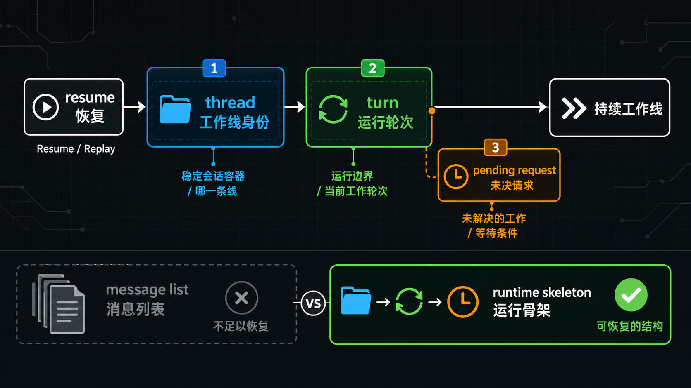
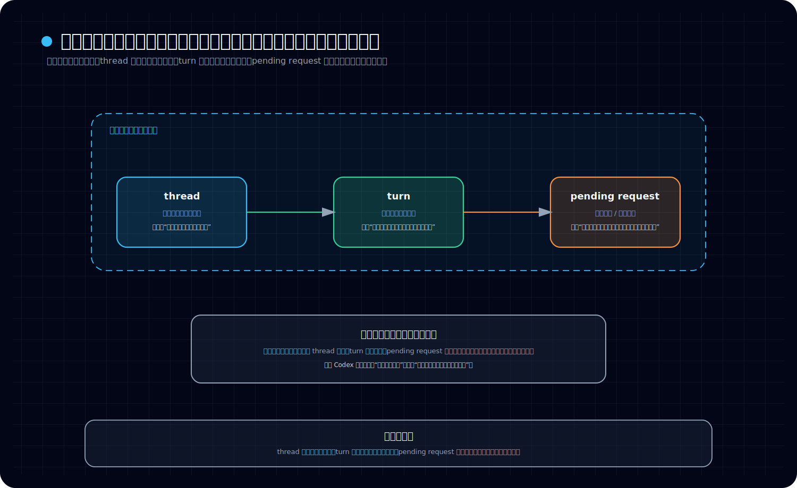

# thread、turn 与 pending request 是怎么组成持续工作线的

## 先回答读者最容易问的那个问题

*图：这张图把 thread、turn 与 pending request 放到同一条持续工作线上：thread 承接长期上下文，turn 承接当前回合，pending request 让未完成工作继续向前。*

**上一篇已经解释了：恢复为什么更像 replay。那 replay 完之后，真正被接回来的到底是什么？为什么 Codex 不能只靠“历史消息 + 数据库记录”继续跑，而必须分成 thread、turn、pending request 这几层？**

先给结论：

> **因为 Codex 恢复的不是一堆旧内容，而是一条还能继续推进的工作线。**
>
> 要把这条工作线接回来，系统至少要同时认得三件事：
>
> 1. **是哪一条正式会话还在继续** —— 这对应 `thread`；
> 2. **这条会话当前推进到哪一轮工作边界** —— 这对应 `turn`；
> 3. **这条线还欠着哪些未决动作，恢复后不能直接丢** —— 这对应 `pending request`。

所以这篇真正想立住的，不是三个术语，而是一个更底层的判断：

> **Codex 的持续工作能力，依赖的不是“历史被存住了”，而是“工作线结构还认得自己”。**

这也顺手把它和下一篇分开：

- **本篇回答：恢复回来后，什么东西还在继续工作；**
- **下一篇回答：这些工作痕迹为什么不会直接原样显示成 event log，而要被整理成 turn-history。**

如果先把这个边界压稳，后面读 turn-history、semantic projection、active turn，就不会再把卷三后半段混成“消息列表显示逻辑”。

---

## 先把几个词说白

这一篇先不用研究稿口吻，直接用最实用的办法理解三个词。

### thread：这是一条正式工作线

可以先把 **thread** 理解成：

> **Codex 里一条可以持续存在、可以中断后再接回、也可以继续往前推进的正式会话。**

它不是界面上的聊天框皮肤，也不是临时命令输入记录。

它更像一个正式容器，里面挂着：

- 这条线的身份
- 它的历史来源
- 它当前已经推进到哪里
- 恢复时要接哪条线回来

所以 thread 解决的是：

> **“到底是哪一条工作线在继续。”**

### turn：这不是文本轮次，而是运行轮次

可以先把 **turn** 理解成：

> **这条 thread 在 runtime 里的一次工作轮次。**

它通常围绕一次用户输入或一次明确的工作推进展开，但它不是“用户一句、模型一句”这么简化的聊天轮。

一个 turn 里实际可能包含：

- 用户输入
- 模型输出增量
- 工具调用
- 执行结果
- 中断、失败、完成等状态封口
- 某些需要在本轮内处理的过程性事件

所以 turn 解决的是：

> **“这条工作线当前推进的运行边界是什么。”**

### pending request：这不是异常角落，而是未决工作

可以先把 **pending request** 理解成：

> **系统已经发出、但还没有被解决的请求状态。**

比如某些 approval、user input、或者需要客户端回应的请求，系统不能假装它们没发生过。因为从 runtime 角度看，这些请求不是旁枝末节，而是这条工作线正在卡在哪里、等什么条件继续推进的一部分。

所以 pending request 解决的是：

> **“这条工作线现在还欠着什么、恢复后还要把什么接着处理。”**

---

## 本文只讲一件事：恢复回来后，继续工作的到底是什么

看这张图时，建议按这个顺序读：

- 先看上方 thread、turn、pending request 三层，确认它们分别回答“哪条线、哪一轮、还欠什么未决工作”
- 再看下方恢复后真正被接回来的定义，确认系统恢复的不是聊天记录列表
- 最后看底部一句话收口，把“正式工作线结构”这层心智压稳

这篇最容易跑偏的地方，是把问题理解成：

- 历史消息怎么展示；
- turn-history 怎么切分；
- 界面上怎么把内容拼出来。

这些当然重要，但那是后面第 04 篇更该展开的话题。

本篇只先回答一个更底层的问题：

> **当 Codex 从中断状态恢复时，真正被接回来的“持续工作线”到底由什么组成？**

答案不是“消息列表”。

更准确地说，恢复回来后继续工作的，是这三样东西共同构成的运行结构：

- **thread 还认得自己是哪条正式工作线；**
- **turn 还认得当前或最近一次运行轮次停在什么位置；**
- **pending request 还认得有哪些未决请求不能丢。**

所以 Codex 不是在恢复“聊天记录”，而是在恢复：

> **一条还能继续跑的工作线。**

---

## 一、为什么 thread 必须是正式承载单元

如果系统只是保存一堆消息，那么恢复时最自然的做法会是：

- 把旧消息读出来；
- 显示在界面上；
- 然后从最后一条继续追加。

但这只够做“聊天记录查看”，不够做“持续工作”。

因为 Codex 里的会话不是散落消息，而是有明确归属的工作线。源码材料反复显示，系统在恢复时不是随便拿一串历史，而是要恢复某个 **thread**。这说明 thread 不是 UI 概念，而是系统内部正式承认的承载单位。

把 thread 立成正式单元，有三个直接好处。

### 1. 它给持续工作线一个稳定身份

恢复时首先要回答的是：

> **现在要接回来的是哪一条线？**

如果没有 thread 这层，系统很容易只剩下一包历史材料，却缺少“谁是这次继续工作的主体”这个正式锚点。

### 2. 它把“会话存在”与“某一轮是否正在运行”分开

一条 thread 可以长期存在，但其中某个 turn 可能已经结束，也可能仍在进行中。

也就是说：

- thread 决定的是这条线是否存在；
- turn 决定的是这条线当前推进到哪一轮。

这两层不能混成一个概念。

### 3. 它让恢复目标不是“消息堆”，而是“工作线实体”

当系统要 resume 时，真正要恢复的不是文本数组，而是一个还能被继续调度、继续追加、继续推进的正式对象边界。

所以这一层最稳的判断是：

> **thread 不是消息集合名词，而是 Codex 里正式会话的承载单元。**

---

## 二、为什么 turn 不是简单文本轮次

很多系统里，“turn”常被松散理解为一问一答。但在 Codex 这里，这样理解会偏得很快。

从已有材料看，turn 更接近 runtime 里的一个工作轮次。它不是只记录“说了什么”，还记录“这一轮是怎么运行、怎么封口、有没有被中断”。

### 1. turn 的核心是运行边界，不是文本对称

一个 turn 之所以重要，不是因为它正好对应两段文本，而是因为它定义了一次工作推进的边界。

这条边界可能由以下东西决定：

- 明确的 turn started / complete / aborted 生命周期
- 某次用户输入触发的新一轮工作
- 当前活动 turn 的 in-progress 状态
- 需要在本轮内归属的工具执行和结果

所以更准确地说：

> **turn 是“这一轮工作怎么开始、怎么推进、怎么结束”的运行单位。**

### 2. turn 可以包含很多不是聊天文本的内容

如果一个 turn 里只放消息文本，那它就只是展示层概念。

但现有材料显示，turn 里承接的实际内容更复杂，包括：

- 用户输入项
- assistant 输出项
- 工具调用/执行项
- 错误、失败、中断信号
- 某些 compaction 或历史修正相关痕迹

这说明 turn 的价值不是“把话术分段”，而是：

> **把一轮运行过程收成一个可继续理解、可继续处理的单元。**

### 3. 旧流兼容也说明它首先是 runtime 概念

`handle_user_message(...)` 那类逻辑之所以重要，不是因为它在“追加消息”，而是因为它要在缺少显式 turn 边界的旧流里，帮系统判断：

- 旧的 implicit turn 是否应该收口；
- 新输入应该归属到哪一轮；
- 哪些特殊壳 turn 不能直接丢掉。

如果 turn 只是文本轮次，这些逻辑根本没必要这么谨慎。

恰恰因为 turn 是 runtime 轮次，系统才必须认真处理这些边界。

所以这部分可以收成一句话：

> **turn 在 Codex 里首先是运行轮次，聊天文本只是其中的一种材料。**

---

## 三、为什么 pending request 必须算进持续工作线里

这一点最容易被低估。

很多人会把 pending request 想成一种“偶尔出现的异常状态”：

- 有就处理一下；
- 没有也不影响主线；
- 恢复时大不了忽略。

但从现有材料看，这样理解不对。

pending request 之所以重要，是因为它直接描述了：

> **这条工作线当前还卡着什么、等着什么、缺了什么条件才能继续。**

### 1. 它不是噪声，而是未决工作本身

比如系统向外发出某个 request 后，如果还没 resolve，这就意味着这条线的运行还没有真正闭合。

这时如果只恢复 thread 和 turn，而把 pending request 忽略掉，会发生什么？

结果就是：

- 历史看上去像是接回来了；
- 但系统不知道之前还在等什么；
- 连接重建后也拿不到那些尚未处理的请求；
- 整条线会表现得像“状态丢了一块”。

所以 pending request 不是附属装饰，而是 runtime 未决状态的一部分。

### 2. 它解释了“为什么恢复后还能接着等、接着处理”

源码笔记里一个很关键的信号是：pending requests 可以按 thread 过滤、按顺序 replay，并在 resume 之后重新发回连接。

这件事说明系统的设计目标不是“把历史展示完就算恢复”，而是：

- 先把 thread 的已知状态接回来；
- 再把当前未解决的 request 一起接回来；
- 让新连接或恢复后的运行环境知道这条线还在等待什么。

换句话说：

> **pending request 让“工作还没做完”这件事在恢复后继续成立。**

### 3. 它与 turn 有边界关系，而不是彼此无关

现有材料还显示，turn 状态切换时，线程范围内的 pending requests 会被取消或收口。这很说明问题。

它表示：

- pending request 不是线程外飘着的独立杂物；
- 它有自己的生命周期；
- 而且这个生命周期受 turn 边界约束。

这进一步证明，pending request 在 Codex 里不是“异常角落”，而是：

> **工作线在当前轮次里的未决部分。**

---

## 四、把三层放在一起看：持续工作线到底是怎么成立的

如果把这三层合在一起，Codex 的持续工作线就比较清楚了。

### 第一层：thread 负责“这是哪条线”

这一层提供正式承载关系。没有它，系统只有历史材料，没有明确主体。

### 第二层：turn 负责“这条线推进到哪一轮”

这一层提供运行边界。没有它，系统只剩历史内容，却不清楚当前轮次怎样切、怎样续。

### 第三层：pending request 负责“这条线还欠着什么没完成”

这一层提供未决状态。没有它，系统会把一条尚未闭合的工作线错误地恢复成“看上去完整、其实缺状态”的线。

把它们合起来，可以得到一个很实用的理解：

> **thread 给出主体，turn 给出当前轮次，pending request 给出未决工作。三者一起，才组成恢复后还能继续运行的持续工作线。**

这也是为什么 Codex 不能只保存一堆消息。

因为“消息历史”只能回答：

- 以前发生过什么；

但持续工作线还必须回答：

- 现在是哪条线；
- 正推进到哪一轮；
- 还有哪些未决请求挂着；
- 恢复后系统该从什么状态继续。

只有这几个问题一起被保存和接回，系统才真正具备“持续工作”能力。

---

## 五、为什么说“恢复回来后继续工作的东西”不是消息列表

现在可以把本文最关键的误区纠正掉。

恢复回来后继续工作的，不是：

- 一堆 message objects；
- 一份聊天 transcript；
- 一串按时间排列的文本。

真正继续工作的，是一条有运行结构的线：

- 它有 thread 身份；
- 它有 turn 边界；
- 它有 pending request 未决状态；
- 它因此能在 runtime 中继续推进。

所以如果只用“保存消息”去理解 Codex，会漏掉两件特别重要的事。

### 1. 会漏掉运行边界

消息只能告诉你内容，不足以稳定告诉你：

- 哪一轮已经结束；
- 哪一轮还在进行中；
- 哪些事件属于同一轮工作。

### 2. 会漏掉未决状态

消息也不足以表达：

- 系统已经发了什么 request；
- 哪些 request 还没 resolve；
- 恢复后还应该继续等什么。

所以更准确的说法应该是：

> **Codex 保存的不是“消息堆”，而是一条持续工作线所需的运行骨架。**

而 thread、turn、pending request，就是这条骨架里最该先看清的三块。

---

## 六、这一篇和下一篇的边界

这里顺手把边界收一下，避免卷三后半段抢题。

本篇回答的是：

> **恢复回来后，什么东西在继续工作。**

所以它强调的是三层运行结构：

- thread 是承载单元；
- turn 是 runtime 轮次；
- pending request 是未决工作状态。

但本篇**不详细展开**这些问题：

- turn-history 具体如何从 event / rollout items 归约出来；
- 为什么 turn-history 不是 event log 镜像；
- semantic projection 的规则到底有哪些；
- app-server 控制面怎样把这些状态对外暴露。

这些内容应留给后面的第 04 篇及之后章节。

换句话说：

- **第 03 篇先把“持续工作线的组成”讲清；**
- **第 04 篇再讲“turn-history 这层语义投影是怎么建出来的”。**

这样分层，读者才不会把“持续工作结构”误读成“历史展示算法”。

---

## 七、本文结论

最后把本文压成几句最值得记的话。

### 1. thread 是正式会话承载单元

它解决的是“到底是哪条工作线在继续”。

### 2. turn 是 runtime 轮次，不是简单文本轮次

它解决的是“这条线当前推进到哪一轮、这一轮怎样开始和结束”。

### 3. pending request 是持续工作线的一部分

它解决的是“这条线还有什么未决工作挂着，恢复后还要接着处理什么”。

### 4. Codex 恢复的不是消息列表，而是一条还能继续跑的工作线

所以更完整的结论是：

> **Codex 的持续工作能力，不是靠多存一些消息成立的，而是靠 thread 提供正式承载、turn 提供运行轮次、pending request 保留未决状态，三者一起把会话组织成一条恢复后还能继续推进的工作线。**
---

## 卷内导航

- 上一篇：[《为什么恢复更像 replay，而不是“查库拼对象”》](./2026-04-12-Codex-卷三-02-为什么恢复更像-replay-而不是-查库拼对象.md)
- 回到本卷入口：[本卷导读](./index.md)
- 下一篇：[《为什么 turn-history 不是 event log 镜像，而是一层 semantic projection》](./2026-04-12-Codex-卷三-04-为什么-turn-history-不是-event-log-镜像.md)

