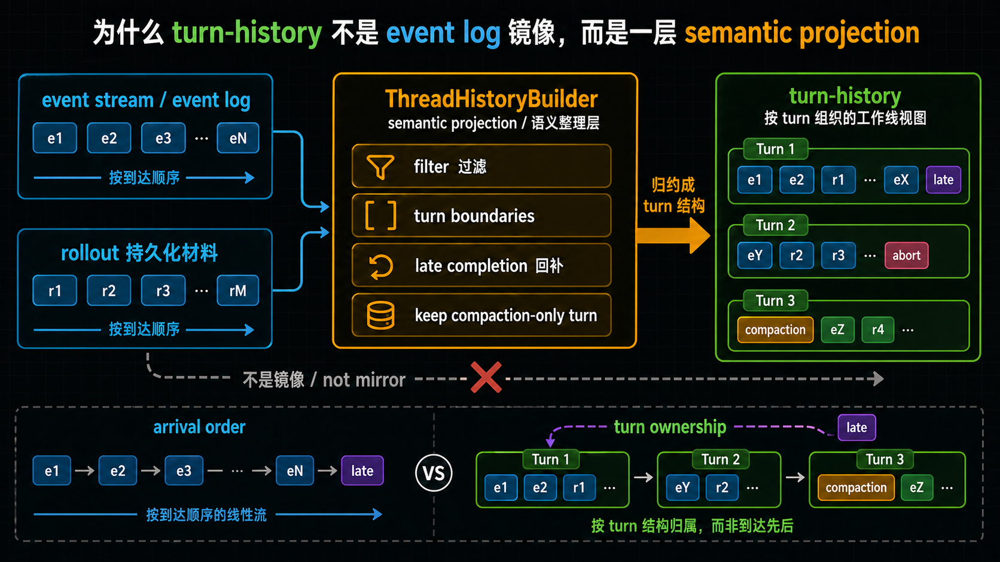

# 为什么 turn-history 不是 event log 镜像，而是一层 semantic projection

## 先回答读者最容易问的那个问题

*图：这张图说明 turn history 与 event log 的差别：event log 保存发生过什么，turn history 则把运行事件投影成模型和工具都能继续使用的语义视图。*

**上一章已经解释了：恢复回来后，真正继续工作的是 thread、turn 和 pending request 这条结构。那为什么系统接下来还不能直接把 event 按顺序摊出来，而必须再整理出一份 turn-history？**

先给结论：

> **因为“继续工作”这件事，要求系统看到的是 turn 结构，而不是事件流水。**
>
> event log 回答的是“先后发生了什么”；
> turn-history 回答的是“这些事件最后组成了哪几个有语义的工作轮次”。
>
> 所以 turn-history 不是 event log 的镜像，而是一层 **semantic projection**：它不是照抄原始记录，而是把原始记录整理成一个更适合阅读、展示、恢复和继续工作的 turn 视图。

这篇真正要压住的，是下面这条边界：

- **本篇不再回答“什么东西在继续工作”** —— 那是上一篇已经立住的；
- **本篇只回答“这些工作痕迹为什么要被归约成 turn，而不能直接原样暴露为 event 列表”。**

如果先把这层边界看清，后面再读 `ThreadHistoryBuilder`、history overlay、active turn，就不会把“工作线对象”和“工作线视图”混成一层。

---

## 先把两个关键词说白

如果你嫌 `semantic projection` 这个词太硬，可以先只记一句白话：

> **turn-history 不是日志复印件，而是一层把事件整理成 turn 轮次的语义整理层。**

后面再看到 `semantic projection`，都可以先把它翻译回这句中文。

### builder

本文会提到 `ThreadHistoryBuilder`。

第一次读到这个名字时，可以先把 **builder** 理解成：

> **一个把散乱事件逐步整理成 turn 历史的装配器。**

它不是简单的“收集器”，也不是“原样转存器”。它更像一层有规则的整理器：哪些事件要放进同一个 turn，什么时候要开新 turn，什么时候要把旧 turn 收口，都是它在判断。

### projection

本文也会说 **projection**。

这里不必先把它想得太抽象，可以直接理解成：

> **把原始事件材料，整理成一份更适合特定用途的结果视图。**

如果换成更容易入口的中文，它也可以直接读成：

> **语义整理层。**

对 turn-history 来说，这个用途就是：

- 让人能读懂一条工作线经历了几个 turn；
- 让系统能围绕 turn 继续恢复和推进；
- 让历史呈现的单位，变成“有语义的轮次”，而不是“零散事件清单”。

所以，所谓 **semantic projection**，说人话就是：

> **一层按语义整理过的 turn 视图。**

---

## 本文只讲一件事：为什么系统必须把事件整理成 turn，而不是直接展示事件

如果只想先抓住这一篇的最低分辨率区别，可以先看这组对照：

- **event log** 更关心：先后发生了什么
- **turn-history** 更关心：这些事最后组织成了哪几个工作轮次
- **semantic projection / 语义整理层** 更关心：哪些底层事件该被保留、归到哪个 turn、怎样呈现成可继续工作的历史

如果只从“日志记录”角度看，一个很自然的直觉是：

- 既然事件已经发生了；
- 既然事件也已经被记录下来；
- 那历史不就是把这些事件按顺序展示出来吗？

但 Codex 这里要解决的，不只是“事件发生过什么”，而是更接近下面这些问题：

- 哪些事件其实属于同一个工作轮次；
- 一个轮次何时开始、何时结束；
- 某些较晚到达的完成事件，应该归到哪个 turn；
- 某些看起来内容不多的 turn，是否仍然需要保留；
- 哪些运行时事件根本不该进入最终的 turn-history。

只要问题变成这样，答案就不会再是“按顺序列出来就行”。

因为 **event log 记录的是发生顺序**，而 **turn-history 想表达的是工作线结构**。这两者相关，但不是同一件事。

所以本文真正要纠正的理解入口是：

> **turn-history 关注的不是“日志有没有被完整抄出来”，而是“这些事件最后被整理成了什么样的 turn 结构”。**

---

## 一、turn-history 的目标，从一开始就不是“事件原样展示”

理解这一层，最重要的是先看目标。

如果 turn-history 的目标只是做事件镜像，那么它最合理的行为应该是：

- 来一个事件，记一个事件；
- 事件先后顺序，就是历史顺序；
- 不做额外归并，不做额外重组；
- 最终展示结果，应该尽量贴近底层事件流。

但从现有材料看，Codex 的 turn-history 明显不是按这个目标设计的。

它更像是在回答下面这些更高一层的问题：

### 1. 历史要按什么单位被读懂

Codex 对外想呈现的，不是“事件点列表”，而是“turn 列表”。

这意味着系统关心的单位不是：

- 某个 begin 事件；
- 某个 end 事件；
- 某条消息；
- 某次 compaction；

而是这些东西最终怎样组合成：

> **一个对读者和系统都有意义的轮次。**

### 2. 历史要怎样支持恢复和继续工作

turn-history 不是纯展示层数据。它和恢复、resume、active turn 追踪之间是接着的。

因此它需要表达的是：

- 哪些内容属于同一轮；
- 哪个轮次已经结束；
- 哪个轮次曾被中断；
- 哪些历史结构虽然不显眼，但不能在语义上丢掉。

这说明它要保留的是 **工作线结构**，而不是只保留“发生过的事件痕迹”。

### 3. 历史要兼容不同来源和不同完整度的输入

现有材料反复显示，Codex 不只处理一种完美、统一、显式标注完全的事件流。

它既要处理：

- 更结构化、显式标明 turn 生命周期的输入；
- 也要兼容较旧、较不完整、需要靠启发式补边界的输入。

这进一步说明，turn-history 的职责不可能只是“忠实打印事件”。

因为一旦输入本身存在显式与隐式并存的情况，系统就必须做判断：

> **哪些地方按显式边界走，哪些地方需要补出语义边界。**

而这已经是归约，不再是镜像。

---

## 二、`ThreadHistoryBuilder` 的角色，就是把事件归约成 turn

从参考材料看，`build_turns_from_rollout_items(...)` 本身很薄：

- 创建一个 `ThreadHistoryBuilder`；
- 把 rollout items 逐个喂进去；
- 最后 `finish()`。

这类结构通常说明：

> **真正有价值的语义，不在入口函数表面，而集中在 builder 内部。**

所以，`ThreadHistoryBuilder` 最准确的定位不是“历史收集器”，而是：

> **turn 语义归约器。**

这里的“归约”，可以先理解成：

> **把更细、更散、更接近底层的事件，整理成更稳定、更适合使用的 turn 结构。**

这个判断很重要，因为它直接解释了为什么 turn-history 不是 event log 镜像。

如果它是镜像，系统并不需要这样一个 builder。直接把事件数组传出去就够了。

但现在 Codex 恰恰把关键语义收拢到了 builder 上，这说明系统在明确做下面这件事：

- 不是单纯保存事件；
- 而是要把事件解释成 turn。

这也是源码笔记里一直强调的那句话：

> **它不是 parser，而是 replay reducer。**

换成更容易读的话，就是：

> **它不是把输入机械翻译出来，而是在一边读取，一边整理，一边决定这些材料最后该形成什么 turn 历史。**

---

## 三、为什么说它在做“语义归约”，而不是普通分发

有时读者会觉得：builder 不就是一堆 `match` 分支吗？为什么要说得这么重？

关键不在于它“分发了多少事件类型”，而在于它做的是不是**语义判断**。

从 `ThreadHistoryBuilder::handle_event(...)` 相关材料看，这里至少发生了三类事。

### 1. 它在决定哪些事件值得进入 turn-history

并不是所有运行时事件都会进入最终的 history。

有些事件会被明确忽略。这件事本身就已经说明：

> **turn-history 不是 event log 的全量镜像。**

如果它是镜像，最自然的行为应该是“来什么记什么”。

但 builder 这里实际上在做筛选：

- 哪些事件会影响 turn 呈现；
- 哪些事件会影响历史恢复；
- 哪些事件对最终的 turn 视图没有决定性意义，因此不必进入这层历史。

这不是简单的技术分发，而是在划定“什么才算 turn-history 关心的事实”。

### 2. 它在决定 turn 的边界

builder 不是只往列表里追加内容，它还在处理：

- `TurnStarted`
- `TurnComplete`
- `TurnAborted`
- 用户消息触发的隐式 turn 边界

也就是说，它不只是说“事件来了”；它还在说：

- 这一轮什么时候算开始；
- 这一轮什么时候算结束；
- 没有显式边界时，哪里仍然应该补出一个轮次边界。

一旦系统开始回答这些问题，它就在做语义归约，而不再是原样记录。

### 3. 它在决定一个事件最终属于哪个 turn

这是最能说明问题的一点。

参考材料明确提到，某些 late completion 一类的事件，不一定机械地挂到“当前最后一个 turn”上，而会尽量按 turn 语义回补到更合适的旧 turn。

这说明 builder 实际在做的是：

- 先看当前 active turn 是否匹配；
- 再看已完成的历史 turn 是否匹配；
- 实在找不到时才放弃。

如果系统只是做事件镜像，根本不需要这种判断。因为镜像只关心顺序，不关心归属。

但 turn-history 这里关心的是：

> **这个事件在最终的工作线结构里，应该落在哪个轮次。**

这就是语义归约最典型的特征。

---

## 四、到达顺序并不天然等于 turn 结构

这篇最容易被误解的地方，正是这里。

很多系统里，“按顺序展示日志”是非常自然的做法，于是读者也很容易把这套直觉带到 Codex：

- 事件先到，应该先显示；
- 事件后到，应该后显示；
- 最终历史应当近似复制 arrival order。

但 turn-history 不是这样一层。

### 1. 事件顺序表达的是“发生或到达的线性过程”

event log 最擅长表达的是：

- 某件事先发生；
- 某件事后发生；
- 中间穿插了哪些过程；
- 系统一路收到了哪些细粒度信号。

这对调试和持久化很有价值，但它不自动等于“读者最应该看到的历史组织方式”。

### 2. turn 结构表达的是“哪些内容属于同一轮工作”

turn-history 想回答的不是“先来后到”本身，而是：

- 这一轮用户提出了什么；
- 系统围绕这轮做了哪些动作；
- 哪些 begin/end、消息、错误、compaction 属于同一轮；
- 这一轮最终以什么状态收口。

所以它更接近一种**按轮次归组的结构化历史**。

这和单纯的到达顺序不是同一坐标系。

### 3. 某些晚到事件，仍然要回到更早的 turn 里

late completion 的例子尤其能说明这一点。

如果一个完成事件来得较晚，系统并不必然把它放到“最新 turn 的尾巴上”。更合理的做法是：

- 判断它原本属于哪个 turn；
- 再把它补回那个 turn。

这说明 Codex 更重视的是：

> **语义归属是否正确。**

而不是：

> **事件在最终展示中是否严格保持最表层的到达顺序。**

因此，本文可以明确立住一句判断：

> **到达顺序是输入材料的顺序，不是 turn-history 必须原样照抄的最终结构。**

---

## 五、显式 turn 生命周期优先，但系统仍然要兼容隐式边界

turn-history 不是 event log 镜像，还有一个很重要的原因：

> **Codex 并不是只接受一种“完美显式标注”的 turn 输入。**

从已有材料看，系统的态度很清楚：

- 有显式的 `TurnStarted`、`TurnComplete`、`TurnAborted` 时，优先按显式生命周期理解；
- 缺少这些完整标记时，仍然需要通过用户消息等信号，补出合理的 turn 边界。

这件事本身就已经说明 turn-history 是“整理后的结构”，不是“原始事件翻印件”。

因为只要系统需要兼容隐式边界，它就必须主动解释历史，而不能被动抄录历史。

这里尤其要注意一件事：

### 本文不是在重讲第 02 篇的 replay 总判断

第 02 篇关心的是：恢复总体上为什么更像 replay，而不是查库拼对象。

本文只往前走一步，专门说明：

> **在 turn-history 这一层，replay 读进来的材料还要继续被整理成 turn 语义，而不是直接作为事件清单交给读者。**

也就是说，本文谈的是 **turn 语义归约**，不是重写 recovery 的总论。

---

## 六、为什么有些看起来“空”的 turn 仍然不能丢

如果把 turn-history 想成 event log 镜像，一个很常见的直觉是：

- 没内容的 turn，好像没必要保留；
- 真正有文本、有消息、有结果的轮次，才算历史。

但参考材料专门提醒了一个关键例外：

> **compaction-only turn 不能简单当成空 turn 丢掉。**

这背后的含义很重要。

它说明 turn-history 记录的不只是“这轮有没有聊天内容”，还在保留：

- 历史结构在哪里发生了变化；
- 哪些 turn 在语义上仍然是有效节点；
- 哪些轮次虽然不热闹，但改变了后续历史的解释方式。

于是，“是否有丰富内容”和“是否有结构意义”就不是一回事了。

这进一步证明：

> **turn-history 不是面向事件数量的流水账，也不是面向文本多少的聊天抄本，而是面向工作线结构的历史视图。**

既然它在维护结构正确性，就不能只按“看起来空不空”来决定去留。

---

## 七、turn-history 是面向 turn 语义的视图，不是 event log 的替身

讲到这里，可以把三层东西明确分开。

### 1. event stream / event log

它更细，记录的是：

- 发生了哪些事件；
- 它们按什么顺序出现；
- 底层过程有哪些信号。

### 2. rollout / 持久化历史材料

它是更接近恢复真相源的一层历史承载材料。它保存的是后续仍可被重读、重解释、重建的正文历史基础。

### 3. turn-history

它不是前两者的别名。

它更像：

> **系统把这些历史材料重新整理之后，得到的一份 turn 语义视图。**

这份视图对外强调的是：

- 有哪些 turn；
- 每个 turn 内部怎样组织；
- 哪些内容属于同一轮；
- 哪些轮次已经完成、被中断、或只保留结构意义。

所以把它叫成 event log 镜像，会错过它最重要的价值：

> **它在替系统和读者做“如何把事件读成工作轮次”的解释。**

而这正是 projection 的意义。

---

## 八、本文和前后两篇的边界

为了不把卷三内部职责写乱，这里需要把本文边界说清楚。

### 本文不回头重写第 02 篇

第 02 篇已经负责回答：

- 为什么恢复总体上更像 replay；
- 为什么不是查库拼对象。

本文不再重讲那套总判断，只在其基础上继续往下说明：

- 即使材料已经进入 replay/reconstruction 语境；
- 在 turn-history 这一层，系统仍然要继续做语义整理；
- 最终得到的是 turn 视图，而不是事件镜像。

### 本文也不抢第 05 篇的职责

第 05 篇更适合专门处理：

- `active_turn_snapshot`
- `handle_user_message`
- 当前工作视图
- 当前/最近 turn 的对外投影边界

本文只点到为止，不把重点转成“当前该展示哪个 turn”。

本文真正要完成的任务只有一个：

> **把 turn-history 的性质写准：它是一层 turn 语义投影，不是 event log 原样镜像。**

---

## 九、这一篇最应该记住的判断

如果整篇只记一句话，最值得记的是：

> **Codex 的 turn-history，不是在复制事件流，而是在把事件流归约成 turn 结构。**

把这句话再展开一点，就是：

1. **turn-history 不是把事件原样堆出来。**
2. **`ThreadHistoryBuilder` / `handle_event(...)` / `build_turns_from_rollout_items(...)` 这一组逻辑，确实在做 turn 语义归约。**
3. **事件到达顺序只是输入材料的顺序，不天然等于最终对读者或系统最有意义的 turn 组织方式。**
4. **因此，turn-history 更准确的定义，不是 event log mirror，而是 semantic projection。**

如果用更正式但仍然容易读的话来收束本文，可以写成：

> **turn-history 是 Codex 将 live 与 persisted 事件材料整理为 turn 结构的一层语义视图；它服务的不是“原样展示事件”，而是“稳定表达工作线的轮次结构”。**

这就是为什么，读 turn-history 时，正确的问题从来不是“它有没有把日志一条不漏地抄出来”，而应该是：

> **它是怎样把这些事件解释成一条真正可读、可恢复、可继续推进的 turn 历史的。**
---

## 卷内导航

- 上一篇：[《thread、turn 与 pending request 是怎么组成持续工作线的》](./2026-04-12-Codex-卷三-03-thread-turn-与-pending-request-是怎么组成持续工作线的.md)
- 回到本卷入口：[本卷导读](./index.md)
- 下一篇：[《active_turn_snapshot、handle_user_message 与当前工作视图的边界》](./2026-04-12-Codex-卷三-05-active-turn-snapshot-handle-user-message-与当前工作视图的边界.md)

