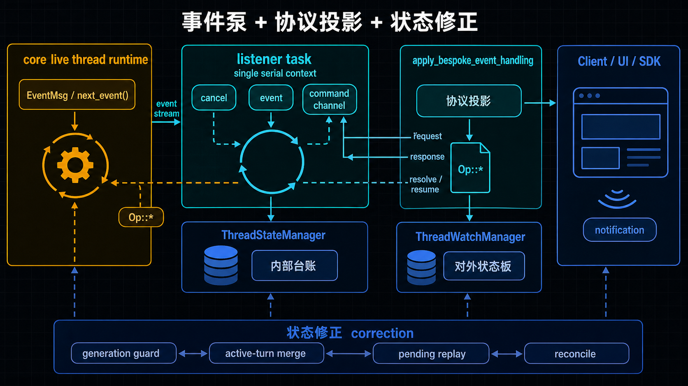
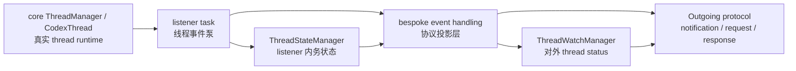
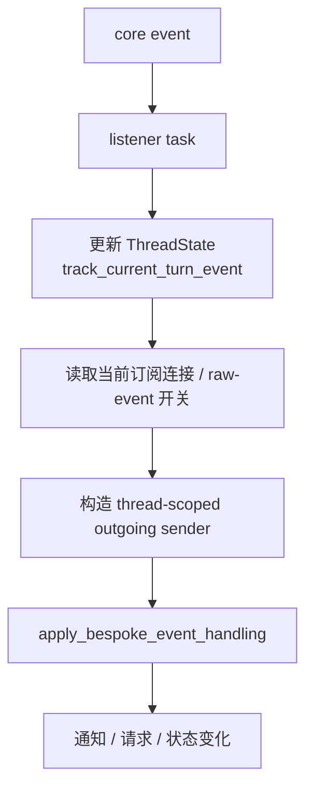
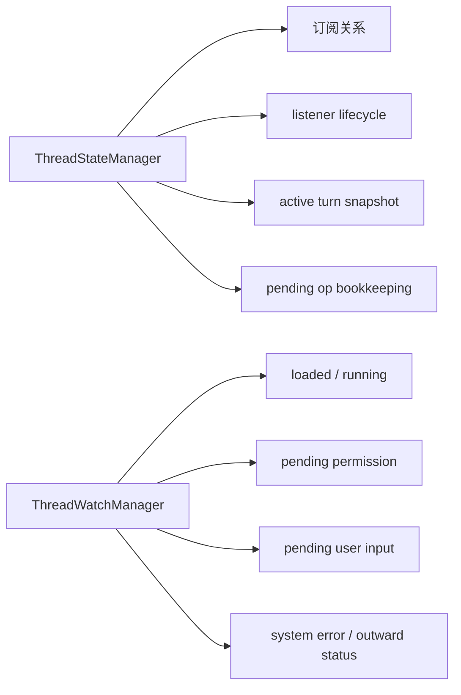
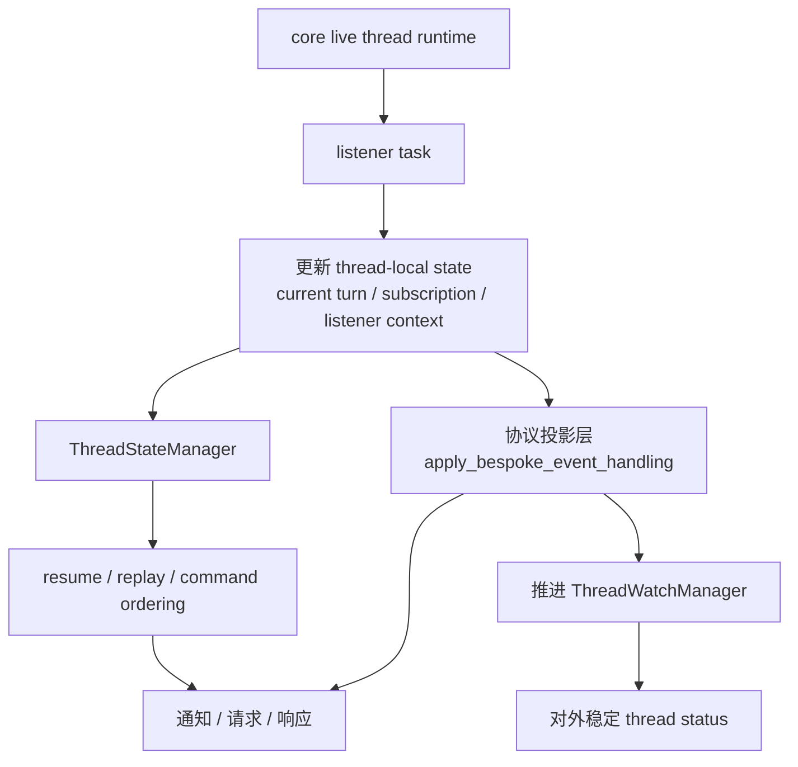

# listener task、协议投影与状态修正怎样把控制面撑起来

## 先回答读者最容易问的那个问题

*图：这张图展示 listener task 如何把外部协议事件投影成可处理的控制面任务，并在状态修正后重新写回前端可观察的运行视图。*

**上一篇已经把一个大边界立住了：app-server 不是另一套 runtime，而是 control-plane facade。那下一个问题就来了：既然它不是靠一个“大 runtime 对象”把一切都包住，控制面到底是靠什么机制变稳定的？**

先给结论：

> **Codex 的控制面，不是一个中心大状态机，而是一套分层配合的稳定面。**
>
> 可以先用一个低分辨率模型理解它：
>
> 1. **listener task** 负责把 live thread 的事件和顺序敏感命令，收进同一个串行上下文；
> 2. **`bespoke_event_handling`** 负责把这些 runtime signal 投影成客户端真正消费的协议语义；
> 3. **`thread_state_manager` / `thread_watch_manager` / 一组状态修正逻辑** 负责把内部局部状态、对外状态、重连与恢复时的视图持续校正到同一条线上。

所以这篇真正想立住的，不是“有哪些函数”，而是：

> **控制面为什么不是单点对象，而是“事件泵 + 协议投影 + 状态修正”三层配合。**

这也顺手把它和后两篇分开：

- **本篇回答：控制面作为机制是怎样成立的；**
- **第 03 篇再回答：request semantics 到底怎样分层；**
- **第 04 篇才单独处理 `DynamicToolCall` 那条语义分叉。**

---

## 先记住这张三层卡

- **listener task**：把 live event 和顺序敏感命令收进同一个串行上下文。
- **`bespoke_event_handling`**：把 runtime signal 整理成客户端真正消费的协议语义。
- **状态修正层**：把 thread-local state、watch 状态、重连/恢复后的对外视图持续校正到同一条线上。

如果中途读乱了，回到这三层卡即可：这篇所有机制，最终都在回答控制面为什么能靠这三层配合站稳。

再压成一句更适合记忆的话就是：

> **listener 负责把顺序守住，协议投影负责把话说成人能消费的样子，状态修正负责保证前后看到的是同一条 thread。**

## 先把“控制面撑起来”这几个字说白

这里的“撑起来”，不是一句抽象比喻，它至少要同时满足几件事：

- thread 正在运行时，外部能持续看到事件和状态变化；
- 客户端断线、重连、resume 时，不会把当前工作线看乱；
- approval、user input、resolve 这类动作，不会和 live event 打乱顺序；
- UI 或 SDK 看到的是稳定协议语义，而不是一堆底层 runtime 碎片；
- 旧 listener 退出、新 listener 接管、active turn 变化、thread status 变化，这些边界时刻不会互相踩坏。

所以控制面不是“能发消息”就算成立。

它真正要成立的是：

> **runtime 的真实活动，怎样被整理成一个可观察、可恢复、可继续控制、并且顺序不乱的外部界面。**

这也是为什么本篇必须同时讲三种东西：

- listener task；
- 协议投影；
- 状态修正与观察逻辑。

少一个，都很难把控制面真正讲清楚。

---

## 本文只讲一件事：Codex 怎样把 thread runtime 稳定投影成控制面

先把边界压紧。

本篇不回答这些问题：

- 哪些 request type 属于哪一类语义；
- `ServerRequestResolved` 的覆盖边界到底多大；
- unified-exec 怎样把执行会话进一步统一；
- 更细的 item lifecycle 分类该怎么拆。

这些后文都会讲。

本篇只回答下面这个问题：

> **当 core 那边已经有 live thread runtime 之后，app-server 是怎样靠 listener、协议投影、状态修正，把它做成一个稳定控制面的？**

换句话说，这篇不是 request 分类篇，也不是 enum 注释篇，而是卷四真正的机制篇。

---

## 一、先把对象摆正：控制面不是单点大服务，而是三层配合

如果先不看细节，只看结构，Codex 这里更像下面这样：

这个图要表达的核心只有一句：

> **app-server 不是拿一个大对象把 thread 全部重做一遍，而是在 runtime 之外长出了一套“事件泵 + 协议投影 + 状态修正”的控制面骨架。**

这也是为什么你在代码里会看到几类东西同时存在：

- 有负责持续读 live event 的 listener；
- 有负责把 `EventMsg` 翻译成通知、请求、状态变化的投影函数；
- 有负责活跃 turn、订阅关系、listener generation、pending 操作的局部状态管理；
- 有负责把复杂 runtime 事实压成 `Idle / Active / SystemError` 一类对外状态的 watch 侧管理；
- 还有一批看起来零散、实际上非常关键的 reconcile / correction helper。

如果误把其中任何一层当成“全部真相”，都会把整个控制面看扁。

---

## 二、listener task 不是后台小助手，而是线程事件泵

这一篇最先要立住的对象，就是 listener task。

很多系统里，listener 给人的直觉是：

- 后台开个协程；
- 有消息就收一下；
- 顺手转发给订阅者。

但 Codex 这里不是这个分量。

更准确地说，listener task 在 app-server 里的角色是：

> **每条 thread 的事件泵，也是这条 thread 在控制面侧的单一串行上下文。**

### 1. 它先安装“谁来听”，再开始“听什么”

`ensure_listener_task_running_task(...)` 的关键，不只是“确保有个 task 在跑”，而是先判断：

- 当前 thread 有没有已经匹配的 listener；
- 如果有，是不是绑定着同一个 live `CodexThread`；
- 如果不是，就要替换 listener；
- 替换时要连同 cancel channel、command channel、generation 一起切换。

所以它首先解决的不是收事件，而是 listener ownership。

也就是说，系统先要回答：

> **谁有资格作为这条 thread 当前代的 authoritative listener。**

### 2. 它统一承接三类输入，而不只是一条 event stream

listener 真正跑起来以后，主循环不是只看 `conversation.next_event()`。

它同时监听：

- cancel 信号；
- core runtime 的下一条 event；
- 发给 listener 的 command channel。

这一步特别关键。

因为它说明 listener 的真正语义不是：

- 读 event；
- 广播 event。

而是：

- 读 live runtime event；
- 接收必须与 event 保持顺序关系的控制命令；
- 在同一个串行上下文里推进这条 thread 的控制面状态。

所以用“线程事件泵”来理解它，比“监听器”准确得多。

### 3. 它的存在，是为了给 thread 建一个顺序控制点

为什么要这么做？

因为控制面要处理的，不只是自然流出的事件，还有一些**排序敏感动作**。例如：

- running thread 的 resume 响应；
- 某个 pending server request 的 resolve；
- 某些 replay / reattach 相关操作。

这些动作如果在别的地方并行做，就很容易和 live event 抢顺序。

于是 Codex 的做法是：

> **凡是必须和 thread 事件流维持相对顺序的动作，都尽量塞回 listener command channel，由 listener 在自己的上下文里串行处理。**

这就是 listener 最像成熟 actor / control loop 的地方。

它不是为了“异步方便”，而是为了“顺序正确”。

---

## 三、listener 为什么能把控制面托住：因为它先做局部记账，再做对外投影

listener 收到 event 以后，并不是立刻往外广播。

它先更新 thread-local state，然后才做 outward projection。

这个顺序非常重要。

更准确地说，主链大致是：

### 1. 为什么必须先更新 thread-local state

因为很多对外协议语义，并不是某个 event 自己就携带完整答案。

例如：

- 当前 active turn 的快照是什么；
- 最近这轮 turn 的错误累积到了什么程度；
- 现在有哪些 pending interrupt / rollback；
- 某条 thread 当前有没有活跃 listener；
- 这时应该向哪些连接发送消息。

如果 event 一到就直接对外投影，很容易出现这样的错位：

- 通知已经发出去了；
- 但内部 active turn 还没跟上；
- 或者订阅者集合还是旧的；
- 或者 watch status 还没修正到正确状态。

所以这里的心智其实很清楚：

> **先让 thread 自己的派生状态跟上，再让外部看到这条 thread。**

### 2. `current_turn_history` 不是装饰字段，而是当前工作线的内存事实

listener 每次收到 event，都会把它喂进 `track_current_turn_event(...)`。

这意味着 active turn snapshot 的维护，不是在别处偷偷进行，而是由 listener 主循环直接负责。

也就是说：

- 历史 replay 可以在别处构造长期历史；
- 但 live current turn 的近场事实，是 listener 一边收 event 一边维护出来的。

这对于控制面很关键。

因为 resume、reconnect、当前工作视图装配，都不能只依赖持久化历史，它们还要知道：

> **现在这条 thread 最近、最新、尚未完全 finalize 的那段工作，内存里已经推进到了哪里。**

listener 正是在维持这个近场事实。

---

## 四、`bespoke_event_handling` 不是分发函数，而是协议投影层

listener 把 event 收进来以后，真正决定“客户端看到什么”的，不是 listener loop 本身，而是 `apply_bespoke_event_handling(...)` 这一层。

如果要给这层下一个正式一点的定义，我会写成：

> **它是 core runtime event 到 app-server 协议语义之间的投影层。**

这比“事件处理函数”准确得多。

### 1. 它处理的不是“原样转发”，而是“重新解释”

`EventMsg` 到客户端通知，并不是一一对应的直译关系。

在这层里，系统会做很多额外工作，例如：

- 根据 `turn_summary` 和 active-turn snapshot，决定 `TurnStarted` / `TurnCompleted` 对外应该长什么样；
- 在 turn 开始或结束时，顺手清理、终止、resolve 某些 pending request；
- 根据 approval / user input 事件，把客户端交互桥接成新的 server request；
- 把 item、tool、collab、hook 等底层事件重新压成更适合 UI / SDK 消费的协议模型；
- 推进 `thread_watch_manager`，让对外 thread status 与当前运行态同步。

所以这里做的不是：

- runtime signal in；
- 同形输出 out。

而是：

- runtime signal in；
- 客户端可理解、可消费、可恢复的语义 out。

### 2. 它是协议层，不只是通知层

为什么要特别说“协议投影”，而不只说“通知映射”？

因为它不只在发 notification。

它还会：

- 发 request；
- 等待客户端返回；
- 把客户端决策重新桥回 core 的 `Op::*` 主链；
- 同时维护 pending request 与 watch status。

也就是说，这一层已经不只是“告诉客户端发生了什么”，而是在规定：

> **客户端应该以什么语义参与这条 thread。**

这才是控制面协议层真正的重量。

### 3. 所以 `bespoke_event_handling` 更像 app-server 的语义翻译器

把这层的角色压缩成一句最短的话，就是：

> **listener 负责把事件按顺序拿到手，`bespoke_event_handling` 负责把这些事件翻译成外部世界真的能消费的控制面语义。**

前者保证顺序，后者保证含义。

---

## 五、为什么只靠 listener 和投影还不够：因为控制面还需要持续修正状态

到了这里，读者很容易产生一个新的误解：

- listener 已经把 event 串起来了；
- 投影层也已经把协议做出来了；
- 那控制面是不是已经完成了？

还不够。

因为控制面面对的不是静态系统，而是：

- live runtime 会持续变化；
- 连接会断开重连；
- listener 会被替换；
- active turn 和 persisted history 会暂时不一致；
- 对外展示状态往往是压缩过的，需要持续和内部事实对齐。

所以 app-server 里还必须有一整层**状态修正与观察逻辑**。

这也是为什么你会看到：

- `thread_state_manager`；
- `thread_watch_manager`；
- listener generation；
- active-turn snapshot merge；
- pending request replay；
- 一批 abort / note / reconcile helper。

这些看起来零散，但它们其实都在做同一类事：

> **把 live runtime、内存局部状态、以及客户端看到的控制面视图，持续修正到同一条线上。**

---

## 六、`thread_state_manager` 管的不是“状态总表”，而是 listener 内务与局部事实

先看 `thread_state_manager`。

这个名字很容易让人误以为它就是 thread 的总状态权威。

但如果按本篇的结构去理解，它更接近：

> **listener 侧的内部台账与局部运行态管理器。**

它主要管这些东西：

- connection 和 thread 的订阅关系；
- 当前 listener 的 cancel / command channel；
- listener generation；
- 当前 active turn history；
- pending interrupt / rollback；
- raw event opt-in 等 thread-local 细节。

换句话说，它关心的问题不是：

- 客户端最终应该看到哪个 thread status；

而是：

- 这条 thread 当前由谁在监听；
- 对哪些连接可见；
- 当前局部 turn 状态推进到了哪里；
- 哪些 ordering-sensitive 动作还需要在 listener 上下文里继续处理。

### 1. 它支撑的是控制面“跑得对”

`thread_state_manager` 的价值，首先不是展示，而是正确性。

例如：

- 没有订阅关系，listener 不知道该往哪些连接发；
- 没有 `current_turn_history`，resume 无法拿到 live active turn；
- 没有 listener command channel，排序敏感命令就会散落在别处并发执行；
- 没有 generation，旧 listener 退出时可能误清新 listener 的状态。

这些都不是 UI 直接看得见的功能，但却是控制面成立的前提。

### 2. 它保存的是近场事实，不是最终展示态

这一点尤其重要。

`thread_state_manager` 里有很多字段，对客户端来说根本不该直接暴露，例如：

- `cancel_tx`；
- `listener_command_tx`；
- `listener_thread`；
- `listener_generation`；
- `pending_interrupts`；
- `current_turn_history`。

这说明它本来就不是 view model。

它更像控制面内部的调度室台账，负责保存：

> **为了让 listener、resume、replay、resolve 这些路径跑对，系统必须记住的局部事实。**

---

## 七、`thread_watch_manager` 管的不是内部机制，而是对外 thread status 投影

和 `thread_state_manager` 对应，`thread_watch_manager` 的语义要纯得多。

它更像：

> **把复杂 runtime 事实压成客户端真正消费的 thread status。**

典型地，它关心的是：

- thread 是否 loaded；
- 现在是否 running；
- 是否有 pending permission request；
- 是否有 pending user input request；
- 是否出现 system error；
- 对外应显示为 `NotLoaded / Idle / Active / SystemError` 的哪一种。

### 1. 它回答的是“客户端现在该怎么看这个 thread”

这是 watch manager 最清楚的职责边界。

它不需要知道：

- 当前 listener generation 是多少；
- 哪条 command channel 正在被谁消费；
- active turn builder 内部现在攒了哪些 item。

它只需要回答：

> **如果客户端此刻刷新这个 thread，它应该看到什么公共状态。**

### 2. 它通常在协议投影时被推进

这也是为什么本篇必须把 watch manager 放在协议投影后面讲。

从材料看，很多 watch 状态更新发生在 `apply_bespoke_event_handling(...)` 中，例如：

- `note_turn_started(...)`；
- `note_turn_completed(...)`；
- `note_turn_interrupted(...)`；
- `note_permission_requested(...)`；
- `note_user_input_requested(...)`；
- `note_system_error(...)`；
- `note_thread_shutdown(...)`。

这说明 watch manager 不是 listener loop 自己偷偷维护的，而是：

> **在 runtime event 被重新解释成控制面语义的同时，一并推进的对外状态投影。**

也因此，它和 `thread_state_manager` 虽然相关，但不该混为一谈。

---

## 八、为什么 `thread_state_manager` 和 `thread_watch_manager` 必须拆开

到了这里，可以回答一个非常重要的设计问题：

**既然都是 thread 相关状态，为什么不合成一个 manager？**

答案是：因为它们在控制面里承担的是两种不同层次的状态。

可以先看下面这个分工图：

### 1. 一边是内部协调状态

`thread_state_manager` 更像 controller state。

它要处理的是：

- listener 怎样安装和替换；
- 订阅关系怎样变；
- command channel 怎样串行推进；
- 当前 turn 的内存快照怎样维护；
- 哪些 pending 动作还没被收口。

这是为了让机制跑对。

### 2. 另一边是对外展示状态

`thread_watch_manager` 更像 observable projection。

它要处理的是：

- 客户端看起来是 idle 还是 active；
- 是否在等待批准；
- 是否在等待用户输入；
- 有没有系统错误；
- 是否需要发 `ThreadStatusChanged` 一类通知。

这是为了让外部看得懂。

### 3. 如果不拆，会出现两类污染

如果把两者硬合在一起，通常会有两个问题：

- **内部协调状态污染公共状态面。** 客户端不该知道的 listener 内务，会被误混进对外状态。  
- **对外状态变化反过来绑死内部机制。** resume、reconnect、listener replacement 这些控制逻辑会和 UI-facing 状态机强耦合。

所以这不是抽象过度，而是必要拆分。

更白话一点：

> **一个负责“后台调度室”，一个负责“给外部看的状态板”。**

控制面之所以稳，很大程度上就是因为这两块没有被糊成一坨。

---

## 九、状态修正逻辑真正修的是什么：不是语法边角，而是控制面正确性

本篇还必须专门讲一下那些看起来琐碎的状态修正逻辑。

因为很多人第一次读 app-server 代码，会有一种感觉：

- 为什么这么多小 helper；
- 为什么到处都是 note / abort / replay / reconcile；
- 为什么不是一个统一大状态机一次算完。

但这些“小修正器”并不次要。

它们修的，恰恰是控制面最容易失真的地方。

### 1. 修 listener 的代际边界

比如 `listener_generation` 的存在，就是在解决一个非常现实的问题：

- 旧 listener 还没完全退出；
- 新 listener 已经装上了；
- 如果旧 listener 退出时不做代际检查，就可能把新 listener 的状态误清掉。

所以 generation guard 修的不是小细节，而是：

> **控制面在 listener 替换时，如何避免 stale task 误伤当前代控制链。**

### 2. 修 active turn 与历史之间的近场差

运行中的 thread，总会有一些最新状态只存在于内存里，尚未沉淀成完整历史。

这时系统就要靠：

- `current_turn_history`；
- `active_turn_snapshot()`；
- resume 时的 merge 逻辑；

把 persisted rollout 和 live active turn 拼回一条连贯工作线。

所以这里修的是：

> **恢复视图不能只看历史，还要把当前正在发生的那段工作补回来。**

### 3. 修 request 与 event 的顺序关系

approval、user input、resolve、resume 这些动作，只要和 live event 的顺序乱掉，客户端看到的控制面就会出错。

所以系统会让它们尽量回到 listener command channel，保证它们在 listener 上下文里串行处理。

这里修的是：

> **控制面不是只要最终状态对就行，还要求过程顺序也对。**

### 4. 修内部事实与外部状态之间的投影差

`thread_watch_manager` 把复杂 runtime 事实压成较小的状态枚举，但压缩本身会带来失真风险。

于是系统必须不断在事件投影时做这些 note / correction：

- turn 开始时把 thread 标成 active；
- 等待批准时挂起 permission flag；
- 等待用户输入时挂起 input flag；
- 出现系统错误时切到 system error；
- 结束、打断、shutdown 时再正确收口。

这里修的是：

> **外部状态板必须始终尽量贴近内部事实，而不是过一会儿才慢慢追上。**

所以这些状态修正函数不该被看成边角料。

它们和 listener、协议投影一起，构成了控制面稳定性的第三根柱子。

---

## 十、把三层合起来看：控制面是怎样被“撑稳”的

到这里，可以把全文的主链收成一个更完整的机制图：

这张图的意思可以翻成一段白话：

### 第一步：listener 把 thread 事件收进一个单一串行上下文

这一步解决的是：

- 谁来听；
- 按什么顺序听；
- 哪些控制命令必须回到同一个上下文里处理。

所以 listener 是线程事件泵。

### 第二步：协议投影层把 runtime 事件重新解释成客户端语义

这一步解决的是：

- 外部究竟该看到什么通知；
- 哪些事件应变成 request；
- thread status 该怎样推进；
- 客户端交互该怎样桥回 core。

所以 `bespoke_event_handling` 是协议投影层。

### 第三步：状态修正逻辑把内部状态、外部状态与恢复视图持续对齐

这一步解决的是：

- listener 替换时不出错；
- active turn 与历史之间不脱节；
- resume / replay 时工作线不断裂；
- 对外状态板始终能贴近内部事实。

所以 `thread_state_manager`、`thread_watch_manager` 与周边 correction 逻辑，是在共同把控制面撑稳。

也就是说，Codex 这里的控制面稳定性，不是来自一个“全知全能大对象”，而是来自三件事同时成立：

1. **有单一串行的线程事件泵；**
2. **有专门的协议投影层；**
3. **有持续修正内外状态差异的状态管理与观察逻辑。**

---

## 十一、为什么这套设计像正式控制面，而不像“UI 顺手包了一层”

这一节可以作为本篇最后一个系统判断。

很多人会把 app-server 误看成：

- UI 前面包了一层协议；
- 把 runtime event 转成消息发出去；
- 做一点 reconnect 兼容。

但如果按本篇主链来看，它已经明显比“薄包装”重得多。

因为它具备正式控制面的几个特征：

### 1. 有 thread-scoped 的单一顺序点

不是谁都能随手碰 thread 事件流。

listener 作为 thread-side control loop，已经确立了顺序主轴。

### 2. 有独立的协议语义层

客户端看到的不是 core 原始事件，而是经过投影、压缩、桥接、合成后的控制面语义。

### 3. 有内外状态分层

内部协调状态和外部可观察状态没有糊在一起，而是分成 `thread_state_manager` 与 `thread_watch_manager` 两套层次。

### 4. 有恢复与重连时的状态修正机制

resume、replay、active-turn merge、generation guard，这些都说明它不是一次性转发器，而是长期维护控制面连续性的系统。

所以更准确的说法是：

> **app-server 不是在“帮 UI 转发 runtime”，而是在把 runtime 长期维护成一个正式控制面。**

这就是卷四第 02 篇真正想压住的判断。

---

## 本篇结论

读完这一篇，应该稳定下面 6 个结论。

### 结论 1：listener task 更像线程事件泵

它不是普通后台监听器，而是每条 thread 在控制面侧的单一串行上下文：既读 live event，也处理排序敏感命令。

### 结论 2：`bespoke_event_handling` 更像协议投影层

它不是简单 mapper，而是把 core `EventMsg` 重写成客户端真正消费的 notification / request / status 语义。

### 结论 3：`thread_state_manager` 管内部协调与局部事实

它负责 listener 生命周期、订阅关系、active turn snapshot、pending 操作等机制性状态。

### 结论 4：`thread_watch_manager` 管对外可观察状态

它负责把复杂 runtime 事实压成客户端稳定消费的 thread status。

### 结论 5：控制面稳定性离不开状态修正逻辑

generation guard、active-turn merge、pending request replay、note / abort / reconcile helper，并不是边角料，而是控制面长期稳定的必要条件。

### 结论 6：Codex 的控制面是三层共同撑起来的

> **listener task 是线程事件泵，`bespoke_event_handling` 是协议投影层，`thread_state_manager` / `thread_watch_manager` 与周边状态修正逻辑则在共同把控制面撑稳。**

这也是本篇最该记住的一句话。

---

## 给下一篇留一个接口

到这里，卷四已经把一个更完整的判断立住了：

- app-server 不是另一套 runtime；
- listener / projection / state correction 才是控制面成立的主骨架。

下一篇才适合继续往前追问：

> **既然控制面已经成立，那 `ServerRequestResolved` 到底覆盖了哪些 request semantics，哪些又根本不是同一种 resolved 语义？**

但那已经是 request shape 分类问题了，不是本篇要展开的内容。
---

## 卷内导航

- 上一篇：[《为什么 app-server 不是另一套 runtime，而是建立在 core 之上的控制面 facade》](./2026-04-12-Codex-卷四-01-为什么-app-server-不是另一套-runtime.md)
- 回到本卷入口：[本卷导读](./index.md)
- 下一篇：[《Codex 卷四 03｜`ServerRequestResolved` 到底覆盖了什么控制面语义》](./2026-04-12-Codex-卷四-03-ServerRequestResolved-到底覆盖了什么控制面语义.md)

