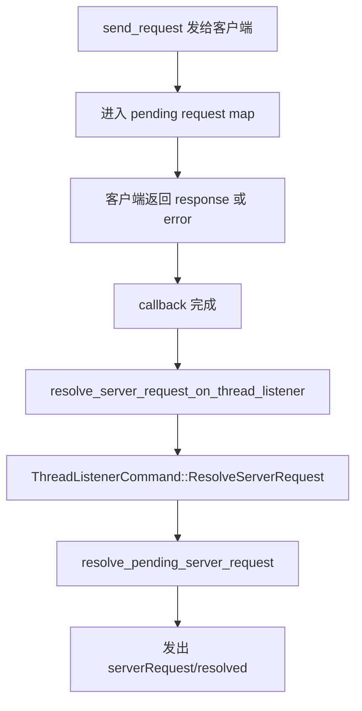

# Codex 卷四 03｜`ServerRequestResolved` 到底覆盖了什么控制面语义

## 先问问题

到了卷四这里，读者最容易滑进一个很自然、但不够准确的理解：

> 某个 request 完成了，所以系统发一个统一的 `serverRequest/resolved` 通知。

这句话的问题，不是完全错，而是**把三层不同的“完成”混成了一层**：

1. **内部 callback 已经收到了结果**
2. **某些 thread-scoped request 会额外发一个有顺序语义的 resolved notification**
3. **还有些 request 根本不打算用这套 resolved 语义收口**

这三层一旦不拆开，后面就会连续误判：

- 看见 callback 能收回结果，就以为等价于 `ServerRequestResolved`
- 看见某个 request 也能 replay，就以为它最终一定会走 resolved
- 看见没有 `serverRequest/resolved`，就以为那一定是“还没迁完”

所以这篇真正要做的，不是再讲一遍 request 清单，而是先把“request 完成”这件事拆层。

---

## 先给结论

先把本文最重要的判断放在前面，而且顺手把和下一篇的边界压住。

### 结论 1：callback resolution 和 `ServerRequestResolved` 不是同一层意思

**callback resolution 只是内部“这个 request 已经收到客户端结果”的完成；`ServerRequestResolved` 是控制面上额外发出的、带 thread 顺序语义的 resolved notification。**

### 结论 2：`ServerRequestResolved` 不是 request 世界的总括名

**它覆盖的是一批特定 request 的 resolved-notification 语义，而不是“所有 request 最终完成时的统一名字”。**

### 结论 3：当前 request 形态已经基本能稳定分成四类

1. **已进入 `ServerRequestResolved` 的 V2 thread-scoped interactive request**
2. **thread-scoped，但产品语义故意不走 resolved，而走别的完成模型**
3. **global / threadless request，本来就不适合进这套 thread-resolved 语义**
4. **deprecated V1 legacy holdout**

### 结论 4：本篇只收口 `ServerRequestResolved` 的覆盖面

`DynamicToolCall` 为什么走 item lifecycle、不走 resolved，这里只点到为止；**完整展开留给第 04 篇。**

换句话说：

- **本篇回答：`ServerRequestResolved` 到底覆盖谁；**
- **下一篇回答：为什么 `DynamicToolCall` 明明像 request，却故意不进入这套 resolved 语义。**

---

## 一、先把“request 完成”拆成三层

### 第一层：transport / callback 层

在 app-server 里，request 发出去之后，会进入 `OutgoingMessageSender` 维护的 pending callback 体系。`notify_client_response(...)` 和 `notify_client_error(...)` 做的事情很直接：

- 按 request id 找到 callback
- 把结果或错误送回去
- 从待处理映射里拿掉

这一层回答的是：

> **这个请求在内部有没有收到回应？**

它是 request machinery 的基础层，适用面很广。

### 第二层：thread listener 上下文里的 resolved notification

`thread_state.rs` 里专门定义了 `ThreadListenerCommand::ResolveServerRequest`，注释写得很直白：

- 它是“notify the client that the request has been resolved”
- 且必须在 thread listener context 里执行
- 为的是保证 resolved notification 和 request 本身之间的顺序关系

也就是说，这里关注的已经不是“callback 收没收到结果”，而是：

> **要不要把这次完成，变成 thread 事件流里一个有顺序语义的外部通知。**

### 第三层：对外协议语义层

在 `app-server-protocol` 里，`ServerRequestResolved` 被定义成一个正式的 server notification，方法名就是 `serverRequest/resolved`。

这说明它不是内部实现细节，而是已经被 app-server 当成一种**对外控制面语义**暴露出来。

所以这里最容易踩的坑就是：

> **内部 callback 被 resolve，不等于协议层一定会发 `ServerRequestResolved`。**

---

## 二、为什么 `ServerRequestResolved` 不能理解成“所有 request 的统一 resolved 事件”

因为源码里根本不是这么组织的。

### 1. 它不是在所有 response handler 末尾统一自动发射

如果 `ServerRequestResolved` 真是“所有 request 最后都会走的统一 resolved 事件”，我们应该看到一种很强的统一模式：

- 所有 request handler 最终都进入同一个 resolved 收口点
- 或所有 callback 完成之后自动补发 resolved
- 或 pending request registry 自己负责统一发 resolved

但实际结构不是这样。

实际代码是：

- 某些 handler 会显式调用 `resolve_server_request_on_thread_listener(&thread_state, pending_request_id).await`
- 某些 handler 根本不会调用它
- 还有些 request 根本不在 thread listener 语义里

这说明：

> **`ServerRequestResolved` 不是 request 系统的默认终点，而是被“选择性接入”的一条语义通道。**

### 2. 它依赖 thread listener 上下文，因此天然不是全局 request 的总括名

`resolve_server_request_on_thread_listener(...)` 会把命令送进 thread listener；而真正发通知的 `resolve_pending_server_request(...)` 又会：

- 拿当前 thread 的 subscribed connection ids
- 构造 `ThreadScopedOutgoingMessageSender`
- 只向这个 thread 的订阅者发 `ServerRequestResolvedNotification`

这几步说明得非常清楚：

> **`ServerRequestResolved` 从设计上就是 thread-scoped notification。**

既然它的成立前提就是“有 thread listener、有 thread subscriber、有 thread ordering”，那它当然不可能天然代表整个 request 世界。

### 3. 它的价值是“有序通知”，不是“抽象命名”

`codex_message_processor.rs` 里 `resolve_pending_server_request(...)` 的函数体其实很简单，但它被放置的位置非常关键：

- 不在原始 callback 里直接发
- 而是先回到 listener command 链
- 再在 listener 上下文里发 `ServerRequestResolved`

它要保住的不是“有没有 resolved”这件事，而是：

> **resolved 这个通知，也要进入 thread 自己的顺序世界。**

所以它的重点从来不是给“所有 request 完成”起一个通用名字，
而是给**一批需要 thread-ordered resolved notification 的 request**提供协议语义。

---

## 三、当前到底哪些 request 会进入 `ServerRequestResolved`

如果只看当前 `ServerRequest` 枚举，可以把 request shape 基本收成 9 类。对本文最重要的是：其中只有一部分真正接入了 `ServerRequestResolved`。

### 已确认接入 `ServerRequestResolved` 的 5 类 request

从 `bespoke_event_handling.rs` 可以直接看到，这几类响应 handler 在拿到客户端回复后，都会显式调用：

`resolve_server_request_on_thread_listener(&thread_state, pending_request_id).await`

当前可稳定确认的有 5 类：

1. `CommandExecutionRequestApproval`
2. `FileChangeRequestApproval`
3. `ToolRequestUserInput`
4. `McpServerElicitationRequest`
5. `PermissionsRequestApproval`

它们共同特点很明确：

- 都是 **V2** request
- 都是 **thread-scoped**
- 都会经过 pending request machinery
- reconnect / resume 时能纳入 replay 世界
- 在 response handler 里都显式接上 resolved listener path

所以更准确的说法是：

> **`ServerRequestResolved` 当前稳定覆盖的是一批 V2、thread-scoped、interactive request 的 resolved-notification 语义。**

而不是“所有 request”。

---

## 四、这 5 类为什么能算“完整进入 resolved 语义模型”

因为它们不是只有 callback 完成，而是整套模式都已经闭环。

可以把共同路径压成下面这条链：

这一整套结构说明两件事。

### 1. resolved 是额外语义，不是 callback 的别名

如果它只是 callback 的另一个名字，`D` 之后就不需要再有 `E/F/G/H` 这整条链。

但现在恰恰有这条链，说明作者有意把：

- 内部 completion
- 对外 resolved notification

分成了两个层次。

### 2. resolved 的时序被纳入 thread ordering

`ThreadListenerCommand::ResolveServerRequest` 的注释已经明确说明，这样做是为了确保 resolved notification 与 request 本身的顺序关系。

也就是说，这 5 类 request 的“完成”不是一句松散的“它结束了”，而是：

> **它们的完成会以 thread-aware、listener-ordered 的方式暴露给控制面。**

这就是它们能被称作“完整进入 resolved 语义模型”的原因。

---

## 五、哪些 request 明显不该被算进这套 resolved 覆盖面

把这一点讲清楚，才能真正理解为什么 `ServerRequestResolved` 不是 request 总括名。

### 1. `ChatgptAuthTokensRefresh`：它属于 global bridge request

`message_processor.rs` 里的 `ExternalAuthRefreshBridge` 很直接：

- 直接 `send_request(ServerRequestPayload::ChatgptAuthTokensRefresh(params))`
- 本地等待 callback 或 timeout
- 超时就 cancel
- 成功就解析为 `ChatgptAuthTokensRefreshResponse`

这条路径里没有：

- `thread_state`
- thread listener
- `resolve_server_request_on_thread_listener(...)`
- `ServerRequestResolved`

原因也不复杂：

> **它不是 thread-scoped request，而是账户认证刷新这类 global / bridge request。**

既然不站在 thread 语义里，自然也不该拿 thread-scoped 的 `ServerRequestResolved` 去描述它。

### 2. `ApplyPatchApproval` 与 `ExecCommandApproval`：它们属于 deprecated V1 holdout

`bespoke_event_handling.rs` 里能直接看到：

- `ApiVersion::V1` 分支发送的是 `ApplyPatchApproval` / `ExecCommandApproval`
- 回包后会继续走各自的业务处理
- 但这条老路径没有接上 `resolve_server_request_on_thread_listener(...)`

这说明它们并不是当前 V2 resolved 主线的一部分。

更合适的归类是：

> **deprecated V1 legacy holdout。**

也就是说，它们的确是 request，也会完成 callback，但不代表它们就自动拥有 `ServerRequestResolved` 语义。

---

## 六、为什么很多人会误以为 `DynamicToolCall` 也应该走 `ServerRequestResolved`

因为它在 transport 形态上，确实很像那批已经接入 resolved 的 thread request：

- 它是 thread-scoped
- 它通过 `send_request(...)` 发给客户端
- 它进入 pending request map
- reconnect 时也能落在 replay 世界里

只看到这里，很自然会得出一个误判：

> 既然这么像，那它是不是也只是“还没接上 `ServerRequestResolved`”？

但当前更稳的判断不是这个。

### 更准确的判断

`dynamic_tools.rs` 里客户端回包后做的事是：

- 解析 `DynamicToolCallResponse`
- 直接 `submit(Op::DynamicToolResponse { ... })` 回 core

而不是：

- `resolve_server_request_on_thread_listener(...)`
- `ThreadListenerCommand::ResolveServerRequest`
- `ServerRequestResolved`

这说明它虽然复用了 request transport machinery，
但完成语义并没有接到 resolved-notification 这一支。

本文先只收这一句：

> **`DynamicToolCall` 不能被当成“还没迁完的 resolved request”；它更像 transport 复用下的一条语义分叉。**

至于它为什么更适合落在 item lifecycle 上，而不是 resolved-notification 上，下一篇再展开。

---

## 七、现在最稳的一张覆盖面表

把前面的判断压成表，会更容易记。

| request shape | 当前归类 | 为什么 |
|---|---|---|
| `CommandExecutionRequestApproval` | 已覆盖 `ServerRequestResolved` | V2、thread-scoped、handler 显式调用 `resolve_server_request_on_thread_listener(...)` |
| `FileChangeRequestApproval` | 已覆盖 `ServerRequestResolved` | 同上 |
| `ToolRequestUserInput` | 已覆盖 `ServerRequestResolved` | 同上 |
| `McpServerElicitationRequest` | 已覆盖 `ServerRequestResolved` | 同上 |
| `PermissionsRequestApproval` | 已覆盖 `ServerRequestResolved` | 同上 |
| `DynamicToolCall` | 语义分叉 | transport 像 request，但完成语义不走 resolved |
| `ChatgptAuthTokensRefresh` | global bridge request | 不站在 thread listener / thread-resolved 世界里 |
| `ApplyPatchApproval` | legacy holdout | deprecated V1，callback 完成，但不走 V2 resolved path |
| `ExecCommandApproval` | legacy holdout | deprecated V1，callback 完成，但不走 V2 resolved path |

这张表背后的真正结论是：

> **`ServerRequestResolved` 的覆盖面是清楚且有限的。它不是 request 系统的大总名，而是 9 类 request 中其中一批的协议完成语义。**

---

## 八、为什么 resume / replay 语境会进一步强化这个判断

这个点很重要，因为很多人会把“能 replay”错看成“就属于同一种 completion semantics”。

`codex_message_processor.rs` 里处理 thread resume 的顺序是：

1. 先发 `ThreadResumeResponse`
2. 再 `replay_requests_to_connection_for_thread(...)`
3. 最后把 connection 正式挂回 live subscription

这里说明的是：

> **pending request replay 解决的是“连接恢复后，哪些未完成交互需要重新送给客户端”**

但 `ServerRequestResolved` 解决的是：

> **某些 request 的完成，要不要在 thread 事件流里发一个有顺序的 resolved notification**

两者有关，但不是同一个层次。

所以即便一个 request：

- 会进入 pending request map
- 会被 replay
- 也有 callback completion

仍然不能直接推出：

- 它一定会发 `ServerRequestResolved`

这正是 `DynamicToolCall` 最容易被误判的原因。

---

## 九、读到这里，应该固定住哪几个判断

### 判断 1：不要再把 callback resolve 和 `ServerRequestResolved` 混成一件事

前者是内部 request machinery 的完成；后者是对外协议层的 thread-aware resolved notification。

### 判断 2：`ServerRequestResolved` 只覆盖一批特定 request

当前稳定可确认的是 5 类 V2、thread-scoped、interactive request。

### 判断 3：没有 `ServerRequestResolved`，不自动等于“没迁完”

至少有三种情况都可能导致它不出现：

- request 本来是 global / threadless
- request 属于 legacy V1 holdout
- request 在产品语义上故意走别的 completion model

### 判断 4：`ServerRequestResolved` 的重点是 thread-ordered notification

它的价值不是给“请求结束”起一个统一名字，而是把某些 request 的 resolved 也纳入 thread 事件流顺序。

---

## 十、本文的最终结论

如果把整篇压成一句话，我会这样写：

> **`ServerRequestResolved` 不是 Codex 控制面里“所有 request 最后都会经过的统一 resolved 事件”；它只覆盖一批特定的、V2 的、thread-scoped 的 interactive request，并且它表达的不是 callback 完成，而是 listener-ordered、thread-aware 的 resolved-notification 语义。**

再往前一步说，真正该记住的是这三个边界：

1. **callback resolution 和 `ServerRequestResolved` 不是同一层意思**
2. **`ServerRequestResolved` 覆盖的是特定 request 的 resolved-notification 语义，不是 request 世界总括名**
3. **不能因为某个 request 也能 pending / replay，就自动推断它最终一定走 `ServerRequestResolved`**

这三个边界一旦立住，卷四后面关于 request semantics 的讨论就会清楚很多。

---

## 下一篇导流

下一篇只接着回答一个更窄、但最容易反复误判的问题：

> **为什么 `DynamicToolCall` 明明复用了 thread request transport，却不进入 `ServerRequestResolved`，而要落到 item lifecycle？**

那会是第 04 篇的主问题。