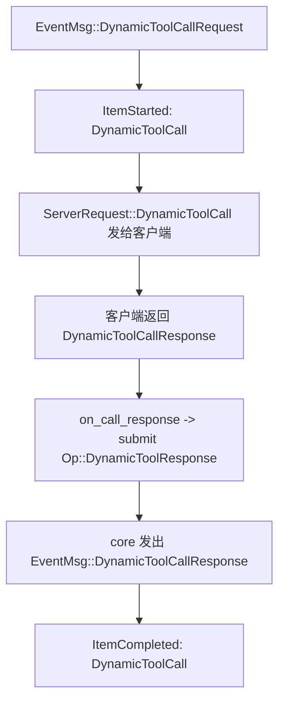

# Codex 卷四 04｜为什么 `DynamicToolCall` 不走 `ServerRequestResolved`

## 先问问题

到第 03 篇为止，我们已经把一个边界压稳了：

> `ServerRequestResolved` 不是“所有 request 完成时都会统一发出的通知”，而是一批 **thread-scoped、V2、interactive request** 的 resolved-notification 语义。

但顺着这条线继续看，很容易立刻遇到下一个疑点：

> 既然 `DynamicToolCall` 看起来也属于 thread-scoped request，为什么它不进入 `ServerRequestResolved` 语义模型，而要通过 item lifecycle 处理？

这个问题之所以容易反复误判，是因为 `DynamicToolCall` 在实现形态上确实很像那批会走 resolved 的 request：

- 它也会通过 `send_request(...)` 发给客户端
- 它也会进入 pending request registry
- 它也能被 replay、也能被 cancel
- 它看起来也挂在某个 thread / turn 下面

如果只看到这些，很自然会得出一个直觉：

> 它是不是只是“还没迁进 `ServerRequestResolved`”的一个缺口？

这篇要做的，就是把这个误判彻底收住。

---

## 先给结论

先把最重要的判断放在前面。

### 结论 1：`DynamicToolCall` 不是“还没迁进去的洞”，而是有意的语义分叉

**`DynamicToolCall` 不走 `ServerRequestResolved`，当前更应该理解成 Codex 的有意设计，而不是高概率遗漏。**

### 结论 2：transport reuse 和 product semantics split 不是一回事

**它在 transport 层复用了 thread-scoped pending request machinery；但在产品语义层，它没有复用 resolved-notification 模型，而是转向了 item lifecycle。**

### 结论 3：它更像 item lifecycle / item stream 语义，而不是 resolved-notification 语义

**`DynamicToolCall` 对外想表达的重点是：某个 tool call 开始了、进行中、完成了，并把结果回写回 thread/turn 的 item 世界；而不是“某个 server request 现在被 resolved 了”。**

### 结论 4：一句最短的话

> **`DynamicToolCall` 是 transport 上的 request，语义上的 item。**

这句话基本就是本文的总拍板。

---

## 先把最容易混的两件事拆开

### 像 request 的地方

- 会通过 `send_request(...)` 发给客户端
- 会进入 pending request registry
- 会被 replay，也会被 cancel

### 不像 resolved request 的地方

- 产品语义更像 item lifecycle，而不是 resolved-notification
- 对外重点是 `ItemStarted / ItemCompleted` 这类 item 世界里的生命周期
- 客户端回包后，结果直接回 core，而不是先转成 `ServerRequestResolved`

先把这组对照记住，整篇就不会一直把 transport reuse 误读成语义归属。

## 一、先把“像 request”这件事和“属于哪套完成语义”分开

这是整篇最关键的阅读姿势。

`DynamicToolCall` 之所以容易让人误判，不是因为它看起来完全不像 request；恰恰相反，**它在发送机制上确实就是 request。**

`outgoing_message.rs` 里可以直接看到：

- `send_request(...)` 会把 request 包装成带 `request_id` 的 `ServerRequest`
- pending callback 会被放进 `request_id_to_callback`
- entry 上还会带 `thread_id`
- `pending_requests_for_thread(...)` 会按 thread 枚举这些挂起 request
- `replay_requests_to_connection_for_thread(...)` 会把它们重放给新连接
- `cancel_requests_for_thread(...)` 会按 thread 统一取消

所以如果问题只是：

> `DynamicToolCall` 是否复用了 thread-scoped request transport machinery？

答案是明确的：**是。**

但这只回答了“它怎么发、怎么等、怎么 replay、怎么 cancel”，并没有回答另一个更重要的问题：

> 它对外到底想把“完成”表达成什么？

而这恰恰是 `ServerRequestResolved` 和 item lifecycle 分叉的地方。

---

## 二、为什么 `ServerRequestResolved` 这套语义不适合直接套在 `DynamicToolCall` 上

先回忆第 03 篇已经建立的判断：

`ServerRequestResolved` 的重点不是“内部 callback 收到了结果”，而是：

> **把某个 request 的完成，变成 thread listener 顺序世界里的一个显式通知。**

`thread_state.rs` 里对 `ThreadListenerCommand::ResolveServerRequest` 的注释写得非常直白：

- 它是“notify the client that the request has been resolved”
- 它必须在 thread listener context 中执行
- 目的是保证 resolved notification 与 request 本身的顺序关系

接着在 `codex_message_processor.rs` 里，`ResolveServerRequest` 会落到 `resolve_pending_server_request(...)`：

- 先拿当前 thread 的 subscribed connections
- 再构造 `ThreadScopedOutgoingMessageSender`
- 然后发 `ServerNotification::ServerRequestResolved(...)`

也就是说，`ServerRequestResolved` 真正表达的是：

> **某个 thread-scoped server request 已经在控制面上被顺序化地“收口”为 resolved。**

这套语义特别适合 approval、elicitation、user input 这一类交互，因为这些交互的核心问题就是：

- 请求有没有发出
- 用户或客户端有没有明确答复
- 系统什么时候可以确认“这次请求已解决”

但 `DynamicToolCall` 的关注点并不是这个。

对动态工具调用来说，控制面真正想让外部观察者看到的是：

- 某个 tool call 开始了
- 它属于哪个 turn、哪个 call_id、哪个 tool
- 它最终成功还是失败
- 它产出了什么 content items
- 它完成后，结果怎样继续回流到模型链路

换句话说，`DynamicToolCall` 的自然观察面，更像一段 **item stream**，而不是一条 **resolved notification**。

---

## 三、源码里真正发生了什么：它从一开始就被投影成 item lifecycle

这一点在 `bespoke_event_handling.rs` 里非常清楚。

### 1. `EventMsg::DynamicToolCallRequest` 先发的是 `ItemStarted`

当 core 发出 `EventMsg::DynamicToolCallRequest(request)` 时，app-server 没有先去安排什么 resolved path。

它做的是：

1. 取出 `call_id`、`turn_id`、`tool`、`arguments`
2. 构造一个 `ThreadItem::DynamicToolCall`
3. 状态标成 `DynamicToolCallStatus::InProgress`
4. 发 `ServerNotification::ItemStarted(...)`
5. 然后才调用 `send_request(ServerRequestPayload::DynamicToolCall(params))`

也就是说，对外第一步不是“这里有一个待 resolved 的 server request”，而是：

> **这里有一个动态工具调用 item 已经开始。**

### 2. 客户端回包后，进入的是 `on_call_response(...)`

`DynamicToolCall` 发出去后，app-server 会拿到一个 receiver，然后 `tokio::spawn` 到 `dynamic_tools::on_call_response(...)`。

这个函数的关键动作是：

1. 等客户端返回 `DynamicToolCallResponse`
2. 解析 response
3. 转成 core 需要的 `CoreDynamicToolResponse`
4. 直接 `conversation.submit(Op::DynamicToolResponse { ... })`

这里最值得注意的不是“它也等回包”，而是：

> **它拿到回包后，直接把结果送回 core 的 dynamic tool response 入口，而不是先转成 `ResolveServerRequest`。**

如果作者认为它的正式完成语义应该是 resolved-notification，那么最自然的写法本应是：

- 客户端回包
- `resolve_server_request_on_thread_listener(...)`
- listener 收到 `ResolveServerRequest`
- `resolve_pending_server_request(...)`
- 发 `serverRequest/resolved`

但这条链在 `DynamicToolCall` 上并不存在。

### 3. `EventMsg::DynamicToolCallResponse` 发的是 `ItemCompleted`

当 core 再次发出 `EventMsg::DynamicToolCallResponse(response)` 时，app-server 做的是另一半 item 收口：

1. 把状态改成 `Completed` 或 `Failed`
2. 把 `content_items`、`success`、`duration_ms` 填回 `ThreadItem::DynamicToolCall`
3. 发 `ServerNotification::ItemCompleted(...)`

所以整个外部协议投影形成的是一条完整闭环：

这条链说明得很清楚：

> **`DynamicToolCall` 的对外完成语义，被设计成 item started / item completed，而不是 request resolved。**

---

## 四、为什么这不是“作者少写了一步”，而更像有意分叉

判断“是不是漏写”，不能只看有没有某个通知，而要看另一套语义是否已经完整闭环。

在 `DynamicToolCall` 这里，另一套语义不仅存在，而且非常完整。

### 1. 它有自己稳定的身份主轴

对 approval 一类 request 来说，外部最关心的是 `request_id` 是否被解决。

但 `DynamicToolCall` 的主身份并不是 `request_id`，而是：

- `call_id`
- `turn_id`
- `tool`

`request_id` 只是它在 transport 层借用 request machinery 时的技术标识；
`call_id` 才是它在产品语义上的主键。

### 2. 它有自己稳定的生命周期事件

它不是只有一个孤立的 request 发出点，而是有完整的生命周期通知：

- `ItemStarted`
- `ServerRequest::DynamicToolCall`
- `DynamicToolCallResponse`
- `ItemCompleted`

这说明“开始”和“结束”都已经有了稳定语义载体。

### 3. 它有自己稳定的回流终点

`dynamic_tools.rs` 里回包后不是做 resolved 发射，而是直接 `submit(Op::DynamicToolResponse { ... })`。

这表示从作者视角看，客户端答复的业务含义是：

> **把 tool result 送回 core，继续完成这次 dynamic tool call 的 item 级生命周期。**

这不是“等待一个 request 被 formally resolved”的读法。

### 4. 测试也在强化这套 item 语义，而不是暗示缺口

`app-server/tests/suite/v2/dynamic_tools.rs` 的测试主线，验证的是：

- 先收到 `ItemStartedNotification`
- 再收到 `ServerRequest::DynamicToolCall`
- 客户端返回 `DynamicToolCallResponse`
- 再收到 `ItemCompletedNotification`
- 后续模型链路拿到 function_call_output

而 `turn_start.rs` 里对于 approval / file change 等 request，则会显式断言：

- `serverRequest/resolved` 必须出现
- 而且它要早于 `turn/completed`

测试作者显然把这两者当成了两套协议契约，而不是一套契约里一个漏掉的分支。

所以更稳的判断不是“它还没接上 resolved”，而是：

> **它本来就没被设计成 resolved-notification 语义。**

---

## 五、白话解释：为什么动态工具调用更适合放进 item lifecycle

如果把这件事说得更白一点，可以这样理解。

### approval 类 request 在问什么？

approval、user input、elicitation 这一类 request，本质上在问：

- 我向客户端发了一个需要回应的问题
- 客户端到底答没答
- 这次交互现在是不是可以正式视为已解决

所以它们天然需要一个“resolved”信号。

### dynamic tool call 在问什么？

dynamic tool call 本质上在问：

- 这个 tool call 开始了没有
- 它正在跑什么工具
- 它返回了什么内容
- 它成功还是失败
- 它完成后有没有把结果送回模型继续推进 turn

这更像是在观察一个“线程内 item”的生命周期。

所以对外最自然的表达不是：

- 某个 request resolved 了

而是：

- 某个 tool call item 开始了
- 某个 tool call item 完成了

这就是为什么它落在 item lifecycle 上，会比落在 `ServerRequestResolved` 上更顺手。

---

## 六、把最容易混淆的地方明确拆开

到这里，可以把最容易绕晕的三个概念重新压成一张边界表。

| 层次 | `DynamicToolCall` 是否使用 | 它表示什么 |
|---|---|---|
| request transport / callback | 是 | 发请求、等回包、挂 pending、可 replay、可 cancel |
| resolved-notification semantics | 否 | 不通过 `ResolveServerRequest` / `ServerRequestResolved` 表达完成 |
| item lifecycle semantics | 是 | 通过 `ItemStarted` / `ItemCompleted` 表达 tool call 生命周期 |

这张表想说明的只有一句话：

> **复用 request 发送机制，不等于必须复用 request 的完成语义。**

也就是本文一开始强调的：

> **transport reuse 和 product semantics split 不是一回事。**

---

## 七、和第 03 篇合起来，request shape 的边界就更稳定了

把第 03 篇和本篇合起来，当前卷四后半的判断可以压成下面这样：

1. `ServerRequestResolved` 覆盖的是一批 **V2、thread-scoped、interactive request** 的 resolved-notification 语义
2. `DynamicToolCall` 虽然也复用了 thread-scoped request transport，但它在语义上是 **semantic split**
3. 这条 split 不是暂存缺口，而是当前设计里很稳定的一条分叉

所以今后再写到这个点，最不该写成的是：

- `DynamicToolCall` 还没有迁移到 `ServerRequestResolved`

更稳的写法应该是：

- `DynamicToolCall` 在 transport 上复用了 pending server request machinery，但在控制面语义上被建模成 dynamic tool call item 的生命周期，因此通过 `ItemStarted` / `ItemCompleted` 暴露完成，而不通过 `ServerRequestResolved` 暴露完成。

---

## 最后收口

现在可以直接回答本文开头的问题。

> 既然 `DynamicToolCall` 看起来也是一类 thread-scoped request，为什么它不进入 `ServerRequestResolved` 语义模型，而要通过 item lifecycle 处理？

答案是：

**因为它虽然借用了 thread-scoped request 的 transport machinery，但 Codex 并没有把它定义成“等待 resolved 的 server request”；Codex 把它定义成 turn 内一个 dynamic tool call item 的生命周期。**

所以它不走 `ServerRequestResolved`，不是因为还没迁进去；而是因为它从产品语义上就更接近：

- `ItemStarted`
- `ItemCompleted`
- item result 回流 core

而不是：

- `ResolveServerRequest`
- `ServerRequestResolved`

一句话拍板：

> **`DynamicToolCall` 不是 resolved 模型的缺口，而是 request transport 与 item semantics 在 Codex 控制面里一次很典型的有意分叉。**
---

## 卷内导航

- 上一篇：[《Codex 卷四 03｜`ServerRequestResolved` 到底覆盖了什么控制面语义》](./2026-04-12-Codex-卷四-03-ServerRequestResolved-到底覆盖了什么控制面语义.md)
- 回到本卷入口：[本卷导读](./index.md)
- 下一篇：[《Codex 卷四 05｜为什么 TUI 越来越像跑在 app-server 之上，而不是直接抓 core》](./2026-04-12-Codex-卷四-05-为什么-TUI-越来越像跑在-app-server-之上.md)

