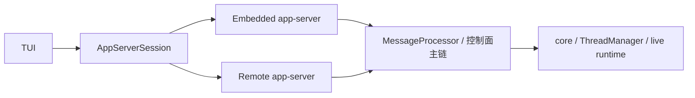
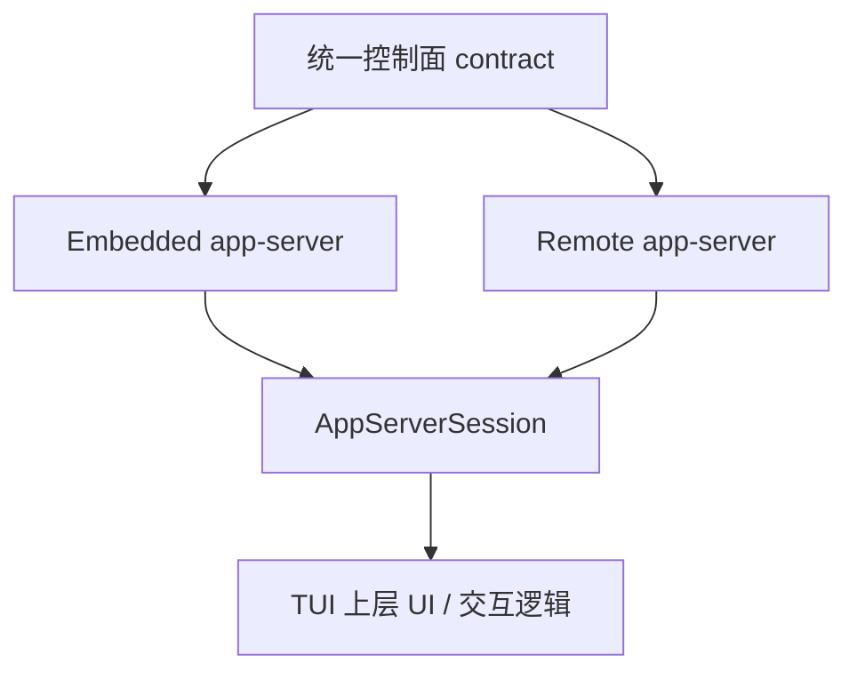
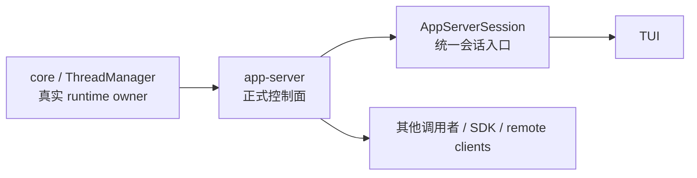

# Codex 卷四 05｜为什么 TUI 越来越像跑在 app-server 之上，而不是直接抓 core

## 先把问题说清楚

卷四前几篇已经把几个边界立住了：

- runtime 的真正持有者更靠近 `core / ThreadManager`
- app-server 不是另一套平行 runtime
- listener、协议投影和状态修正一起把控制面撑起来
- `ServerRequestResolved` 这类语义说明，app-server 对外暴露的已经不是零散 API，而是一套正式控制面

那么最后就会自然冒出一个问题：

> **既然 runtime 在 core，那今天的 Codex 体验为什么越来越表现为 TUI over app-server，而不是 TUI 直接抓 core？**

先给本文结论：

> **TUI 越来越像跑在 app-server 之上，不是因为 app-server 比 core 更底层，而是因为 app-server 更适合作为统一控制面 contract。**
>
> **对 TUI 来说，真正重要的不是“直接碰到最底层对象”，而是拿到一套统一的启动、恢复、订阅、请求、通知和重连接口。**
>
> **embedded app-server、remote app-server、以及 TUI 内部的 `AppServerSession`，本质上都在收敛到同一件事：把不同部署形态压成同一个控制面入口。**

这一篇是卷四收口篇，所以目标不是再开新题，而是把前文的判断压成一个系统结论：

> **Codex 已经长出正式控制面，而不是 UI 直接抓 runtime。**

本文不展开卷四的 unified-exec 细节，只在最后做自然导流。

---

## 一、先区分两个问题：谁拥有 runtime，谁提供统一入口

很多人第一次看 Codex 的分层，会把两个问题混在一起：

1. **哪一层最接近真实 runtime？**
2. **哪一层最适合作为上层产品的统一入口？**

这两个问题不一样。

### 1. runtime owner 仍然更靠近 core

卷四前文已经说明：

- thread 的创建、取回、恢复入口更靠近 `ThreadManager`
- app-server 自己也是围绕 `thread_manager` 工作
- app-server 补出来的主要是连接、订阅、协议投影、resume、replay、状态修正这些控制面能力

所以，**更接近 runtime owner 的是 core，不是 TUI，也不是 app-server。**

### 2. 统一入口却越来越落在 app-server

但对 TUI 来说，日常真正需要的并不是“直接拿到底层 thread 对象”。
TUI 更常需要的是这些事情：

- 启动 thread
- 恢复 thread
- fork thread
- 读取 thread 列表和内容
- 接收 live notification
- 处理 approval / user input / account / plugin / MCP 一类控制面请求
- 在断线后重新接回当前 thread
- 在 embedded 与 remote 之间尽量不改 UI 上层逻辑

把这些能力放在一起看，就会发现：

> **TUI 真正依赖的不是裸 runtime，而是一套完整的控制面接口。**

而 app-server 正好就是这层接口。

所以这一篇最重要的边界判断是：

> **TUI 向 app-server 收敛，描述的是“上层入口收敛”；不是“runtime owner 上移”。**

这两件事必须分开看。

---

## 二、为什么 TUI 不适合长期直接抓 core

如果只看“离底层更近”这一个标准，TUI 直接调用 core 似乎很自然。
但一旦把产品面真正要承担的事放进来，这条路就会越来越重。

### 1. TUI 不只是本地界面，它还要处理会话控制

现代 TUI 不只是把文本画出来。它要承担的是一整套交互会话工作：

- 当前 thread 的生命周期控制
- 当前 turn 的实时更新
- 中途出现的 approval / input / account request
- 错误、重试、恢复、重连
- 历史视图与 live 视图的接续

如果这些都让 TUI 直接面向 core 来拼，TUI 自己就会越来越像半个控制面。

这会带来两个问题：

1. **UI 代码必须直接理解越来越多 runtime 细节**
2. **一旦引入 remote 模式，就要重新补一套网络侧控制面语义**

也就是说，TUI 直接抓 core 的成本，不在“能不能调用”，而在：

> **它会逼着 UI 自己长成控制面。**

这正是系统分层最不想发生的事。

### 2. 直接抓 core，会把 embedded 和 remote 分成两套心智

一旦 TUI 直接碰 core，本地 embedded 形态看起来会很顺；
但远端模式马上会变复杂：

- 本地时可以直接拿对象、直接调函数
- 远端时就必须把这些动作重新包装成 RPC
- 两边的事件流、恢复、请求处理、错误边界都会开始分叉

最后很容易得到两套后端心智：

- 一套是“本地真路径”
- 一套是“远端兼容路径”

而从 TUI 现有抽象看，Codex 正在反过来做：

> **不是让 remote 去模仿 embedded 的内部对象，而是让 embedded 与 remote 共同落到 app-server contract。**

这样 UI 上层拿到的是同一类会话接口，而不是两套完全不同的后端模型。

### 3. 直接抓 core，不利于把“顺序正确性”封装掉

卷四前文讲过，app-server 不是简单转发层。它已经把很多正确性工作收进了控制面：

- listener 作为线程事件泵
- command channel 保证某些动作与 live event 保持顺序
- `ServerRequestResolved` 等通知在 listener 上下文里收口
- thread watch / thread state 把内部状态和对外状态分开维护

这些东西的价值，正是在于：

> **上层不必自己重新理解 thread 顺序、resume/replay 以及 pending request 的组合关系。**

如果 TUI 直接抓 core，那么这些控制面正确性就要重新暴露给 UI，或者被 UI 再实现一遍。

这显然不是一个更干净的长期方向。

---

## 三、TUI 现在为什么会越来越像“跑在 app-server 之上”

从现有代码形态看，最值得注意的变化不是某一个 API，而是整个主链已经越来越稳定地经过 app-server。

可以先把结构压成下面这张图：

这张图想表达的只有一句：

> **TUI 现在更像是 app-server 的客户端，而不是 core 的直接前端。**

### 1. `AppServerSession` 已经在统一主会话面

参考现有笔记可以看到，`AppServerSession` 已经把一批核心动作收进同一会话接口：

- `start_thread`
- `resume_thread`
- `fork_thread`
- `thread_list`
- `thread_read`
- `turn_start`
- `turn_interrupt`
- `turn_steer`

这件事的意义很大。

它说明 TUI 的主执行面，已经不再把“本地直接调 core”当成默认组织方式；
而是把线程与会话控制，逐步压到一套 app-server 风格的接口后面。

### 2. 实时事件消费也已经明显站在 app-server 协议上

前面的源码笔记还显示，TUI 的 live handling 已经大量直接消费：

- server notifications
- server requests

包括 turn、approval、plugin、MCP、account 等控制面能力。

这意味着，TUI 不只是通过 app-server 启线程；它连**实时驱动界面更新的主链**，都已经越来越建立在 app-server protocol 上。

这一步很关键，因为它说明 app-server 在 TUI 里承担的不是一个“启动代理”，而是：

> **真正的 control-plane backend。**

### 3. embedded 与 remote 都是一等路径

从 `AppServerTarget::{Embedded, Remote}` 这类抽象可以看得更清楚。

它表达的不是：

- embedded 才是正式模式
- remote 只是额外补丁

而是：

- embedded 是 app-server contract 的本地形态
- remote 是 app-server contract 的远端形态

也就是说，**差异主要落在 transport placement，而不是上层控制面语义。**

这正是“统一 contract，变动 transport”的典型成熟分层。

---

## 四、embedded app-server、remote app-server、`AppServerSession`，为什么要被压成同一接口意义

这一节是本文的核心。

因为很多读者会把这三者看成三个对象：

- embedded app-server：本地模式
- remote app-server：远端模式
- `AppServerSession`：TUI 里的客户端封装

如果只从部署角度看，它们确实不同；
但从系统设计角度看，它们更重要的共同点是：

> **它们都在服务同一件事：把 TUI 连接到统一控制面。**

### 1. embedded app-server：控制面留在本地进程附近

embedded 形态下：

- transport 更近
- 进程边界更薄
- 连接成本更低

但即使如此，TUI 也没有把“本地所以直接抓 core”当作默认答案。
相反，embedded 依然尽量保留 app-server 语义。

这说明系统真正追求的不是“少一层”，而是：

> **即使同进程，也尽量让上层站在控制面接口上。**

### 2. remote app-server：把同一 contract 放到 websocket 等远端链路上

remote 形态下，现有笔记已经很明确：

- TUI 选择 `AppServerTarget::Remote`
- 通过 `RemoteAppServerClient::connect()` 建链
- 底层走 websocket 上的 JSON-RPC
- server 侧仍然统一汇入 `MessageProcessor`

这说明 remote app-server 不是另一套产品语义，而是：

> **同一控制面 contract 的远端部署变体。**

它改变的是 transport，不是控制面本身。

### 3. `AppServerSession`：把“不同部署形态”压成“同一会话接口”

`AppServerSession` 的价值，恰恰不在于它多么复杂，而在于它把上层最关心的东西固定住了：

- 我怎样开启或接回一个 thread
- 我怎样接收后续通知和请求
- 我怎样向后端发送 turn / thread / control 动作
- 我怎样在 embedded 与 remote 之间切换，而不让 UI 大面积重写

所以更准确的说法不是：

- embedded、remote、session 是三层功能堆叠

而是：

- **embedded 与 remote 是同一控制面的两种放置方式**
- **`AppServerSession` 是 TUI 对这同一控制面的会话化入口**

可以把它们的关系压成下面这张图：

这张图背后的判断是：

> **Codex 不是在为 TUI 准备两个后端，而是在为 TUI 稳定出一个后端 contract。**

---

## 五、为什么说 app-server 更适合作为统一控制面 contract

现在可以回到本文最核心的一句话：

> **TUI 越来越像跑在 app-server 之上，不是因为 app-server 更底层，而是因为它更适合作为统一控制面 contract。**

这里的“更适合”，至少包括五层含义。

### 1. 它天然承接“连接”而不是只承接“调用”

core 更像 runtime 聚合中心；
app-server 更像正式操作面。

对 TUI 来说，重要的不只是“发一个函数调用”，而是：

- 建立会话
- 订阅 thread
- 接收持续事件
- 在断开后重新连回去

这些都是连接型语义，不只是函数型语义。

app-server 正是围绕这类语义组织的。

### 2. 它天然承接“协议投影”而不是只承接“内部对象”

core 里的对象更接近内部运行事实；
而 TUI 真正需要的是：

- 稳定通知
- 稳定请求
- 稳定状态
- 稳定恢复动作

也就是**可供产品面消费的协议化语义**。

这正是 app-server 已经在做的事。

### 3. 它天然承接“本地 / 远端统一”

只要 TUI 的主链站在 app-server contract 上，embedded 和 remote 就能尽量共用：

- 启动路径
- 恢复路径
- 请求处理路径
- live event 消费路径

否则，UI 很快就会被迫维护两套行为模型。

### 4. 它天然承接“重连与恢复正确性”

卷四前文已经证明，app-server 的一大价值在于：

- listener 串起顺序点
- thread state / watch state 负责控制面视图
- pending request replay 和 resume/reconnect 已经进正式主链

这些都说明 app-server 承接的不是薄接口，而是**恢复正确性**。

而这恰好是 TUI 不应该自己扛的一类复杂度。

### 5. 它天然承接“多调用者一致性”

一旦系统不只服务 TUI，还要服务：

- SDK
- remote caller
- 其他客户端或服务形态

就更需要一层统一 contract 来保证：

- 大家看到的是同一套 thread 控制语义
- 大家接收的是同一套 notification / request 形态
- 大家处理的是同一种恢复与重连模型

这也是为什么 app-server 的意义不只是“TUI 后端”，而是：

> **Codex 的正式控制面。**

---

## 六、这并不意味着 TUI 已经 100% 纯 app-server 化

这里要加一个边界，避免把结论说得过头。

现有源码笔记也明确指出，TUI 还保留了一圈 hybrid / legacy 边缘层，例如：

- `legacy_core`
- 一些 config、本地状态、文件系统 helper
- 一部分历史浏览或 startup 相关路径
- 某些尚未完全抽成 RPC 的本地能力

所以，最准确的说法不是：

> **TUI 已经完全脱离 core。**

而是：

> **TUI 的核心 thread/session/live-event 主链，已经明显向 app-server 收敛；仍直接咬 core 的部分，更多是迁移中的边缘 helper。**

这个判断很重要，因为它解释了当前代码为什么看起来有一点“双栈感”：

- 新主链已经站在 app-server 上
- 旧边缘还没有全部吃完

这不是方向摇摆，反而更像成熟迁移的常见形态。

也正因为如此，本文的结论要写得克制一些：

- **不是说 TUI 与 core 没关系了**
- **而是说 TUI 的系统主入口，已经越来越不是“直接抓 core”**

---

## 七、把卷四前文收成一句系统判断

到这里，可以把卷四前文一起收束回来。

### 1. 第 01 篇解决的是“owner 在哪”

第 01 篇说明：

- app-server 虽厚，但不是另一套 runtime
- runtime owner 更靠近 `core / ThreadManager`
- app-server 是建立在 core 之上的 control-plane facade

### 2. 第 02、03、04 篇解决的是“控制面怎么成立”

后面几篇又进一步说明：

- listener task 不是普通监听器，而是线程事件泵和顺序控制点
- 协议投影与状态修正让 runtime 事实变成稳定控制面语义
- `ServerRequestResolved` 和 item lifecycle 这类设计说明，app-server 已经有了自己的正式控制面表达，而不是零散调用集合

### 3. 第 05 篇解决的是“为什么上层会收敛到这里”

因此，第 05 篇真正要落下的不是一句产品感受，而是一句系统判断：

> **因为 app-server 已经长成正式控制面，所以 TUI 才会越来越像跑在 app-server 之上。**

换句话说，TUI 的变化不是单独发生的；
它是卷四前文那些结构判断的自然结果。

如果控制面已经成立，那么上层产品继续直接抓 runtime，反而会变得不经济、不稳定，也不利于 embedded / remote 统一。

所以卷四的最终落点应该是：

> **Codex 已经不再主要依赖“UI 直接驱动 runtime”的形态，而是开始依赖“runtime 在 core，正式控制面在 app-server，上层通过控制面接入”的形态。**

这就是卷四真正收住的地方。

---

## 八、给读者一个最容易记住的最终图景

如果把本文压缩成一张图，最合适的是下面这个：

这张图最想表达的是四句话：

1. **runtime owner 在 core**
2. **正式控制面在 app-server**
3. **TUI 通过 `AppServerSession` 使用这套控制面**
4. **embedded 与 remote 是同一控制面 contract 的不同放置方式**

只要把这四句记住，卷四的主问题就算真正立住了。

---

## 结语：卷四在这里收住，再进入执行会话主线

所以，回答本文标题中的问题：

> **如果 runtime 在 core、控制面在 app-server，那今天的 Codex 体验为什么越来越表现为 TUI over app-server，而不是 TUI 直接抓 core？**

最准确的答案是：

> **因为 Codex 已经长出正式控制面。**
>
> **TUI 需要的不是比 app-server 更底层的对象访问权，而是一套能统一 embedded、remote、resume、replay、notification、server request 的稳定 contract。**
>
> **app-server 提供的正是这套 contract，所以它自然成为 TUI 的主控制面后端。**

卷四到这里可以收成一句话：

> **Codex 的系统形态，已经从“UI 直接抓 runtime”走向“runtime 在 core、控制面在 app-server、上层围绕统一控制面 contract 收敛”。**

如果把整卷再压成最值得记的一句，就是：

> **app-server 的意义，不是替代 core，而是把 core runtime 暴露成一套统一控制面 contract；TUI、SDK 和远端调用者，正在围绕这套 contract 收敛。**

到这里，卷四就该收住。接下来再进入 unified-exec，问题才会自然切到“控制面已经成立之后，执行会话是怎样被真正组织出来的”。
