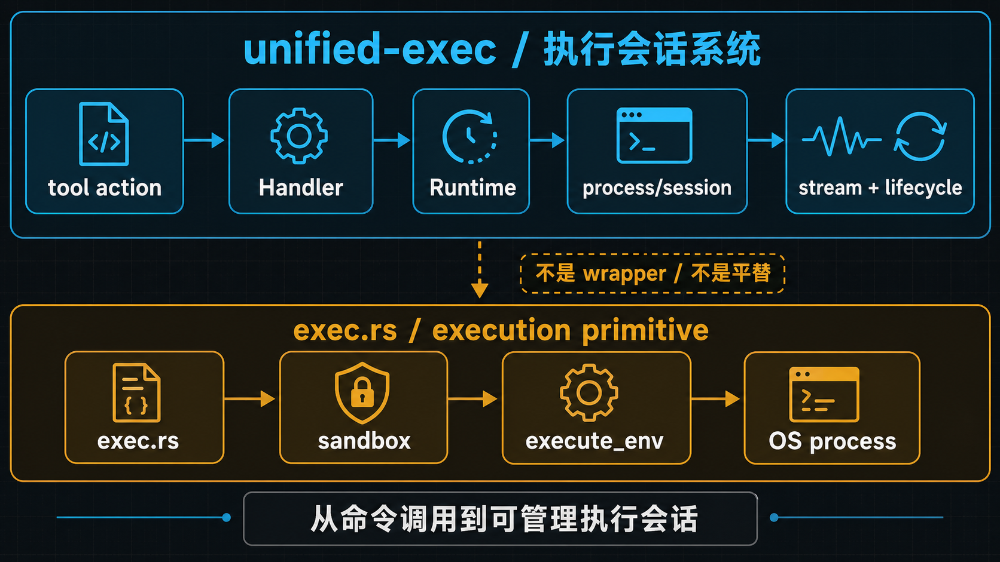
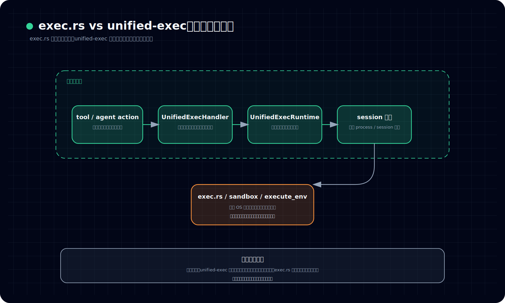
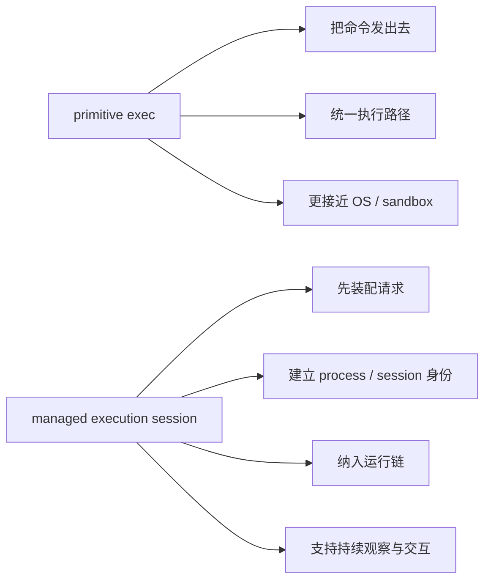

# 为什么 `exec.rs` 和 unified-exec 不是一回事

## 先回答读者最容易问的那个问题

*图：这张图把 exec.rs 与 unified exec 的边界拆开：前者更像一次执行入口，后者则把动作、策略、会话与输出组织成统一执行链路。*

**Codex 不就是执行命令吗？既然源码里已经有 `exec.rs`，那 unified-exec 难道不就是再包一层、更产品化一点的 exec 封装？**

先给结论：

> **不能这么理解。`exec.rs` 更接近执行 primitive，解决的是“命令怎样被真正交给系统执行”；unified-exec 解决的则是“这次执行怎样先被装配成一个正式、可管理、可持续观察的执行会话”。**
>
> 换句话说：
>
> 1. **`exec.rs` 负责执行底盘；**
> 2. **unified-exec 负责把底盘接进 agent 可使用的执行主链；**
> 3. **卷五要讲的重点不是“怎么跑命令”，而是“Codex 怎么把动作组织成执行会话系统”。**

所以这篇的任务很单纯：

> **先把 primitive exec 和 unified-exec subsystem 的层级切开。**

这一步如果不先立住，后面读 handler、runtime、approval、transcript、process store 时，读者很容易一直带着一个错误前提：以为后文讲的都只是“执行命令时顺手加上的外围功能”。

但真实情况正相反：

> **这些东西之所以存在，是因为 Codex 从一开始就不把执行理解成一次性命令调用，而是理解成一条正式运行链。**

---

## 先把几个关键词说白

### `exec.rs`

本文说的 `exec.rs`，可以先把它理解成：

> **更接近 OS 执行面的底层执行原语层。**

它关心的是这类问题：

- 命令要怎样整理成执行请求；
- sandbox 相关参数怎样进入执行路径；
- 最终怎样走到统一的执行环境入口；
- 一次底层执行怎样被真正发出去。

所以它更像执行底盘，而不是完整的产品执行语义。

### unified-exec

本文说的 unified-exec，不是某一个函数，也不是某一个薄薄的 wrapper。它更接近：

> **站在 agent/runtime 视角上，把动作请求组织成正式执行会话的一整套子系统。**

这里的关键词不是“命令”，而是：

- 请求入口；
- 会话身份；
- 策略装配；
- 执行路由；
- 持续交互；
- 流式观察；
- 生命周期管理。

也就是说，unified-exec 处理的对象已经不是一行 shell text，而是一条要被系统接住、推进、收尾的执行会话。

### 执行会话系统

所谓“执行会话系统”，可以先用一句白话记住：

> **不是把命令丢出去就完了，而是先给这次执行建立身份、上下文、控制链和观察面，再让它进入真正的运行。**

这也是卷五要整体提升的视角：

- 不是“执行命令”；
- 而是“管理执行会话”。

---

## 本文只先立住一个总判断：`exec.rs` 是底层执行，unified-exec 是会话化执行子系统

很多误读都来自名字过于相似。

一边叫 `exec`，另一边叫 `unified_exec`，很容易让人以为两者主要差异只是“新旧版本”或“薄厚不同”。

但如果把职责放在一起看，更准确的关系其实是下面这样：

看这张图时，建议按这个顺序读：

- 先看上面从 tool / agent action 到 session / process 管理的链，确认 unified-exec 先把动作请求装成系统对象
- 再看下方 `exec.rs / sandbox / execute_env`，确认它靠近的是执行原语和环境约束，而不是整条执行会话的产品语义
- 最后再看底部总结，确认这篇真正要压住的是“谁更靠近运行链，谁更靠近执行底盘”

这张图最想说明的不是调用顺序，而是**层级落点**：

- **`exec.rs` 靠近真正的执行原语层；**
- **unified-exec 站在它上面，负责把一次动作请求装成系统可管理的执行对象；**
- **两者不是平替关系，而是上下层关系。**

因此，最稳的判断不是“哪个才是真的 exec”，而是：

1. **哪一层更接近真实 OS 执行；**
2. **哪一层更接近模型/tool 请求入口；**
3. **哪一层开始建立 process/session 身份；**
4. **哪一层把执行接进更大的 agent 运行链。**

按这个标准看，边界就很清楚了。

---

## 一、为什么说 `exec.rs` 更像 execution primitive，而不是卷五的主角

`exec.rs` 很重要，但它的重要性主要落在**执行底盘**上。

它更接近这些职责：

- 把命令与参数整理成底层执行请求；
- 统一进入 sandboxing / execute_env 这样的执行路径；
- 处理“这次执行在什么约束下被发出去”这种底层问题。

这里最关键的认识是：

> **`exec.rs` 里的 “unified” 更接近执行通路统一，而不是产品层语义统一。**

也就是说，`exec.rs` 可以统一底层执行路径，但这还不等于 Codex 已经拥有了一套“可被 agent 使用的执行会话系统”。

因为只要还停留在 primitive 这一层，系统真正解决的仍然主要是：

- 怎么执行；
- 怎样过 sandbox；
- 怎样把请求交给环境。

而卷五真正要回答的问题，比这一步更大：

- 这个执行请求是谁发起的；
- 它怎样先被装配成正式会话；
- 会话身份何时建立；
- 为什么执行前就要进入统一控制链；
- 为什么输出要被当成运行中的事件，而不是最后再拼字符串。

这些都已经超出 `exec.rs` 本身的解释范围。

所以卷五第 01 篇必须先把这件事说死：

> **`exec.rs` 是执行底盘，但不是卷五所说的“统一执行子系统”全貌。**

---

## 二、unified-exec 真正新增的，不是“更会执行”，而是“更会把执行组织成系统对象”

如果只从功能表面看，unified-exec 似乎也在做执行，于是很容易得出一句不够准确的话：

> 它只是比 `exec.rs` 多管了一些事情。

问题在于，这里的“多管一些事情”并不是附属增强，而是**对象层级发生了变化**。

在 `exec.rs` 视角里，对象更像是：

- 一次执行请求；
- 一个底层命令；
- 一条进入执行环境的路径。

而在 unified-exec 视角里，对象已经更像是：

- 一个来自工具入口的动作请求；
- 一个要先绑定上下文与身份的 process/session；
- 一条要被系统持续管理的执行链。

可以用一张对照图压缩这个差异：

所以 unified-exec 的价值，不是“替 `exec.rs` 再跑一遍命令”，而是：

> **把原本只能被理解成一次调用的执行动作，提升成一个可被系统管理的正式会话对象。**

这就是“执行命令”和“执行会话系统”之间的真正差别。

---

## 三、为什么 unified-exec 一开始就更像 subsystem，而不是 helper

判断一层是不是 subsystem，最简单的方法不是看文件名，而是看它是不是开始承担这些职责：

- 有没有独立入口；
- 有没有自己的请求装配层；
- 有没有会话身份与生命周期对象；
- 有没有共享管理器；
- 有没有持续交互，而不只是一次返回。

按这个标准看，unified-exec 很明显已经不是普通 helper。

### 1. 它有 tool-facing 入口

`UnifiedExecHandler` 这一层的存在，本身就在说明：

> **系统不是把模型的 tool call 直接下沉到底层 exec，而是先经过一次正式的入口装配。**

这意味着 unified-exec 从一开始就不是 OS API 的别名，而是 agent 入口的一部分。

### 2. 它有 runtime-facing 编排层

继续往下，不是直接 spawn，而是进入 `UnifiedExecRuntime` 这一类 runtime 装配层。

这说明系统要先把执行请求整理成“可被运行时接受的请求”，然后才进入真正的执行路径。

### 3. 它有 session / process manager 心智

当系统开始提前分配 process id、打开 session、支持继续写 stdin、管理会话生命周期时，读者就该立刻切换心智：

> **眼前这套东西管理的已经不是单次命令，而是带身份、可持续推进的执行会话。**

也正因为如此，unified-exec 更准确的位置不是“执行函数集合”，而是：

> **Codex 的统一执行子系统。**

---

## 四、卷五为什么必须先从这里起跑

卷五如果一上来就讲 approval、transcript 或 process store，很容易发生三种误读：

1. 把整卷读成权限专题；
2. 把整卷读成输出流专题；
3. 把整卷读成进程状态管理专题。

这三种读法都不对。

因为 approval、输出流、process store 之所以会一起出现，并不是因为系统给一条普通命令“外挂了很多模块”，而是因为：

> **Codex 先把执行定义成会话系统，这些机制才会自然长出来。**

所以第 01 篇的职责不是多讲细节，而是先建立卷五的视角底座：

- **卷五不是 shell 教程；**
- **卷五也不是 `exec.rs` 函数导读；**
- **卷五真正讨论的是：统一执行子系统怎样把动作变成正式运行链。**

只要这个底座一稳，后面几篇才有正确的阅读顺序：

- 先看执行请求怎样被装成正式会话；
- 再看执行前控制链怎样进入主线；
- 再看输出与终态为什么不是低层附属物。

---

## 五、把这篇收成一句话

读完这篇，最该留下来的不是某个函数名，而是下面这句话：

> **`exec.rs` 解决的是“怎么执行”，unified-exec 解决的是“怎么把执行组织成 Codex 可管理的会话系统”。**

前者更接近 execution primitive，后者更接近 agent-facing、sessionful 的统一执行子系统。

所以从卷五开始，读者的心智必须整体抬高一层：

- 不再把 Codex 理解成“会调用命令的 agent”；
- 而要把它理解成“会把动作装成正式执行会话的系统”。

这也是卷五和前几卷的衔接点：

- 前面几卷已经说明 Codex 不是单函数运行时；
- 到卷五，终于要看到它怎样把“动作”纳入一套正式、可管理、可持续推进的执行面。

---

## 下一篇从哪里接最自然

既然这篇已经把 `exec.rs` 和 unified-exec 的层级切开，下一步最自然的问题就变成：

**既然 unified-exec 不是薄封装，那么一次动作请求到底是怎样被装成“正式执行会话”的？**

所以下一篇会顺着这条线进入：

> **`UnifiedExecHandler` 和 `UnifiedExecRuntime` 是怎么把动作装成执行会话的。**
---

## 卷内导航

- 这是本卷起点，建议先顺着往下读。
- 回到本卷入口：[本卷导读](./index.md)
- 下一篇：[《`UnifiedExecHandler` 和 `UnifiedExecRuntime` 是怎么把动作装成执行会话的》](./2026-04-13-Codex-卷五-02-UnifiedExecHandler-和-UnifiedExecRuntime-是怎么把动作装成执行会话的.md)

