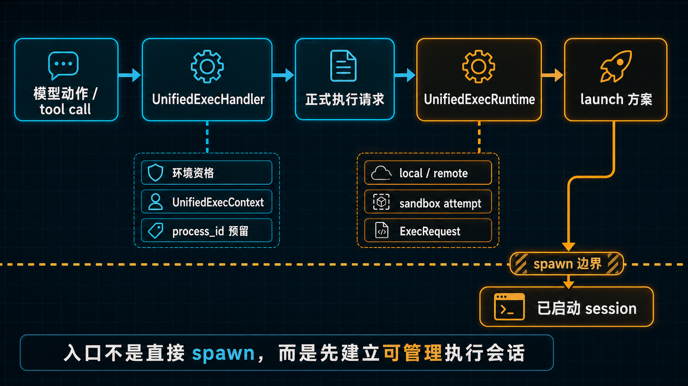
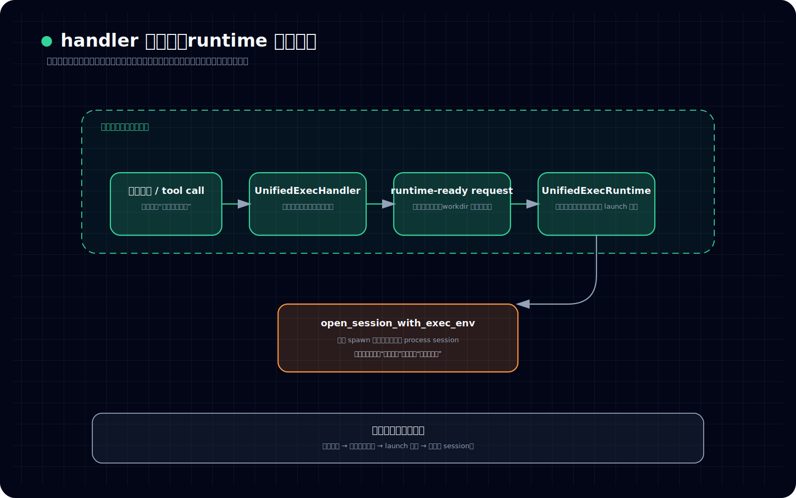
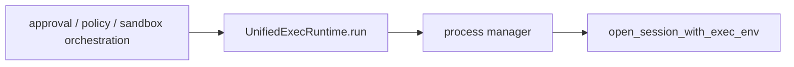
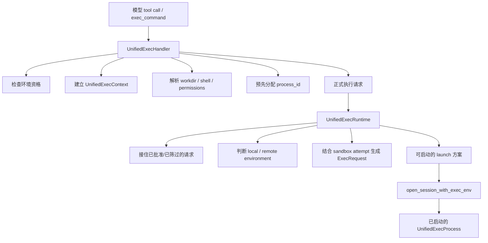

# `UnifiedExecHandler` 和 `UnifiedExecRuntime` 是怎么把动作装成执行会话的

## 读者问题

*图：这张图展示 UnifiedExecHandler 与 UnifiedExecRuntime 如何把一次动作包装成执行会话：先建立上下文，再进入 runtime，最后把输出、状态和结果回写。*

当 Codex 真正执行一个动作时，为什么不是“模型发来一次 `exec_command`，系统立刻去 spawn 一个命令”，而是还要先经过 `UnifiedExecHandler` 和 `UnifiedExecRuntime` 这两层？

换句话说，unified-exec 的入口到底在做什么：

- 它只是把命令转发给底层执行器吗？
- `process_id` 和 session 身份是什么时候正式成立的？
- 为什么从入口看上去像“开始执行”，实际上却还没有直接跑命令？

## 结论

先给结论：

> **`UnifiedExecHandler` 负责把模型侧动作请求装配成一个带身份、带上下文、带前置约束的正式执行入口；`UnifiedExecRuntime` 负责把这份入口请求继续压成当前环境下可真正落地的 launch 方案，并把 approval、policy、environment、sandbox attempt 这些执行前现实条件纳入主链。**

所以 unified-exec 的入口不是“直接跑命令”，而是：

> **先把一个动作，建立成一个可被系统管理、批准、路由和追踪的执行会话。**

这里最关键的判断有三个：

1. **handler 不是执行器，而是入口装配线。**
2. **runtime 不是总控审批器，而是执行前最后一层现实适配器。**
3. **process / session 的身份不是 spawn 之后才补出来的，而是在进入 unified-exec 主链时就开始被正式建立。**

---

## 先把几个术语说白话

### 什么叫 handler
这里的 `UnifiedExecHandler`，可以先把它理解成：

> **工具入口的装配层。**

它面对的是模型发来的 tool call 和参数负载。它的工作不是立刻执行，而是先回答几个更上游的问题：

- 当前 session 有没有执行环境资格？
- 这次调用到底是哪种 unified-exec 动作？
- workdir、shell、权限、额外能力这些前置条件怎么整理？
- 这次执行要拿哪个 `process_id`？

所以 handler 处理的是“把输入整理成可进入执行主链的请求”。

### 什么叫 runtime
这里的 `UnifiedExecRuntime`，可以先把它理解成：

> **执行前最后一公里的落地适配层。**

它拿到的已经不是原始 tool call，而是一份更干净、更正式的执行请求。它要继续回答的是：

- 这次执行面对的是本地环境还是远端环境？
- 当前 shell 需要什么平台化处理？
- 这次 sandbox attempt 要怎样把请求改写成最终的 `ExecRequest`？
- 最后应该走哪条真正的 spawn 路径？

所以 runtime 处理的是“把正式请求压成当前环境下可以启动的具体方案”。

### 什么叫执行会话
这篇里说的“执行会话”，不是玄学词，意思很朴素：

> **这次动作不再只是一个待执行的命令字符串，而是一个已经有身份、有上下文、有后续生命周期的运行对象。**

至少包括三层东西：

- 有可引用的身份：比如 `process_id`
- 有明确所属上下文：比如当前 turn、session、environment
- 有后续可持续管理的可能：比如批准、路由、启动、追踪

这就是为什么 unified-exec 看起来像执行入口，实际上做的是“会话建立”。

---

## 一、先看总分工：handler 建入口，runtime 压实落地

如果只看名字，很多人会把这两层理解成“上层调下层”。这个理解太薄。

更准确的分工应该是：

看这张图时，建议按这个顺序读：

- 先看上面从模型动作到 runtime-ready request 的转换，确认 handler 做的不是薄转发，而是入口装配
- 再看右侧 UnifiedExecRuntime，确认它负责把请求压成当前环境下可落地的 launch 方案
- 最后看下方 `open_session_with_exec_env`，确认跨过 spawn 边界后主语才真正变成“已启动 process session”

这张图里最重要的不是箭头顺序，而是对象变化：

- 进入 handler 前，主语还是“模型动作”
- 离开 handler 后，主语变成“正式执行请求”
- 离开 runtime 后，主语变成“具体 launch 方案”
- 跨过 `open_session_with_exec_env(...)` 后，主语才真正变成“已启动的 process session”

所以这篇必须先立住一个判断：

> **unified-exec 的入口并不等于命令已经开始运行；它首先在完成动作到执行会话的形态转换。**

---

## 二、`UnifiedExecHandler` 为什么不是薄转发，而是入口装配线

### 1. 它先确认的不是命令内容，而是“这次调用有没有资格进入执行面”

`UnifiedExecHandler::handle(...)` 一开始先看 payload 形态，也先看 `turn.environment` 是否存在。这里的信号很明确：

> **在 Codex 里，unified-exec 不是任何 session 都天然可用的。**

也就是说，handler 最先确认的不是“你想跑什么命令”，而是：

- 当前是不是正确的工具调用形态
- 当前 turn 有没有执行环境
- 这次请求能不能进入 unified-exec 主链

这已经说明它不是 shell wrapper。shell wrapper 一般假设“输入到了这里，就该执行”；但 unified-exec 的 handler 先判定“你能不能成为执行请求”。

### 2. 它先造上下文，而不是直接把参数往下丢

接下来 handler 会把 session、turn、call_id 等材料装进 `UnifiedExecContext`。

这一层很重要，因为它说明 unified-exec 不是“参数函数式传递”，而是：

> **后续整条执行链，都围绕一个正式上下文继续推进。**

这意味着后面的 process 身份、权限处理、环境选择，都不是孤立函数的副作用，而是有归属地挂在统一 context 上。

### 3. 它真正做的是“请求装配”，不是“命令执行”

当 tool call 进入 `exec_command` 分支时，handler 实际上会串起一整段前置动作：

- 解析参数
- 解析逻辑 workdir
- 处理 shell 相关命令形态
- 记录隐式 skill invocation
- 向 manager 申请 `process_id`
- 整理 permission / additional permissions
- 处理特例分流，比如 `apply_patch`
- 最后才构造真正要交下去的执行请求

也就是说，交给后续 runtime 的，已经不是原始模型输入，而是一个 **runtime-ready request**。

这一步的本质可以压成一句话：

> **handler 负责把“模型说要做一件动作”翻译成“系统承认的一次执行会话入口”。**

---

## 三、process / session 身份是在 handler 这里开始正式建立的

这是本篇最该让读者记住的地方。

很多人下意识会觉得：进程身份应该等到底层 spawn 成功后才出现。但 unified-exec 不是这么设计的。

### 1. `process_id` 是执行前先申请的，不是执行后再回填的

handler 在真正向下推进前，就会先向 manager 申请 `process_id`。这意味着：

- 这次执行在真正启动前，就已经拿到了一个系统内可引用的身份
- 后续 approval、路由、stdin 续写、状态引用，都可以围绕这个 id 展开
- 即便这次请求最后没能成功启动，系统也已经把它当作一次正式会话尝试来处理

这和“一条命令跑完返回 pid”完全不是同一种心智。

这里的关键信号是：

> **unified-exec 先预留会话身份，再推进执行链。**

### 2. 身份的建立不只是一串 id，而是“可以进入统一生命周期”的资格

`process_id` 重要，但更重要的是它背后的设计姿态：

- 这次动作已经可以被引用
- 这次动作已经可以被批准或拒绝
- 这次动作已经可以被路由到不同环境
- 这次动作已经准备好跨进 spawn 边界

所以这里建立的不只是编号，而是：

> **一个正式执行对象的系统身份。**

### 3. 这就是为什么 unified-exec 入口不等于“直接跑命令”

如果入口只是“直接跑命令”，那最自然的设计应该是：

- 参数到了
- 底层立即 spawn
- 成功后再把 pid 和结果回传

但 Codex 选择的是另一条路：

- 先建立上下文
- 先建立 process 身份
- 先整理权限与前置条件
- 再把请求交给后续 runtime 继续压实

这说明系统关心的主语不是命令，而是：

> **一个即将被启动、并且要被统一管理的执行会话。**

---

## 四、`UnifiedExecRuntime` 负责的不是“批准”，而是把请求压成现实世界里的 launch 方案

到了 `UnifiedExecRuntime::run(...)`，读者最容易误解成两种极端：

- 要么把它看成“终于真正执行了”
- 要么把它看成“就是继续转发给 process manager”

这两种都不准确。

### 1. 它的位置在 orchestrator 和 process manager 中间

更准确地说，它处在这样一个位置：

这意味着：

- 上层决定这次执行是否能进入下一步、当前尝试的 sandbox attempt 是什么
- runtime 负责把这份已被认可的请求，变成当前环境下可真的启动的方案
- process manager 再负责跨过真正的 spawn 边界

所以 runtime 的准确角色不是审批器，也不是最终启动器，而是：

> **执行前最后一层现实适配器。**

### 2. 它先看的常常不是“命令”，而是“环境”

`UnifiedExecRuntime::run(...)` 一上来就会判断 environment 是 local 还是 remote。这个顺序很能说明问题。

系统最先处理的现实约束不是“你想跑什么”，而是：

- 你到底在哪种执行环境里跑
- 本地 shell 体验相关的包装要不要做
- 某些 backend 是否可用
- 最终 spawn 应该交给谁

这说明 runtime 真正在做的是：

> **把抽象请求放回真实执行世界，看它应该以什么形态落地。**

### 3. 它统一吃的是“执行请求”，而不是原始 tool call

无论后面走的是：

- 本地路径
- 远端路径
- zsh-fork 机会主义路径
- 常规 direct execution 路径

runtime 处理的主语始终是一份统一的执行请求模型。也正因为如此，它才能把 environment、shell、sandbox attempt 这些现实差异压进同一层适配逻辑里。

所以 runtime 的价值不在于多做了一次函数调用，而在于：

> **它把“已被系统接受的动作请求”压缩成“此时此地可执行的具体方案”。**

---

## 五、approval / sandbox / policy 为什么已经在这条链上，而不是在外面兜一圈

这篇不展开 approval 细节，但必须把边界立住。

### 1. handler 里已经开始做权限前置整理

在 handler 阶段，sticky permissions、额外权限合法性、approval policy 允许与否等前置判断就已经开始进入请求装配。也就是说：

- 权限不是执行后补处理
- 权限不是纯外围标签
- 权限会直接影响这份请求能不能成立、能以什么形态成立

### 2. runtime 吃到的已经是带有这些前提的正式请求

runtime 接到的不是“随便一条命令”，而是已经带着：

- 被整理过的 permission 形态
- 当前 environment 约束
- 具体 sandbox attempt
- 上层 orchestration 结果

这说明 approval / policy / sandbox 不是主链外面的安保站，而是：

> **执行请求本体的一部分。**

### 3. 所以 unified-exec 入口不等于直接 spawn

真正的命令启动，是在这些执行前条件被纳入主链之后才发生的。换句话说：

- unified-exec 的入口，先建立“能不能执行、以什么条件执行、要在哪执行”的正式语义
- 真正 spawn，只是这套语义最后跨过系统边界的一步

这就是为什么你不能把 unified-exec 理解成一个厚一点的 shell wrapper。

---

## 六、从 runtime 到 `open_session_with_exec_env(...)`：真正的 spawn 边界还在后面

为了避免读者把 runtime 误读成“已经跑起来了”，这里要再切一刀。

### 1. runtime 结束时，得到的是 launch 方案，不是最终进程对象

runtime 会把请求整理成当前环境下可落地的 `ExecRequest`，并把它交给 process manager。到这一步，系统才算走到真正的 spawn 边界门口。

### 2. 真正跨过去的是 `open_session_with_exec_env(...)`

这一层才会：

- 统一检查 command line 是否成立
- 根据 local / remote 分支决定怎么启动
- 处理 inherited FDs 等 spawn-time 资源问题
- 返回统一的 `UnifiedExecProcess`

也就是说：

> **runtime 负责把请求送到“可以启动”的状态；`open_session_with_exec_env(...)` 才负责把它跨成“已启动的 session”。**

### 3. 这进一步证明 unified-exec 入口不等于执行动作本身

如果连 runtime 后面都还有明确的 spawn 边界适配器，那就更能看出：

- handler 不是直接执行
- runtime 也不是单纯“调用子进程”
- unified-exec 的前半段主线，是在把动作装成正式执行会话

这正是卷五要立住的心智：

> **Codex 不是收到命令就跑，而是先把动作组织成系统内可管理的执行对象。**

---

## 七、把两层职责压成一张读图

如果把这一篇只留一张结构图，我会留这张：

这张图对应三层结论：

### 第一层：handler 的关键词是“装配”
它负责把模型动作翻译成正式入口请求，并在这里开始建立 process / session 身份。

### 第二层：runtime 的关键词是“适配”
它负责把正式请求变成当前环境里可启动的具体方案。

### 第三层：spawn 边界在更后面
真正启动成 process session，还要跨过 `open_session_with_exec_env(...)` 这道边界。

---

## 收口：unified-exec 的入口，首先是在建立“可管理执行会话”

现在可以把本篇收成一句更稳的话：

> **`UnifiedExecHandler` 和 `UnifiedExecRuntime` 的组合，不是在把命令尽快丢给系统执行，而是在把一次动作请求正式建立成一个有身份、有上下文、能接入执行前控制链、并最终可跨入 spawn 边界的执行会话。**

所以当我们说 unified-exec 是一个子系统，而不是普通执行封装时，本篇给出的证据就是：

- handler 先做入口装配
- process 身份先于真正 spawn 被建立
- runtime 再做执行前最后一公里适配
- 真正的启动边界还在 `open_session_with_exec_env(...)` 之后

这套分层让 Codex 处理的主语，从一开始就不是“命令字符串”，而是“可被系统管理的执行会话”。

下一篇要继续回答的就是：

> **为什么 approval、sandbox、policy 不是执行外围，而是在真正执行前就进入 unified-exec 的主链。**
---

## 卷内导航

- 上一篇：[《为什么 `exec.rs` 和 unified-exec 不是一回事》](./2026-04-13-Codex-卷五-01-为什么-exec-rs-和-unified-exec-不是一回事.md)
- 回到本卷入口：[本卷导读](./index.md)
- 下一篇：[《为什么 approval、sandbox、policy 不是执行外围，而是在执行前就进入主链》](./2026-04-13-Codex-卷五-03-为什么-approval-sandbox-policy-不是执行外围而是在执行前就进入主链.md)

