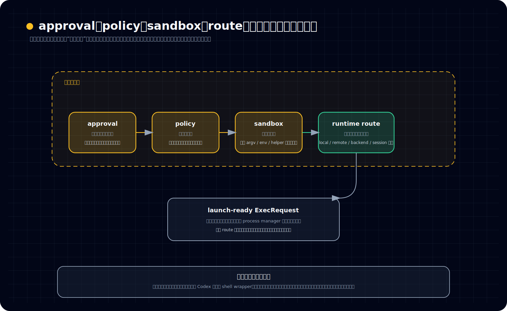

# 为什么 approval、sandbox、policy 不是执行外围，而是在执行前就进入主链

## 读者问题

很多人第一次看 Codex 的执行层，都会自然地这么理解：

- tool call 先变成命令
- 命令先跑起来
- approval、sandbox、policy 只是外面再包一圈检查

于是就会得到一个很常见的印象：**执行是执行，安全是安全，路由是路由；前者是主干，后两者只是外围。**

但如果这样理解 unified-exec，后面几乎所有设计都会读歪。

真正的问题不是“Codex 执行前会不会做检查”，而是：

> **为什么在 Codex 里，approval、sandbox、policy、runtime route 这些东西，不是命令跑起来之后的附属判断，而是在真正 spawn 之前就已经进入统一执行主链？**

## 结论

结论先立住：

> **在 Codex 里，执行不是“先把命令跑起来，再补一层安全外壳”，而是“先把 approval / sandbox / policy / runtime route 纳入统一控制链，再决定这次执行究竟能否成立、该在哪儿成立、该以什么形态成立”。**

所以 approval、sandbox、policy 不是 unified-exec 的外围附件，而是 unified-exec 之所以成为“统一执行子系统”的本体组成。

也正因为如此，`UnifiedExecRuntime` 的价值不只是“帮你调一下底层 exec”，而是把下面几件事合并进同一条执行前主链：

- 这次动作是否允许直接做
- 这次动作是否需要 approval
- 从规则上是否可做、可联网、可走哪些前缀
- 这次执行要套什么 sandbox 约束
- 这次请求最终应该走本地还是远端环境
- 最后才是把它适配成真正可启动的 `ExecRequest` 与 process session

一句话说，**Codex 不是先有一个裸执行，再给它外挂限制；而是从执行链一开始，就把“怎么被允许地执行”写进执行本身。**

## 首次术语白话解释

先把这几个词压成读者能直接拿来用的白话版本。

### approval 是什么

approval 可以先理解成：

> **这次动作要不要先过一道“允许你做”的门。**

它关心的不是系统技术上能不能跑，而是这次动作在当前模式下，是否必须先得到确认，或者是否可以直接放行。

所以 approval 不是执行后的审计，也不是命令失败后的补救；它是执行前的动作门禁。

### sandbox 是什么

sandbox 可以先理解成：

> **即使允许你执行，也不是让你裸奔，而是指定你在哪种受限环境里执行。**

它关心的是执行环境边界，比如文件系统、网络、命名空间、代理路由之类的现实约束。

所以 sandbox 不是一句“请小心运行”，而是真正决定这次进程如何被装进特定环境。

### policy 是什么

policy 可以先理解成：

> **在正式执行之前，系统先按规则判断：这类命令、这个前缀、这类联网行为，到底算允许、拒绝，还是需要额外处理。**

它不是环境实现，也不是用户确认本身，而是规则评估层。

如果把 sandbox 看成“你在哪种笼子里跑”，那 policy 更像“这类动作按规则允不允许你尝试”。

### runtime route 是什么

runtime route 可以先理解成：

> **这次已经被认可的执行请求，最后应该走哪条真实运行路线。**

它不只是“调用哪个函数”，而是包括：

- 本地还是远端环境
- 是否要先做 shell 形态调整
- 采用哪种 sandbox attempt
- 最终把请求交给哪种 spawn backend

也就是说，route 不是执行后的物流，而是执行成立前的一部分决策。

## 分层：为什么这四件事必须在执行前合流

看这张图时，建议按这个顺序读：

- 先看上面四层从 approval 到 runtime route 的合流，确认它们不是执行外围挂件
- 再看下方 launch-ready `ExecRequest`，确认这些判断最后都会落到真实启动方案上
- 最后看底部一句话收口，把“shell wrapper 心智”压掉，改成“执行请求成立条件”心智

### 第一层：如果把它们当外围检查，你会把 Codex 误读成 shell wrapper

普通 shell wrapper 的思路通常是：

1. 收到命令
2. 直接执行
3. 失败了再处理
4. 或者在执行前顺手加一点外部检查

这种模型里，执行本体是稳定的，检查只是挂件。

但 Codex 的 unified-exec 不是这样。

它真正想管理的对象，不是“一次命令调用”，而是：

> **一个可以被批准、可以被约束、可以被路由、最后还能被会话化管理的执行请求。**

一旦对象变成“执行会话请求”，approval、sandbox、policy 就不可能再被当成边上的小插件。因为这几个判断会直接改写请求本身：

- 有的请求根本不能进入 spawn
- 有的请求必须先等 approval
- 有的请求要改成受限网络/文件系统约束
- 有的请求要被送到另一条 execution environment 路线

所以它们不是在“执行外面做点事”，而是在决定**这次执行到底成不成立，以及以什么执行形态成立**。

### 第二层：approval 不是“执行之后再问”，而是执行前门禁

从职责上看，approval 管的是“要不要先确认”。这件事一旦成立，它就天然必须位于 spawn 之前。

原因很简单：

- 如果命令已经跑起来，再去问要不要批准，那批准就失去意义了
- 如果副作用已经发生，再去做 approval，那就不是门禁，而是事后解释
- 如果流程允许先执行再确认，那么所谓 approval 只是 UI 提示，不是系统边界

Codex 恰恰不是把 approval 当提示，而是把它当真正的动作门。

因此更准确的理解是：

> **approval 的存在，不是在执行链旁边提醒一下，而是在告诉 unified-exec：这次请求目前还不能进入最终 launch 形态。**

也正因为如此，`UnifiedExecRuntime` 读起来才不像一个单纯 executor，而更像把“这次动作是否具备执行资格”纳入主链的执行控制层。

### 第三层：policy 不是附加说明，而是“这次请求能否成立”的规则解释器

很多人会把 policy 理解成配置文件，或者把它想成“命令跑起来之后用来记日志的规则背景”。这也偏了。

在 Codex 里，policy 关心的是执行前的规则判定，例如：

- 某类命令前缀是否允许
- 这次联网行为是否允许
- 当前限制下是否只能走特定方式
- 规则冲突时该合并还是回退

这意味着 policy 的输出不是一段注释，而是会改写执行分支的结构化结果。

换句话说，policy 并不只是回答“系统偏好怎样做”，而是在回答：

> **这次请求从规则上还能不能继续往下走。**

所以它不可能被放到 spawn 之后。因为一旦已经进入进程创建，policy 就只能退化为审计说明，无法再作为控制链的一部分。

### 第四层：sandbox 不是布尔开关，而是会进入真实 `ExecRequest` 的环境塑形器

sandbox 最容易被低估成一句话：运行时套个沙箱。

但从分层上看，sandbox 不是“执行成功后再包一层容器”，而是要在进程真正启动前，把请求变成某种受约束的 launch 方案。

这也是为什么高层会先决定：

- 是否必须要求平台 sandbox
- 当前 sandbox attempt 是什么
- 是否允许某些附加权限
- 代理网络要不要改写与桥接

然后下层才把结构化信息变成真实可启动的 `ExecRequest`。

这一点很关键：

> **sandbox 真正作用的位置，不是在进程已经启动以后，而是在“要以什么 argv / env / route / helper 形态启动”这一刻。**

尤其在 Linux 路径里，真正的隔离落地涉及 bwrap、seccomp、`no_new_privs`、代理桥接等现实机制。它们都说明 sandbox 不是抽象标签，而是会实际进入启动方案的环境层塑形。

因此，sandbox 如果不在执行前主链，就根本没有机会成为真实的执行边界。

### 第五层：runtime route 的作用，是把“已被允许的请求”送进正确世界

前面三层回答的是：

- 能不能做
- 要不要先批
- 应该受什么约束

但统一执行还要再回答一层现实问题：

> **这次请求最后应该在哪个环境、通过哪条 backend、以哪种 session 形式启动？**

这就是 runtime route 的价值。

从 `UnifiedExecRuntime::run(...)` 这一层可以看得很清楚：它不是主要做政策判断，而是在更高层 approval / sandbox orchestration 之后，把一个已经筛过的请求继续压成当前环境里可落地的 launch 方案。

这里最值得读者记住的是：

- 它先看 environment 是 local 还是 remote
- 本地路径才会考虑 shell snapshot wrapping 一类本地 UX 适配
- 远端路径不会硬塞这些本地逻辑
- 不同 sandbox attempt 会被整理成不同 `ExecRequest`
- 最后再交给 process manager 跨过真正的 spawn 边界

所以 route 不是执行完后的统计标签，而是执行前最后一公里的现实分流。

如果没有这一层，approval / policy / sandbox 即使做了判断，也还没有真正落到“这次进程到底怎样被启动”。

## 机制：执行前主链到底是怎么成立的

把整条链压缩一下，读者会更容易建立稳定心智。

### 1. 动作先被装配成统一执行请求，不是直接 spawn

统一执行入口的关键，不是“收到 tool call 就开进程”，而是先把动作参数装成一个正式请求。

这一步一旦成立，后面的 approval、policy、sandbox 就有了可以被持续处理的对象。也就是说，系统处理的已经不是一句命令文本，而是一个带上下文、带环境、带目标行为的执行请求。

### 2. 批准与规则判断先决定请求是否有资格继续前进

请求进入主链后，系统先要判断：

- 当前模式下是否需要 approval
- 规则上是可允许、需确认，还是直接拒绝
- 有无可复用的批准结果

这一步的作用不是给执行加注释，而是决定请求能否继续向 launch 方案推进。

### 3. sandbox attempt 把“允许执行”继续细化成“允许怎么执行”

即使请求已经被允许，也还没结束。

系统还要继续回答：

- 用什么 sandbox 模式
- 文件系统与网络限制怎么落地
- 是否需要平台 helper
- 代理/network 路径如何改写

所以这里不是从“禁止/允许”一下跳到“直接跑”，而是中间还有一层“受约束地跑”的形态整理。

### 4. runtime 再把请求压成当前环境下可启动的 launch 方案

到这一步，`UnifiedExecRuntime::run(...)` 的角色就清楚了：

- 它不是批准机关
- 也不是底层具体 spawn 实现
- 它是把已经过审、已选定 attempt 的请求，翻译成当前 execution environment 下真正可启动的方案

这也是为什么它是 unified-exec 的最后适配层，而不是一个简单的执行函数。

### 5. process manager 才跨过真正的 spawn 边界

再往下，`open_session_with_exec_env(...)` 才会把准备好的 `ExecRequest` 跨过本地/远端差异，变成真正的 process session。

这一步进一步说明：

- approval / policy / sandbox 已经在它之前完成了主链角色
- spawn 边界处理的是“如何启动”
- 而不是回头再决定“是否允许启动”

也就是说，**权限性判断与环境性塑形，不是 spawn 之后的附加逻辑，而是 spawn 之前就已经写进请求命运的控制链。**

## 为什么这种设计比“先执行再处理”更像一个统一执行子系统

### 不是为了显得更安全，而是为了让系统对象保持一致

如果采用“先执行再处理”的模型，系统内部会同时出现两种对象：

- 一个已经跑起来的裸进程
- 一套外部再去补做的批准/限制/路由逻辑

这样会立刻带来对象分裂：

- 谁才是真正的执行主体？
- 哪个层级对副作用负责？
- 哪条链才是权威的执行语义？

Codex 选择的做法，是从一开始就只承认一种对象：

> **被统一控制链处理过、因此可以正式进入会话化执行的请求。**

这样后面的 session、transcript、end event、process store 才能建立在同一条主语义轨上。

### 不是把安全抬高，而是把执行定义得更完整

把 approval、sandbox、policy 写进主链，真正改变的不是“安全等级”，而是“什么叫一次执行”。

在 Codex 里，一次执行不等于：

- 用户给一句命令
- 系统把它跑掉

而更接近：

- 一个动作请求被装配
- 被批准与规则系统判定
- 被选择合适的 sandbox 与 route
- 被启动成正式 process session
- 再被持续观察与收尾

所以统一执行的“统一”，不是把命令接口统一，而是把**执行成立前的控制条件**统一进同一条运行链。

## 收口

这一篇最该留下来的判断是：

> **approval、sandbox、policy、runtime route 之所以不是执行外围，不是因为它们很重要，而是因为它们直接决定了一次执行是否成立、如何成立、在哪个环境里成立。**

也因此，unified-exec 不是“底层 exec 外面再包一层限制”，而是把执行前控制链本身做成了执行子系统的一部分。

这一步一旦立住，后面很多现象就不再奇怪：

- 为什么 Codex 不是 shell wrapper
- 为什么执行请求要先会话化、再进入 launch
- 为什么输出不会直接被当成最终字符串
- 为什么 process store 也不是唯一真相源

因为从这里开始，Codex 管的已经不是“一次命令调用”，而是**一条被批准、被约束、被路由后才成立的执行会话主链**。

下一篇要继续回答的是：

> **为什么 transcript / delta 不是附属日志，而是 unified-exec 的主语义轨。**
---

## 卷内导航

- 上一篇：[《`UnifiedExecHandler` 和 `UnifiedExecRuntime` 是怎么把动作装成执行会话的》](./2026-04-13-Codex-卷五-02-UnifiedExecHandler-和-UnifiedExecRuntime-是怎么把动作装成执行会话的.md)
- 回到本卷入口：[本卷导读](./index.md)
- 下一篇：[《输出为什么先进入 transcript，而不是直接变成“最终结果”》](./2026-04-13-Codex-卷五-04-输出为什么先进入-transcript-而不是直接变成最终结果.md)

