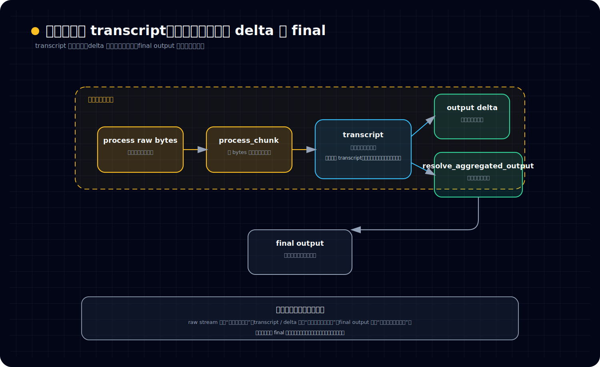
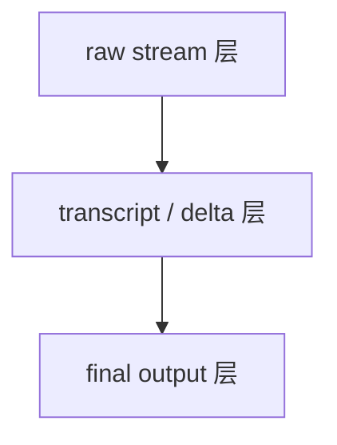
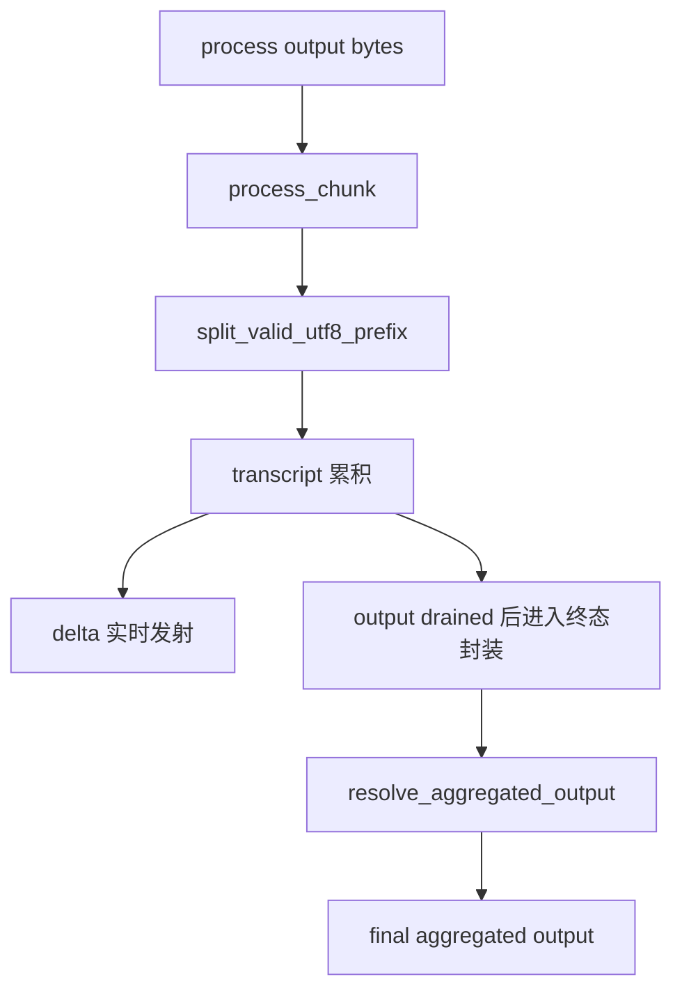

# 输出为什么先进入 transcript，而不是直接变成“最终结果”

## 读者问题

很多人第一次看 unified-exec 的输出链，直觉都会很简单：

- 进程跑起来
- stdout / stderr 持续冒出来
- 命令结束后把这些内容拼起来
- 最后返回一个“结果字符串”

如果是这样，`transcript` 看起来就像一层顺手记下来的日志；流式 delta 也像只是 UI 为了“边打边显示”加的体验增强。

但 Codex 这里不是这个模型。

真正的问题是：

> **为什么 unified-exec 不把输出直接理解成“命令完成后的一段最终文本”，而是先把输出送进 transcript、delta 流和 aggregated output 这条链？**

以及再往下追两步：

- `process_chunk(...)` 这种小函数为什么会变得这么关键？
- 为什么连 UTF-8 边界都要单独守？
- 为什么最终结果还要再经过一次 `resolve_aggregated_output(...)` 才成立？

## 结论

先把结论立住：

> **在 unified-exec 里，输出首先不是“结果字符串”，而是一条正在发生的执行事件流。只有先进入 transcript，这些输出才会从原始进程字节，变成系统可持续观察、可协议化发射、可统一收尾的执行语义材料。**

所以这里有三个必须分开的层次：

1. **raw stream**：进程吐出来的原始字节流。
2. **transcript / delta**：系统把这条流整理成可持续观察的语义轨。
3. **final output**：执行收尾时，对外给出的最终文本视图。

真正重要的判断是：

- **transcript 不是附属日志，而是 unified-exec 的主语义轨。**
- **流式输出和最终结果不是同一层东西。**
- **最终结果不是预先存在的对象，而是收尾阶段对 transcript 的再裁决。**

换句话说，Codex 不是“先有最终结果，再顺手流式显示”；而是**先有流中的语义轨，最终结果只是这条语义轨在收尾时的一个投影**。

---

## 首次术语白话解释

### transcript 是什么

这里的 `transcript`，先不要把它理解成普通日志文件。

更贴近源码角色的白话是：

> **一条对外可见、对内也可继续被 runtime 理解的执行语义记录。**

它记的不是“底层某次 read 拿到了哪些 bytes”这种纯 IO 事实，而是已经被整理成可展示、可继续封装、可参与终态输出判断的内容。

所以 transcript 的位置更像：

- 一边接 raw output
- 一边向上游提供可消费的执行语义

它不是边角料，而是主干。

### delta 是什么

`ExecCommandOutputDelta` 这一类 delta，可以先把它理解成：

> **从 transcript 里切出来、面向实时观察的一小段增量事件。**

它服务的是“现在就让上层看见一部分内容”。

但要注意，delta 不是 output 的全部真相。因为实时发射会受事件预算、节流和 watcher 状态影响；**delta 更像实时播报，transcript 才像持续积累下来的正式正文。**

### aggregated output 是什么

`aggregated output` 可以先理解成：

> **执行结束时，对外给出的最终文本视图。**

它是终态 payload 里的“最后你把这次输出当成什么文本来交付”。

但它不是原始输出的天然本体，也不是一开始就在那里等着被读取的桶。它是执行收尾时，系统根据 transcript 和 fallback 规则做出的最终裁决结果。

### `process_chunk(...)` 是什么

`process_chunk(...)` 不是简单的 append 函数。

更准确的白话是：

> **它是把原始输出字节切成 transcript 片段和实时 delta 的小型转译器。**

从它开始，输出不再只是 bytes，而开始进入 unified-exec 的协议语义层。

---

## 一、先立住主判断：transcript 不是日志，而是输出的主语义轨

如果把 transcript 当日志，整条链会被读歪。

“日志”这个词默认暗示一件事：

- 主要事情已经在别处发生
- 日志只是旁边记一份
- 没有日志，主功能仍然成立

但 unified-exec 不是这样。

从输出链的安排看，系统真正关心的是：

- 输出如何持续被观察
- 输出如何以文本语义稳定进入上层协议
- 输出如何在结束时形成统一终态

而这三件事，都不是靠“最后拼字符串”完成的，而是靠 transcript 这条中间语义轨完成的。

可以先把整个模型压成一张图：

看这张图时，建议按这个顺序读：

- 先看左到中的 `raw bytes → process_chunk → transcript`，确认输出真正跨进系统语义层的地方在哪里
- 再看右上 `output delta` 和右中 `resolve_aggregated_output`，确认“进行中观察”和“收尾裁决”为什么不是一层对象
- 最后看底部三层总结，把 raw stream、transcript / delta、final output 这三层彻底拆开

这张图最关键的不是节点多少，而是谁是中轴：

- raw bytes 不能直接拿来当最终结果
- delta 只是实时增量发射
- final output 也不是直接从 raw bytes 拼出来
- **真正贯穿中段的是 transcript**

所以更准确的理解应该是：

> **在 unified-exec 里，输出一旦进入系统，就优先被组织成 transcript；只有成为 transcript 的一部分，它才真正进入 Codex 的执行语义世界。**

这也是为什么第 04 篇必须把 transcript 立成主语义轨，而不是把它写成附属缓存。

---

## 二、为什么流式输出与最终结果不是同一层

很多系统里，大家会默认：

- 流式输出 = 最终输出的分段预览

这句话只说对了一半。

在 unified-exec 里，流式输出和最终结果确实相关，但它们不是同一层对象。

### 1. 流式输出处理的是“进行中”

流式输出链关心的是：

- 现在收到了一批 bytes
- 其中哪些已经能安全解释成文本
- 哪些内容可以立刻写进 transcript
- 哪些内容可以继续往上发成 delta

也就是说，它处理的是：

> **执行尚未结束时，系统怎样持续地把 output 转成可观察语义。**

这里的关键词是“持续”和“进行中”。

### 2. 最终结果处理的是“收尾后的统一交付”

最终结果关心的是另一件事：

- 执行即将结束或已经结束
- transcript 到底有没有保留内容
- 如果 transcript 有内容，就应不应该优先信它
- 如果 transcript 为空，才要不要回退到 fallback 文本

也就是说，它处理的是：

> **这次执行收尾后，最终应该把哪一份文本当成正式交付结果。**

这里的关键词是“裁决”和“交付”。

### 3. 两者的对象不同，职责也不同

可以把它们压成三层：

这三层里：

- raw stream 层解决的是“底层确实吐出了哪些字节”
- transcript / delta 层解决的是“系统如何持续理解并发射这些内容”
- final output 层解决的是“收尾时最终信哪份文本”

所以不要把“边流式显示”理解成“最终结果正在一点点提前泄露出来”。

更准确的说法是：

> **流式输出是在建立执行中的语义轨；最终结果是在执行结束时，对这条语义轨做统一收口。**

---

## 三、`process_chunk(...)` 为什么关键：因为输出真正是在这里跨进 transcript 语义层

如果要找 output path 上最值得记住的小函数，`process_chunk(...)` 一定排在前面。

原因不是它代码很长，恰恰相反，是因为它很短却卡在关键边界上。

### 1. 它做的不是“接收一块输出”，而是“把输出转成系统语义”

外面收到的 `chunk: Vec<u8>` 只是底层 receiver 或 transport 给你的一坨字节。

这坨字节本身并不天然等于：

- 一段完整文本
- 一次可直接发给用户的片段
- 一份最终结果的一部分

所以 `process_chunk(...)` 不会直接把它转发出去，而是会做三件事：

1. 先并入 `pending`
2. 再从 `pending` 里找出当前可安全吐出的 UTF-8 前缀
3. 对每一段前缀，先写 transcript，再在预算允许时发 delta

这一步非常关键，因为它说明：

> **底层 chunk 边界不是产品语义边界。**

Codex 不信任 IO 给出的分块；它要自己重新切，重新定义什么叫“现在可以被上层看见的一段输出”。

### 2. 它先写 transcript，再考虑要不要发 delta

这是 `process_chunk(...)` 最应该让读者记住的地方。

顺序不是：

- 先发 delta
- 顺手写一份 transcript

而是：

- **先把内容写进 transcript**
- **再判断实时 delta 还能不能继续发**

这意味着系统的优先级非常明确：

> **完整语义轨的持续累积，优先于实时事件是否还能继续发射。**

所以哪怕 delta 达到事件预算上限，transcript 也不会停写。

这件事一旦看懂，整条链就会稳定下来：

- delta 可能被节流
- transcript 不能因此丢主线

这也再次说明 transcript 不是日志，而是主语义轨。

### 3. 它是 output lifecycle 的小 codec boundary

如果把输出链想成一次转译，`process_chunk(...)` 就是最关键的可逆边界之前那一步。

在它之前，主语还是：

- 原始 bytes
- 不可信 chunk
- 可能跨 UTF-8 边界的 pending 数据

过了它之后，主语就变成：

- transcript 片段
- 可被上层消费的文本
- 可被协议发射的 delta

所以更准确地说：

> **`process_chunk(...)` 是 raw output 进入 transcript 语义层的入口切片器。**

---

## 四、为什么 UTF-8 边界要单独守：因为“能读到字节”不等于“能安全形成文本”

`split_valid_utf8_prefix(...)` 这类函数，乍看像纯工程细节；但在 unified-exec 这里，它其实决定了 transcript 能不能稳定成立。

### 1. 输出链面对的不是天然整齐的文本片段

底层进程输出给 watcher 的，是字节流，不是“已经按字符切好的字符串数组”。

因此很容易出现：

- 一个多字节 UTF-8 字符被切成两半
- 当前 chunk 末尾只拿到前 2 个字节，后 1 个字节还没到
- 混入了非法字节

如果系统天真地把当前 chunk 直接当字符串，就会出现两类问题：

- 文本被截坏
- 输出卡在 pending 上，迟迟不能继续推进

### 2. `split_valid_utf8_prefix(...)` 解决的是“双约束切片”

它要同时满足两件事：

- 单次 payload 不能无限大
- 切出来的前缀尽量是合法 UTF-8

所以它不是普通截断器，而是：

> **一个在大小上限内寻找“最长合法文本前缀”的边界守门员。**

这一步的意义，不是“让文本看起来更美观”，而是让 transcript 中的每一段文本，都尽量以稳定、可读、可继续处理的形式进入系统。

### 3. 它真正守住的是 transcript 质量，而不是 UI 小细节

很多人会误以为 UTF-8 切边只是前端显示问题。其实不是。

因为一旦 transcript 作为主语义轨成立，进入 transcript 的内容就会进一步影响：

- 实时 delta 的文本质量
- end payload 的 aggregated output
- 上层对这次执行的最终文本理解

所以 UTF-8 边界守门，不是在修饰展示层，而是在守住整条输出语义链的入口质量。

### 4. 它还要保证“绝不因为坏字节卡死”

更值钱的是，`split_valid_utf8_prefix(...)` 并不是死守“必须找到合法文本才继续”。

它还坚持另一条原则：

> **即便当前窗口内找不到合法 UTF-8 前缀，也至少吐出 1 byte，让流继续前进。**

这很重要。

因为 unified-exec 的目标不是做一个完美 decoder，而是做一个**既尽量保持文本合法，又绝不让输出链停摆**的执行子系统。

所以这里真正的优先级是：

- 优先保证文本边界尽量正确
- 同时保证整个流不会卡死

这正是成熟系统的取舍，而不是小修小补。

---

## 五、为什么最终还需要 `resolve_aggregated_output(...)`：因为“最后信谁”必须单点裁决

前面有了 transcript，为什么还不够？为什么最终 end payload 里还要专门通过 `resolve_aggregated_output(...)` 来决定 aggregated output？

因为到收尾阶段，系统面对的不是“有没有文本”这么简单，而是：

> **最终结果到底要信哪一个来源。**

### 1. 收尾时天然会出现多个候选来源

至少会有两类候选：

- watcher 持续累积下来的 transcript
- 当前调用现场手上的 fallback 文本

这时如果没有单点裁决规则，系统很容易漂：

- 有时信现场文本
- 有时信 transcript
- 有时两边拼起来
- 有时重复内容

而 `resolve_aggregated_output(...)` 做的事情非常干脆：

- transcript 有 retained bytes，就优先信 transcript
- transcript 完全为空，才回退到 fallback

它不做模糊拼装，也不做双源混合。

### 2. 这一步是在明确：最终结果优先信 output lifecycle 的主语义轨

这条规则背后真正要立住的是：

> **最终结果的权威来源，优先是已经经历完整 streaming lifecycle 的 transcript，而不是收尾现场临时拿到的一段文本。**

这是非常重要的判断。

因为它意味着 unified-exec 并不把“谁最后手上正好拿着一串字符串”当成真相，而是更信那条被持续维护、被安全切片、被正式记录下来的 transcript 语义轨。

### 3. aggregated output 不是 transcript 的别名，而是 transcript 优先下的最终投影

这两者也不能混成一个概念。

- transcript 是进行中的主语义轨
- aggregated output 是终态交付视图

两者关系不是完全相等，而是：

> **aggregated output 通常优先从 transcript 投影出来，但它本身属于收尾层的最终交付对象。**

这就是为什么需要一个专门的小函数，把“主语义轨”与“最终交付文本”之间的关系钉死。

---

## 六、把整条机制串起来：Codex 先建立可观察输出，再统一收尾成结果

如果把第 04 篇的机制压缩一下，读者最应该记住下面这条顺序：

### 1. 进程先吐出 raw bytes

这是最低层事实。

但 raw bytes 还不属于 unified-exec 的正式输出语义，因为它们可能：

- 分块随意
- 跨字符边界
- 暂时还不能安全解释成文本

### 2. `process_chunk(...)` 把 raw bytes 重新切成可进入 transcript 的片段

它会：

- 维护 pending buffer
- 反复抽取当前能安全吐出的 UTF-8 前缀
- 先写 transcript
- 再在预算允许时发 delta

到这一步，输出才正式进入 Codex 的流式语义世界。

### 3. transcript 成为持续累积的主语义轨，delta 只是实时播报层

这一步必须分清：

- transcript 负责完整持续积累
- delta 负责有界实时发射

所以实时体验可以受限，主语义轨不能因此消失。

### 4. watcher 在“退出 + 输出排干”之后才进入终态封装

前面 source note 已经明确指出，end event 不是“进程一退出就立刻发”。

更准确地说，系统要等：

- 退出信号到了
- 输出也尽可能排干了

然后才安全进入终态封装。

这说明 unified-exec 的结束语义不是“OS 进程退出”，而是：

> **这次执行对上层来说已经输出稳定、语义收口。**

### 5. `resolve_aggregated_output(...)` 再把 transcript 投影成最终交付文本

最后，系统不会直接拿某段现场字符串草草交差，而是按统一规则：

- transcript 有内容，优先信 transcript
- transcript 为空，才用 fallback

于是 aggregated output 才正式成立。

把它画成总图会更清楚：

从这张图就能看出来：

- transcript 在中段是主干
- delta 是旁路实时发射
- aggregated output 是收尾投影

这三者相关，但绝不能混成一个桶。

---

## 七、这篇真正要留下的判断

到这里，可以把全篇收成几句稳定结论。

第一句：

> **unified-exec 里的输出，首先是一条执行中的事件流，不是一段预先存在的最终字符串。**

第二句：

> **transcript 不是附属日志，而是 raw output 进入系统语义层后的主轨道。**

第三句：

> **`process_chunk(...)`、`split_valid_utf8_prefix(...)` 这类小函数之所以关键，是因为它们在守住 transcript 成立所需的边界质量：怎么切、何时可读、怎样持续前进。**

第四句：

> **aggregated output 不是流式输出的同义词，而是执行收尾时对 transcript 的最终交付投影。**

如果读者只记住一句话，那应该是：

> **Codex 不是把输出“先变成结果再顺手流出来”，而是先把输出组织成 transcript 语义轨，再在终态阶段把它裁决为最终结果。**

这也就是为什么第 04 篇不能把 transcript 写成日志专题，更不能把它写成 stdout/stderr 工程细节文：它讨论的其实是 unified-exec 对“输出到底是什么”的核心判断。

---

## 下一篇去哪里

理解了 transcript 为什么是主语义轨，下一步自然要追问另一件事：

> **如果输出最终优先信 transcript，那 process store 为什么还不是最终权威源？**

下一篇第 05 篇就进入这个问题：**process store 为什么不是最终真相，而 unified-exec 更像 execution control plane。**
