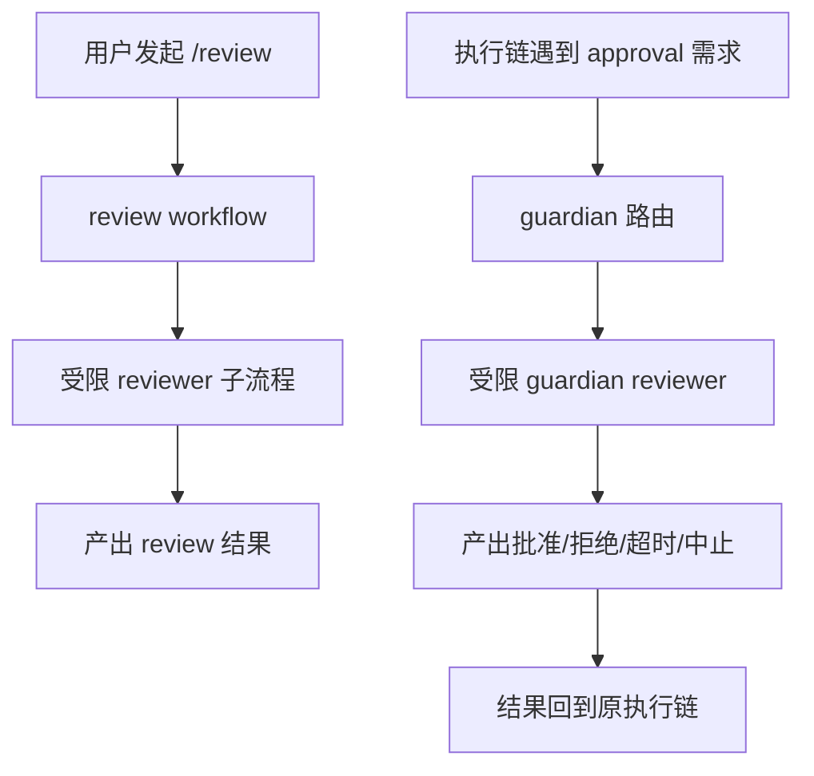

# 为什么 `/review` 和 guardian 不是一回事

## 读者问题

很多人第一次看到 Codex 里的 review 相关代码，都会自然把它们压成一句话：

> 这不就是两种“让另一个 agent 帮我审一下”的功能吗？

如果这样理解，卷六的入口就会立刻读歪。因为你会把后面所有内容都当成“review 的不同变体”，而不是两类职责不同的系统。

## 结论

先给结论：

> **`/review` 更像一个面向用户的 review workflow；guardian 更像一层面向 approval 的审查基础设施。两者有关，但不是同一回事，更不在同一层。**

再用白话说一次：

- **`/review`** 解决的是：**我想发起一次审查，请系统产出一份 review 结果。**
- **guardian** 解决的是：**某个动作要不要被批准，系统能不能先走一条受限的自动审查链来裁决。**

所以，虽然两边都带有“reviewer 子代理”的味道，但它们服务的不是同一个问题：

- 一个偏**用户工作流**
- 一个偏**系统授权判断**

卷六第 01 篇的任务，就是先把这条边界切开。只有先切开，后面第 02 篇才有资格继续谈：为什么 guardian 更像审查基础设施，而不是一个高级功能名。

## 先把这篇要留下来的记忆点钉住

如果这篇只留一句话，最该留下的是：

> **`/review` 负责“发起一次审查工作流”，guardian 负责“在授权链里做一次审查裁决”。**

---

## 一、先把误解纠正：名字接近，不等于系统同层

读者最容易犯的错，是把 `/review` 和 guardian 理解成同一个 reviewer 系统的两种入口。

这个错看起来很自然，因为二者确实都有一些相似表面：

- 都会拉起一个受限的 reviewer 过程
- 都不是普通自由对话
- 都在“先检查、再返回结果”

但真正决定系统分层的，不是表面动作像不像，而是**它到底在为哪条主链服务**。

### `/review` 服务的是用户可见的审查流程
用户显式发起 `/review`，期待的是一份 review 结果。重点在：

- 把审查作为一个明确任务运行起来
- 形成一条 review 子线程或 review 会话
- 最后把结果以用户可消费的形式交出来

也就是说，`/review` 的重心是：

> **生成 review 内容。**

### guardian 服务的是审批与授权链
guardian 不是让用户“开一个 review 模式看看结果”，而是当系统遇到某个需要批准的动作时，插入一条审查判断链。它真正关心的是：

- 这个动作该不该放行
- 如果不放行，是拒绝、超时，还是中止
- 这个判断怎样回流到原执行链

也就是说，guardian 的重心是：

> **产出授权判断。**

一句话压缩：

> **`/review` 产出的是审查内容，guardian 产出的是审批裁决。**

这个区分非常关键。因为卷六不是要把“review 相关功能”打包介绍，而是要带读者看到：Codex 后半段开始长出更高层的审查组织能力。第一步，就是别把用户工作流和审查基础设施混成一团。

---

## 二、第一次出现术语时，先用白话解释

在继续往下之前，先把这篇会反复出现的两个词讲白。

### 1. 什么叫 review workflow
这里的 workflow，不是抽象口号，而是指：

- 用户能显式触发
- 系统会按一条明确步骤去执行
- 结果以用户能理解、能消费的形式结束

所以说 `/review` 是 workflow，意思是：

> **它是一条面向用户的、可发起、可运行、可看到结果的审查流程。**

它像一个产品层动作，而不是纯内部机制。

### 2. 什么叫审查基础设施
基础设施的意思不是“更底层所以更高级”，而是：

- 它不只服务一个入口
- 它嵌在更大的运行链里
- 它的价值不在一次结果，而在持续提供某类判断能力

所以说 guardian 更像审查基础设施，意思是：

> **它不是专门为某个命令界面存在，而是在需要 approval 的地方，提供一套可复用的审查与裁决能力。**

从读者心智上看，这里要完成一次切换：

- 不要把 guardian 想成“另一个 review 功能”
- 要把 guardian 想成“系统里负责审查裁决的一层能力面”

这就是卷六入口最重要的第一步。

---

## 三、从分层看：`/review` 在用户侧，guardian 在授权侧

如果只记一张图，应该记这张。

这张图里最重要的不是“都用了 reviewer”，而是两边的入口和出口完全不同。

### `/review` 的入口和出口
- **入口**：用户显式要求做一次 review
- **出口**：用户得到一份 review 结果

### guardian 的入口和出口
- **入口**：某个动作进入 approval 场景
- **出口**：执行链收到一个授权判断

你可以把它们想成两种不同的问题：

- `/review`：**请帮我审一审**
- guardian：**这件事能不能过**

前者偏内容，后者偏裁决。

---

## 四、`/review` 为什么首先是一个用户工作流

从卷六的叙述角度看，`/review` 最该被读成一个用户可理解的产品动作，而不是一个底层 approval 组件。

原因很简单：它整条链的存在意义，就是把“做一次 review”组织成一条明确流程。

这条流程的核心特征通常包括：

- 它是显式发起的
- 它可以有独立的 review 线程或 review 交付面
- 它使用受限配置运行 reviewer 子过程
- 它的结束条件是形成 review 输出，而不是决定某个高风险动作是否获批

这说明 `/review` 的设计目标，不是替控制面做授权决策，而是让系统具备一种稳定的“审查产出能力”。

换句话说，读者看到 `/review` 时，首先应该想到：

> **这是一条用户可触发的审查工作流。**

而不是：

> 这是 guardian 的前台皮肤。

这两种理解差别很大。

如果把 `/review` 错看成 guardian 的前台包装，就会误以为它的核心价值在“批准不批准”。但实际上，它的核心价值在于：**把 review 作为可运行、可交付的流程产品化。**

---

## 五、guardian 为什么首先是授权审查链，而不是另一个 review 模式

guardian 的位置则完全不同。

它不是为了让用户多一个“审一下”的入口，而是为了让系统在遇到 approval 请求时，不必只剩下“直接问用户”这一条路。它插进来的，是**授权链**，不是普通内容链。

所以，guardian 更该被理解成下面这种东西：

- 一层 approval reviewer
- 一层自动审查裁决器
- 一层嵌在执行与授权之间的判断机制

它关注的不是 review 文本是否完整，而是：

- 当前动作风险是什么
- 依据什么做判断
- 最终是批准、拒绝、超时还是中止
- 结果如何反馈给原来的执行过程

这意味着 guardian 最重要的产物不是“审查报告”，而是“裁决结果”。

因此，guardian 的系统角色天然更靠近：

- approval gate
- 审查路由
- 授权控制链的一环

而不是一个独立命令模式。

这也是为什么卷六必须把它单独拉出来讲。因为一旦把 guardian 看成基础设施层，后面很多现象才会自然成立：

- 为什么它会接在多种 approval surface 上
- 为什么它强调 fail-closed
- 为什么它更像一套可复用的 reviewer 机制

但这些都要放在第 02 篇详细展开。本篇只需要先稳住一句话：

> **guardian 不等于“另一个 review 功能”，它服务的是系统授权判断。**

---

## 六、机制上到底怎么分：同样是 reviewer，职责却不一样

为了避免“概念上懂了，机制上又混回去”，这里再从机制层做一次对照。

### 1. 触发方式不同
`/review` 的触发，通常是用户主动发起。

guardian 的触发，则依赖 approval 路由条件是否成立。也就是说，guardian 不是你“想开就开”的用户模式，而是系统在需要授权审查时才介入的内部机制。

所以第一层差异是：

- `/review`：**用户触发**
- guardian：**系统路由触发**

### 2. 目标对象不同
`/review` 面向的是一个需要被审查的对象或任务，目标是给出 review 结果。

guardian 面向的是一个需要被批准的动作，目标是给出可执行的审批判断。

所以第二层差异是：

- `/review`：**面向审查内容**
- guardian：**面向授权动作**

### 3. 结果回流方式不同
`/review` 的结果主要回到用户可见面，成为 review 输出的一部分。

guardian 的结果则主要回到执行链，决定后续动作能否继续。

所以第三层差异是：

- `/review`：**结果面向用户消费**
- guardian：**结果面向运行链消费**

### 4. 系统地位不同
`/review` 虽然也有专门配置和受限运行，但它仍然首先是一个工作流单元。

guardian 则更像一层在多处复用的系统能力。它的价值，不是某一次“审查得好不好看”，而是能否稳定地承担审批裁决职责。

所以第四层差异是：

- `/review`：**workflow unit**
- guardian：**infrastructure layer**

把这四层一起看，边界就很清楚了。

---

## 七、为什么卷六必须先讲这条边界，而不是直接讲 guardian 细节

卷六的主题不是“高级功能盘点”，而是：

> **这些看起来零散的高级能力，其实正在把 Codex 推向更高层的运行组织结构。**

要进入这个主题，第一步必须先消掉一个非常强的误导：

> 既然 `/review` 和 guardian 都像在“审一下”，那它们大概只是同一个功能的不同实现。

如果不先拆掉这个误导，读者后面会连续产生几种偏差：

- 把 guardian 看成 `/review` 的后台版本
- 把审查基础设施看成某个命令功能的内部实现
- 把卷六读成“review、collab、memory 等高级功能合集”

而这正是卷六最不该发生的事。

卷六要建立的不是“功能越来越多”的感觉，而是“系统职责开始分层”的感觉。`/review` 和 guardian 的边界，就是这套分层叙事的第一块地基。

---

## 八、最小记忆表：这一篇读完以后，至少要留下什么

如果你不想记太多，只要记住下面这组对照就够了。

| 维度 | `/review` | guardian |
|---|---|---|
| 首先是什么 | 用户工作流 | 审查基础设施 |
| 由谁触发 | 用户显式发起 | approval 路由触发 |
| 主要目标 | 产出 review 结果 | 产出审批裁决 |
| 结果给谁用 | 用户可见面 | 原执行链 / 授权链 |
| 更像什么 | 产品功能流程 | 系统授权能力 |

压缩成一句话：

> **`/review` 是“做一次 review”；guardian 是“替 approval 链做一次审查裁决”。**

这句话，就是本篇的 retained takeaway。

---

## 九、收口：先把边界立住，后面才能谈基础设施

现在可以收口了。

本篇真正要建立的，不是一些实现细节，而是一种读法：

1. **不要按名字相似度理解系统。**
2. **先看它服务哪条主链。**
3. **`/review` 服务用户审查流程，guardian 服务授权审查链。**
4. **因此二者相关，但不是一回事，也不在同一层。**

有了这一步，卷六才算真正起跑。因为从这里开始，我们终于可以把问题从“两个功能像不像”升级为“两个系统职责为什么不同”。

下一篇就进入这个升级后的问题：

> **如果 guardian 不是 `/review` 的另一种入口，那为什么它更应该被理解成一层审查基础设施？**

这就是卷六第 02 篇要回答的内容。
