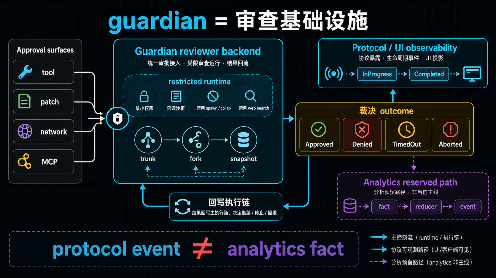
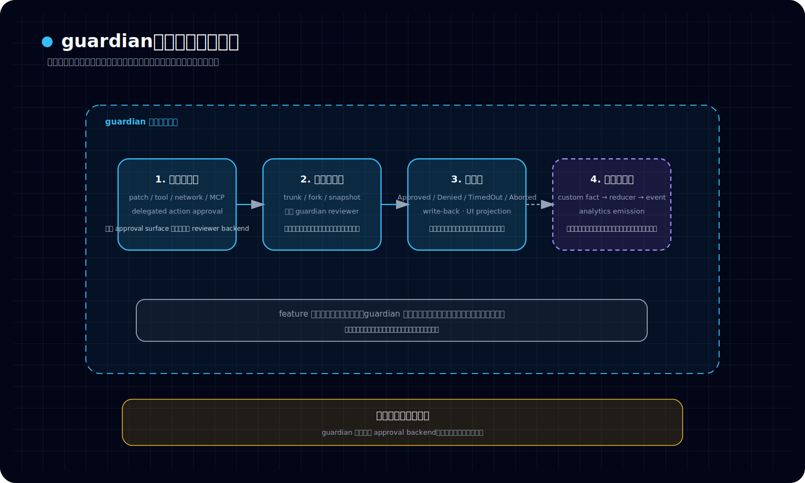

# guardian 为什么更像审查基础设施，而不是一条普通 feature 链

## 读者最常见的问题

*图：这张图展示 guardian 为什么不是普通 feature 链：它横跨输入、工具、执行和结果，形成对运行过程的基础设施级守护。*

很多读者第一次碰到 guardian，都会自然地把它理解成一种“高级审查功能”：

- 它会拉起 reviewer 子 agent
- 它会给出批准或拒绝
- UI 里还能看到 started / completed 这类事件

于是一个很自然的问题就出现了：

> **既然 guardian 看起来也只是在“做一次审查”，为什么这里要把它单独提升为基础设施，而不是当作一条普通 feature 链来看？**

这个问题如果不先答清楚，后面就很容易把卷六整卷读歪：把 guardian 读成“另一个高级功能”，再把 realtime、collab、AgentControl、memories 全部读成功能列表。那样就会错过 Codex 后半段真正长出来的东西——不是功能越来越多，而是运行组织能力越来越强。

---

## 先给结论

结论可以压成一句话：

> **guardian 的价值不在某一次审查动作本身，而在它试图把审查判断、协议暴露、运行时接入和后续可观测性组织成一层可复用的审查基础设施。**

换句话说，普通 feature 更像“用户触发一次能力，系统完成一次结果”；而 guardian 更像“只要执行链上出现需要批准的动作，就有一套统一的审查机制可以接入、复用、投影和约束”。

所以 guardian 不应被理解为：

- 一个单独的用户工作流
- 一个只服务某个按钮或某个命令的高级功能
- 一个“再来一次 review”的产品包装

它更接近的是：

- approval 场景里的 reviewer backend
- 多条审批面共享的审查接入层
- 带有协议面、会话管理、结果回流和观测边界的基础设施层

这里也顺带给出本篇最重要的边界判断：

> **protocol / UI observability 已经说明 guardian 是正式系统的一部分；analytics schema / reducer / client 的存在，则说明它还被预留进了更深一层的系统观测模型；但 runtime emission 与 analytics 接线并不是同一回事。**

也就是说，能在 UI 看到 guardian，不等于 guardian analytics 已经真正打通。

---

## 第一次出现的术语，先用白话讲清楚

### 什么叫“审查基础设施”

这里说的“基础设施”，不是指 guardian 比别的模块更底层，而是指它服务的不是一条单独产品路径，而是一类系统职责：

> **凡是执行链里出现“这个动作要不要被允许”的问题，guardian 都有机会作为统一审查器插进去。**

它关心的重点不是“生成一段审查文案”，而是：

- 审查请求怎样被路由进来
- 审查器以什么受限配置运行
- 结果如何回写原执行链
- 外层协议和 UI 怎样观察这次审查
- 未来 analytics 怎样把它纳入正式事件体系

当一个系统同时负责这些事情时，它就已经不像单点 feature，而更像基础设施。

### 什么叫“protocol / UI observability”

白话说，就是：

> **系统有没有把 guardian 的生命周期显式暴露给 app-server 和前端，而不是只在内部静默做判断。**

guardian 这条线上，运行时会发出 `GuardianAssessment(InProgress)`、`Approved`、`Denied`、`TimedOut`、`Aborted` 一类事件；app-server 再把这些内部事件翻译成客户端能消费的通知、状态和时间线投影。

所以 protocol / UI observability 关心的是：

- 外部能不能看见 guardian 正在发生
- 能不能知道它审了什么、结果是什么
- UI 能不能把拒绝、超时、中止等状态表达出来

这是一种“产品表面上的可观察”。

### 什么叫“analytics / runtime emission”

这一层不是让用户看，而是让系统统计、归约、分析。

白话说：

> **runtime emission 是运行时有没有真正把某次 guardian 审查当作 analytics fact 发出去；analytics 则是这些 fact 之后怎样被 reducer 补全并归约成正式事件。**

这层关心的不是 timeline，而是：

- 有没有调用 analytics client
- 有没有生成 guardian review 对应的 fact
- reducer 能不能把 thread / connection / source 等元数据补齐
- 最后能不能落成稳定事件模型，比如 `codex_guardian_review`

这是一种“系统内部统计意义上的可观察”。

本篇后面所有分层，都是围绕这两个“可观察”不能混为一谈来展开的。

---

## 一、为什么 guardian 天然更像基础设施，而不是 feature

### 1. 它服务的是审批判断，不是单次内容产出

普通 feature 的直觉模型通常是：用户触发 → 系统执行 → 返回结果。

guardian 不是这样。它回答的问题是：

> **当某个动作需要批准时，这个动作该被允许、拒绝，还是因为超时或中止而 fail-closed？**

也就是说，guardian 输出的核心不是“内容”，而是“裁决”。

这会直接改变它在系统里的位置：

- 它不是执行器
- 它不是内容生成器
- 它是审查判断器

而“判断器”一旦被接到多条审批链上，就天然会朝基础设施方向发展。

### 2. 它不是挂在单一点上，而是插在多种 approval surface 上

从已有材料看，guardian 可以服务的并不只是某一种操作，而是多类需要批准的动作：

- tool approvals
- patch approvals
- network approvals
- MCP tool approvals
- delegated subagent 回流到 parent session 的 approvals

这件事非常关键。

如果 guardian 只是某个产品功能的内置 reviewer，那它的作用域通常会跟着那个功能走；但 guardian 的作用域跟的是“审批面”，而不是某个单一入口。它在意的是：**哪里出现 approval request，哪里就可能需要统一审查。**

这正是基础设施思维，而不是 feature 思维。

### 3. 它内建的是 fail-closed 安全语义

guardian 出错、超时或中止时，不是“算了先继续”，而是明显偏向 deny / abort。

这种设计说明它不只是一个辅助建议器，而是在承担授权边界上的责任。凡是承担授权责任的系统，设计默认值就会更像控制链的一部分，而不是体验层功能。

换句话说：

> **如果一个模块失败后系统倾向收紧而不是放行，那它通常已经站在基础设施一侧，而不是普通 feature 一侧。**

### 4. 它有 trunk / fork / snapshot 语义，而不是一次性 helper 语义

guardian 还有一个非常强的基础设施信号：它不是每次都冷启动一个全新 reviewer，而是有一套可复用的会话组织方式。

大意可以压成三层：

- **trunk session**：作为可复用的主干审查会话
- **ephemeral fork**：在 trunk 忙或需要隔离时拉临时审查分支
- **fork snapshot**：把可提交的审查上下文保存下来，供后续 fork 继承

这类设计已经不太像“做一次功能调用”，而像“维护一个专用 runtime 资源池”。

它想解决的是：

- reviewer 上下文怎样连续
- 多次审批怎样复用成本
- 并发审批怎样隔离
- 复用与一致性怎样平衡

这套问题域，本身就是基础设施问题。

---

## 二、guardian 的真正分层：请求接入、审查运行、协议暴露、分析预留

把 guardian 看成基础设施，最稳的方式不是抽象赞美它“更高级”，而是把它拆成几层看。拆开以后，feature 心智自然会失效。

看这张图时，建议按这个顺序读：

- 先看最左边“请求接入层”，确认 guardian 首先解决的是多种 approval surface 的统一收束
- 再看中间“审查运行层”和“回写 / 暴露层”，确认它并不是做动作执行，而是在做裁决、回写和观察暴露
- 最后再看最右边“分析预留层”，理解为什么这个系统从一开始就更像基础设施而不是普通 feature

### 1. 请求接入层：guardian 先是一个统一入口

guardian 不需要用户先显式进入某个“guardian 模式”，它首先是审批请求的接入层。

只要满足特定条件，例如：

- 当前 approval policy 处于 on-request 语义
- 审批 reviewer 被配置为 guardian subagent

某些原本要抛给用户的 approval request，就可能改由 guardian 先做判断。

所以它的第一层职责不是“展示一个功能”，而是：

> **把多种审批请求收束到同一套 reviewer backend。**

这和普通 feature 的入口完全不同。feature 更在意用户怎么点进来；guardian 更在意请求怎么被统一接管。

### 2. 审查运行层：guardian 不是执行器，而是受限审查器

guardian 自己虽然在授权上很重要，但它本身能力被明显收紧：

- `approval_policy = never`
- sandbox 偏只读
- 禁用 spawn / collab
- 禁用 web search
- 只保留最小审查面

这说明 guardian 不是“超级 agent”，而是“高责任、低自由度”的审查器。

它的权力来源不是执行能力，而是裁决位置。

从架构上看，这又是一个基础设施特征：

- feature 常常强调能力暴露
- guardian 反而强调能力收缩

因为基础设施的目标不是多做事，而是**在关键边界上给出稳定、可控、可回收的判断。**

### 3. 结果回流层：guardian 的结果要回写原执行链

guardian 的终点也不是生成一份单独文本，而是把结果写回原来的执行链。

一条典型逻辑可以压成：

1. 某动作触发 approval request
2. guardian review 启动，并先发 InProgress 状态
3. reviewer 在受限会话中做判断
4. 产出 Approved / Denied / TimedOut / Aborted
5. 原执行链依据该结果继续、停止或回退

注意这里的重点：

> **guardian 的产物要重新进入执行系统，而不是停留在独立阅读面。**

这说明它不是旁观式功能，而是执行链的一部分。

### 4. 协议暴露层：guardian 已经有正式的 protocol / UI surface

guardian 并不是只在 core 里静默运作。它的生命周期会被 app-server 消化并投影给客户端。

这意味着外层系统已经默认：guardian 不是内部细节，而是值得显式表达的状态机。客户端能观察到的通常包括：

- 审查是否开始
- 审查是否完成
- 当前状态与结果
- 某些场景里的风险等级、授权信息、rationale
- 某些命令类场景里的 decline / fail 投影

这一步非常像“把内部控制链提升为正式系统面”。

一旦一个模块拥有稳定协议面，它就不再只是 feature 内部实现，而开始变成平台性能力。

### 5. 分析预留层：analytics 侧已经按正式系统预留了 guardian 位置

从 analytics 材料看，guardian 这边并不是完全没有后续观测设计。相反，analytics 侧已经准备了：

- guardian review 对应的 client API
- 自定义 fact 类型
- 事件 schema
- reducer 归约逻辑

而且 schema 字段并不敷衍，已经涉及：

- request source
- reviewed action
- outcome / rationale
- guardian thread id
- guardian session kind
- model / reasoning effort
- timeout / token / latency 等指标

这说明设计上，guardian 从来不是“一个 UI 上能看到就够了的小功能”，而是被当成**值得独立建模的系统事件**。

只是到当前实现状态为止，analytics 这一层更像“观测模型已经搭好”，并不等于 runtime 已经把发射点全部接上。

---

## 三、protocol / UI observability 与 analytics / runtime emission 的边界到底在哪里

这是本篇必须单独立住的重点，因为很多误解都出在这里。

### 1. 第一条边界：能看到 guardian，不等于 analytics 已打通

guardian 在 protocol / UI 侧已经很像一个成熟系统：

- core 会发 guardian assessment 生命周期事件
- app-server 会把它们翻译成客户端可消费通知
- UI 能把 started / completed / status / rationale 投影出来

如果只看到这层，很容易下意识得出：guardian 的观测已经完整。

但这里的“完整”，只成立在协议和界面层。

analytics 要求的是另一条链：

- runtime 真的生成 analytics fact
- analytics client 真的接收到 fact
- reducer 真的补全上下文
- 最终真的归约出稳定事件

只要这条链没真正发生，guardian 就仍然只是“对用户可见”，而不是“对分析系统可统计”。

### 2. 第二条边界：analytics schema 的存在，不等于 runtime emission 已存在

guardian analytics 最容易让人误判的地方在这里。

因为从 analytics 侧看，很多东西已经具备：

- 有 client API
- 有 fact 类型
- 有 reducer
- 有事件 schema

这会给人一种非常强的印象：guardian analytics 应该已经接好了。

但更稳的读法是：

> **analytics 子系统已经为 guardian 预留了正式位置；至于 guardian runtime 有没有在关键边界真正调用这些接口，是另一件事。**

所以 schema / reducer / client 只能说明“系统准备好了接”；不能自动推出“运行时已经在发”。

### 3. 第三条边界：protocol event 不能自动替代 analytics fact

还有一个常见误读是：既然 guardian assessment 已经经过 app-server 和 protocol 暴露出来了，analytics reducer 能不能直接从这些通知里反推出正式事件？

当前材料支持的更稳判断是否定的。

原因很简单：

- protocol notification 的职责是把状态暴露给客户端
- analytics fact 的职责是给 reducer 提供可归约、可补全、可统计的标准输入

两者服务对象不同，稳定性要求也不同。

所以：

> **guardian protocol event ≠ guardian analytics fact。**

如果 runtime 不发 analytics fact，reducer 不会凭 UI 通知自动替你补出一条正式 guardian analytics 事件。

### 4. 第四条边界：这说明的是“基础设施在分层长出”，不是“系统没做完就不能算基础设施”

有些读者会因为 guardian analytics 尚未完全接上，就退回去说：“那它还只是半成品 feature。”

这个判断并不稳。

更准确的说法是：

- guardian 作为审查 runtime 与协议系统，已经成立
- guardian 作为 analytics 完整观测对象，仍处于接线未完全落定的状态

这两件事可以同时为真。

也就是说，**基础设施不是等所有后续层都完工了才叫基础设施，而是当它已经承担统一接入、统一裁决、统一回流和统一协议暴露时，基础设施性质就已经成立。**

analytics 缺口说明的是“这层基础设施还在继续向更完整观测体系演进”，而不是“它还只是一个普通功能”。

---

## 四、为什么这一判断对卷六很重要

如果把 guardian 仍然读成功能，卷六后面几篇都会跟着歪掉。

### 1. 会把审查问题读成产品路径问题

那样你会继续追问：

- 这个入口怎么触发
- 这个界面怎么展示
- 这次 review 长什么样

但 guardian 真正重要的问题是：

- 它如何成为统一 approval reviewer backend
- 它如何把审批判断接回执行链
- 它如何通过 trunk / fork / snapshot 形成专用 runtime
- 它如何在 protocol 与 analytics 之间逐步长出完整观测体系

前者是 feature 读法，后者才是基础设施读法。

### 2. 会看不见 Codex 正在形成更高层运行组织能力

guardian 和普通 feature 的差别，不只在于它更复杂，而在于它已经开始体现一种新的系统组织方式：

- 不再只围绕“用户发起一个请求”设计
- 而是围绕“执行链上如何统一处理一类高风险职责”设计

一旦你接受这点，就会更容易理解后文的 realtime、collab、AgentControl 为什么也不能简单当作功能。

因为它们共同指向的是同一件事：

> **Codex 后半段正在从单线程执行工具，长成带审查、协作和多层运行组织的系统。**

---

## 收口：这一篇读完，应该留下什么判断

本篇最后只需要稳稳留下五个判断。

### 判断 1：guardian 的核心产物是裁决，不是内容
它解决的是“该不该放行”，不是“再写一份 review 文本”。

### 判断 2：guardian 服务的是多条 approval surface
所以它天然更像统一接入层，而不是单点 feature。

### 判断 3：guardian 已经具备正式 runtime 与 protocol / UI surface
它不是内部黑箱，也不是临时 helper。

### 判断 4：analytics 侧已经为 guardian 准备了正式事件模型
但 schema / reducer / client 的存在，不等于 runtime emission 已经全部接通。

### 判断 5：guardian 的未完成之处，不会把它打回“普通功能”
相反，这更说明它正在从审查 runtime 继续长向更完整的系统观测层。

因此，对 guardian 最准确的读法不是“一个高级 feature”，而是：

> **一套已经具备统一审查接入、会话复用、协议投影和分析预留的审查基础设施。**

下一篇要继续回答的，就是另一个常见误读：为什么 realtime、collab 和 AgentControl 看起来都像“多 agent 协作功能”，但真正该把它们读成协作 runtime 的不同层。
---

## 卷内导航

- 上一篇：[《为什么 `/review` 和 guardian 不是一回事》](./2026-04-13-Codex-卷六-01-为什么-review-和-guardian-不是一回事.md)
- 回到本卷入口：[本卷导读](./index.md)
- 下一篇：[《realtime、collab 与 AgentControl 分别是什么层》](./2026-04-13-Codex-卷六-03-realtime-collab-与-AgentControl-分别是什么层.md)

