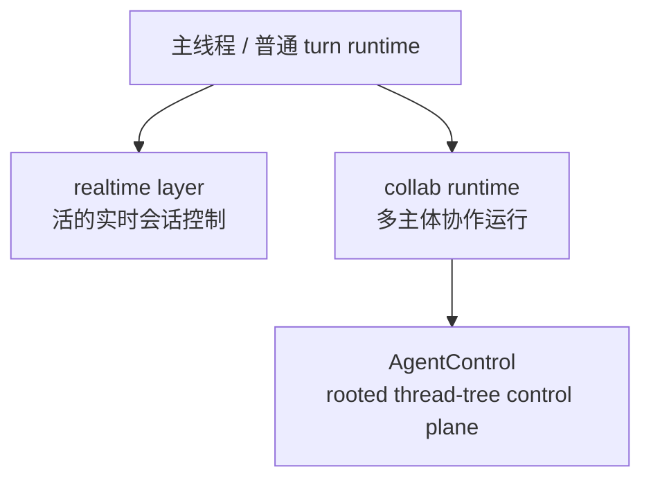

# realtime、collab 与 AgentControl 分别是什么层

## 先回答读者最容易混的那个问题

**realtime、collab、AgentControl 看起来都在处理“多主体”“多会话”“实时协作”。那它们是不是其实是一回事，只是从不同文件夹里露出来的不同名字？**

先给结论：

> **不是。realtime 是实时会话与交互层，collab 是协作运行层，而 AgentControl 是 collab 这套协作运行层内部真正负责 rooted thread-tree 编排的控制面。**
>
> 也可以压成一句更稳的话：
>
> 1. **realtime 解决的是“一个活的实时会话怎样被维持和接回主线程”；**
> 2. **collab 解决的是“多个 agent / thread 怎样形成正式协作运行”；**
> 3. **AgentControl 解决的是“这套协作运行由谁真正管理、寻址、生成、等待、关闭和收束”。**

所以，这篇真正要做的不是介绍三个功能名，而是先把卷六里一个很关键的视角立住：

> **Codex 这里讲的“协作”，不是产品页面上的一个 feature，而是在单线程 turn/runtime 主链之外，开始长出来的一层运行组织能力。**

如果这一步不先切开，读者后面很容易把卷六第 03 篇误读成“多 agent 功能导览”；但这不是本篇要讲的重点。本篇要讲的是：**这些名字分别落在哪一层系统职责上。**

---

## 先把几个术语说白

### realtime

本文说的 realtime，可以先用一句白话记住：

> **让一个线程拥有“活着的实时会话状态机”的那一层。**

它不是单纯“再加个 websocket”或“支持语音输入”这么薄。它真正关心的是：

- 当前有没有 active realtime conversation；
- 输入流从哪里来；
- 输出流往哪里发；
- response create 什么时候能继续发；
- 何时要 handoff 回普通 session 主链。

所以 realtime 的核心对象不是某个前端按钮，而是 **ConversationState 及其周边控制逻辑**。

### collab

本文说的 collab，也不要先把它理解成“多人一起聊天”。更准确的白话是：

> **让多个 agent / thread 形成正式协作关系，并把这些关系投影成可观察运行对象的那一层。**

它关心的不是实时音频，而是：

- spawn；
- fork；
- message；
- wait；
- resume；
- close；
- 这些动作怎样被表示成一套协作事件模型。

所以 collab 不是一个按钮，也不只是一个 mode；它更像 **多主体协作 runtime**。

### AgentControl

AgentControl 最容易被误会成“multi-agent 的某个内部 helper”。但如果先用白话说，它更接近：

> **一棵 rooted thread tree 的控制柄。**

它不是抽象地“管理 agents”，而是围绕当前 root thread / session tree 去做这些事情：

- 保留 spawn slot；
- 给 agent 分配 path / nickname；
- 决定 child thread 怎样出生；
- 支持 resolve / list；
- 管理等待、关闭、子树收束。

所以 AgentControl 不是 collab 的同义词，而是 **collab runtime 内部真正承担控制面职责的核心对象**。

---

## 先立一个总分层：三者不是并列功能，而是三段不同职责

很多误读都来自把它们并排看成“高级能力包”。

但如果按系统职责排布，关系更接近下面这样：

这张图最重要的不是箭头方向，而是三个判断：

- **realtime 和 collab 不是一条链上的上下级替代品；**
- **它们都站在主 turn spine 之外，但面向的是不同运行对象；**
- **AgentControl 不该和 realtime、collab 并列成三个 feature，而应被理解成 collab 内部的控制面核心。**

换句话说：

1. realtime 面向的是 **live conversation**；
2. collab 面向的是 **live collaboration**；
3. AgentControl 面向的是 **collab 中那棵 thread tree 的控制与编排**。

只有这样切，后面“协作为什么是 runtime 组织能力”才讲得通。

---

## 一、realtime 为什么首先是实时会话层，而不是协作层

realtime 最容易被表面名字带偏。很多人一看到它，就会自然联想到：

- 实时消息；
- 多人在线；
- 语音连线；
- 因而好像也属于“协作”。

但从源码职责看，realtime 解决的不是多主体编排，而是：

> **一个线程怎样临时长出一套 live conversation runtime。**

这套 runtime 的关键点有三个。

### 1. 它维护的是 active conversation state，而不是 agent tree

realtime 关心的中心对象，是当前实时会话本身：

- 是否 active；
- 当前输入输出通道；
- handoff 状态；
- fanout 任务；
- response create 调度。

这说明 realtime 的第一性问题不是“谁和谁协作”，而是“这场实时会话此刻处在什么状态”。

所以它落点首先是 **会话状态机层**。

### 2. 它要吸收 backend 的实时约束，而不是做多主体控制

`RealtimeResponseCreateQueue` 这一类对象很能说明问题。

Codex 在这里做的事情，不是简单转发消息，而是把 backend 的限制吸收进本地控制逻辑：

- 已有 active response 时，新的 create 要 defer；
- response done / cancel 后再 flush；
- 后端报 active-response 冲突时，也要本地接住而不是让上层乱掉。

这是一种很典型的 runtime 行为：**把外部协议约束变成本地可管理状态。**

但这仍然不是协作编排。它面对的是一个活的 conversation，而不是一棵 agent 关系树。

### 3. 它最终还要 handoff 回普通 turn 主链

realtime 最关键的边界之一，在于它没有试图重写 Codex 的普通主线程引擎。

相反，当 backend 发出 handoff 请求时，系统会把文本重新导回正常的 session 路径，再注入普通 `Op::UserInput` 主链。

这说明：

> **realtime 是一层会话级实时控制面，但它不是独立宇宙；它需要时会把内容重新归回主线程运行。**

因此，把 realtime 叫成“协作层”其实并不准确。它更准确的位置，是：

> **主线程之外的实时会话层。**

---

## 二、collab 为什么已经不是“多几个 agent”而是协作运行层

如果说 realtime 管的是一场活的 conversation，那么 collab 管的就是另一种“活着的东西”：

> **多个 thread / agent 之间持续存在、会变化、可观察、可恢复的协作关系。**

这就是它和普通多线程调用最不一样的地方。

### 1. collab 有完整事件模型，不是若干零散工具

从 spawn、message、wait、resume、close 到 begin/end 的事件发射，说明 collab 不是“起个子线程、发两条消息”那么轻。

只要一套系统开始稳定地表达这些东西：

- 谁发起；
- 谁接收；
- 当前处于 waiting / interaction / closing 的哪一段；
- 一个协作动作怎样开始、怎样结束；

它就已经不只是工具动作集合，而是**协作 runtime 的事件系统**。

### 2. collab 被 app-server 投影成正式 thread item，而不是临时日志

app-server 这边会把 collab 事件归一化成 `ThreadItem::CollabAgentToolCall` 这样的对象。

这很关键，因为它说明系统不是把协作动作当成调试输出，而是把它们当成：

> **线程历史里正式存在、可以展示、可以恢复、可以继续理解的运行对象。**

一旦协作动作开始被投影成 thread item，读者就应该切换心智：

- 这里讲的不是“多 agent 支持”；
- 而是“多 agent 运行已被系统组织成正式观察面”。

### 3. collab UI 还是 live + backfill hybrid

TUI 不是只吃实时通知，还会在加载线程、读取历史时，根据 thread metadata 和 spawn 来源重建子树。

这再次说明 collab 不是短暂的 feature flash，而是要考虑：

- 实时态；
- 恢复态；
- 回放态；
- 子树重建。

这些都是 **runtime 组织能力** 才会自然承担的问题。

所以，对 collab 最稳的判断不是“多 agent 模式”，而是：

> **一套面向多主体协作的正式运行层。**

---

## 三、为什么 AgentControl 不是又一层“协作功能”，而是 collab 内部真正的控制面

到了这里，最容易剩下的误会是：

**既然 collab 已经是协作 runtime，那 AgentControl 是不是只是其中一个实现细节？**

不够准确。更准确的说法是：

> **AgentControl 是 collab 里把“协作”真正组织起来的控制面核心。**

它的重要性，不在于“它也能做一些动作”，而在于 **collab 的正式性，恰恰是通过它这种控制面对象被撑起来的。**

### 1. 它管理的不是 agent list，而是 rooted thread tree

这是最关键的一刀。

Codex 的多 agent 协作，不是简单维护一个“当前有哪些 agent”的列表。它更像一棵 rooted tree：

- root 被显式识别；
- child thread 有出生关系；
- agent 有 canonical path；
- 关闭一个 agent 可能意味着关闭其 subtree；
- resolve / list 也围绕路径和树来进行。

因此 AgentControl 真正控制的对象不是“若干并列 agent”，而是：

> **一棵可寻址、可派生、可收束的线程树。**

这就是为什么它更像 control plane，而不是 helper。

### 2. multi-agent handlers 更像门面，AgentControl 才是 owner

从职责分工上看，handlers 做的更多是：

- 接参数；
- 发 begin/end event；
- 调控制层；
- 把结果包装回上层。

而真正关键的行为，例如：

- spawn slot 保留；
- path / nickname 分配；
- child thread fork / fresh spawn；
- 生命周期状态控制；
- shutdown / subtree 收束；

都更靠近 AgentControl。

因此，最稳的读法不是“工具实现了多 agent”，而是：

> **工具 handler 只是协作入口门面，AgentControl 才是协作控制面的 owner。**

### 3. 它把“协作”从调用动作提升成可编排结构

如果没有 AgentControl，所谓协作很容易退化成：

- 主线程临时起一个子线程；
- 发一条消息；
- 回头等它结束。

这当然也能叫“支持子 agent”，但还谈不上正式协作 runtime。

AgentControl 的意义在于，它让系统开始显式管理：

- 谁是谁的子节点；
- 从哪里寻址到谁；
- 哪个节点仍存活；
- 哪个子树该等待；
- 哪个子树该被关闭；
- 这些变化怎样映射回系统可见状态。

这一步一旦出现，协作就不再只是操作动作，而变成 **运行结构**。

---

## 四、把三层并排放回卷六主线：为什么这已经是“更高层 runtime”，而不是“高级功能合集”

卷六如果只是做功能导览，完全可以把这三者压缩成一句：

- Codex 支持 realtime；
- Codex 支持 collab；
- Codex 支持 multi-agent。

但这样讲，会错过真正重要的东西。

真正重要的是，三者拼起来后，Codex 已经不再只是：

> **一个收用户输入、调模型、调工具、返回结果的单线程 agent。**

它开始长出的是三种更高层组织能力：

### 1. 实时组织能力

也就是 realtime 代表的：

- 活会话；
- 流式输入输出；
- 本地调度；
- handoff 桥接。

### 2. 协作组织能力

也就是 collab 代表的：

- 多主体关系；
- 协作事件；
- 线程历史投影；
- 恢复与回放。

### 3. 控制面组织能力

也就是 AgentControl 代表的：

- rooted tree；
- 寻址与路径；
- 生命周期编排；
- 子树级控制。

把这三层放在一起，最值得读者带走的不是“Codex 支持很多高级玩法”，而是：

> **Codex 已经在主 turn/runtime spine 之外，长出一套更高层的协作 runtime 组织结构。**

这就是为什么本篇必须把它们分层，而不能混成一句“多 agent 功能”。

---

## 五、还有一个边界必须顺手切开：collaboration mode 不等于 collab runtime

这一点如果不顺手点出来，读者还是容易混。

`collaboration mode` 更像 turn-start 时的一种 preset / instructions 注入方式，它决定的是：

- 这轮更偏 plan 还是 default；
- 协作相关提示如何进入上下文；
- 某些策略默认值怎样配置。

但这和真正的 collab runtime 不是一回事。

后者关心的是：

- 真正 spawn 了没有；
- thread tree 如何变化；
- 当前在等待、交互还是关闭；
- 事件如何被投影和恢复。

所以更准确的关系是：

- **collaboration mode 是 turn-level 的协作预设；**
- **collab runtime 是运行中的多主体协作系统。**

这个边界一旦不切开，读者很容易把“开了协作模式”误认为“系统已经进入正式协作 runtime”。这两者不是同一层。

---

## 收口：本篇真正要读懂的，不是三个名词，而是 Codex 开始怎样组织“活的协作”

现在可以把全文压回最初那个问题。

**realtime、collab、AgentControl 为什么看起来都像“多主体/多会话协作”，但其实不是一层东西？**

因为它们分别回答的是三类不同问题：

- **realtime：活的实时会话怎么维持；**
- **collab：多个主体怎么形成正式协作运行；**
- **AgentControl：这套协作运行由谁按 rooted thread-tree 进行控制。**

因此，本篇真正要留下来的判断是：

> **realtime 不等于协作，collab 不等于某个工具集合，AgentControl 也不只是内部实现细节。三者拼在一起，说明 Codex 已经开始从单线程 agent 工具，长成更高层的协作 runtime。**

而这还不是卷六的终点。

因为当协作层级切开之后，下一个自然问题就来了：

**如果 memories 也不是普通 helper，那它为什么更像启动管线，而不是运行时顺手挂上的长期记忆功能？**

这正是第 04 篇要进入的问题。