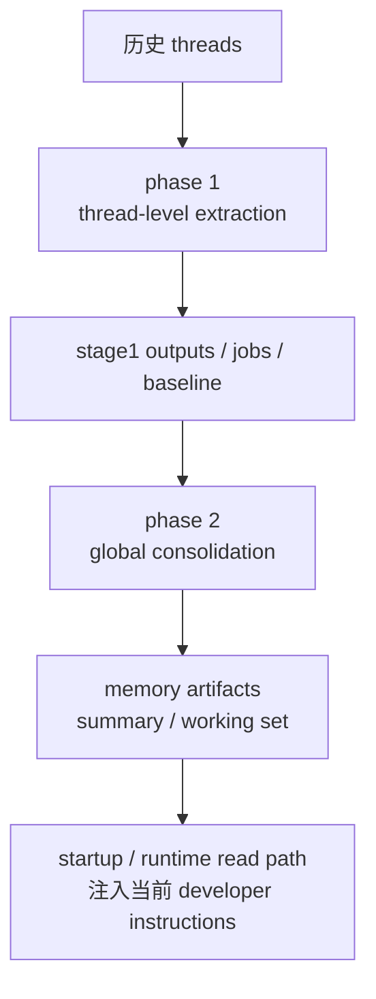

# 为什么 memories 更像启动管线，而不是普通 helper

## 先回答读者最容易冒出来的问题

很多读者第一次看到 memories，直觉都会很像这样：

- 它是不是就是“长期记忆功能”；
- 它是不是在对话时顺手帮模型补一点背景；
- 它是不是和别的 helper 一样，需要时调用一下、把结果塞进 prompt 就结束。

所以本篇要先回答的核心问题是：

> **为什么 memories 不该被理解成一个普通 helper，而要被理解成一条启动管线，甚至是一种更长期的运行组织能力？**

先给结论：

> **因为 memories 的关键职责，不是某一轮对话里“帮忙补一句上下文”，而是把长期上下文的提取、筛选、整合和启动期接入组织成一条正式流程。**
>
> 它更接近：
>
> 1. **系统启动时要不要、能不能、该怎样拉起长期上下文；**
> 2. **后台如何分阶段提炼历史线程；**
> 3. **前台在运行时怎样消费已经整理好的结果。**

换句话说，helper 心智关心的是“这一轮要不要顺手帮一下”；而 pipeline 心智关心的是“系统怎样稳定地生产、维护并接入一类长期资源”。memories 显然更像后者。

这件事之所以重要，是因为如果把 memories 误读成 helper，读者就会把卷六第 04 篇读成“又一个长期记忆功能”；但卷六真正要立住的是：**Codex 后半段长出来的，不只是高级功能，而是更高层的 runtime 组织能力。**

---

## 第一次出现的术语，先用白话讲清楚

### 什么叫“普通 helper”

这里说的 helper，不是贬义，而是指那种**围绕一次当前任务、一次当前 turn、一次当前调用**临时提供帮助的组件。

它的典型特征通常是：

- 在当前请求里被调用；
- 直接服务当前轮次；
- 调完就结束；
- 不需要自己维护很强的阶段划分和长期协调关系。

如果 memories 只是 helper，那它大概应该像“读到需要时，查一点记忆并塞回 prompt”。但源码材料显示，它远不止这一层。

### 什么叫“启动管线”

本篇说的启动管线，可以先记成一句白话：

> **系统在进入日常对话之前，先把一批长期上下文资源按步骤准备好、并在合适时机接到当前运行里的那条流程。**

它强调的是：

- 有明确入口；
- 有阶段划分；
- 有资格判断；
- 有后台协调；
- 有产物沉淀；
- 前台消费和后台生成不是一回事。

memories 更像这个，而不是“谁需要谁调用一下”的小工具。

### 什么叫“长期组织能力”

这里不要把它理解成抽象空话。白话说就是：

> **系统不只会临场回答问题，还开始会把历史经验整理成可持续复用的结构，并决定这些结构在未来运行里怎样被接入。**

一旦问题变成这个层级，重点就不再是“存了什么”，而是“如何组织、何时启动、由谁整合、怎样接回当前运行”。这正是本篇关心的重点。

---

## 先立一个总分层：memories 不是单点能力，而是前后台分离的正式流程

如果只从用户表面看，memories 容易被想成“运行时读一点长期记忆”。但从系统职责看，更稳的分层其实是下面这样：

这张图最重要的不是具体文件名，而是四个判断：

1. **memories 先有后台生成，再有前台消费；**
2. **生成过程不是一段脚本，而是分阶段工作流；**
3. **消费过程也不是现场现做，而是读取已经整理好的产物；**
4. **因此 memories 的系统身份更像 pipeline，而不是 turn-time helper。**

也就是说，平时对话里真正“读到”的 memory summary，只是这条管线最后被接入运行的一小段表面；它背后其实是一整套先提炼、再整合、再投喂的组织过程。

---

## 一、为什么说 memories 的关键不在“记住”，而在“分阶段组织”

很多人一看到 memories，就把注意力放在“它记住了什么”。这当然不是完全错，但还不够准确。

更关键的问题是：

> **它不是边聊天边顺手记一句，而是把长期上下文整理拆成了 thread-level extract 和 global-level consolidate 两段。**

这意味着什么？意味着它真正解决的不是单条记忆的生成，而是**长期经验如何被加工成系统可复用资源**。

### 1. phase 1 处理的是分散历史线程

phase 1 的职责，不是立刻生成最终 memory summary，而是先从符合条件的历史线程里提取阶段性结果。这里的重点不是模型说了什么，而是系统已经开始关心：

- 哪些线程有资格进入流程；
- 每个线程的 job 怎样被 claim；
- 中间结果怎样以结构化状态保存下来。

只要一套系统开始稳定处理这些问题，它就已经不像 helper。因为 helper 通常不需要维护“线程资格—任务认领—中间产物”这条线。

### 2. phase 2 处理的是全局整合，而不是单线程收尾

如果 phase 1 只是“各线程自己提一点记忆”，那仍然可能被误读成多个 helper 的堆叠。但 phase 2 把这件事彻底拉到了另一层：

> **系统不满足于每个线程各自产生一点片段，而要再做一次全局 consolidation，把可用材料整合成更稳定的长期工作集。**

这一步非常关键。因为一旦有了全局 consolidation，memories 就不再是“每段历史各自总结一下”，而是变成了**长期上下文的统一组织流程**。

这也解释了为什么本篇不应该被写成存储实现专题。真正重要的，不是 SQLite 还是文件系统，而是：**Codex 在这里已经把长期上下文当作一类要被流水化处理的资源。**

---

## 二、为什么 state runtime 的存在，说明它不是一个小 helper

memories 另一条特别强的信号，是它并不靠一小段本地逻辑偷偷完成，而是要借助 state runtime 去协调 durable workflow。

这说明系统关心的已经不是“模型能不能做摘要”，而是：

- job 如何协调；
- watermark 和 baseline 如何推进；
- retry / backoff 如何处理；
- 全局 phase 2 如何避免乱跑。

把这句话说得更白一点：

> **如果一个模块需要正式的 runtime 协调层去帮它管理任务生命周期，它就已经不是那种“顺手调一下”的 helper。**

helper 的典型形态，是上层调用、立刻返回；而 memories 的典型形态，是**后台可持续协调、阶段性推进、产物可持续被前台读取**。这已经是流程系统的味道，不是工具函数的味道。

所以，对 memories 最稳的判断不是“它能提供长期记忆”，而是：

> **它把长期记忆的生成组织成了一条可协调、可推进、可消费的正式工作流。**

---

## 三、为什么 phase 2 会起内部 agent，但 memories 仍然不等于 agents

读到这里，很多读者会自然追问：

**既然 phase 2 会拉起一个内部 subagent 来做 consolidation，那 memories 和 agents 是不是其实就是同一层东西？**

不是。更准确的说法是：

> **memories 是一条上层组织流程；agents 是它在某个阶段可复用的一类运行时执行者。**

两者的层级不一样。

### 1. memories 关心的是流程目标，agents 关心的是运行时协作

memories 这条线首先关心的是：

- 长期上下文怎样被生成；
- 哪些材料被选入整合；
- 最终产物怎样供未来运行读取。

而 agents 关心的是：

- 子 agent 如何生成；
- thread tree 如何被管理；
- message / wait / close 如何编排；
- 多主体协作如何形成正式控制面。

所以两者差别不是“一个简单一个复杂”，而是**职责对象不同**：

- memories 面向的是长期上下文资源；
- agents 面向的是运行时主体协作。

### 2. phase 2 使用 agent，不代表 memories 降格成 agent feature

phase 2 里起一个受限内部 agent，真正说明的是另一件事：

> **Codex 会把自己的 agent runtime 当成内部 worker 来复用，但复用执行者，不等于被执行的上层流程和 agent runtime 本身是同一层。**

这和“数据管线里用一个 worker 去跑某一步”是同样的逻辑。你不会因为某一步用了 worker，就说整条管线等于 worker 系统本身。

因此，本篇必须把这个边界切开：

- **agent 是可被复用的执行机制；**
- **memories 是调用这类机制来完成长期整合目标的上层流程。**

如果把这两层混在一起，读者就会把 memories 误读成“多 agent 的一个附属玩法”；但这恰恰会错过它作为长期组织能力的意义。

---

## 四、为什么 memories 和 external-agent-config 也不是同一层

另一种常见混淆是：

**memories 和 external-agent-config 看起来都更接近启动前后发生的事情，那它们是不是属于同一类系统？**

也不对。它们确实都不像普通 turn-time helper，但它们处理的问题完全不同。

### 1. memories 是长期上下文生成与接入层

memories 关心的是：

- 历史经验如何提炼；
- 这些提炼结果如何整合成长期工作集；
- 当前运行怎样消费这些长期产物。

它的核心问题是**长期上下文怎样被组织出来并接回运行**。

### 2. external-agent-config 是跨生态迁移层

external-agent-config 更接近：

- 检测外部 agent/config 资产；
- 把外部生态的配置、技能、说明迁入 Codex；
- 以 additive merge 方式做兼容和导入。

它的核心问题不是长期上下文，而是**外部配置如何迁入 Codex 体系**。

所以两者虽然都可能出现在“启动前后适配”这类语境里，但层级判断应该是：

- **memories：长期上下文的生成与接入流程；**
- **external-agent-config：跨生态资产的迁移与兼容流程。**

一个面向内部长期组织，一个面向外部配置迁移。它们都不是普通 helper，但也绝不是同一层系统。

---

## 五、把 helper 心智换成 pipeline 心智后，读者应该留下什么判断

到了这里，本篇最想让读者稳定留下来的，不是“memories 有 phase 1 / phase 2”这种事实点，而是下面这组更稳的判断。

### 判断 1：memories 的中心不是“多记一点”，而是“先提炼、再整合、再接入”

这决定了它首先是一条流程，不是一段插拔式小能力。

### 判断 2：memories 有明显的后台生成 / 前台消费分离

后台负责生产长期资源，前台负责在合适时机读取并注入当前运行。仅这一点，就已经和普通 helper 拉开了层级差。

### 判断 3：state runtime 说明 memories 是正式工作流，而不是脚本小补丁

只要 durable coordination 成了必需角色，这条线就已经进入 runtime 组织能力范畴。

### 判断 4：memories 会复用 agent runtime，但不等于 agents

memories 是上层长期组织流程；agents 是运行时协作与执行机制。两者相关，但不是同一层。

### 判断 5：memories 和 external-agent-config 都不像普通 helper，但问题域完全不同

前者组织长期上下文，后者迁移外部生态配置。不能因为都出现在“启动前后”就把它们合成一类。

---

## 收口：memories 不是“记忆功能加一点”，而是 Codex 开始组织长期上下文的方式

现在可以把本文压回一句最核心的话：

> **memories 在 Codex 里更像一条启动与长期组织管线，而不是普通 helper。**

它之所以重要，不是因为“系统终于能记住一些东西”，而是因为 Codex 已经开始认真回答一个更高层的问题：

> **长期经验怎样被整理成未来运行可复用的正式资源。**

一旦问题被提到这个层级，memories 就自然不再只是 feature list 上的一个功能点，而会变成卷六要反复强调的那类东西：**更高层的 runtime 组织能力。**

下一篇第 05 篇要收的，就是这条线最终指向的总判断：**Codex 怎样从这些看似分散的高级功能，走向更高层的 runtime 组织能力。**
