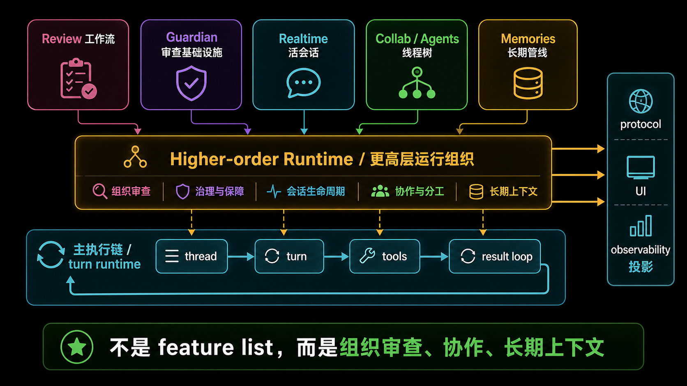
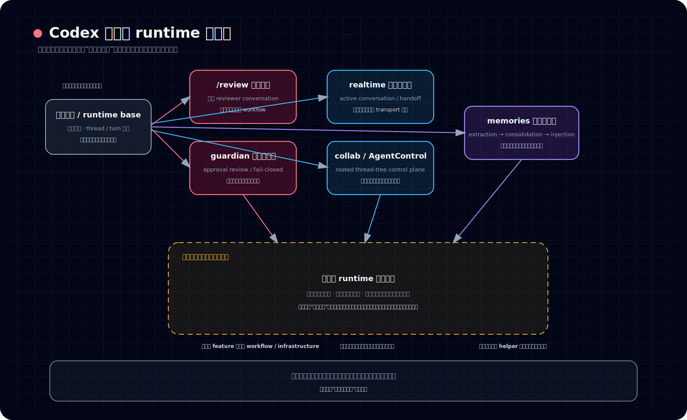
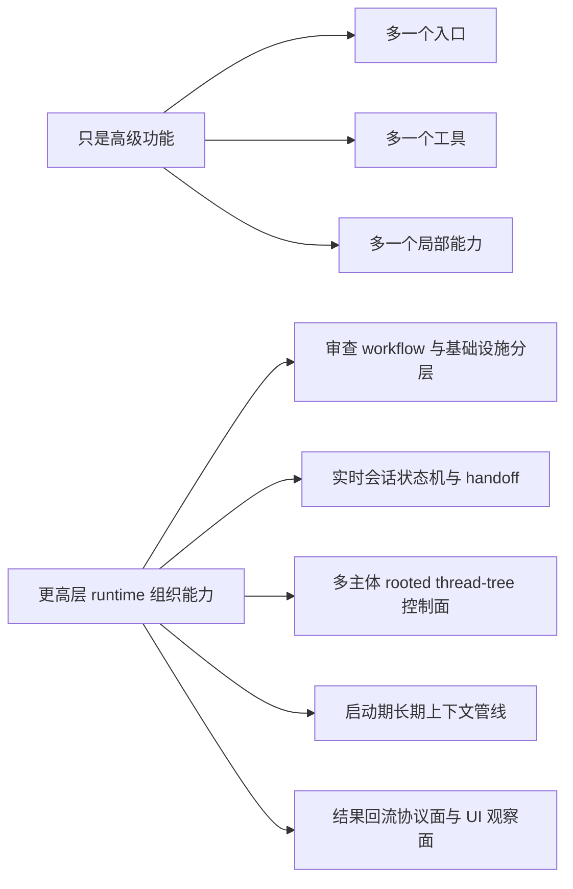

# 为什么说 Codex 正在长成更高层 runtime，而不是只多了一些高级功能

## 读者问题

*图：这张图把全书最后的判断收束起来：Codex 正在从工具集合长成更高层 runtime，把协作、记忆、审查和执行控制纳入同一运行面。*

如果把 `/review`、guardian、realtime、collab、memories、agents 放在一起看，一个很自然的问题是：

> **它们是不是只是 Codex 后半段多出来的一批高级功能？**

表面上看，这个理解很顺手。

因为它们都不像前几卷那样属于最基础的执行主链；它们也都带一点“高级”“扩展”“可选”的观感：

- `/review` 像额外的审查功能
- guardian 像额外的安全能力
- realtime 像额外的实时接口
- collab / agents 像额外的多 agent 能力
- memories 像额外的长期记忆能力

但如果真的按源码里的职责去看，这个结论并不稳。

这些系统共同长出来的，不只是 feature list 变长，而是 Codex 已经开始具备：

- 审查如何被组织
- 协作如何被组织
- 长期上下文如何被组织
- 多主体运行如何被组织
- 这些组织结果如何继续投影到 UI、协议面和运行时状态里

问题的重点因此不再是“又多了什么功能”，而是：

> **Codex 开始不只负责执行一个 agent 的一次次回合，而是在负责更高一层的运行组织。**

---

## 结论

本篇要压住的结论只有一句：

> **Codex 后半段真正长出来的，不只是一些高级功能，而是审查、协作与更高层运行组织能力。**

更具体一点说：

- `/review` 说明系统已经能把“审查”包装成独立工作流
- guardian 说明系统已经能把“批准前判断”组织成专门基础设施
- realtime 说明系统已经能维持一套活的实时会话控制面
- collab / agents 说明系统已经能维护 rooted thread-tree 的多主体控制面
- memories 说明系统已经能在启动和长期阶段组织上下文提炼与回注

这也是整本书最后最该带走的一层上移判断：卷一到卷五让你看清系统怎样形成、怎样持续、怎样暴露、怎样执行；卷六则解释这些能力怎样进一步被组织成高层运行结构。

所以卷六最后最该留下来的记忆点不是：

- Codex 会 review
- Codex 会多 agent
- Codex 有 memory

而是：

> **Codex 正在从“能执行任务的 agent 系统”，长成“能组织审查、协作与长期运行结构的高层 runtime”。**

---

## 先把“更高层 runtime”用白话说清楚

这里的“更高层 runtime”，不是一个玄的词。

这篇里它的意思很朴素：

> **系统不再只负责某个动作能不能跑、某个 tool 怎么调、某次 turn 怎么完成；它开始负责“这些动作、这些线程、这些审查者、这些长期信息，应该如何被编排、分层、约束、复用与回收”。**

也就是说，普通功能更像：

- 这里多一个命令
- 那里多一个工具
- 某处多一个接口

而更高层 runtime 组织能力更像：

- 谁来审
- 审查何时介入
- 审查结果如何回流执行链
- 多个主体如何分工、寻址、等待、关闭
- 实时会话如何与普通 turn 引擎衔接
- 长期记忆如何在启动期被提炼、在运行期被消费

它关注的不是单点能力，而是：

> **系统如何把一组能力稳定组织起来。**

这就是本卷后半段和“高级功能合集”最大的差别。

---

## 为什么不能把它们理解成“多了一些高级功能”

把这些东西都叫高级功能，最大的问题不是不够准确，而是会把它们的系统层级读低。

因为“功能”这个词天然暗示三件事：

1. 它是局部的
2. 它主要服务一次具体动作
3. 拿掉它不会改变系统整体组织方式

但卷六里的这些对象，恰好都不满足这三个特征。

### 第一，它们都不是单点动作

它们几乎都不是“调一下就结束”的能力：

- `/review` 是工作流
- guardian 是审批接入链
- realtime 是会话状态机
- collab / agents 是 thread-tree 控制面
- memories 是启动期两阶段管线

也就是说，它们本身就是一段被组织起来的运行过程。

### 第二，它们都跨越了多个表面

这些系统很少只存在于一个地方。它们通常同时跨过：

- core runtime
- protocol / app-server 映射
- UI 投影
- 某些场景下的 telemetry / observability 结构

这说明它们不是孤立功能块，而是系统级构件。

### 第三，它们都在改写系统的“默认主人公”

前面几卷里，Codex 的默认主人公仍然比较像：

- 一个 session
- 一条 turn 链
- 一次执行请求

到了卷六后半段，默认主人公开始变成：

- 审查中的动作与裁决关系
- 实时会话与主 turn 引擎的衔接关系
- 一棵 root-thread 下的多主体树
- 启动期长期上下文的生成与回注链

这意味着系统关心的已经不只是“这次做什么”，而是“这群东西怎么一起运转”。

这就是 runtime 组织面的味道。

---

## 卷六真正压出来的分层

如果把前四篇的判断压缩成一张图，可以得到下面这个分层：

看这张图时，建议按这个顺序读：

- 先看左侧主执行链，确认卷六不是另起一个新主体
- 再看中上部的 `/review`、guardian、realtime、collab / AgentControl、memories 五块，确认它们分别在组织什么运行问题
- 最后看中下部黄色收口区，理解为什么这些能力要被一起压成“更高层 runtime 组织能力”

这张图最想说明的不是“模块真多”，而是：

> **这些模块都在主执行链之上，继续长出一层“如何组织运行”的系统结构。**

下面分别收束。

---

## 一、从 `/review` 到 guardian：长出来的是“审查如何被组织”

卷六前两篇最重要的收获，不是知道 `/review` 和 guardian 不一样，而是知道：

> **Codex 已经不把审查看成一次临时动作，而是在把审查组织成不同层级的运行结构。**

### `/review` 代表的是显式审查工作流

`/review` 面向的是用户显式触发的审查任务。

它会：

- 启一个特化 reviewer conversation
- 用锁得很紧的配置运行
- 在 inline 或 detached surface 上产出 review 结果

所以它不是“一条 prompt 技巧”，而是一条完整 workflow。

### guardian 代表的是审批审查基础设施

guardian 解决的则不是“给用户产出一份 review 文本”，而是：

- 当动作需要批准时
- 是否由系统里的 reviewer 先做判断
- 这个判断如何回到原执行链
- 如果审查失败，系统如何 fail-closed

它的 trunk session、ephemeral fork、snapshot 复用，也进一步说明 guardian 不是一次性 helper，而是一个可以复用、分叉、隔离的审查会话系统。

### 收口：审查在这里已经变成运行组织问题

因此，卷六前半段真正立住的不是“Codex 多了两个审查 feature”，而是：

- 显式 review 可以被工作流化
- approval review 可以被基础设施化
- 审查结果可以系统性回流执行链
- 审查会话本身可以被复用、分叉、约束与观察

这已经是“审查如何运行”的组织层，而不只是“支持审查”这个功能点。

---

## 二、从 realtime 到 collab / agents：长出来的是“协作如何被组织”

卷六第三篇最重要的收口，不是记住几个名词，而是把三层东西切开：

- realtime 是实时会话控制层
- collab 是协作运行层
- AgentControl / agents 是 rooted thread-tree 的多主体控制面

它们合在一起，说明 Codex 已经在处理“多个活对象如何同时运行”的问题。

### realtime：不是普通 transport 扩展，而是活会话控制面

realtime 的关键不只是音频、文本或 WebRTC。

更重要的是它维护：

- active conversation state
- 输入输出通道
- response create 调度
- handoff 到普通 turn 引擎的桥

这意味着系统已经不只是接收离散请求，而是在维护一段持续活着的会话状态机。

### collab / agents：不是多开几个线程，而是管理一棵协作树

collab / agents 的关键也不在 `/spawn` 这种表层入口，而在：

- spawn、fork、message、wait、resume、close 等生命周期控制
- agent registry 与 canonical path
- parent / child 关系和 subtree 关闭
- approval authority 仍可回收到 parent session

也就是说，这不是“支持多个 agent”而已，而是：

> **系统已经开始维护一个 rooted thread-tree 的协作 runtime。**

### 收口：协作在这里已经变成运行结构问题

所以这部分真正长出来的是：

- 一个会话如何变成实时会话
- 多个主体如何被寻址、挂接、等待、关闭
- 实时交互如何与普通 turn 主线衔接
- 多主体控制权如何不在协作中散掉

这显然已经不是“高级多 agent 功能”一句话能概括的。

它更接近：

> **Codex 开始拥有组织活会话和多主体协作的 runtime 结构。**

---

## 三、从 memories 到 agents：长出来的是“长期运行如何被组织”

卷六第四篇最重要的判断，是把 memories 从“长期记忆 helper”拉回到“启动与长期组织管线”。

### memories 的重点不是多存一点信息

memories 的关键不是边聊边塞一句摘要，而是：

- 启动期按资格筛选历史线程
- 跑 phase 1 extraction
- 再跑 phase 2 consolidation
- 产出长期 artifacts
- 最终在运行时被摘要注入消费

这说明 memories 不是 turn-time 小功能，而是系统在后台组织长期上下文的一条正式管线。

### 它和 agents 不是同一层

agents 管的是运行时协作主体；memories 管的是长期上下文的提炼、整合与回注。

一个偏当前运行中的多主体组织，另一个偏跨时段的上下文组织。

正因为这两条线分层明确，卷六才能得出更稳的结论：

- Codex 不只是会“临场执行”
- Codex 也在组织“长期如何继续影响之后的运行”

### 收口：长期能力在这里已经变成启动与组织问题

因此 memories 真正贡献的，不是“系统有记忆了”，而是：

> **系统开始把长期经验的生成、整合和消费，纳入正式 runtime 组织结构。**

这也是为什么它必须被理解成 pipeline，而不是 helper。

---

## 四、把这些东西放在一起看，Codex 已经不只是在跑“一个 agent”

把 review、guardian、realtime、collab、memories、agents 放在一起看，会发现它们都在做同一类事：

> **把原本可能散落在单次调用、单个线程、单个功能里的能力，上提成可组织、可复用、可回流、可观察的运行结构。**

这就是本卷最后最该稳住的一张对照表。

左边的心智会让人不断问：

- 它能做什么？
- 又加了什么？
- 有哪些高级模式？

右边的心智会让人问真正关键的问题：

- 审查是怎么接进执行链的？
- 协作是怎么被编排的？
- 长期上下文是怎么被提炼和再利用的？
- 多个主体如何共享边界、保持控制权、暴露状态？

而卷六的答案显然站在右边。

---

## 五、为什么这个判断很重要

如果不把卷六压到“更高层 runtime”这一句，整卷就会被读成一组分散专题：

- 一篇讲 review
- 一篇讲 guardian
- 一篇讲 realtime / collab
- 一篇讲 memory

这样当然也能读，但会丢掉最重要的 retained takeaway：

> **这些专题不是碰巧放在一起，而是共同显示 Codex 的系统角色正在上移。**

这个“上移”至少体现在三点。

### 1. 从执行能力，上移到组织能力

系统不再只关心某个动作能不能完成，也关心这个动作处于什么审查结构、协作结构、长期结构里。

### 2. 从单主体回合，上移到多主体运行

系统不再只处理单线程 turn，而开始处理：

- reviewer 子主体
- guardian 审查主体
- collab 子主体
- memory consolidation 子主体

这已经是多主体 runtime 的语言了。

### 3. 从即时结果，上移到持续结构

系统不再只产出这次响应，也在维护：

- 审查状态
- 会话状态
- 线程树状态
- 长期上下文状态

这意味着它开始拥有持续组织运行的能力。

---

## 收口：卷六最后应该留下什么

在真正收口前，最好先把前四篇怎样一步步推到这里再回看一遍：

1. **第 01 篇** 先切开 `/review` 和 guardian：把工作流层与基础设施层分开。
2. **第 02 篇** 再证明 guardian 更像审查基础设施：说明审查判断正在系统化，而不是停在单点 feature。
3. **第 03 篇** 再把 realtime / collab / AgentControl 切成不同层：说明协作已经进入 runtime 分层，而不是“多 agent 功能合集”。
4. **第 04 篇** 再把 memories 拉回启动与长期组织管线：说明长期上下文也开始被流程化、结构化地组织。

有了这四步，最后这篇的任务才不是“再下一个更大的判断”，而是把前面四条线压成同一个 retained takeaway。

到卷六结尾，最稳的收束不是：

- Codex 有很多高级模块
- Codex 有 review、guardian、realtime、memory 这些高级点
- Codex 将来也许会变成更复杂的平台

这些说法都不够稳，或者太散，或者太像未来脑暴。

卷六真正应该留下的是一句已经能被当前结构支撑的判断：

> **Codex 后半段真正长出来的，不只是一些高级功能，而是审查、协作与更高层运行组织能力。**

而且这句话不是悬空结论，它正好对应前四篇已经建立起来的四条主线：

- `/review` 和 guardian 不是一回事，说明审查已经分化成工作流与基础设施两层；
- guardian 不只是 feature，说明审查判断正在被系统化；
- realtime / collab / AgentControl 不是一层，说明协作已经进入 runtime 层级；
- memories 不只是 helper，说明长期上下文也开始被组织成正式流程。

换句话说，Codex 的后半段最值得记住的，不是它“会得更多”，而是它已经开始同时组织三类东西：

- **组织审查**：把 workflow 与基础设施分层，并把裁决接进正式运行链。
- **组织协作**：把实时会话、多主体协作、rooted thread-tree 控制一起变成运行结构。
- **组织长期上下文**：把经验提炼、整合与后续运行复用变成正式管线。

当一个系统开始稳定地做这些事时，我们对它最准确的描述，就不再只是“功能更高级的 agent”，而是：

> **一个正在长成更高层 runtime 的系统。**
---

## 卷内导航

- 上一篇：[《为什么 memories 更像启动管线，而不是普通 helper》](./2026-04-13-Codex-卷六-04-为什么-memories-更像启动管线而不是普通-helper.md)
- 回到本卷入口：[本卷导读](./index.md)
- 这是本卷卷尾，读完建议先回到本卷入口再决定是否跳卷。

